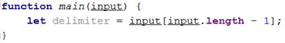
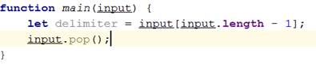
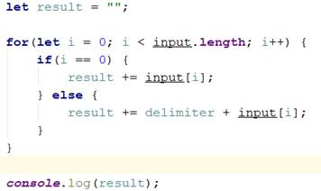

<html>

<head>
<meta http-equiv=Content-Type content="text/html; charset=windows-1251">
<meta name=Generator content="Microsoft Word 14 (filtered)">

</head>

<body lang=EN-US link=blue vlink=purple>

<h1>Exercises: Arrays, Matrices, Multi-Dimensional Arrays</h1>

Problems for exercises and homework for the <a
href="https://softuni.bg/courses/javascript-fundamentals">“JavaScript Fundamentals”
course @ SoftUni</a>. Submit your solutions in the SoftUni judge system at <a
href="https://judge.softuni.bg/Contests/313/">https://judge.softuni.bg/Contests/313/</a>.

<h2>1.&nbsp;&nbsp; Print an
Array with a given Delimiter</h2>

Write a JS function that prints a given array.

The <b>input</b> comes as array of strings. The last element
of the array is the delimiter.

The <b>output</b> is the same array, printed on the console,
each element <b>separated</b> from the others by the <b>given delimiter</b>.

<h3>Examples</h3>

<table class=MsoTableGrid border=1 cellspacing=0 cellpadding=0 width=694
 style='width:520.6pt;margin-left:1.15pt;border-collapse:collapse;border:none'>
 <tr>
  <td width=58 valign=top style='width:43.6pt;border:solid windowtext 1.0pt;
  background:#D9D9D9;padding:2.85pt 4.25pt 2.85pt 4.25pt'>
  
<b>Input</b>

  </td>
  <td width=198 valign=top style='width:148.5pt;border:solid windowtext 1.0pt;
  border-left:none;background:#D9D9D9;padding:2.85pt 4.25pt 2.85pt 4.25pt'>
  
<b>Output</b>

  </td>
  <td width=24 valign=top style='width:.25in;border:none;border-right:solid windowtext 1.0pt;
  padding:2.85pt 4.25pt 2.85pt 4.25pt'>
  
<b>&nbsp;</b>

  </td>
  <td width=138 valign=top style='width:103.5pt;border:solid windowtext 1.0pt;
  border-left:none;background:#D9D9D9;padding:2.85pt 4.25pt 2.85pt 4.25pt'>
  
<b>Input</b>

  </td>
  <td width=276 valign=top style='width:207.0pt;border:solid windowtext 1.0pt;
  border-left:none;background:#D9D9D9;padding:2.85pt 4.25pt 2.85pt 4.25pt'>
  
<b>Output</b>

  </td>
 </tr>
 <tr>
  <td width=58 valign=top style='width:43.6pt;border:solid windowtext 1.0pt;
  border-top:none;padding:2.85pt 4.25pt 2.85pt 4.25pt'>
  
One

  
Two

  
Three

  
Four

  
Five

  
-

  </td>
  <td width=198 valign=top style='width:148.5pt;border-top:none;border-left:
  none;border-bottom:solid windowtext 1.0pt;border-right:solid windowtext 1.0pt;
  padding:2.85pt 4.25pt 2.85pt 4.25pt'>
  
One-Two-Three-Four-Five

  </td>
  <td width=24 valign=top style='width:.25in;border:none;border-right:solid windowtext 1.0pt;
  padding:2.85pt 4.25pt 2.85pt 4.25pt'>
  
&nbsp;

  </td>
  <td width=138 valign=top style='width:103.5pt;border-top:none;border-left:
  none;border-bottom:solid windowtext 1.0pt;border-right:solid windowtext 1.0pt;
  padding:2.85pt 4.25pt 2.85pt 4.25pt'>
  
How about no?

  
I

  
will

  
not

  
do

  
it!

  
_

  </td>
  <td width=276 valign=top style='width:207.0pt;border-top:none;border-left:
  none;border-bottom:solid windowtext 1.0pt;border-right:solid windowtext 1.0pt;
  padding:2.85pt 4.25pt 2.85pt 4.25pt'>
  
How about no?_I_will_not_do_it!

  </td>
 </tr>
</table>

<h3>Hints</h3>

·&nbsp;&nbsp;&nbsp;&nbsp;&nbsp;&nbsp;&nbsp;&nbsp;
Let’s start by extracting the delimiter from the input array:

·&nbsp;&nbsp;&nbsp;&nbsp;&nbsp;&nbsp;&nbsp;&nbsp;
Now that we have the element, we need to delete it from the
array, because we don’t need it in the output. Thankfully, the Array in
JavaScript has a <b>built-in function</b> for <b>removing the last element</b>,
which is <b>Array.pop()</b>.

·&nbsp;&nbsp;&nbsp;&nbsp;&nbsp;&nbsp;&nbsp;&nbsp;
And last but not least, let’s print each element of the array,
separated with the next one by the delimiter:

·&nbsp;&nbsp;&nbsp;&nbsp;&nbsp;&nbsp;&nbsp;&nbsp;
The result variable holds our final
string. The if check in the loop is necessary so
that we don’t <b>attach an</b> <b>unneeded delimiter</b> somewhere in the
result string.

&nbsp;

<h2>2.&nbsp;&nbsp; Print every
N-th Element from an Array </h2>

Write a JS function that prints every element of an array,
on a given step.

The <b>input</b> comes as array of strings. The last element
is <b>N - the step</b>.

The <b>output</b> is every element on the <b>N-th</b> step <b>starting
from the first one</b>. If the step is “3”, you
need to print the <b>1-st</b>, the <b>4-th</b>, the <b>7-th</b> … and so on,
until you reach the end of the array. The elements must be printed each on a
new line.

<h3>Examples</h3>

<table class=MsoTableGrid border=1 cellspacing=0 cellpadding=0 width=700
 style='width:525.1pt;margin-left:1.15pt;border-collapse:collapse;border:none'>
 <tr>
  <td width=106 valign=top style='width:79.6pt;border:solid windowtext 1.0pt;
  background:#D9D9D9;padding:2.85pt 4.25pt 2.85pt 4.25pt'>
  
<b>Input</b>

  </td>
  <td width=108 valign=top style='width:81.0pt;border:solid windowtext 1.0pt;
  border-left:none;background:#D9D9D9;padding:2.85pt 4.25pt 2.85pt 4.25pt'>
  
<b>Output</b>

  </td>
  <td width=24 valign=top style='width:.25in;border:none;border-right:solid windowtext 1.0pt;
  padding:2.85pt 4.25pt 2.85pt 4.25pt'>
  
<b>&nbsp;</b>

  </td>
  <td width=102 valign=top style='width:76.5pt;border:solid windowtext 1.0pt;
  border-left:none;background:#D9D9D9;padding:2.85pt 4.25pt 2.85pt 4.25pt'>
  
<b>Input</b>

  </td>
  <td width=102 valign=top style='width:76.5pt;border:solid windowtext 1.0pt;
  border-left:none;background:#D9D9D9;padding:2.85pt 4.25pt 2.85pt 4.25pt'>
  
<b>Output</b>

  </td>
  <td width=24 rowspan=2 valign=top style='width:.25in;border:none;border-right:
  solid windowtext 1.0pt;padding:2.85pt 4.25pt 2.85pt 4.25pt'>
  
<b>&nbsp;</b>

  </td>
  <td width=120 valign=top style='width:1.25in;border:solid windowtext 1.0pt;
  border-left:none;background:#D9D9D9;padding:2.85pt 4.25pt 2.85pt 4.25pt'>
  
<b>Input</b>

  </td>
  <td width=114 valign=top style='width:85.5pt;border:solid windowtext 1.0pt;
  border-left:none;background:#D9D9D9;padding:2.85pt 4.25pt 2.85pt 4.25pt'>
  
<b>Output</b>

  </td>
 </tr>
 <tr>
  <td width=106 valign=top style='width:79.6pt;border:solid windowtext 1.0pt;
  border-top:none;padding:2.85pt 4.25pt 2.85pt 4.25pt'>
  
5

  
20

  
31

  
4

  
20

  
2

  </td>
  <td width=108 valign=top style='width:81.0pt;border-top:none;border-left:
  none;border-bottom:solid windowtext 1.0pt;border-right:solid windowtext 1.0pt;
  padding:2.85pt 4.25pt 2.85pt 4.25pt'>
  
5

  
31

  
20

  </td>
  <td width=24 valign=top style='width:.25in;border:none;border-right:solid windowtext 1.0pt;
  padding:2.85pt 4.25pt 2.85pt 4.25pt'>
  
&nbsp;

  </td>
  <td width=102 valign=top style='width:76.5pt;border-top:none;border-left:
  none;border-bottom:solid windowtext 1.0pt;border-right:solid windowtext 1.0pt;
  padding:2.85pt 4.25pt 2.85pt 4.25pt'>
  
dsa

  
asd

  
test

  
tset

  
2

  
&nbsp;

  </td>
  <td width=102 valign=top style='width:76.5pt;border-top:none;border-left:
  none;border-bottom:solid windowtext 1.0pt;border-right:solid windowtext 1.0pt;
  padding:2.85pt 4.25pt 2.85pt 4.25pt'>
  
dsa

  
test

  </td>
  <td width=120 valign=top style='width:1.25in;border-top:none;border-left:
  none;border-bottom:solid windowtext 1.0pt;border-right:solid windowtext 1.0pt;
  padding:2.85pt 4.25pt 2.85pt 4.25pt'>
  
1

  
2

  
3

  
4

  
5

  
6

  </td>
  <td width=114 valign=top style='width:85.5pt;border-top:none;border-left:
  none;border-bottom:solid windowtext 1.0pt;border-right:solid windowtext 1.0pt;
  padding:2.85pt 4.25pt 2.85pt 4.25pt'>
  
1

  </td>
 </tr>
</table>

<h3>Hints</h3>

·&nbsp;&nbsp;&nbsp;&nbsp;&nbsp;&nbsp;&nbsp;&nbsp;
Use what you’ve seen from the <b>previous problem</b> to <b>extract
the last element</b> of the array.

·&nbsp;&nbsp;&nbsp;&nbsp;&nbsp;&nbsp;&nbsp;&nbsp;
Create a step variable to hold the <b>given
step</b> of the array. Then <b>print all the elements</b> with a for loop, <b>incrementing</b> the <b>loop variable </b>with
the value of the step variable.

<h2>3.&nbsp;&nbsp; *Add and
Remove Elements from Array</h2>

Write a JS function that <b>adds</b> and <b>removes</b> numbers
<b>to / from</b> an array. You will receive a command which can either be “add” or “remove”. 

The <b>initial number</b> is <b>1</b>. Each input command
should <b>increase that number</b>, regardless of what it is.

 
Upon receiving an “add” command you should add the current
number to your array.  
Upon receiving the “remove” command you should remove
the last entered number, currently existent in the array.

The <b>input</b> comes as array of strings. Each element
holds a <b>command</b>. 

The <b>output</b> is the array itself, with each element
printed on a new line. In case of an empty array, just print “Empty”.

<h3>Examples</h3>

<table class=MsoTableGrid border=1 cellspacing=0 cellpadding=0 width=700
 style='width:525.1pt;margin-left:1.15pt;border-collapse:collapse;border:none'>
 <tr>
  <td width=106 valign=top style='width:79.6pt;border:solid windowtext 1.0pt;
  background:#D9D9D9;padding:2.85pt 4.25pt 2.85pt 4.25pt'>
  
<b>Input</b>

  </td>
  <td width=108 valign=top style='width:81.0pt;border:solid windowtext 1.0pt;
  border-left:none;background:#D9D9D9;padding:2.85pt 4.25pt 2.85pt 4.25pt'>
  
<b>Output</b>

  </td>
  <td width=24 valign=top style='width:.25in;border:none;border-right:solid windowtext 1.0pt;
  padding:2.85pt 4.25pt 2.85pt 4.25pt'>
  
<b>&nbsp;</b>

  </td>
  <td width=102 valign=top style='width:76.5pt;border:solid windowtext 1.0pt;
  border-left:none;background:#D9D9D9;padding:2.85pt 4.25pt 2.85pt 4.25pt'>
  
<b>Input</b>

  </td>
  <td width=102 valign=top style='width:76.5pt;border:solid windowtext 1.0pt;
  border-left:none;background:#D9D9D9;padding:2.85pt 4.25pt 2.85pt 4.25pt'>
  
<b>Output</b>

  </td>
  <td width=24 rowspan=2 valign=top style='width:.25in;border:none;border-right:
  solid windowtext 1.0pt;padding:2.85pt 4.25pt 2.85pt 4.25pt'>
  
<b>&nbsp;</b>

  </td>
  <td width=120 valign=top style='width:1.25in;border:solid windowtext 1.0pt;
  border-left:none;background:#D9D9D9;padding:2.85pt 4.25pt 2.85pt 4.25pt'>
  
<b>Input</b>

  </td>
  <td width=114 valign=top style='width:85.5pt;border:solid windowtext 1.0pt;
  border-left:none;background:#D9D9D9;padding:2.85pt 4.25pt 2.85pt 4.25pt'>
  
<b>Output</b>

  </td>
 </tr>
 <tr>
  <td width=106 valign=top style='width:79.6pt;border:solid windowtext 1.0pt;
  border-top:none;padding:2.85pt 4.25pt 2.85pt 4.25pt'>
  
add

  
add

  
add

  
add

  
&nbsp;

  </td>
  <td width=108 valign=top style='width:81.0pt;border-top:none;border-left:
  none;border-bottom:solid windowtext 1.0pt;border-right:solid windowtext 1.0pt;
  padding:2.85pt 4.25pt 2.85pt 4.25pt'>
  
1

  
2

  
3

  
4

  </td>
  <td width=24 valign=top style='width:.25in;border:none;border-right:solid windowtext 1.0pt;
  padding:2.85pt 4.25pt 2.85pt 4.25pt'>
  
&nbsp;

  </td>
  <td width=102 valign=top style='width:76.5pt;border-top:none;border-left:
  none;border-bottom:solid windowtext 1.0pt;border-right:solid windowtext 1.0pt;
  padding:2.85pt 4.25pt 2.85pt 4.25pt'>
  
add

  
add

  
remove

  
add

  
add

  </td>
  <td width=102 valign=top style='width:76.5pt;border-top:none;border-left:
  none;border-bottom:solid windowtext 1.0pt;border-right:solid windowtext 1.0pt;
  padding:2.85pt 4.25pt 2.85pt 4.25pt'>
  
1

  
4

  
5

  </td>
  <td width=120 valign=top style='width:1.25in;border-top:none;border-left:
  none;border-bottom:solid windowtext 1.0pt;border-right:solid windowtext 1.0pt;
  padding:2.85pt 4.25pt 2.85pt 4.25pt'>
  
remove

  
remove

  
remove

  </td>
  <td width=114 valign=top style='width:85.5pt;border-top:none;border-left:
  none;border-bottom:solid windowtext 1.0pt;border-right:solid windowtext 1.0pt;
  padding:2.85pt 4.25pt 2.85pt 4.25pt'>
  
Empty

  </td>
 </tr>
</table>

<h2>4.&nbsp;&nbsp; Rotate
Array</h2>

Write a JS function that rotates an array. The array should
be rotated to the right side, meaning that the last element should become the
first, upon rotation. 

The <b>input</b> comes as array of strings. The <b>last
element </b>of the array is the amount of rotation you need to perform.

The <b>output</b> is the resulted array after the rotations.
The elements should be printed on one line, separated by a <b>single space</b>.

<h3>Examples</h3>

<table class=MsoTableGrid border=1 cellspacing=0 cellpadding=0 width=586
 style='width:439.6pt;margin-left:1.15pt;border-collapse:collapse;border:none'>
 <tr>
  <td width=106 valign=top style='width:79.6pt;border:solid windowtext 1.0pt;
  background:#D9D9D9;padding:2.85pt 4.25pt 2.85pt 4.25pt'>
  
<b>Input</b>

  </td>
  <td width=108 valign=top style='width:81.0pt;border:solid windowtext 1.0pt;
  border-left:none;background:#D9D9D9;padding:2.85pt 4.25pt 2.85pt 4.25pt'>
  
<b>Output</b>

  </td>
  <td width=24 valign=top style='width:.25in;border:none;border-right:solid windowtext 1.0pt;
  padding:2.85pt 4.25pt 2.85pt 4.25pt'>
  
<b>&nbsp;</b>

  </td>
  <td width=102 valign=top style='width:76.5pt;border:solid windowtext 1.0pt;
  border-left:none;background:#D9D9D9;padding:2.85pt 4.25pt 2.85pt 4.25pt'>
  
<b>Input</b>

  </td>
  <td width=246 valign=top style='width:184.5pt;border:solid windowtext 1.0pt;
  border-left:none;background:#D9D9D9;padding:2.85pt 4.25pt 2.85pt 4.25pt'>
  
<b>Output</b>

  </td>
 </tr>
 <tr>
  <td width=106 valign=top style='width:79.6pt;border:solid windowtext 1.0pt;
  border-top:none;padding:2.85pt 4.25pt 2.85pt 4.25pt'>
  
1

  
2

  
3

  
4

  
2

  </td>
  <td width=108 valign=top style='width:81.0pt;border-top:none;border-left:
  none;border-bottom:solid windowtext 1.0pt;border-right:solid windowtext 1.0pt;
  padding:2.85pt 4.25pt 2.85pt 4.25pt'>
  
3 4 1 2

  </td>
  <td width=24 valign=top style='width:.25in;border:none;border-right:solid windowtext 1.0pt;
  padding:2.85pt 4.25pt 2.85pt 4.25pt'>
  
&nbsp;

  </td>
  <td width=102 valign=top style='width:76.5pt;border-top:none;border-left:
  none;border-bottom:solid windowtext 1.0pt;border-right:solid windowtext 1.0pt;
  padding:2.85pt 4.25pt 2.85pt 4.25pt'>
  
Banana

  
Orange

  
Coconut

  
Apple

  
15

  </td>
  <td width=246 valign=top style='width:184.5pt;border-top:none;border-left:
  none;border-bottom:solid windowtext 1.0pt;border-right:solid windowtext 1.0pt;
  padding:2.85pt 4.25pt 2.85pt 4.25pt'>
  
Orange Coconut Apple Banana

  </td>
 </tr>
</table>

<h3>Hints</h3>

·&nbsp;&nbsp;&nbsp;&nbsp;&nbsp;&nbsp;&nbsp;&nbsp;
Check if there is a <b>built-in function</b> for inserting
elements <b>at the</b> <b>start </b>of the array.

<h2>5.&nbsp;&nbsp; Extract an
Non-decreasing Subsequence from an Array</h2>

Write a JS function that extracts only those numbers that <b>form
a</b> <b>non-decreasing subsequence</b>. In other words, you start from the <b>first
element</b> and continue to <b>the end</b> of the <b>given array of numbers</b>.
Any number which is <b>LESS THAN </b>the <b>current biggest one</b> is <b>ignored</b>,
alternatively if it’s equal or higher than the <b>current biggest one</b> you
set it as the <b>current biggest one</b> and you continue to the next number. 

The <b>input</b> comes as array of numbers.

The <b>output</b> is the processed array after the
filtration, which should be a non-decreasing subsequence. Each element should
be printed on a new line.

<h3>Examples</h3>

<table class=MsoTableGrid border=1 cellspacing=0 cellpadding=0 width=700
 style='width:525.1pt;margin-left:1.15pt;border-collapse:collapse;border:none'>
 <tr>
  <td width=106 valign=top style='width:79.6pt;border:solid windowtext 1.0pt;
  background:#D9D9D9;padding:2.85pt 4.25pt 2.85pt 4.25pt'>
  
<b>Input</b>

  </td>
  <td width=108 valign=top style='width:81.0pt;border:solid windowtext 1.0pt;
  border-left:none;background:#D9D9D9;padding:2.85pt 4.25pt 2.85pt 4.25pt'>
  
<b>Output</b>

  </td>
  <td width=24 valign=top style='width:.25in;border:none;border-right:solid windowtext 1.0pt;
  padding:2.85pt 4.25pt 2.85pt 4.25pt'>
  
<b>&nbsp;</b>

  </td>
  <td width=102 valign=top style='width:76.5pt;border:solid windowtext 1.0pt;
  border-left:none;background:#D9D9D9;padding:2.85pt 4.25pt 2.85pt 4.25pt'>
  
<b>Input</b>

  </td>
  <td width=102 valign=top style='width:76.5pt;border:solid windowtext 1.0pt;
  border-left:none;background:#D9D9D9;padding:2.85pt 4.25pt 2.85pt 4.25pt'>
  
<b>Output</b>

  </td>
  <td width=24 rowspan=2 valign=top style='width:.25in;border:none;border-right:
  solid windowtext 1.0pt;padding:2.85pt 4.25pt 2.85pt 4.25pt'>
  
<b>&nbsp;</b>

  </td>
  <td width=120 valign=top style='width:1.25in;border:solid windowtext 1.0pt;
  border-left:none;background:#D9D9D9;padding:2.85pt 4.25pt 2.85pt 4.25pt'>
  
<b>Input</b>

  </td>
  <td width=114 valign=top style='width:85.5pt;border:solid windowtext 1.0pt;
  border-left:none;background:#D9D9D9;padding:2.85pt 4.25pt 2.85pt 4.25pt'>
  
<b>Output</b>

  </td>
 </tr>
 <tr>
  <td width=106 valign=top style='width:79.6pt;border:solid windowtext 1.0pt;
  border-top:none;padding:2.85pt 4.25pt 2.85pt 4.25pt'>
  
1

  
3

  
8

  
4

  
10

  
12

  
3

  
2

  
24

  </td>
  <td width=108 valign=top style='width:81.0pt;border-top:none;border-left:
  none;border-bottom:solid windowtext 1.0pt;border-right:solid windowtext 1.0pt;
  padding:2.85pt 4.25pt 2.85pt 4.25pt'>
  
1

  
3

  
8

  
10

  
12

  
24

  </td>
  <td width=24 valign=top style='width:.25in;border:none;border-right:solid windowtext 1.0pt;
  padding:2.85pt 4.25pt 2.85pt 4.25pt'>
  
&nbsp;

  </td>
  <td width=102 valign=top style='width:76.5pt;border-top:none;border-left:
  none;border-bottom:solid windowtext 1.0pt;border-right:solid windowtext 1.0pt;
  padding:2.85pt 4.25pt 2.85pt 4.25pt'>
  
1

  
2

  
3

  
4

  </td>
  <td width=102 valign=top style='width:76.5pt;border-top:none;border-left:
  none;border-bottom:solid windowtext 1.0pt;border-right:solid windowtext 1.0pt;
  padding:2.85pt 4.25pt 2.85pt 4.25pt'>
  
1

  
2

  
3

  
4

  </td>
  <td width=120 valign=top style='width:1.25in;border-top:none;border-left:
  none;border-bottom:solid windowtext 1.0pt;border-right:solid windowtext 1.0pt;
  padding:2.85pt 4.25pt 2.85pt 4.25pt'>
  
20

  
3

  
2

  
15

  
6

  
1

  </td>
  <td width=114 valign=top style='width:85.5pt;border-top:none;border-left:
  none;border-bottom:solid windowtext 1.0pt;border-right:solid windowtext 1.0pt;
  padding:2.85pt 4.25pt 2.85pt 4.25pt'>
  
20

  </td>
 </tr>
</table>

<h3>Hints</h3>

·&nbsp;&nbsp;&nbsp;&nbsp;&nbsp;&nbsp;&nbsp;&nbsp;
The <b>Array.filter()</b> built-in function might help you a lot
with this problem.

<h2>6.&nbsp;&nbsp; Sort an
Array by 2 Criteria</h2>

Write a JS function that orders a <b>given array of strings</b>,
by <b>length</b> in <b>ascending order</b> as <b>primary criteria</b>, and by <b>alphabetical
value </b>in<b> ascending order </b>as <b>second criteria</b>. The comparison
should be <b>case-insensitive</b>.

The <b>input</b> comes as array of strings.

The <b>output</b> is the ordered array of strings.

<h3>Examples</h3>

<table class=MsoTableGrid border=1 cellspacing=0 cellpadding=0 width=700
 style='width:525.1pt;margin-left:1.15pt;border-collapse:collapse;border:none'>
 <tr>
  <td width=106 valign=top style='width:79.6pt;border:solid windowtext 1.0pt;
  background:#D9D9D9;padding:2.85pt 4.25pt 2.85pt 4.25pt'>
  
<b>Input</b>

  </td>
  <td width=108 valign=top style='width:81.0pt;border:solid windowtext 1.0pt;
  border-left:none;background:#D9D9D9;padding:2.85pt 4.25pt 2.85pt 4.25pt'>
  
<b>Output</b>

  </td>
  <td width=24 valign=top style='width:.25in;border:none;border-right:solid windowtext 1.0pt;
  padding:2.85pt 4.25pt 2.85pt 4.25pt'>
  
<b>&nbsp;</b>

  </td>
  <td width=102 valign=top style='width:76.5pt;border:solid windowtext 1.0pt;
  border-left:none;background:#D9D9D9;padding:2.85pt 4.25pt 2.85pt 4.25pt'>
  
<b>Input</b>

  </td>
  <td width=102 valign=top style='width:76.5pt;border:solid windowtext 1.0pt;
  border-left:none;background:#D9D9D9;padding:2.85pt 4.25pt 2.85pt 4.25pt'>
  
<b>Output</b>

  </td>
  <td width=24 rowspan=2 valign=top style='width:.25in;border:none;border-right:
  solid windowtext 1.0pt;padding:2.85pt 4.25pt 2.85pt 4.25pt'>
  
<b>&nbsp;</b>

  </td>
  <td width=120 valign=top style='width:1.25in;border:solid windowtext 1.0pt;
  border-left:none;background:#D9D9D9;padding:2.85pt 4.25pt 2.85pt 4.25pt'>
  
<b>Input</b>

  </td>
  <td width=114 valign=top style='width:85.5pt;border:solid windowtext 1.0pt;
  border-left:none;background:#D9D9D9;padding:2.85pt 4.25pt 2.85pt 4.25pt'>
  
<b>Output</b>

  </td>
 </tr>
 <tr>
  <td width=106 valign=top style='width:79.6pt;border:solid windowtext 1.0pt;
  border-top:none;padding:2.85pt 4.25pt 2.85pt 4.25pt'>
  
alpha

  
beta

  
gamma

  </td>
  <td width=108 valign=top style='width:81.0pt;border-top:none;border-left:
  none;border-bottom:solid windowtext 1.0pt;border-right:solid windowtext 1.0pt;
  padding:2.85pt 4.25pt 2.85pt 4.25pt'>
  
beta

  
alpha

  
gamma

  </td>
  <td width=24 valign=top style='width:.25in;border:none;border-right:solid windowtext 1.0pt;
  padding:2.85pt 4.25pt 2.85pt 4.25pt'>
  
&nbsp;

  </td>
  <td width=102 valign=top style='width:76.5pt;border-top:none;border-left:
  none;border-bottom:solid windowtext 1.0pt;border-right:solid windowtext 1.0pt;
  padding:2.85pt 4.25pt 2.85pt 4.25pt'>
  
Isacc

  
Theodor

  
Jack

  
Harrison

  
George

  
&nbsp;

  </td>
  <td width=102 valign=top style='width:76.5pt;border-top:none;border-left:
  none;border-bottom:solid windowtext 1.0pt;border-right:solid windowtext 1.0pt;
  padding:2.85pt 4.25pt 2.85pt 4.25pt'>
  
Jack

  
Isacc

  
George

  
Theodor

  
Harrison

  
&nbsp;

  </td>
  <td width=120 valign=top style='width:1.25in;border-top:none;border-left:
  none;border-bottom:solid windowtext 1.0pt;border-right:solid windowtext 1.0pt;
  padding:2.85pt 4.25pt 2.85pt 4.25pt'>
  
test

  
Deny

  
omen

  
Default

  </td>
  <td width=114 valign=top style='width:85.5pt;border-top:none;border-left:
  none;border-bottom:solid windowtext 1.0pt;border-right:solid windowtext 1.0pt;
  padding:2.85pt 4.25pt 2.85pt 4.25pt'>
  
Deny

  
omen

  
test

  
Default

  </td>
 </tr>
</table>

<h3>Hints</h3>

·&nbsp;&nbsp;&nbsp;&nbsp;&nbsp;&nbsp;&nbsp;&nbsp;
An array can be sorted by passing a comparing function to the <b>Array.sort()</b>
function.

·&nbsp;&nbsp;&nbsp;&nbsp;&nbsp;&nbsp;&nbsp;&nbsp;
Creating a comparing function by 2 criteria can be achieved by
first comparing by the <b>main criteria</b>, if the 2 items are different (the
result of the compare is not 0) - return the result as the result of the
comparing function. If the two items are the same by the <b>main criteria</b>
(the result of the compare is 0), we need to compare by the <b>second criteria</b>
and the result of that comparison is the result of the comparing function.

·&nbsp;&nbsp;&nbsp;&nbsp;&nbsp;&nbsp;&nbsp;&nbsp;
You can check more about <b>Array.sort()</b> here - <a
href="https://developer.mozilla.org/en-US/docs/Web/JavaScript/Reference/Global_Objects/Array/sort%20">https://developer.mozilla.org/en-US/docs/Web/JavaScript/Reference/Global_Objects/Array/sort</a>

<h1>Multidimensional Arrays</h1>

We will mainly work with 2-dimensional arrays. The concept
is as simple as working with a simple 1-dimensional array. It is just an array
of arrays.

<h2>7.&nbsp;&nbsp; Magic
Matrices</h2>

Write a JS function that checks if a given matrix of numbers
is magical. A matrix is magical if the <b>sums of the cells</b> of <b>every row</b>
and <b>every column</b> are <b>equal</b>. 

The <b>input</b> comes as an array of arrays, containing
numbers (number 2D matrix). The input numbers will <b>always be positive</b>.

The <b>output</b> is a Boolean result indicating whether the
matrix is magical or not.

<h3>Examples</h3>

<table class=MsoTableGrid border=1 cellspacing=0 cellpadding=0 width=628
 style='width:470.9pt;margin-left:1.15pt;border-collapse:collapse;border:none'>
 <tr>
  <td width=113 valign=top style='width:85.05pt;border:solid windowtext 1.0pt;
  background:#D9D9D9;padding:2.85pt 4.25pt 2.85pt 4.25pt'>
  
<b>Input</b>

  </td>
  <td width=76 valign=top style='width:56.7pt;border:solid windowtext 1.0pt;
  border-left:none;background:#D9D9D9;padding:2.85pt 4.25pt 2.85pt 4.25pt'>
  
<b>Output</b>

  </td>
  <td width=18 valign=top style='width:13.5pt;border:none;border-right:solid windowtext 1.0pt;
  padding:2.85pt 4.25pt 2.85pt 4.25pt'>
  
<b>&nbsp;</b>

  </td>
  <td width=132 valign=top style='width:99.2pt;border:solid windowtext 1.0pt;
  border-left:none;background:#D9D9D9;padding:2.85pt 4.25pt 2.85pt 4.25pt'>
  
<b>Input</b>

  </td>
  <td width=76 valign=top style='width:56.7pt;border:solid windowtext 1.0pt;
  border-left:none;background:#D9D9D9;padding:2.85pt 4.25pt 2.85pt 4.25pt'>
  
<b>Output</b>

  </td>
  <td width=24 rowspan=2 valign=top style='width:.25in;border:none;border-right:
  solid windowtext 1.0pt;padding:2.85pt 4.25pt 2.85pt 4.25pt'>
  
<b>&nbsp;</b>

  </td>
  <td width=113 valign=top style='width:85.05pt;border:solid windowtext 1.0pt;
  border-left:none;background:#D9D9D9;padding:2.85pt 4.25pt 2.85pt 4.25pt'>
  
<b>Input</b>

  </td>
  <td width=76 valign=top style='width:56.7pt;border:solid windowtext 1.0pt;
  border-left:none;background:#D9D9D9;padding:2.85pt 4.25pt 2.85pt 4.25pt'>
  
<b>Output</b>

  </td>
 </tr>
 <tr>
  <td width=113 valign=top style='width:85.05pt;border:solid windowtext 1.0pt;
  border-top:none;padding:2.85pt 4.25pt 2.85pt 4.25pt'>
  
[[4, 5, 6],

  
 [6, 5, 4],

  
 [5, 5, 5]]

  </td>
  <td width=76 valign=top style='width:56.7pt;border-top:none;border-left:none;
  border-bottom:solid windowtext 1.0pt;border-right:solid windowtext 1.0pt;
  padding:2.85pt 4.25pt 2.85pt 4.25pt'>
  
true

  </td>
  <td width=18 valign=top style='width:13.5pt;border:none;border-right:solid windowtext 1.0pt;
  padding:2.85pt 4.25pt 2.85pt 4.25pt'>
  
&nbsp;

  </td>
  <td width=132 valign=top style='width:99.2pt;border-top:none;border-left:
  none;border-bottom:solid windowtext 1.0pt;border-right:solid windowtext 1.0pt;
  padding:2.85pt 4.25pt 2.85pt 4.25pt'>
  
[[11, 32, 45],

  
 [21, 0, 1],

  
 [21, 1, 1]]

  </td>
  <td width=76 valign=top style='width:56.7pt;border-top:none;border-left:none;
  border-bottom:solid windowtext 1.0pt;border-right:solid windowtext 1.0pt;
  padding:2.85pt 4.25pt 2.85pt 4.25pt'>
  
false

  
&nbsp;

  </td>
  <td width=113 valign=top style='width:85.05pt;border-top:none;border-left:
  none;border-bottom:solid windowtext 1.0pt;border-right:solid windowtext 1.0pt;
  padding:2.85pt 4.25pt 2.85pt 4.25pt'>
  
[[1, 0, 0],

  
 [0, 0, 1],

  
 [0, 1, 0]]

  </td>
  <td width=76 valign=top style='width:56.7pt;border-top:none;border-left:none;
  border-bottom:solid windowtext 1.0pt;border-right:solid windowtext 1.0pt;
  padding:2.85pt 4.25pt 2.85pt 4.25pt'>
  
true

  </td>
 </tr>
</table>

<h2>8.&nbsp;&nbsp; *Spiral
Matrix</h2>

Write a JS function that generates a <b>Spirally-filled</b>
matrix with numbers, with given dimensions.

The <b>input</b> comes as 2 numbers that represent the <b>dimension
of the matrix</b>. 

The <b>output</b> is the matrix filled spirally starting
from <b>1</b>. You need to print <b>every row on a new line</b>, with the cells
<b>separated by a space</b>. Check the examples below. 

<h3>Examples</h3>

<table class=MsoTableGrid border=1 cellspacing=0 cellpadding=0 width=700
 style='width:525.1pt;margin-left:1.15pt;border-collapse:collapse;border:none'>
 <tr>
  <td width=106 valign=top style='width:79.6pt;border:solid windowtext 1.0pt;
  background:#D9D9D9;padding:2.85pt 4.25pt 2.85pt 4.25pt'>
  
<b>Input</b>

  </td>
  <td width=192 valign=top style='width:2.0in;border:solid windowtext 1.0pt;
  border-left:none;background:#D9D9D9;padding:2.85pt 4.25pt 2.85pt 4.25pt'>
  
<b>Output</b>

  </td>
  <td width=126 valign=top style='width:94.5pt;border:none;border-right:solid windowtext 1.0pt;
  padding:2.85pt 4.25pt 2.85pt 4.25pt'>
  
<b>&nbsp;</b>

  </td>
  <td width=102 valign=top style='width:76.5pt;border:solid windowtext 1.0pt;
  border-left:none;background:#D9D9D9;padding:2.85pt 4.25pt 2.85pt 4.25pt'>
  
<b>Input</b>

  </td>
  <td width=174 valign=top style='width:130.5pt;border:solid windowtext 1.0pt;
  border-left:none;background:#D9D9D9;padding:2.85pt 4.25pt 2.85pt 4.25pt'>
  
<b>Output</b>

  </td>
 </tr>
 <tr>
  <td width=106 valign=top style='width:79.6pt;border:solid windowtext 1.0pt;
  border-top:none;padding:2.85pt 4.25pt 2.85pt 4.25pt'>
  
5, 5

  </td>
  <td width=192 valign=top style='width:2.0in;border-top:none;border-left:none;
  border-bottom:solid windowtext 1.0pt;border-right:solid windowtext 1.0pt;
  padding:2.85pt 4.25pt 2.85pt 4.25pt'>
  
1 2 3 4 5

  
16 17 18 19 6

  
15 24 25 20 7

  
14 23 22 21 8

  
13 12 11 10 9

  </td>
  <td width=126 valign=top style='width:94.5pt;border:none;border-right:solid windowtext 1.0pt;
  padding:2.85pt 4.25pt 2.85pt 4.25pt'>
  
&nbsp;

  </td>
  <td width=102 valign=top style='width:76.5pt;border-top:none;border-left:
  none;border-bottom:solid windowtext 1.0pt;border-right:solid windowtext 1.0pt;
  padding:2.85pt 4.25pt 2.85pt 4.25pt'>
  
3, 3

  </td>
  <td width=174 valign=top style='width:130.5pt;border-top:none;border-left:
  none;border-bottom:solid windowtext 1.0pt;border-right:solid windowtext 1.0pt;
  padding:2.85pt 4.25pt 2.85pt 4.25pt'>
  
1 2 3

  
8 9 4

  
7 6 5

  </td>
 </tr>
</table>

<h2>9.&nbsp;&nbsp; *Diagonal
Attack</h2>

Write a JS function that reads a given matrix of numbers,
and checks if both <b>main diagonals have equal sum</b>. If they do, set every
element that is <b>NOT</b> part of <b>the main diagonals</b> to that sum, alternatively
just print the matrix unchanged.

The <b>input</b> comes as array of strings. Each element
represents a <b>string of numbers</b>, with <b>spaces</b> between them. Parse
it into a <b>matrix of numbers</b>, so you can work with it.

The <b>output</b> is either the new matrix, with all cells
not belonging to a main diagonal changed to the diagonal sum or the original
matrix, if the two diagonals have different sums. You need to print <b>every
row on a new line</b>, with cells <b>separated by a space</b>. Check the
examples below. 

<h3>Examples</h3>

<table class=MsoTableGrid border=1 cellspacing=0 cellpadding=0 width=700
 style='width:525.1pt;margin-left:1.15pt;border-collapse:collapse;border:none'>
 <tr>
  <td width=154 valign=top style='width:115.6pt;border:solid windowtext 1.0pt;
  background:#D9D9D9;padding:2.85pt 4.25pt 2.85pt 4.25pt'>
  
<b>Input</b>

  </td>
  <td width=156 valign=top style='width:117.0pt;border:solid windowtext 1.0pt;
  border-left:none;background:#D9D9D9;padding:2.85pt 4.25pt 2.85pt 4.25pt'>
  
<b>Output</b>

  </td>
  <td width=114 valign=top style='width:85.5pt;border:none;border-right:solid windowtext 1.0pt;
  padding:2.85pt 4.25pt 2.85pt 4.25pt'>
  
<b>&nbsp;</b>

  </td>
  <td width=102 valign=top style='width:76.5pt;border:solid windowtext 1.0pt;
  border-left:none;background:#D9D9D9;padding:2.85pt 4.25pt 2.85pt 4.25pt'>
  
<b>Input</b>

  </td>
  <td width=174 valign=top style='width:130.5pt;border:solid windowtext 1.0pt;
  border-left:none;background:#D9D9D9;padding:2.85pt 4.25pt 2.85pt 4.25pt'>
  
<b>Output</b>

  </td>
 </tr>
 <tr>
  <td width=154 valign=top style='width:115.6pt;border:solid windowtext 1.0pt;
  border-top:none;padding:2.85pt 4.25pt 2.85pt 4.25pt'>
  
['5 3 12 3 1',

  
'11 4 23 2 5',

  
'101 12 3 21 10',

  
'1 4 5 2 2',

  
'5 22 33 11 1']

  </td>
  <td width=156 valign=top style='width:117.0pt;border-top:none;border-left:
  none;border-bottom:solid windowtext 1.0pt;border-right:solid windowtext 1.0pt;
  padding:2.85pt 4.25pt 2.85pt 4.25pt'>
  
5 15 15 15 1

  
15 4 15 2 15

  
15 15 3 15 15

  
15 4 15 2 15

  
5 15 15 15 1

  </td>
  <td width=114 valign=top style='width:85.5pt;border:none;border-right:solid windowtext 1.0pt;
  padding:2.85pt 4.25pt 2.85pt 4.25pt'>
  
&nbsp;

  </td>
  <td width=102 valign=top style='width:76.5pt;border-top:none;border-left:
  none;border-bottom:solid windowtext 1.0pt;border-right:solid windowtext 1.0pt;
  padding:2.85pt 4.25pt 2.85pt 4.25pt'>
  
['1 1 1',

  
'1 1 1'

  
'1 1 0']

  
&nbsp;

  </td>
  <td width=174 valign=top style='width:130.5pt;border-top:none;border-left:
  none;border-bottom:solid windowtext 1.0pt;border-right:solid windowtext 1.0pt;
  padding:2.85pt 4.25pt 2.85pt 4.25pt'>
  
1 1 1

  
1 1 1

  
1 1 0

  </td>
 </tr>
</table>

<h2>10.&nbsp;&nbsp;&nbsp; **Orbit</h2>

You will be given an empty rectangular space of cells. Then
you will be given the position of a star. You need to build the orbits around
it.

You will be given a coordinate of a cell, which will <b>always
be</b> <b>inside the matrix</b>, on which you will put the value – 1. Then you must set the values of the cells <b>directly
surrounding that cell</b>, including the <b>diagonals</b>, <b>to </b>2. After which you must set the values of the next
surrounding cells to 3 and so on. Check the pictures for more info.

For example we are given a matrix which has 5 rows and 5
columns and the star is at coordinates – 0, 0. Then
the following should happen:

<table class=MsoTableGrid border=1 cellspacing=0 cellpadding=0 align=left
 style='border-collapse:collapse;border:none;margin-left:4.8pt;margin-right:
 4.8pt'>
 <tr>
  <td width=28 valign=top style='width:21.25pt;border:solid windowtext 1.0pt;
  background:yellow;padding:0in 5.4pt 0in 5.4pt'>
  
1

  </td>
  <td width=28 valign=top style='width:21.25pt;border:solid windowtext 1.0pt;
  border-left:none;padding:0in 5.4pt 0in 5.4pt'>
  
&nbsp;

  </td>
  <td width=28 valign=top style='width:21.25pt;border:solid windowtext 1.0pt;
  border-left:none;padding:0in 5.4pt 0in 5.4pt'>
  
&nbsp;

  </td>
  <td width=28 valign=top style='width:21.25pt;border:solid windowtext 1.0pt;
  border-left:none;padding:0in 5.4pt 0in 5.4pt'>
  
&nbsp;

  </td>
  <td width=28 valign=top style='width:21.25pt;border:solid windowtext 1.0pt;
  border-left:none;padding:0in 5.4pt 0in 5.4pt'>
  
&nbsp;

  </td>
  <td width=28 valign=top style='width:21.25pt;border:none;padding:0in 5.4pt 0in 5.4pt'>
  
&nbsp;

  </td>
  <td width=28 valign=top style='width:21.25pt;border:none;border-right:solid windowtext 1.0pt;
  padding:0in 5.4pt 0in 5.4pt'>
  
&nbsp;

  </td>
  <td width=28 valign=top style='width:21.25pt;border:solid windowtext 1.0pt;
  border-left:none;background:yellow;padding:0in 5.4pt 0in 5.4pt'>
  
1

  </td>
  <td width=28 valign=top style='width:21.25pt;border:solid windowtext 1.0pt;
  border-left:none;background:#92D050;padding:0in 5.4pt 0in 5.4pt'>
  
2

  </td>
  <td width=28 valign=top style='width:21.25pt;border:solid windowtext 1.0pt;
  border-left:none;padding:0in 5.4pt 0in 5.4pt'>
  
&nbsp;

  </td>
  <td width=28 valign=top style='width:21.25pt;border:solid windowtext 1.0pt;
  border-left:none;padding:0in 5.4pt 0in 5.4pt'>
  
&nbsp;

  </td>
  <td width=28 valign=top style='width:21.25pt;border:solid windowtext 1.0pt;
  border-left:none;padding:0in 5.4pt 0in 5.4pt'>
  
&nbsp;

  </td>
  <td width=28 valign=top style='width:21.25pt;border:none;padding:0in 5.4pt 0in 5.4pt'>
  
&nbsp;

  </td>
  <td width=28 valign=top style='width:21.25pt;border:none;border-right:solid windowtext 1.0pt;
  padding:0in 5.4pt 0in 5.4pt'>
  
&nbsp;

  </td>
  <td width=28 valign=top style='width:21.25pt;border:solid windowtext 1.0pt;
  border-left:none;background:yellow;padding:0in 5.4pt 0in 5.4pt'>
  
1

  </td>
  <td width=28 valign=top style='width:21.25pt;border:solid windowtext 1.0pt;
  border-left:none;background:#92D050;padding:0in 5.4pt 0in 5.4pt'>
  
2

  </td>
  <td width=28 valign=top style='width:21.25pt;border:solid windowtext 1.0pt;
  border-left:none;background:#C4BC96;padding:0in 5.4pt 0in 5.4pt'>
  
3

  </td>
  <td width=28 valign=top style='width:21.25pt;border:solid windowtext 1.0pt;
  border-left:none;background:#E5DFEC;padding:0in 5.4pt 0in 5.4pt'>
  
4

  </td>
  <td width=28 valign=top style='width:21.25pt;border:solid windowtext 1.0pt;
  border-left:none;background:#FBD4B4;padding:0in 5.4pt 0in 5.4pt'>
  
5

  </td>
 </tr>
 <tr>
  <td width=28 valign=top style='width:21.25pt;border:solid windowtext 1.0pt;
  border-top:none;padding:0in 5.4pt 0in 5.4pt'>
  
 

  </td>
  <td width=28 valign=top style='width:21.25pt;border-top:none;border-left:
  none;border-bottom:solid windowtext 1.0pt;border-right:solid windowtext 1.0pt;
  padding:0in 5.4pt 0in 5.4pt'>
  
&nbsp;

  </td>
  <td width=28 valign=top style='width:21.25pt;border-top:none;border-left:
  none;border-bottom:solid windowtext 1.0pt;border-right:solid windowtext 1.0pt;
  padding:0in 5.4pt 0in 5.4pt'>
  
&nbsp;

  </td>
  <td width=28 valign=top style='width:21.25pt;border-top:none;border-left:
  none;border-bottom:solid windowtext 1.0pt;border-right:solid windowtext 1.0pt;
  padding:0in 5.4pt 0in 5.4pt'>
  
&nbsp;

  </td>
  <td width=28 valign=top style='width:21.25pt;border-top:none;border-left:
  none;border-bottom:solid windowtext 1.0pt;border-right:solid windowtext 1.0pt;
  padding:0in 5.4pt 0in 5.4pt'>
  
&nbsp;

  </td>
  <td width=28 valign=top style='width:21.25pt;border:none;padding:0in 5.4pt 0in 5.4pt'>
  
&nbsp;

  </td>
  <td width=28 valign=top style='width:21.25pt;border:none;border-right:solid windowtext 1.0pt;
  padding:0in 5.4pt 0in 5.4pt'>
  
&nbsp;

  </td>
  <td width=28 valign=top style='width:21.25pt;border-top:none;border-left:
  none;border-bottom:solid windowtext 1.0pt;border-right:solid windowtext 1.0pt;
  background:#92D050;padding:0in 5.4pt 0in 5.4pt'>
  
2

  </td>
  <td width=28 valign=top style='width:21.25pt;border-top:none;border-left:
  none;border-bottom:solid windowtext 1.0pt;border-right:solid windowtext 1.0pt;
  background:#92D050;padding:0in 5.4pt 0in 5.4pt'>
  
2

  </td>
  <td width=28 valign=top style='width:21.25pt;border-top:none;border-left:
  none;border-bottom:solid windowtext 1.0pt;border-right:solid windowtext 1.0pt;
  padding:0in 5.4pt 0in 5.4pt'>
  
&nbsp;

  </td>
  <td width=28 valign=top style='width:21.25pt;border-top:none;border-left:
  none;border-bottom:solid windowtext 1.0pt;border-right:solid windowtext 1.0pt;
  padding:0in 5.4pt 0in 5.4pt'>
  
&nbsp;

  </td>
  <td width=28 valign=top style='width:21.25pt;border-top:none;border-left:
  none;border-bottom:solid windowtext 1.0pt;border-right:solid windowtext 1.0pt;
  padding:0in 5.4pt 0in 5.4pt'>
  
&nbsp;

  </td>
  <td width=28 valign=top style='width:21.25pt;border:none;padding:0in 5.4pt 0in 5.4pt'>
  
&nbsp;

  </td>
  <td width=28 valign=top style='width:21.25pt;border:none;border-right:solid windowtext 1.0pt;
  padding:0in 5.4pt 0in 5.4pt'>
  
&nbsp;

  </td>
  <td width=28 valign=top style='width:21.25pt;border-top:none;border-left:
  none;border-bottom:solid windowtext 1.0pt;border-right:solid windowtext 1.0pt;
  background:#92D050;padding:0in 5.4pt 0in 5.4pt'>
  
2

  </td>
  <td width=28 valign=top style='width:21.25pt;border-top:none;border-left:
  none;border-bottom:solid windowtext 1.0pt;border-right:solid windowtext 1.0pt;
  background:#92D050;padding:0in 5.4pt 0in 5.4pt'>
  
2

  </td>
  <td width=28 valign=top style='width:21.25pt;border-top:none;border-left:
  none;border-bottom:solid windowtext 1.0pt;border-right:solid windowtext 1.0pt;
  background:#C4BC96;padding:0in 5.4pt 0in 5.4pt'>
  
3

  </td>
  <td width=28 valign=top style='width:21.25pt;border-top:none;border-left:
  none;border-bottom:solid windowtext 1.0pt;border-right:solid windowtext 1.0pt;
  background:#E5DFEC;padding:0in 5.4pt 0in 5.4pt'>
  
4

  </td>
  <td width=28 valign=top style='width:21.25pt;border-top:none;border-left:
  none;border-bottom:solid windowtext 1.0pt;border-right:solid windowtext 1.0pt;
  background:#FBD4B4;padding:0in 5.4pt 0in 5.4pt'>
  
5

  </td>
 </tr>
 <tr>
  <td width=28 valign=top style='width:21.25pt;border:solid windowtext 1.0pt;
  border-top:none;padding:0in 5.4pt 0in 5.4pt'>
  
   

  </td>
  <td width=28 valign=top style='width:21.25pt;border-top:none;border-left:
  none;border-bottom:solid windowtext 1.0pt;border-right:solid windowtext 1.0pt;
  padding:0in 5.4pt 0in 5.4pt'>
  
&nbsp;

  </td>
  <td width=28 valign=top style='width:21.25pt;border-top:none;border-left:
  none;border-bottom:solid windowtext 1.0pt;border-right:solid windowtext 1.0pt;
  padding:0in 5.4pt 0in 5.4pt'>
  
&nbsp;

  </td>
  <td width=28 valign=top style='width:21.25pt;border-top:none;border-left:
  none;border-bottom:solid windowtext 1.0pt;border-right:solid windowtext 1.0pt;
  padding:0in 5.4pt 0in 5.4pt'>
  
&nbsp;

  </td>
  <td width=28 valign=top style='width:21.25pt;border-top:none;border-left:
  none;border-bottom:solid windowtext 1.0pt;border-right:solid windowtext 1.0pt;
  padding:0in 5.4pt 0in 5.4pt'>
  
&nbsp;

  </td>
  <td width=28 valign=top style='width:21.25pt;border:none;padding:0in 5.4pt 0in 5.4pt'>
  
&nbsp;

  </td>
  <td width=28 valign=top style='width:21.25pt;border:none;border-right:solid windowtext 1.0pt;
  padding:0in 5.4pt 0in 5.4pt'>
  
&nbsp;

  </td>
  <td width=28 valign=top style='width:21.25pt;border-top:none;border-left:
  none;border-bottom:solid windowtext 1.0pt;border-right:solid windowtext 1.0pt;
  padding:0in 5.4pt 0in 5.4pt'>
  
&nbsp;

  </td>
  <td width=28 valign=top style='width:21.25pt;border-top:none;border-left:
  none;border-bottom:solid windowtext 1.0pt;border-right:solid windowtext 1.0pt;
  padding:0in 5.4pt 0in 5.4pt'>
  
&nbsp;

  </td>
  <td width=28 valign=top style='width:21.25pt;border-top:none;border-left:
  none;border-bottom:solid windowtext 1.0pt;border-right:solid windowtext 1.0pt;
  padding:0in 5.4pt 0in 5.4pt'>
  
&nbsp;

  </td>
  <td width=28 valign=top style='width:21.25pt;border-top:none;border-left:
  none;border-bottom:solid windowtext 1.0pt;border-right:solid windowtext 1.0pt;
  padding:0in 5.4pt 0in 5.4pt'>
  
&nbsp;

  </td>
  <td width=28 valign=top style='width:21.25pt;border-top:none;border-left:
  none;border-bottom:solid windowtext 1.0pt;border-right:solid windowtext 1.0pt;
  padding:0in 5.4pt 0in 5.4pt'>
  
&nbsp;

  </td>
  <td width=28 valign=top style='width:21.25pt;border:none;padding:0in 5.4pt 0in 5.4pt'>
  
&nbsp;

  </td>
  <td width=28 valign=top style='width:21.25pt;border:none;border-right:solid windowtext 1.0pt;
  padding:0in 5.4pt 0in 5.4pt'>
  
&nbsp;

  </td>
  <td width=28 valign=top style='width:21.25pt;border-top:none;border-left:
  none;border-bottom:solid windowtext 1.0pt;border-right:solid windowtext 1.0pt;
  background:#C4BC96;padding:0in 5.4pt 0in 5.4pt'>
  
3

  </td>
  <td width=28 valign=top style='width:21.25pt;border-top:none;border-left:
  none;border-bottom:solid windowtext 1.0pt;border-right:solid windowtext 1.0pt;
  background:#C4BC96;padding:0in 5.4pt 0in 5.4pt'>
  
3

  </td>
  <td width=28 valign=top style='width:21.25pt;border-top:none;border-left:
  none;border-bottom:solid windowtext 1.0pt;border-right:solid windowtext 1.0pt;
  background:#C4BC96;padding:0in 5.4pt 0in 5.4pt'>
  
3

  </td>
  <td width=28 valign=top style='width:21.25pt;border-top:none;border-left:
  none;border-bottom:solid windowtext 1.0pt;border-right:solid windowtext 1.0pt;
  background:#E5DFEC;padding:0in 5.4pt 0in 5.4pt'>
  
4

  </td>
  <td width=28 valign=top style='width:21.25pt;border-top:none;border-left:
  none;border-bottom:solid windowtext 1.0pt;border-right:solid windowtext 1.0pt;
  background:#FBD4B4;padding:0in 5.4pt 0in 5.4pt'>
  
5

  </td>
 </tr>
 <tr>
  <td width=28 valign=top style='width:21.25pt;border:solid windowtext 1.0pt;
  border-top:none;padding:0in 5.4pt 0in 5.4pt'>
  
&nbsp;

  </td>
  <td width=28 valign=top style='width:21.25pt;border-top:none;border-left:
  none;border-bottom:solid windowtext 1.0pt;border-right:solid windowtext 1.0pt;
  padding:0in 5.4pt 0in 5.4pt'>
  
&nbsp;

  </td>
  <td width=28 valign=top style='width:21.25pt;border-top:none;border-left:
  none;border-bottom:solid windowtext 1.0pt;border-right:solid windowtext 1.0pt;
  padding:0in 5.4pt 0in 5.4pt'>
  
&nbsp;

  </td>
  <td width=28 valign=top style='width:21.25pt;border-top:none;border-left:
  none;border-bottom:solid windowtext 1.0pt;border-right:solid windowtext 1.0pt;
  padding:0in 5.4pt 0in 5.4pt'>
  
&nbsp;

  </td>
  <td width=28 valign=top style='width:21.25pt;border-top:none;border-left:
  none;border-bottom:solid windowtext 1.0pt;border-right:solid windowtext 1.0pt;
  padding:0in 5.4pt 0in 5.4pt'>
  
&nbsp;

  </td>
  <td width=28 valign=top style='width:21.25pt;border:none;padding:0in 5.4pt 0in 5.4pt'>
  
&nbsp;

  </td>
  <td width=28 valign=top style='width:21.25pt;border:none;border-right:solid windowtext 1.0pt;
  padding:0in 5.4pt 0in 5.4pt'>
  
&nbsp;

  </td>
  <td width=28 valign=top style='width:21.25pt;border-top:none;border-left:
  none;border-bottom:solid windowtext 1.0pt;border-right:solid windowtext 1.0pt;
  padding:0in 5.4pt 0in 5.4pt'>
  
&nbsp;

  </td>
  <td width=28 valign=top style='width:21.25pt;border-top:none;border-left:
  none;border-bottom:solid windowtext 1.0pt;border-right:solid windowtext 1.0pt;
  padding:0in 5.4pt 0in 5.4pt'>
  
&nbsp;

  </td>
  <td width=28 valign=top style='width:21.25pt;border-top:none;border-left:
  none;border-bottom:solid windowtext 1.0pt;border-right:solid windowtext 1.0pt;
  padding:0in 5.4pt 0in 5.4pt'>
  
&nbsp;

  </td>
  <td width=28 valign=top style='width:21.25pt;border-top:none;border-left:
  none;border-bottom:solid windowtext 1.0pt;border-right:solid windowtext 1.0pt;
  padding:0in 5.4pt 0in 5.4pt'>
  
&nbsp;

  </td>
  <td width=28 valign=top style='width:21.25pt;border-top:none;border-left:
  none;border-bottom:solid windowtext 1.0pt;border-right:solid windowtext 1.0pt;
  padding:0in 5.4pt 0in 5.4pt'>
  
&nbsp;

  </td>
  <td width=28 valign=top style='width:21.25pt;border:none;padding:0in 5.4pt 0in 5.4pt'>
  
&nbsp;

  </td>
  <td width=28 valign=top style='width:21.25pt;border:none;border-right:solid windowtext 1.0pt;
  padding:0in 5.4pt 0in 5.4pt'>
  
&nbsp;

  </td>
  <td width=28 valign=top style='width:21.25pt;border-top:none;border-left:
  none;border-bottom:solid windowtext 1.0pt;border-right:solid windowtext 1.0pt;
  background:#E5DFEC;padding:0in 5.4pt 0in 5.4pt'>
  
4

  </td>
  <td width=28 valign=top style='width:21.25pt;border-top:none;border-left:
  none;border-bottom:solid windowtext 1.0pt;border-right:solid windowtext 1.0pt;
  background:#E5DFEC;padding:0in 5.4pt 0in 5.4pt'>
  
4

  </td>
  <td width=28 valign=top style='width:21.25pt;border-top:none;border-left:
  none;border-bottom:solid windowtext 1.0pt;border-right:solid windowtext 1.0pt;
  background:#E5DFEC;padding:0in 5.4pt 0in 5.4pt'>
  
4

  </td>
  <td width=28 valign=top style='width:21.25pt;border-top:none;border-left:
  none;border-bottom:solid windowtext 1.0pt;border-right:solid windowtext 1.0pt;
  background:#E5DFEC;padding:0in 5.4pt 0in 5.4pt'>
  
4

  </td>
  <td width=28 valign=top style='width:21.25pt;border-top:none;border-left:
  none;border-bottom:solid windowtext 1.0pt;border-right:solid windowtext 1.0pt;
  background:#FBD4B4;padding:0in 5.4pt 0in 5.4pt'>
  
5

  </td>
 </tr>
 <tr>
  <td width=28 valign=top style='width:21.25pt;border:solid windowtext 1.0pt;
  border-top:none;padding:0in 5.4pt 0in 5.4pt'>
  
&nbsp;

  </td>
  <td width=28 valign=top style='width:21.25pt;border-top:none;border-left:
  none;border-bottom:solid windowtext 1.0pt;border-right:solid windowtext 1.0pt;
  padding:0in 5.4pt 0in 5.4pt'>
  
&nbsp;

  </td>
  <td width=28 valign=top style='width:21.25pt;border-top:none;border-left:
  none;border-bottom:solid windowtext 1.0pt;border-right:solid windowtext 1.0pt;
  padding:0in 5.4pt 0in 5.4pt'>
  
&nbsp;

  </td>
  <td width=28 valign=top style='width:21.25pt;border-top:none;border-left:
  none;border-bottom:solid windowtext 1.0pt;border-right:solid windowtext 1.0pt;
  padding:0in 5.4pt 0in 5.4pt'>
  
&nbsp;

  </td>
  <td width=28 valign=top style='width:21.25pt;border-top:none;border-left:
  none;border-bottom:solid windowtext 1.0pt;border-right:solid windowtext 1.0pt;
  padding:0in 5.4pt 0in 5.4pt'>
  
&nbsp;

  </td>
  <td width=28 valign=top style='width:21.25pt;border:none;padding:0in 5.4pt 0in 5.4pt'>
  
&nbsp;

  </td>
  <td width=28 valign=top style='width:21.25pt;border:none;border-right:solid windowtext 1.0pt;
  padding:0in 5.4pt 0in 5.4pt'>
  
&nbsp;

  </td>
  <td width=28 valign=top style='width:21.25pt;border-top:none;border-left:
  none;border-bottom:solid windowtext 1.0pt;border-right:solid windowtext 1.0pt;
  padding:0in 5.4pt 0in 5.4pt'>
  
&nbsp;

  </td>
  <td width=28 valign=top style='width:21.25pt;border-top:none;border-left:
  none;border-bottom:solid windowtext 1.0pt;border-right:solid windowtext 1.0pt;
  padding:0in 5.4pt 0in 5.4pt'>
  
&nbsp;

  </td>
  <td width=28 valign=top style='width:21.25pt;border-top:none;border-left:
  none;border-bottom:solid windowtext 1.0pt;border-right:solid windowtext 1.0pt;
  padding:0in 5.4pt 0in 5.4pt'>
  
&nbsp;

  </td>
  <td width=28 valign=top style='width:21.25pt;border-top:none;border-left:
  none;border-bottom:solid windowtext 1.0pt;border-right:solid windowtext 1.0pt;
  padding:0in 5.4pt 0in 5.4pt'>
  
&nbsp;

  </td>
  <td width=28 valign=top style='width:21.25pt;border-top:none;border-left:
  none;border-bottom:solid windowtext 1.0pt;border-right:solid windowtext 1.0pt;
  padding:0in 5.4pt 0in 5.4pt'>
  
&nbsp;

  </td>
  <td width=28 valign=top style='width:21.25pt;border:none;padding:0in 5.4pt 0in 5.4pt'>
  
&nbsp;

  </td>
  <td width=28 valign=top style='width:21.25pt;border:none;border-right:solid windowtext 1.0pt;
  padding:0in 5.4pt 0in 5.4pt'>
  
&nbsp;

  </td>
  <td width=28 valign=top style='width:21.25pt;border-top:none;border-left:
  none;border-bottom:solid windowtext 1.0pt;border-right:solid windowtext 1.0pt;
  background:#FBD4B4;padding:0in 5.4pt 0in 5.4pt'>
  
5

  </td>
  <td width=28 valign=top style='width:21.25pt;border-top:none;border-left:
  none;border-bottom:solid windowtext 1.0pt;border-right:solid windowtext 1.0pt;
  background:#FBD4B4;padding:0in 5.4pt 0in 5.4pt'>
  
5

  </td>
  <td width=28 valign=top style='width:21.25pt;border-top:none;border-left:
  none;border-bottom:solid windowtext 1.0pt;border-right:solid windowtext 1.0pt;
  background:#FBD4B4;padding:0in 5.4pt 0in 5.4pt'>
  
5

  </td>
  <td width=28 valign=top style='width:21.25pt;border-top:none;border-left:
  none;border-bottom:solid windowtext 1.0pt;border-right:solid windowtext 1.0pt;
  background:#FBD4B4;padding:0in 5.4pt 0in 5.4pt'>
  
5

  </td>
  <td width=28 valign=top style='width:21.25pt;border-top:none;border-left:
  none;border-bottom:solid windowtext 1.0pt;border-right:solid windowtext 1.0pt;
  background:#FBD4B4;padding:0in 5.4pt 0in 5.4pt'>
  
5

  </td>
 </tr>
</table>

 
   

If the coordinates of the star are somewhere in the middle
of the matrix for example – 2, 2, then it should
look like this:

<table class=MsoTableGrid border=1 cellspacing=0 cellpadding=0 align=left
 style='border-collapse:collapse;border:none;margin-left:4.8pt;margin-right:
 4.8pt'>
 <tr>
  <td width=28 valign=top style='width:21.25pt;border:solid windowtext 1.0pt;
  background:white;padding:0in 5.4pt 0in 5.4pt'>
  
&nbsp;

  </td>
  <td width=28 valign=top style='width:21.25pt;border:solid windowtext 1.0pt;
  border-left:none;background:white;padding:0in 5.4pt 0in 5.4pt'>
  
&nbsp;

  </td>
  <td width=28 valign=top style='width:21.25pt;border:solid windowtext 1.0pt;
  border-left:none;background:white;padding:0in 5.4pt 0in 5.4pt'>
  
&nbsp;

  </td>
  <td width=28 valign=top style='width:21.25pt;border:solid windowtext 1.0pt;
  border-left:none;background:white;padding:0in 5.4pt 0in 5.4pt'>
  
&nbsp;

  </td>
  <td width=28 valign=top style='width:21.25pt;border:solid windowtext 1.0pt;
  border-left:none;background:white;padding:0in 5.4pt 0in 5.4pt'>
  
&nbsp;

  </td>
  <td width=28 valign=top style='width:21.25pt;border:none;background:white;
  padding:0in 5.4pt 0in 5.4pt'>
  
&nbsp;

  </td>
  <td width=28 valign=top style='width:21.25pt;border:none;border-right:solid windowtext 1.0pt;
  background:white;padding:0in 5.4pt 0in 5.4pt'>
  
&nbsp;

  </td>
  <td width=28 valign=top style='width:21.25pt;border:solid windowtext 1.0pt;
  border-left:none;background:white;padding:0in 5.4pt 0in 5.4pt'>
  
&nbsp;

  </td>
  <td width=28 valign=top style='width:21.25pt;border:solid windowtext 1.0pt;
  border-left:none;background:white;padding:0in 5.4pt 0in 5.4pt'>
  
&nbsp;

  </td>
  <td width=28 valign=top style='width:21.25pt;border:solid windowtext 1.0pt;
  border-left:none;background:white;padding:0in 5.4pt 0in 5.4pt'>
  
&nbsp;

  </td>
  <td width=28 valign=top style='width:21.25pt;border:solid windowtext 1.0pt;
  border-left:none;background:white;padding:0in 5.4pt 0in 5.4pt'>
  
&nbsp;

  </td>
  <td width=28 valign=top style='width:21.25pt;border:solid windowtext 1.0pt;
  border-left:none;background:white;padding:0in 5.4pt 0in 5.4pt'>
  
&nbsp;

  </td>
  <td width=28 valign=top style='width:21.25pt;border:none;background:white;
  padding:0in 5.4pt 0in 5.4pt'>
  
&nbsp;

  </td>
  <td width=28 valign=top style='width:21.25pt;border:none;border-right:solid windowtext 1.0pt;
  background:white;padding:0in 5.4pt 0in 5.4pt'>
  
&nbsp;

  </td>
  <td width=28 valign=top style='width:21.25pt;border:solid windowtext 1.0pt;
  border-left:none;background:#C4BC96;padding:0in 5.4pt 0in 5.4pt'>
  
3

  </td>
  <td width=28 valign=top style='width:21.25pt;border:solid windowtext 1.0pt;
  border-left:none;background:#C4BC96;padding:0in 5.4pt 0in 5.4pt'>
  
3

  </td>
  <td width=28 valign=top style='width:21.25pt;border:solid windowtext 1.0pt;
  border-left:none;background:#C4BC96;padding:0in 5.4pt 0in 5.4pt'>
  
3

  </td>
  <td width=28 valign=top style='width:21.25pt;border:solid windowtext 1.0pt;
  border-left:none;background:#C4BC96;padding:0in 5.4pt 0in 5.4pt'>
  
3

  </td>
  <td width=28 valign=top style='width:21.25pt;border:solid windowtext 1.0pt;
  border-left:none;background:#C4BC96;padding:0in 5.4pt 0in 5.4pt'>
  
3

  </td>
 </tr>
 <tr>
  <td width=28 valign=top style='width:21.25pt;border:solid windowtext 1.0pt;
  border-top:none;background:white;padding:0in 5.4pt 0in 5.4pt'>
  
 

  </td>
  <td width=28 valign=top style='width:21.25pt;border-top:none;border-left:
  none;border-bottom:solid windowtext 1.0pt;border-right:solid windowtext 1.0pt;
  background:white;padding:0in 5.4pt 0in 5.4pt'>
  
&nbsp;

  </td>
  <td width=28 valign=top style='width:21.25pt;border-top:none;border-left:
  none;border-bottom:solid windowtext 1.0pt;border-right:solid windowtext 1.0pt;
  background:white;padding:0in 5.4pt 0in 5.4pt'>
  
&nbsp;

  </td>
  <td width=28 valign=top style='width:21.25pt;border-top:none;border-left:
  none;border-bottom:solid windowtext 1.0pt;border-right:solid windowtext 1.0pt;
  background:white;padding:0in 5.4pt 0in 5.4pt'>
  
&nbsp;

  </td>
  <td width=28 valign=top style='width:21.25pt;border-top:none;border-left:
  none;border-bottom:solid windowtext 1.0pt;border-right:solid windowtext 1.0pt;
  background:white;padding:0in 5.4pt 0in 5.4pt'>
  
&nbsp;

  </td>
  <td width=28 valign=top style='width:21.25pt;border:none;background:white;
  padding:0in 5.4pt 0in 5.4pt'>
  
&nbsp;

  </td>
  <td width=28 valign=top style='width:21.25pt;border:none;border-right:solid windowtext 1.0pt;
  background:white;padding:0in 5.4pt 0in 5.4pt'>
  
&nbsp;

  </td>
  <td width=28 valign=top style='width:21.25pt;border-top:none;border-left:
  none;border-bottom:solid windowtext 1.0pt;border-right:solid windowtext 1.0pt;
  background:white;padding:0in 5.4pt 0in 5.4pt'>
  
&nbsp;

  </td>
  <td width=28 valign=top style='width:21.25pt;border-top:none;border-left:
  none;border-bottom:solid windowtext 1.0pt;border-right:solid windowtext 1.0pt;
  background:#92D050;padding:0in 5.4pt 0in 5.4pt'>
  
2

  </td>
  <td width=28 valign=top style='width:21.25pt;border-top:none;border-left:
  none;border-bottom:solid windowtext 1.0pt;border-right:solid windowtext 1.0pt;
  background:#92D050;padding:0in 5.4pt 0in 5.4pt'>
  
2

  </td>
  <td width=28 valign=top style='width:21.25pt;border-top:none;border-left:
  none;border-bottom:solid windowtext 1.0pt;border-right:solid windowtext 1.0pt;
  background:#92D050;padding:0in 5.4pt 0in 5.4pt'>
  
2

  </td>
  <td width=28 valign=top style='width:21.25pt;border-top:none;border-left:
  none;border-bottom:solid windowtext 1.0pt;border-right:solid windowtext 1.0pt;
  background:white;padding:0in 5.4pt 0in 5.4pt'>
  
&nbsp;

  </td>
  <td width=28 valign=top style='width:21.25pt;border:none;background:white;
  padding:0in 5.4pt 0in 5.4pt'>
  
&nbsp;

  </td>
  <td width=28 valign=top style='width:21.25pt;border:none;border-right:solid windowtext 1.0pt;
  background:white;padding:0in 5.4pt 0in 5.4pt'>
  
&nbsp;

  </td>
  <td width=28 valign=top style='width:21.25pt;border-top:none;border-left:
  none;border-bottom:solid windowtext 1.0pt;border-right:solid windowtext 1.0pt;
  background:#C4BC96;padding:0in 5.4pt 0in 5.4pt'>
  
3

  </td>
  <td width=28 valign=top style='width:21.25pt;border-top:none;border-left:
  none;border-bottom:solid windowtext 1.0pt;border-right:solid windowtext 1.0pt;
  background:#92D050;padding:0in 5.4pt 0in 5.4pt'>
  
2

  </td>
  <td width=28 valign=top style='width:21.25pt;border-top:none;border-left:
  none;border-bottom:solid windowtext 1.0pt;border-right:solid windowtext 1.0pt;
  background:#92D050;padding:0in 5.4pt 0in 5.4pt'>
  
2

  </td>
  <td width=28 valign=top style='width:21.25pt;border-top:none;border-left:
  none;border-bottom:solid windowtext 1.0pt;border-right:solid windowtext 1.0pt;
  background:#92D050;padding:0in 5.4pt 0in 5.4pt'>
  
2

  </td>
  <td width=28 valign=top style='width:21.25pt;border-top:none;border-left:
  none;border-bottom:solid windowtext 1.0pt;border-right:solid windowtext 1.0pt;
  background:#C4BC96;padding:0in 5.4pt 0in 5.4pt'>
  
3

  </td>
 </tr>
 <tr>
  <td width=28 valign=top style='width:21.25pt;border:solid windowtext 1.0pt;
  border-top:none;background:white;padding:0in 5.4pt 0in 5.4pt'>
  
   

  </td>
  <td width=28 valign=top style='width:21.25pt;border-top:none;border-left:
  none;border-bottom:solid windowtext 1.0pt;border-right:solid windowtext 1.0pt;
  background:white;padding:0in 5.4pt 0in 5.4pt'>
  
&nbsp;

  </td>
  <td width=28 valign=top style='width:21.25pt;border-top:none;border-left:
  none;border-bottom:solid windowtext 1.0pt;border-right:solid windowtext 1.0pt;
  background:yellow;padding:0in 5.4pt 0in 5.4pt'>
  
1

  </td>
  <td width=28 valign=top style='width:21.25pt;border-top:none;border-left:
  none;border-bottom:solid windowtext 1.0pt;border-right:solid windowtext 1.0pt;
  background:white;padding:0in 5.4pt 0in 5.4pt'>
  
&nbsp;

  </td>
  <td width=28 valign=top style='width:21.25pt;border-top:none;border-left:
  none;border-bottom:solid windowtext 1.0pt;border-right:solid windowtext 1.0pt;
  background:white;padding:0in 5.4pt 0in 5.4pt'>
  
&nbsp;

  </td>
  <td width=28 valign=top style='width:21.25pt;border:none;background:white;
  padding:0in 5.4pt 0in 5.4pt'>
  
&nbsp;

  </td>
  <td width=28 valign=top style='width:21.25pt;border:none;border-right:solid windowtext 1.0pt;
  background:white;padding:0in 5.4pt 0in 5.4pt'>
  
&nbsp;

  </td>
  <td width=28 valign=top style='width:21.25pt;border-top:none;border-left:
  none;border-bottom:solid windowtext 1.0pt;border-right:solid windowtext 1.0pt;
  background:white;padding:0in 5.4pt 0in 5.4pt'>
  
&nbsp;

  </td>
  <td width=28 valign=top style='width:21.25pt;border-top:none;border-left:
  none;border-bottom:solid windowtext 1.0pt;border-right:solid windowtext 1.0pt;
  background:#92D050;padding:0in 5.4pt 0in 5.4pt'>
  
2

  </td>
  <td width=28 valign=top style='width:21.25pt;border-top:none;border-left:
  none;border-bottom:solid windowtext 1.0pt;border-right:solid windowtext 1.0pt;
  background:yellow;padding:0in 5.4pt 0in 5.4pt'>
  
1

  </td>
  <td width=28 valign=top style='width:21.25pt;border-top:none;border-left:
  none;border-bottom:solid windowtext 1.0pt;border-right:solid windowtext 1.0pt;
  background:#92D050;padding:0in 5.4pt 0in 5.4pt'>
  
2

  </td>
  <td width=28 valign=top style='width:21.25pt;border-top:none;border-left:
  none;border-bottom:solid windowtext 1.0pt;border-right:solid windowtext 1.0pt;
  background:white;padding:0in 5.4pt 0in 5.4pt'>
  
&nbsp;

  </td>
  <td width=28 valign=top style='width:21.25pt;border:none;background:white;
  padding:0in 5.4pt 0in 5.4pt'>
  
&nbsp;

  </td>
  <td width=28 valign=top style='width:21.25pt;border:none;border-right:solid windowtext 1.0pt;
  background:white;padding:0in 5.4pt 0in 5.4pt'>
  
&nbsp;

  </td>
  <td width=28 valign=top style='width:21.25pt;border-top:none;border-left:
  none;border-bottom:solid windowtext 1.0pt;border-right:solid windowtext 1.0pt;
  background:#C4BC96;padding:0in 5.4pt 0in 5.4pt'>
  
3

  </td>
  <td width=28 valign=top style='width:21.25pt;border-top:none;border-left:
  none;border-bottom:solid windowtext 1.0pt;border-right:solid windowtext 1.0pt;
  background:#92D050;padding:0in 5.4pt 0in 5.4pt'>
  
2

  </td>
  <td width=28 valign=top style='width:21.25pt;border-top:none;border-left:
  none;border-bottom:solid windowtext 1.0pt;border-right:solid windowtext 1.0pt;
  background:yellow;padding:0in 5.4pt 0in 5.4pt'>
  
1

  </td>
  <td width=28 valign=top style='width:21.25pt;border-top:none;border-left:
  none;border-bottom:solid windowtext 1.0pt;border-right:solid windowtext 1.0pt;
  background:#92D050;padding:0in 5.4pt 0in 5.4pt'>
  
2

  </td>
  <td width=28 valign=top style='width:21.25pt;border-top:none;border-left:
  none;border-bottom:solid windowtext 1.0pt;border-right:solid windowtext 1.0pt;
  background:#C4BC96;padding:0in 5.4pt 0in 5.4pt'>
  
3

  </td>
 </tr>
 <tr>
  <td width=28 valign=top style='width:21.25pt;border:solid windowtext 1.0pt;
  border-top:none;background:white;padding:0in 5.4pt 0in 5.4pt'>
  
&nbsp;

  </td>
  <td width=28 valign=top style='width:21.25pt;border-top:none;border-left:
  none;border-bottom:solid windowtext 1.0pt;border-right:solid windowtext 1.0pt;
  background:white;padding:0in 5.4pt 0in 5.4pt'>
  
&nbsp;

  </td>
  <td width=28 valign=top style='width:21.25pt;border-top:none;border-left:
  none;border-bottom:solid windowtext 1.0pt;border-right:solid windowtext 1.0pt;
  background:white;padding:0in 5.4pt 0in 5.4pt'>
  
&nbsp;

  </td>
  <td width=28 valign=top style='width:21.25pt;border-top:none;border-left:
  none;border-bottom:solid windowtext 1.0pt;border-right:solid windowtext 1.0pt;
  background:white;padding:0in 5.4pt 0in 5.4pt'>
  
&nbsp;

  </td>
  <td width=28 valign=top style='width:21.25pt;border-top:none;border-left:
  none;border-bottom:solid windowtext 1.0pt;border-right:solid windowtext 1.0pt;
  background:white;padding:0in 5.4pt 0in 5.4pt'>
  
&nbsp;

  </td>
  <td width=28 valign=top style='width:21.25pt;border:none;background:white;
  padding:0in 5.4pt 0in 5.4pt'>
  
&nbsp;

  </td>
  <td width=28 valign=top style='width:21.25pt;border:none;border-right:solid windowtext 1.0pt;
  background:white;padding:0in 5.4pt 0in 5.4pt'>
  
&nbsp;

  </td>
  <td width=28 valign=top style='width:21.25pt;border-top:none;border-left:
  none;border-bottom:solid windowtext 1.0pt;border-right:solid windowtext 1.0pt;
  background:white;padding:0in 5.4pt 0in 5.4pt'>
  
&nbsp;

  </td>
  <td width=28 valign=top style='width:21.25pt;border-top:none;border-left:
  none;border-bottom:solid windowtext 1.0pt;border-right:solid windowtext 1.0pt;
  background:#92D050;padding:0in 5.4pt 0in 5.4pt'>
  
2

  </td>
  <td width=28 valign=top style='width:21.25pt;border-top:none;border-left:
  none;border-bottom:solid windowtext 1.0pt;border-right:solid windowtext 1.0pt;
  background:#92D050;padding:0in 5.4pt 0in 5.4pt'>
  
2

  </td>
  <td width=28 valign=top style='width:21.25pt;border-top:none;border-left:
  none;border-bottom:solid windowtext 1.0pt;border-right:solid windowtext 1.0pt;
  background:#92D050;padding:0in 5.4pt 0in 5.4pt'>
  
2

  </td>
  <td width=28 valign=top style='width:21.25pt;border-top:none;border-left:
  none;border-bottom:solid windowtext 1.0pt;border-right:solid windowtext 1.0pt;
  background:white;padding:0in 5.4pt 0in 5.4pt'>
  
&nbsp;

  </td>
  <td width=28 valign=top style='width:21.25pt;border:none;background:white;
  padding:0in 5.4pt 0in 5.4pt'>
  
&nbsp;

  </td>
  <td width=28 valign=top style='width:21.25pt;border:none;border-right:solid windowtext 1.0pt;
  background:white;padding:0in 5.4pt 0in 5.4pt'>
  
&nbsp;

  </td>
  <td width=28 valign=top style='width:21.25pt;border-top:none;border-left:
  none;border-bottom:solid windowtext 1.0pt;border-right:solid windowtext 1.0pt;
  background:#C4BC96;padding:0in 5.4pt 0in 5.4pt'>
  
3

  </td>
  <td width=28 valign=top style='width:21.25pt;border-top:none;border-left:
  none;border-bottom:solid windowtext 1.0pt;border-right:solid windowtext 1.0pt;
  background:#92D050;padding:0in 5.4pt 0in 5.4pt'>
  
2

  </td>
  <td width=28 valign=top style='width:21.25pt;border-top:none;border-left:
  none;border-bottom:solid windowtext 1.0pt;border-right:solid windowtext 1.0pt;
  background:#92D050;padding:0in 5.4pt 0in 5.4pt'>
  
2

  </td>
  <td width=28 valign=top style='width:21.25pt;border-top:none;border-left:
  none;border-bottom:solid windowtext 1.0pt;border-right:solid windowtext 1.0pt;
  background:#92D050;padding:0in 5.4pt 0in 5.4pt'>
  
2

  </td>
  <td width=28 valign=top style='width:21.25pt;border-top:none;border-left:
  none;border-bottom:solid windowtext 1.0pt;border-right:solid windowtext 1.0pt;
  background:#C4BC96;padding:0in 5.4pt 0in 5.4pt'>
  
3

  </td>
 </tr>
 <tr>
  <td width=28 valign=top style='width:21.25pt;border:solid windowtext 1.0pt;
  border-top:none;background:white;padding:0in 5.4pt 0in 5.4pt'>
  
&nbsp;

  </td>
  <td width=28 valign=top style='width:21.25pt;border-top:none;border-left:
  none;border-bottom:solid windowtext 1.0pt;border-right:solid windowtext 1.0pt;
  background:white;padding:0in 5.4pt 0in 5.4pt'>
  
&nbsp;

  </td>
  <td width=28 valign=top style='width:21.25pt;border-top:none;border-left:
  none;border-bottom:solid windowtext 1.0pt;border-right:solid windowtext 1.0pt;
  background:white;padding:0in 5.4pt 0in 5.4pt'>
  
&nbsp;

  </td>
  <td width=28 valign=top style='width:21.25pt;border-top:none;border-left:
  none;border-bottom:solid windowtext 1.0pt;border-right:solid windowtext 1.0pt;
  background:white;padding:0in 5.4pt 0in 5.4pt'>
  
&nbsp;

  </td>
  <td width=28 valign=top style='width:21.25pt;border-top:none;border-left:
  none;border-bottom:solid windowtext 1.0pt;border-right:solid windowtext 1.0pt;
  background:white;padding:0in 5.4pt 0in 5.4pt'>
  
&nbsp;

  </td>
  <td width=28 valign=top style='width:21.25pt;border:none;background:white;
  padding:0in 5.4pt 0in 5.4pt'>
  
&nbsp;

  </td>
  <td width=28 valign=top style='width:21.25pt;border:none;border-right:solid windowtext 1.0pt;
  background:white;padding:0in 5.4pt 0in 5.4pt'>
  
&nbsp;

  </td>
  <td width=28 valign=top style='width:21.25pt;border-top:none;border-left:
  none;border-bottom:solid windowtext 1.0pt;border-right:solid windowtext 1.0pt;
  background:white;padding:0in 5.4pt 0in 5.4pt'>
  
&nbsp;

  </td>
  <td width=28 valign=top style='width:21.25pt;border-top:none;border-left:
  none;border-bottom:solid windowtext 1.0pt;border-right:solid windowtext 1.0pt;
  background:white;padding:0in 5.4pt 0in 5.4pt'>
  
&nbsp;

  </td>
  <td width=28 valign=top style='width:21.25pt;border-top:none;border-left:
  none;border-bottom:solid windowtext 1.0pt;border-right:solid windowtext 1.0pt;
  background:white;padding:0in 5.4pt 0in 5.4pt'>
  
&nbsp;

  </td>
  <td width=28 valign=top style='width:21.25pt;border-top:none;border-left:
  none;border-bottom:solid windowtext 1.0pt;border-right:solid windowtext 1.0pt;
  background:white;padding:0in 5.4pt 0in 5.4pt'>
  
&nbsp;

  </td>
  <td width=28 valign=top style='width:21.25pt;border-top:none;border-left:
  none;border-bottom:solid windowtext 1.0pt;border-right:solid windowtext 1.0pt;
  background:white;padding:0in 5.4pt 0in 5.4pt'>
  
&nbsp;

  </td>
  <td width=28 valign=top style='width:21.25pt;border:none;background:white;
  padding:0in 5.4pt 0in 5.4pt'>
  
&nbsp;

  </td>
  <td width=28 valign=top style='width:21.25pt;border:none;border-right:solid windowtext 1.0pt;
  background:white;padding:0in 5.4pt 0in 5.4pt'>
  
&nbsp;

  </td>
  <td width=28 valign=top style='width:21.25pt;border-top:none;border-left:
  none;border-bottom:solid windowtext 1.0pt;border-right:solid windowtext 1.0pt;
  background:#C4BC96;padding:0in 5.4pt 0in 5.4pt'>
  
3

  </td>
  <td width=28 valign=top style='width:21.25pt;border-top:none;border-left:
  none;border-bottom:solid windowtext 1.0pt;border-right:solid windowtext 1.0pt;
  background:#C4BC96;padding:0in 5.4pt 0in 5.4pt'>
  
3

  </td>
  <td width=28 valign=top style='width:21.25pt;border-top:none;border-left:
  none;border-bottom:solid windowtext 1.0pt;border-right:solid windowtext 1.0pt;
  background:#C4BC96;padding:0in 5.4pt 0in 5.4pt'>
  
3

  </td>
  <td width=28 valign=top style='width:21.25pt;border-top:none;border-left:
  none;border-bottom:solid windowtext 1.0pt;border-right:solid windowtext 1.0pt;
  background:#C4BC96;padding:0in 5.4pt 0in 5.4pt'>
  
3

  </td>
  <td width=28 valign=top style='width:21.25pt;border-top:none;border-left:
  none;border-bottom:solid windowtext 1.0pt;border-right:solid windowtext 1.0pt;
  background:#C4BC96;padding:0in 5.4pt 0in 5.4pt'>
  
3

  </td>
 </tr>
</table>

&nbsp;

&nbsp;

&nbsp;

&nbsp;

&nbsp;

&nbsp;

The <b>input</b> comes as an array of 4 numbers <b>[width,
height, x, y]</b> which represents the <b>dimensions of the matrix</b> and the <b>coordinates
of the star.</b>

The <b>output</b> is the filled matrix, with the cells <b>separated
by a space</b>, each <b>row on a new line</b>.

<h3>Examples</h3>

<table class=MsoTableGrid border=1 cellspacing=0 cellpadding=0 width=700
 style='width:525.1pt;margin-left:1.15pt;border-collapse:collapse;border:none'>
 <tr>
  <td width=108 valign=top style='width:81.1pt;border:solid windowtext 1.0pt;
  background:#D9D9D9;padding:2.85pt 4.25pt 2.85pt 4.25pt'>
  
<b>Input</b>

  </td>
  <td width=106 valign=top style='width:79.5pt;border:solid windowtext 1.0pt;
  border-left:none;background:#D9D9D9;padding:2.85pt 4.25pt 2.85pt 4.25pt'>
  
<b>Output</b>

  </td>
  <td width=24 valign=top style='width:.25in;border:none;border-right:solid windowtext 1.0pt;
  padding:2.85pt 4.25pt 2.85pt 4.25pt'>
  
<b>&nbsp;</b>

  </td>
  <td width=116 valign=top style='width:86.75pt;border:solid windowtext 1.0pt;
  border-left:none;background:#D9D9D9;padding:2.85pt 4.25pt 2.85pt 4.25pt'>
  
<b>Input</b>

  </td>
  <td width=88 valign=top style='width:66.25pt;border:solid windowtext 1.0pt;
  border-left:none;background:#D9D9D9;padding:2.85pt 4.25pt 2.85pt 4.25pt'>
  
<b>Output</b>

  </td>
  <td width=24 rowspan=2 valign=top style='width:.25in;border:none;border-right:
  solid windowtext 1.0pt;padding:2.85pt 4.25pt 2.85pt 4.25pt'>
  
<b>&nbsp;</b>

  </td>
  <td width=120 valign=top style='width:1.25in;border:solid windowtext 1.0pt;
  border-left:none;background:#D9D9D9;padding:2.85pt 4.25pt 2.85pt 4.25pt'>
  
<b>Input</b>

  </td>
  <td width=114 valign=top style='width:85.5pt;border:solid windowtext 1.0pt;
  border-left:none;background:#D9D9D9;padding:2.85pt 4.25pt 2.85pt 4.25pt'>
  
<b>Output</b>

  </td>
 </tr>
 <tr>
  <td width=108 valign=top style='width:81.1pt;border:solid windowtext 1.0pt;
  border-top:none;padding:2.85pt 4.25pt 2.85pt 4.25pt'>
  
[4, 4, 0, 0]

  </td>
  <td width=106 valign=top style='width:79.5pt;border-top:none;border-left:
  none;border-bottom:solid windowtext 1.0pt;border-right:solid windowtext 1.0pt;
  padding:2.85pt 4.25pt 2.85pt 4.25pt'>
  
1 2 3 4

  
2 2 3 4

  
3 3 3 4

  
4 4 4 4

  </td>
  <td width=24 valign=top style='width:.25in;border:none;border-right:solid windowtext 1.0pt;
  padding:2.85pt 4.25pt 2.85pt 4.25pt'>
  
&nbsp;

  </td>
  <td width=116 valign=top style='width:86.75pt;border-top:none;border-left:
  none;border-bottom:solid windowtext 1.0pt;border-right:solid windowtext 1.0pt;
  padding:2.85pt 4.25pt 2.85pt 4.25pt'>
  
[5, 5, 2, 2]

  
&nbsp;

  </td>
  <td width=88 valign=top style='width:66.25pt;border-top:none;border-left:
  none;border-bottom:solid windowtext 1.0pt;border-right:solid windowtext 1.0pt;
  padding:2.85pt 4.25pt 2.85pt 4.25pt'>
  
3 3 3 3 3

  
3 2 2 2 3

  
3 2 1 2 3

  
3 2 2 2 3

  
3 3 3 3 3 

  </td>
  <td width=120 valign=top style='width:1.25in;border-top:none;border-left:
  none;border-bottom:solid windowtext 1.0pt;border-right:solid windowtext 1.0pt;
  padding:2.85pt 4.25pt 2.85pt 4.25pt'>
  
[3, 3, 2, 2]

  </td>
  <td width=114 valign=top style='width:85.5pt;border-top:none;border-left:
  none;border-bottom:solid windowtext 1.0pt;border-right:solid windowtext 1.0pt;
  padding:2.85pt 4.25pt 2.85pt 4.25pt'>
  
3 3 3

  
3 2 2

  
3 2 1

  </td>
 </tr>
</table>

<h3>Hints</h3>

·&nbsp;&nbsp;&nbsp;&nbsp;&nbsp;&nbsp;&nbsp;&nbsp;
Check if there is some <b>dependency</b> or <b>relation</b>
between the <b>position of the numbers</b> and the <b>rows</b> and <b>columns </b>of
those positions.

</body>

</html>
