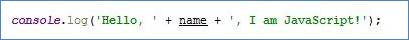

<html>

<head>
<meta http-equiv=Content-Type content="text/html; charset=windows-1251">
<meta name=Generator content="Microsoft Word 14 (filtered)">
<title>Exercises and Homework for the JavaScript Fundamentals Course at SoftUni</title>

</head>

<body lang=EN-US link=blue vlink=purple>

<h1>Exercises: Data Types, Expressions, Statements</h1>

Problems for exercises and homework for the <a
href="https://softuni.bg/courses/javascript-fundamentals">“JavaScript
Fundamentals” course @ SoftUni</a>. Submit your solutions in the SoftUni Judge
system at <a href="https://judge.softuni.bg/Contests/308">https://judge.softuni.bg/Contests/308</a>.

<h2>1.&nbsp;&nbsp; Hello,
JavaScript!</h2>

Write a JS function that can receive a name as input and
print a greeting to the console.

The <b>input</b> comes as a single string that is the name
of the person.

The <b>output</b> should be printed to the console.

<h3>Examples</h3>

<table class=MsoTableGrid border=1 cellspacing=0 cellpadding=0 width=529
 style='width:396.85pt;margin-left:1.15pt;border-collapse:collapse;border:none'>
 <tr>
  <td width=189 valign=top style='width:141.75pt;border:solid windowtext 1.0pt;
  background:#D9D9D9;padding:2.85pt 4.25pt 2.85pt 4.25pt'>
  
<b>Input</b>

  </td>
  <td width=340 valign=top style='width:255.1pt;border:solid windowtext 1.0pt;
  border-left:none;background:#D9D9D9;padding:2.85pt 4.25pt 2.85pt 4.25pt'>
  
<b>Output</b>

  </td>
 </tr>
 <tr>
  <td width=189 valign=top style='width:141.75pt;border:solid windowtext 1.0pt;
  border-top:none;padding:2.85pt 4.25pt 2.85pt 4.25pt'>
  
Pesho

  </td>
  <td width=340 style='width:255.1pt;border-top:none;border-left:none;
  border-bottom:solid windowtext 1.0pt;border-right:solid windowtext 1.0pt;
  padding:2.85pt 4.25pt 2.85pt 4.25pt'>
  
Hello, Pesho, I am JavaScript!

  </td>
 </tr>
 <tr>
  <td width=189 valign=top style='width:141.75pt;border:solid windowtext 1.0pt;
  border-top:none;padding:2.85pt 4.25pt 2.85pt 4.25pt'>
  
Bill Gates

  </td>
  <td width=340 style='width:255.1pt;border-top:none;border-left:none;
  border-bottom:solid windowtext 1.0pt;border-right:solid windowtext 1.0pt;
  padding:2.85pt 4.25pt 2.85pt 4.25pt'>
  
Hello, Bill Gates, I am JavaScript!

  </td>
 </tr>
</table>

<h3>Hints</h3>

We would get the name from a single string variable that
would be passed to our method.

We need to concatenate three strings – the two static parts
of our greeting and the name of the person in the middle. We can do this by
simply adding the three strings with the addition operator. Since this is an
operation which returns the concatenated string, we can directly perform this
expression in a call to console.log(). Note the
space at the end of the first string:

You should be ready to submit your solution to the <strong>judge system</strong>. Open
the judge contest for this homework and submit your code:<a
href="https://judge.softuni.bg/Contests/308">
https://judge.softuni.bg/Contests/308</a>. It should look like this: 

The judge system should <b>accept your solution</b> as
correct: 

If you get an error, you can see what went wrong in the
detailed report, using the highlighted button: 
 

Here you can see what the system expected and what your
program’s result was. You can also see what the input for the test was: 

Note you can only view detailed information for zero tests –
they do not give you points, but are handy for finding typos and debugging some
errors. Chances are, if you manage to get all zero tests to pass, you’ll also
have some competitive tests passing too.

<h2>2.&nbsp;&nbsp; Area and
Perimeter</h2>

Write a JS function that calculates the area and perimeter
of a rectangle by given two sides.

The <b>input</b> comes as 2 numbers that are
the lengths of the 2 sides of the rectangle (sideA and sideB)

The <b>output</b> should be printed to the console on two
lines.

<h3>Examples</h3>

<table class=MsoTableGrid border=1 cellspacing=0 cellpadding=0 width=529
 style='width:396.85pt;margin-left:1.15pt;border-collapse:collapse;border:none'>
 <tr>
  <td width=189 valign=top style='width:141.75pt;border:solid windowtext 1.0pt;
  background:#D9D9D9;padding:2.85pt 4.25pt 2.85pt 4.25pt'>
  
<b>Input</b>

  </td>
  <td width=340 valign=top style='width:255.1pt;border:solid windowtext 1.0pt;
  border-left:none;background:#D9D9D9;padding:2.85pt 4.25pt 2.85pt 4.25pt'>
  
<b>Output</b>

  </td>
 </tr>
 <tr>
  <td width=189 valign=top style='width:141.75pt;border:solid windowtext 1.0pt;
  border-top:none;padding:2.85pt 4.25pt 2.85pt 4.25pt'>
  
2 2

  </td>
  <td width=340 style='width:255.1pt;border-top:none;border-left:none;
  border-bottom:solid windowtext 1.0pt;border-right:solid windowtext 1.0pt;
  padding:2.85pt 4.25pt 2.85pt 4.25pt'>
  
4

  
8

  </td>
 </tr>
 <tr>
  <td width=189 valign=top style='width:141.75pt;border:solid windowtext 1.0pt;
  border-top:none;padding:2.85pt 4.25pt 2.85pt 4.25pt'>
  
1 3

  </td>
  <td width=340 style='width:255.1pt;border-top:none;border-left:none;
  border-bottom:solid windowtext 1.0pt;border-right:solid windowtext 1.0pt;
  padding:2.85pt 4.25pt 2.85pt 4.25pt'>
  
3

  
8

  </td>
 </tr>
 <tr>
  <td width=189 valign=top style='width:141.75pt;border:solid windowtext 1.0pt;
  border-top:none;padding:2.85pt 4.25pt 2.85pt 4.25pt'>
  
2.5 3.14

  </td>
  <td width=340 style='width:255.1pt;border-top:none;border-left:none;
  border-bottom:solid windowtext 1.0pt;border-right:solid windowtext 1.0pt;
  padding:2.85pt 4.25pt 2.85pt 4.25pt'>
  
7.85

  
11.28

  </td>
 </tr>
</table>

<h3>Hints</h3>

The multiplication operator will automatically coerce the
input variables to numbers, so we can directly find the area of the rectangle
by multiplying the two input elements. 

The remaining operations are straightforward arithmetic and
finally printing the two results (area and perimeter) to the console.

<h2>3.&nbsp;&nbsp; Distance
over Time</h2>

Two objects start from point <b><i>A</i></b> and travel in
the same direction at constant speeds <b><i>V1</i></b> and <b><i>V2</i></b>
for a period <b><i>T</i></b>. Write a JS function that calculates the distance
between the two object at the end of the period.

The <b>input</b> comes as array of numbers. The first two
elements are the speeds to the two objects in km/h and the third element is the
time in seconds.

The <b>output</b> should be printed to the console.
Calculate the distance in meters.

<h3>Examples</h3>

<table class=MsoTableGrid border=1 cellspacing=0 cellpadding=0 width=529
 style='width:396.85pt;margin-left:1.15pt;border-collapse:collapse;border:none'>
 <tr>
  <td width=189 valign=top style='width:141.75pt;border:solid windowtext 1.0pt;
  background:#D9D9D9;padding:2.85pt 4.25pt 2.85pt 4.25pt'>
  
<b>Input</b>

  </td>
  <td width=340 valign=top style='width:255.1pt;border:solid windowtext 1.0pt;
  border-left:none;background:#D9D9D9;padding:2.85pt 4.25pt 2.85pt 4.25pt'>
  
<b>Output</b>

  </td>
 </tr>
 <tr>
  <td width=189 valign=top style='width:141.75pt;border:solid windowtext 1.0pt;
  border-top:none;padding:2.85pt 4.25pt 2.85pt 4.25pt'>
  
[0, 60, 3600]

  </td>
  <td width=340 style='width:255.1pt;border-top:none;border-left:none;
  border-bottom:solid windowtext 1.0pt;border-right:solid windowtext 1.0pt;
  padding:2.85pt 4.25pt 2.85pt 4.25pt'>
  
60000

  </td>
 </tr>
 <tr>
  <td width=189 valign=top style='width:141.75pt;border:solid windowtext 1.0pt;
  border-top:none;padding:2.85pt 4.25pt 2.85pt 4.25pt'>
  
[11, 10, 120]

  </td>
  <td width=340 style='width:255.1pt;border-top:none;border-left:none;
  border-bottom:solid windowtext 1.0pt;border-right:solid windowtext 1.0pt;
  padding:2.85pt 4.25pt 2.85pt 4.25pt'>
  
33.33333333333337

  </td>
 </tr>
 <tr>
  <td width=189 valign=top style='width:141.75pt;border:solid windowtext 1.0pt;
  border-top:none;padding:2.85pt 4.25pt 2.85pt 4.25pt'>
  
[5, -5, 40]

  </td>
  <td width=340 style='width:255.1pt;border-top:none;border-left:none;
  border-bottom:solid windowtext 1.0pt;border-right:solid windowtext 1.0pt;
  padding:2.85pt 4.25pt 2.85pt 4.25pt'>
  
111.11111111111111

  </td>
 </tr>
</table>

<h3>Hints</h3>

Speed, time and distance are related to each other with the
following formula:

However, the incoming units need to be equalized first and
after the calculation, a final conversion needs to be done to match the
required output units. There are 3600 seconds in an hour and 1000 meters in a
kilometer. We don’t know which object covered a greater distance, so simply
subtracting them from one another may result in a <strong>negative number</strong>.
Distance however is absolute (always positive), so we need to get the absolute
value of the operation, using the built-in Math.abs(number)
functions: 

<h2>4.&nbsp;&nbsp; Distance
in 3D</h2>

Write a JS function that calculates the distance between the
two points in 3D by given coordinates.

The <b>input</b> comes as an array of numbers. The first
three elements are the x, y and z coordinates for the first point and the
second set of arguments are the coordinates of the other point.

The <b>output</b> should be printed to the console.

<h3>Examples</h3>

<table class=MsoTableGrid border=1 cellspacing=0 cellpadding=0 width=529
 style='width:396.85pt;margin-left:1.15pt;border-collapse:collapse;border:none'>
 <tr>
  <td width=189 valign=top style='width:141.75pt;border:solid windowtext 1.0pt;
  background:#D9D9D9;padding:2.85pt 4.25pt 2.85pt 4.25pt'>
  
<b>Input</b>

  </td>
  <td width=340 valign=top style='width:255.1pt;border:solid windowtext 1.0pt;
  border-left:none;background:#D9D9D9;padding:2.85pt 4.25pt 2.85pt 4.25pt'>
  
<b>Output</b>

  </td>
 </tr>
 <tr>
  <td width=189 valign=top style='width:141.75pt;border:solid windowtext 1.0pt;
  border-top:none;padding:2.85pt 4.25pt 2.85pt 4.25pt'>
  
[1, 1, 0, 5, 4, 0]

  </td>
  <td width=340 style='width:255.1pt;border-top:none;border-left:none;
  border-bottom:solid windowtext 1.0pt;border-right:solid windowtext 1.0pt;
  padding:2.85pt 4.25pt 2.85pt 4.25pt'>
  
5

  </td>
 </tr>
 <tr>
  <td width=189 valign=top style='width:141.75pt;border:solid windowtext 1.0pt;
  border-top:none;padding:2.85pt 4.25pt 2.85pt 4.25pt'>
  
[3.5, 0, 1, 0, 2, -1]

  </td>
  <td width=340 style='width:255.1pt;border-top:none;border-left:none;
  border-bottom:solid windowtext 1.0pt;border-right:solid windowtext 1.0pt;
  padding:2.85pt 4.25pt 2.85pt 4.25pt'>
  
4.5

  </td>
 </tr>
</table>

<h3>Hints</h3>

You can find the horizontal and vertical offset between two
points by calculating the difference between their respective coordinates. Use
Pythagoras’ theorem to find the distance.

<h2>5.&nbsp;&nbsp; Grads to
Degrees</h2>

Land surveyors use grads (also known as gon, 400 grads in a
full turn) in their documents. Grads are rather unwieldy though, so you need to
write a JS function that converts from grads to degrees. In addition, your
program needs to constrain the results within the range ,
so if you arrive at a value like -15°, it needs to be converted to 345° and
420° becomes 60°.

The <b>input</b> comes as single number.

The <b>output</b> should be printed to the console.

<h3>Examples</h3>

<table class=MsoTableGrid border=1 cellspacing=0 cellpadding=0 width=677
 style='width:7.05in;margin-left:1.15pt;border-collapse:collapse;border:none'>
 <tr>
  <td width=76 valign=top style='width:56.7pt;border:solid windowtext 1.0pt;
  background:#D9D9D9;padding:2.85pt 4.25pt 2.85pt 4.25pt'>
  
<b>Input</b>

  </td>
  <td width=76 valign=top style='width:56.7pt;border:solid windowtext 1.0pt;
  border-left:none;background:#D9D9D9;padding:2.85pt 4.25pt 2.85pt 4.25pt'>
  
<b>Output</b>

  </td>
  <td width=24 valign=top style='width:.25in;border:none;border-right:solid windowtext 1.0pt;
  padding:2.85pt 4.25pt 2.85pt 4.25pt'>
  
<b>&nbsp;</b>

  </td>
  <td width=76 valign=top style='width:56.7pt;border:solid windowtext 1.0pt;
  border-left:none;background:#D9D9D9;padding:2.85pt 4.25pt 2.85pt 4.25pt'>
  
<b>Input</b>

  </td>
  <td width=76 valign=top style='width:56.7pt;border:solid windowtext 1.0pt;
  border-left:none;background:#D9D9D9;padding:2.85pt 4.25pt 2.85pt 4.25pt'>
  
<b>Output</b>

  </td>
  <td width=24 rowspan=2 valign=top style='width:.25in;border:none;border-right:
  solid windowtext 1.0pt;padding:2.85pt 4.25pt 2.85pt 4.25pt'>
  
<b>&nbsp;</b>

  </td>
  <td width=76 valign=top style='width:56.7pt;border:solid windowtext 1.0pt;
  border-left:none;background:#D9D9D9;padding:2.85pt 4.25pt 2.85pt 4.25pt'>
  
<b>Input</b>

  </td>
  <td width=76 valign=top style='width:56.7pt;border:solid windowtext 1.0pt;
  border-left:none;background:#D9D9D9;padding:2.85pt 4.25pt 2.85pt 4.25pt'>
  
<b>Output</b>

  </td>
  <td width=24 rowspan=2 valign=top style='width:.25in;border:none;border-right:
  solid windowtext 1.0pt;padding:2.85pt 4.25pt 2.85pt 4.25pt'>
  
<b>&nbsp;</b>

  </td>
  <td width=76 valign=top style='width:56.7pt;border:solid windowtext 1.0pt;
  border-left:none;background:#D9D9D9;padding:2.85pt 4.25pt 2.85pt 4.25pt'>
  
<b>Input</b>

  </td>
  <td width=76 valign=top style='width:56.7pt;border:solid windowtext 1.0pt;
  border-left:none;background:#D9D9D9;padding:2.85pt 4.25pt 2.85pt 4.25pt'>
  
<b>Output</b>

  </td>
 </tr>
 <tr>
  <td width=76 valign=top style='width:56.7pt;border:solid windowtext 1.0pt;
  border-top:none;padding:2.85pt 4.25pt 2.85pt 4.25pt'>
  
100

  </td>
  <td width=76 style='width:56.7pt;border-top:none;border-left:none;border-bottom:
  solid windowtext 1.0pt;border-right:solid windowtext 1.0pt;padding:2.85pt 4.25pt 2.85pt 4.25pt'>
  
90

  </td>
  <td width=24 valign=top style='width:.25in;border:none;border-right:solid windowtext 1.0pt;
  padding:2.85pt 4.25pt 2.85pt 4.25pt'>
  
&nbsp;

  </td>
  <td width=76 valign=top style='width:56.7pt;border-top:none;border-left:none;
  border-bottom:solid windowtext 1.0pt;border-right:solid windowtext 1.0pt;
  padding:2.85pt 4.25pt 2.85pt 4.25pt'>
  
400

  </td>
  <td width=76 valign=top style='width:56.7pt;border-top:none;border-left:none;
  border-bottom:solid windowtext 1.0pt;border-right:solid windowtext 1.0pt;
  padding:2.85pt 4.25pt 2.85pt 4.25pt'>
  
0

  </td>
  <td width=76 valign=top style='width:56.7pt;border-top:none;border-left:none;
  border-bottom:solid windowtext 1.0pt;border-right:solid windowtext 1.0pt;
  padding:2.85pt 4.25pt 2.85pt 4.25pt'>
  
850

  </td>
  <td width=76 valign=top style='width:56.7pt;border-top:none;border-left:none;
  border-bottom:solid windowtext 1.0pt;border-right:solid windowtext 1.0pt;
  padding:2.85pt 4.25pt 2.85pt 4.25pt'>
  
45

  </td>
  <td width=76 valign=top style='width:56.7pt;border-top:none;border-left:none;
  border-bottom:solid windowtext 1.0pt;border-right:solid windowtext 1.0pt;
  padding:2.85pt 4.25pt 2.85pt 4.25pt'>
  
-50

  </td>
  <td width=76 valign=top style='width:56.7pt;border-top:none;border-left:none;
  border-bottom:solid windowtext 1.0pt;border-right:solid windowtext 1.0pt;
  padding:2.85pt 4.25pt 2.85pt 4.25pt'>
  
315

  </td>
 </tr>
</table>

<h3>Hints</h3>

You can use the remainder (modulo) operator to get a value
that is cyclic – it returns the same result for all input values with offset
equal to the second parameter. For instance, n % 10
will return 3 with values for <strong>n</strong>
3, 13, 23, 243, 1003 and so on.

<h2>6.&nbsp;&nbsp; Compound
Interest</h2>

Write a JS function that calculates the total accumulated
value for a monetary deposit by given principal sum, interest rate, compounding
frequency and overall length.

The <b>input</b> comes as an array of numbers. The first
value is the principal sum, the second is the interest rate in percent, the
third is the compounding period in months and the final value is the total
timespan, given in years.

The <b>output</b> should be printed to the console, with two
decimal places.

<h3>Examples</h3>

<table class=MsoTableGrid border=1 cellspacing=0 cellpadding=0 width=629
 style='width:6.55in;margin-left:1.15pt;border-collapse:collapse;border:none'>
 <tr>
  <td width=189 valign=top style='width:141.75pt;border:solid windowtext 1.0pt;
  background:#D9D9D9;padding:2.85pt 4.25pt 2.85pt 4.25pt'>
  
<b>Input</b>

  </td>
  <td width=113 valign=top style='width:85.05pt;border:solid windowtext 1.0pt;
  border-left:none;background:#D9D9D9;padding:2.85pt 4.25pt 2.85pt 4.25pt'>
  
<b>Output</b>

  </td>
  <td width=24 valign=top style='width:.25in;border:none;border-right:solid windowtext 1.0pt;
  padding:2.85pt 4.25pt 2.85pt 4.25pt'>
  
<b>&nbsp;</b>

  </td>
  <td width=189 valign=top style='width:141.75pt;border:solid windowtext 1.0pt;
  border-left:none;background:#D9D9D9;padding:2.85pt 4.25pt 2.85pt 4.25pt'>
  
<b>Input</b>

  </td>
  <td width=113 valign=top style='width:85.05pt;border:solid windowtext 1.0pt;
  border-left:none;background:#D9D9D9;padding:2.85pt 4.25pt 2.85pt 4.25pt'>
  
<b>Output</b>

  </td>
 </tr>
 <tr>
  <td width=189 valign=top style='width:141.75pt;border:solid windowtext 1.0pt;
  border-top:none;padding:2.85pt 4.25pt 2.85pt 4.25pt'>
  
[1500, 4.3, 3, 6]

  </td>
  <td width=113 style='width:85.05pt;border-top:none;border-left:none;
  border-bottom:solid windowtext 1.0pt;border-right:solid windowtext 1.0pt;
  padding:2.85pt 4.25pt 2.85pt 4.25pt'>
  
1938.84

  </td>
  <td width=24 valign=top style='width:.25in;border:none;border-right:solid windowtext 1.0pt;
  padding:2.85pt 4.25pt 2.85pt 4.25pt'>
  
&nbsp;

  </td>
  <td width=189 valign=top style='width:141.75pt;border-top:none;border-left:
  none;border-bottom:solid windowtext 1.0pt;border-right:solid windowtext 1.0pt;
  padding:2.85pt 4.25pt 2.85pt 4.25pt'>
  
[100000, 5, 12, 25]

  </td>
  <td width=113 valign=top style='width:85.05pt;border-top:none;border-left:
  none;border-bottom:solid windowtext 1.0pt;border-right:solid windowtext 1.0pt;
  padding:2.85pt 4.25pt 2.85pt 4.25pt'>
  
338635.49

  </td>
 </tr>
</table>

<h3>Hints</h3>

The formula for calculating compound interest is as follows:

where:

·&nbsp;&nbsp;&nbsp;&nbsp;&nbsp;&nbsp;&nbsp;&nbsp;
<b><i>P</i></b> is the principal sum

·&nbsp;&nbsp;&nbsp;&nbsp;&nbsp;&nbsp;&nbsp;&nbsp;
<b><i>i</i></b> is the nominal interest rate

·&nbsp;&nbsp;&nbsp;&nbsp;&nbsp;&nbsp;&nbsp;&nbsp;
<b><i>n</i></b> is the compounding frequency

·&nbsp;&nbsp;&nbsp;&nbsp;&nbsp;&nbsp;&nbsp;&nbsp;
<b><i>t</i></b> is the overall length of time the interest is
applied

Note that at the beginning of the task you are given the
compounding period, which is inversely related to the frequency. You need to
express the frequency as how many times in a year the interest is compounded.
For instance, a 3-month period means the interest will be updated 4 times in a
year. Any percentages need to be expressed as a fraction.

<h2>7.&nbsp;&nbsp; *Rounding</h2>

Write a JS function that rounds numbers to specific
precision.

The <b>input</b> comes as an array of two numbers. The first
value is the number to be rounded and the second is the precision (significant
decimal places). If a precision is passed, that is more than <b>15</b> it
should automatically be reduced to <b>15</b>.

The <b>output</b> should be printed to the console. Do not
print insignificant decimals.

<h3>Examples</h3>

<table class=MsoTableGrid border=1 cellspacing=0 cellpadding=0 width=629
 style='width:6.55in;margin-left:1.15pt;border-collapse:collapse;border:none'>
 <tr>
  <td width=189 valign=top style='width:141.75pt;border:solid windowtext 1.0pt;
  background:#D9D9D9;padding:2.85pt 4.25pt 2.85pt 4.25pt'>
  
<b>Input</b>

  </td>
  <td width=113 valign=top style='width:85.05pt;border:solid windowtext 1.0pt;
  border-left:none;background:#D9D9D9;padding:2.85pt 4.25pt 2.85pt 4.25pt'>
  
<b>Output</b>

  </td>
  <td width=24 valign=top style='width:.25in;border:none;border-right:solid windowtext 1.0pt;
  padding:2.85pt 4.25pt 2.85pt 4.25pt'>
  
<b>&nbsp;</b>

  </td>
  <td width=189 valign=top style='width:141.75pt;border:solid windowtext 1.0pt;
  border-left:none;background:#D9D9D9;padding:2.85pt 4.25pt 2.85pt 4.25pt'>
  
<b>Input</b>

  </td>
  <td width=113 valign=top style='width:85.05pt;border:solid windowtext 1.0pt;
  border-left:none;background:#D9D9D9;padding:2.85pt 4.25pt 2.85pt 4.25pt'>
  
<b>Output</b>

  </td>
 </tr>
 <tr>
  <td width=189 valign=top style='width:141.75pt;border:solid windowtext 1.0pt;
  border-top:none;padding:2.85pt 4.25pt 2.85pt 4.25pt'>
  
[3.1415926535897932384626433832795, 2]

  </td>
  <td width=113 valign=top style='width:85.05pt;border-top:none;border-left:
  none;border-bottom:solid windowtext 1.0pt;border-right:solid windowtext 1.0pt;
  padding:2.85pt 4.25pt 2.85pt 4.25pt'>
  
3.14

  </td>
  <td width=24 valign=top style='width:.25in;border:none;border-right:solid windowtext 1.0pt;
  padding:2.85pt 4.25pt 2.85pt 4.25pt'>
  
&nbsp;

  </td>
  <td width=189 valign=top style='width:141.75pt;border-top:none;border-left:
  none;border-bottom:solid windowtext 1.0pt;border-right:solid windowtext 1.0pt;
  padding:2.85pt 4.25pt 2.85pt 4.25pt'>
  
[10.5, 3]

  </td>
  <td width=113 valign=top style='width:85.05pt;border-top:none;border-left:
  none;border-bottom:solid windowtext 1.0pt;border-right:solid windowtext 1.0pt;
  padding:2.85pt 4.25pt 2.85pt 4.25pt'>
  
10.5

  </td>
 </tr>
</table>

<h2>8.&nbsp;&nbsp; Imperial
Units</h2>

Imperial units are confusing, but still in use in some
backwards countries (Myanmar, Liberia and the United States are the only
countries still using them). They are so confusing in fact, that native users
struggle to convert between them. Write a JS function that converts from inches
to feet and inches. There are 12 inches in a foot. See the example for
formatting details.

The <b>input</b> comes as a single number.

The <b>output</b> should be printed to the console.

<h3>Examples</h3>

<table class=MsoTableGrid border=1 cellspacing=0 cellpadding=0 width=615
 style='width:461.4pt;margin-left:1.15pt;border-collapse:collapse;border:none'>
 <tr>
  <td width=76 valign=top style='width:56.7pt;border:solid windowtext 1.0pt;
  background:#D9D9D9;padding:2.85pt 4.25pt 2.85pt 4.25pt'>
  
<b>Input</b>

  </td>
  <td width=113 valign=top style='width:85.05pt;border:solid windowtext 1.0pt;
  border-left:none;background:#D9D9D9;padding:2.85pt 4.25pt 2.85pt 4.25pt'>
  
<b>Output</b>

  </td>
  <td width=24 rowspan=2 valign=top style='width:.25in;border:none;border-right:
  solid windowtext 1.0pt;padding:2.85pt 4.25pt 2.85pt 4.25pt'>
  
<b>&nbsp;</b>

  </td>
  <td width=76 valign=top style='width:56.7pt;border:solid windowtext 1.0pt;
  border-left:none;background:#D9D9D9;padding:2.85pt 4.25pt 2.85pt 4.25pt'>
  
<b>Input</b>

  </td>
  <td width=113 valign=top style='width:85.05pt;border:solid windowtext 1.0pt;
  border-left:none;background:#D9D9D9;padding:2.85pt 4.25pt 2.85pt 4.25pt'>
  
<b>Output</b>

  </td>
  <td width=24 rowspan=2 valign=top style='width:18.15pt;border:none;
  border-right:solid windowtext 1.0pt;padding:2.85pt 4.25pt 2.85pt 4.25pt'>
  
<b>&nbsp;</b>

  </td>
  <td width=76 valign=top style='width:56.7pt;border:solid windowtext 1.0pt;
  border-left:none;background:#D9D9D9;padding:2.85pt 4.25pt 2.85pt 4.25pt'>
  
<b>Input</b>

  </td>
  <td width=113 valign=top style='width:85.05pt;border:solid windowtext 1.0pt;
  border-left:none;background:#D9D9D9;padding:2.85pt 4.25pt 2.85pt 4.25pt'>
  
<b>Output</b>

  </td>
 </tr>
 <tr>
  <td width=76 valign=top style='width:56.7pt;border:solid windowtext 1.0pt;
  border-top:none;padding:2.85pt 4.25pt 2.85pt 4.25pt'>
  
36

  </td>
  <td width=113 valign=top style='width:85.05pt;border-top:none;border-left:
  none;border-bottom:solid windowtext 1.0pt;border-right:solid windowtext 1.0pt;
  padding:2.85pt 4.25pt 2.85pt 4.25pt'>
  
3'-0&quot;

  </td>
  <td width=76 valign=top style='width:56.7pt;border-top:none;border-left:none;
  border-bottom:solid windowtext 1.0pt;border-right:solid windowtext 1.0pt;
  padding:2.85pt 4.25pt 2.85pt 4.25pt'>
  
55

  </td>
  <td width=113 valign=top style='width:85.05pt;border-top:none;border-left:
  none;border-bottom:solid windowtext 1.0pt;border-right:solid windowtext 1.0pt;
  padding:2.85pt 4.25pt 2.85pt 4.25pt'>
  
4'-7&quot;

  </td>
  <td width=76 valign=top style='width:56.7pt;border-top:none;border-left:none;
  border-bottom:solid windowtext 1.0pt;border-right:solid windowtext 1.0pt;
  padding:2.85pt 4.25pt 2.85pt 4.25pt'>
  
11

  </td>
  <td width=113 valign=top style='width:85.05pt;border-top:none;border-left:
  none;border-bottom:solid windowtext 1.0pt;border-right:solid windowtext 1.0pt;
  padding:2.85pt 4.25pt 2.85pt 4.25pt'>
  
0'-11&quot;

  </td>
 </tr>
</table>

<h2>9.&nbsp;&nbsp; Now
Playing</h2>

Write a JS function that displays information about the
currently playing musical track.

The <b>input</b> comes as an array of string elements. The
first element is the name of the track, the second is the name of the artist
performing and the third is the duration in minutes and seconds.

The <b>output</b> should be printed to the console in the
following format:

Now Playing: {artist name} - {track name} [{duration}]

<h3>Examples</h3>

<table class=MsoTableGrid border=1 cellspacing=0 cellpadding=0 width=680
 style='width:510.2pt;margin-left:1.15pt;border-collapse:collapse;border:none'>
 <tr>
  <td width=302 valign=top style='width:226.75pt;border:solid windowtext 1.0pt;
  background:#D9D9D9;padding:2.85pt 4.25pt 2.85pt 4.25pt'>
  
<b>Input</b>

  </td>
  <td width=378 valign=top style='width:283.45pt;border:solid windowtext 1.0pt;
  border-left:none;background:#D9D9D9;padding:2.85pt 4.25pt 2.85pt 4.25pt'>
  
<b>Output</b>

  </td>
 </tr>
 <tr>
  <td width=302 valign=top style='width:226.75pt;border:solid windowtext 1.0pt;
  border-top:none;padding:2.85pt 4.25pt 2.85pt 4.25pt'>
  
['Number One', 'Nelly', '4:09']

  </td>
  <td width=378 valign=top style='width:283.45pt;border-top:none;border-left:
  none;border-bottom:solid windowtext 1.0pt;border-right:solid windowtext 1.0pt;
  padding:2.85pt 4.25pt 2.85pt 4.25pt'>
  
Now Playing: Nelly – Number One [4:09]

  </td>
 </tr>
</table>

 

&nbsp;

<h2>10.&nbsp;&nbsp;&nbsp; Compose
Tag</h2>

Write a JS function that composes an HTML image tag.

The <b>input</b> comes as an array of string elements. The
first element is the location of the file and the second is the alternate text.

The <b>output</b> should be printed to the console in the
following format:

&lt;img src=&quot;{file location}&quot; alt=&quot;{alternate
text}&quot;&gt;

<h3>Examples</h3>

<table class=MsoTableGrid border=1 cellspacing=0 cellpadding=0 width=680
 style='width:510.2pt;margin-left:1.15pt;border-collapse:collapse;border:none'>
 <tr>
  <td width=302 valign=top style='width:226.75pt;border:solid windowtext 1.0pt;
  background:#D9D9D9;padding:2.85pt 4.25pt 2.85pt 4.25pt'>
  
<b>Input</b>

  </td>
  <td width=378 valign=top style='width:283.45pt;border:solid windowtext 1.0pt;
  border-left:none;background:#D9D9D9;padding:2.85pt 4.25pt 2.85pt 4.25pt'>
  
<b>Output</b>

  </td>
 </tr>
 <tr>
  <td width=302 valign=top style='width:226.75pt;border:solid windowtext 1.0pt;
  border-top:none;padding:2.85pt 4.25pt 2.85pt 4.25pt'>
  
['smiley.gif', 'Smiley Face']

  </td>
  <td width=378 valign=top style='width:283.45pt;border-top:none;border-left:
  none;border-bottom:solid windowtext 1.0pt;border-right:solid windowtext 1.0pt;
  padding:2.85pt 4.25pt 2.85pt 4.25pt'>
  
&lt;img src=&quot;smiley.gif&quot; alt=&quot;Smiley Face&quot;&gt;

  </td>
 </tr>
</table>

<h2>11.&nbsp;&nbsp;&nbsp; Binary
to Decimal</h2>

Write a JS function that reads an 8-bit binary number and
converts it to a decimal.

The <b>input</b> comes as one string element, representing a
binary number.

The <b>output</b> should be printed to the console.

<h3>Examples</h3>

<table class=MsoTableGrid border=1 cellspacing=0 cellpadding=0 width=629
 style='width:6.55in;margin-left:1.15pt;border-collapse:collapse;border:none'>
 <tr>
  <td width=189 valign=top style='width:141.75pt;border:solid windowtext 1.0pt;
  background:#D9D9D9;padding:2.85pt 4.25pt 2.85pt 4.25pt'>
  
<b>Input</b>

  </td>
  <td width=113 valign=top style='width:85.05pt;border:solid windowtext 1.0pt;
  border-left:none;background:#D9D9D9;padding:2.85pt 4.25pt 2.85pt 4.25pt'>
  
<b>Output</b>

  </td>
  <td width=24 valign=top style='width:.25in;border:none;border-right:solid windowtext 1.0pt;
  padding:2.85pt 4.25pt 2.85pt 4.25pt'>
  
<b>&nbsp;</b>

  </td>
  <td width=189 valign=top style='width:141.75pt;border:solid windowtext 1.0pt;
  border-left:none;background:#D9D9D9;padding:2.85pt 4.25pt 2.85pt 4.25pt'>
  
<b>Input</b>

  </td>
  <td width=113 valign=top style='width:85.05pt;border:solid windowtext 1.0pt;
  border-left:none;background:#D9D9D9;padding:2.85pt 4.25pt 2.85pt 4.25pt'>
  
<b>Output</b>

  </td>
 </tr>
 <tr>
  <td width=189 valign=top style='width:141.75pt;border:solid windowtext 1.0pt;
  border-top:none;padding:2.85pt 4.25pt 2.85pt 4.25pt'>
  
00001001

  </td>
  <td width=113 valign=top style='width:85.05pt;border-top:none;border-left:
  none;border-bottom:solid windowtext 1.0pt;border-right:solid windowtext 1.0pt;
  padding:2.85pt 4.25pt 2.85pt 4.25pt'>
  
9

  </td>
  <td width=24 valign=top style='width:.25in;border:none;border-right:solid windowtext 1.0pt;
  padding:2.85pt 4.25pt 2.85pt 4.25pt'>
  
&nbsp;

  </td>
  <td width=189 valign=top style='width:141.75pt;border-top:none;border-left:
  none;border-bottom:solid windowtext 1.0pt;border-right:solid windowtext 1.0pt;
  padding:2.85pt 4.25pt 2.85pt 4.25pt'>
  
11110000

  </td>
  <td width=113 valign=top style='width:85.05pt;border-top:none;border-left:
  none;border-bottom:solid windowtext 1.0pt;border-right:solid windowtext 1.0pt;
  padding:2.85pt 4.25pt 2.85pt 4.25pt'>
  
240

  </td>
 </tr>
</table>

<h2>12.&nbsp;&nbsp;&nbsp; Assign
Properties</h2>

Write a JS function that composes an object by given
properties. There will be 3 sets of property-value pairs (a total of 6 elements).
Assign each value to its respective property of an object and return the object
as a result of the function.

The <b>input</b> comes as an array of string elements.

The <b>output</b> should be returned as a value.

<h3>Examples</h3>

<table class=MsoTableGrid border=1 cellspacing=0 cellpadding=0 width=567
 style='width:425.2pt;margin-left:1.15pt;border-collapse:collapse;border:none'>
 <tr>
  <td width=567 valign=top style='width:425.2pt;border:solid windowtext 1.0pt;
  background:#D9D9D9;padding:2.85pt 4.25pt 2.85pt 4.25pt'>
  
<b>Input</b>

  </td>
 </tr>
 <tr>
  <td width=567 valign=top style='width:425.2pt;border:solid windowtext 1.0pt;
  border-top:none;padding:2.85pt 4.25pt 2.85pt 4.25pt'>
  
['name', 'Pesho', 'age', '23', 'gender', 'male']

  </td>
 </tr>
 <tr>
  <td width=567 valign=top style='width:425.2pt;border:solid windowtext 1.0pt;
  border-top:none;background:#D9D9D9;padding:2.85pt 4.25pt 2.85pt 4.25pt'>
  
<b>Output</b>

  </td>
 </tr>
 <tr>
  <td width=567 valign=top style='width:425.2pt;border:solid windowtext 1.0pt;
  border-top:none;padding:2.85pt 4.25pt 2.85pt 4.25pt'>
  
{

  
  name: 'Pesho',

  
  age: '23',

  
  gender: 'male'

  
}

  </td>
 </tr>
</table>

 

&nbsp;

<table class=MsoTableGrid border=1 cellspacing=0 cellpadding=0 width=567
 style='width:425.2pt;margin-left:1.15pt;border-collapse:collapse;border:none'>
 <tr>
  <td width=567 valign=top style='width:425.2pt;border:solid windowtext 1.0pt;
  background:#D9D9D9;padding:2.85pt 4.25pt 2.85pt 4.25pt'>
  
<b>Input</b>

  </td>
 </tr>
 <tr>
  <td width=567 valign=top style='width:425.2pt;border:solid windowtext 1.0pt;
  border-top:none;padding:2.85pt 4.25pt 2.85pt 4.25pt'>
  
['ssid', '90127461', 'status', 'admin', 'expires',
  '600']

  </td>
 </tr>
 <tr>
  <td width=567 valign=top style='width:425.2pt;border:solid windowtext 1.0pt;
  border-top:none;background:#D9D9D9;padding:2.85pt 4.25pt 2.85pt 4.25pt'>
  
<b>Output</b>

  </td>
 </tr>
 <tr>
  <td width=567 valign=top style='width:425.2pt;border:solid windowtext 1.0pt;
  border-top:none;padding:2.85pt 4.25pt 2.85pt 4.25pt'>
  
{

  
  ssid: '90127461',

  
  status: 'admin',

  
  expires: '600'

  
}

  </td>
 </tr>
</table>

<h2>13.&nbsp;&nbsp;&nbsp; *Last
Month</h2>

Write a JS function that receives a date as array of strings
containing <b>day, month</b> and<b> year</b> in that order. Your task is to
print the last day of previous month (the month <b>BEFORE </b>the given date).
Check the examples to better understand the problem.

The <b>input</b> comes as an array of numbers.

The <b>output</b> should be a single number representing the
<b>last day</b> of the previous month.

<h3>Examples</h3>

<table class=MsoTableGrid border=1 cellspacing=0 cellpadding=0 width=629
 style='width:6.55in;margin-left:1.15pt;border-collapse:collapse;border:none'>
 <tr>
  <td width=189 valign=top style='width:141.75pt;border:solid windowtext 1.0pt;
  background:#D9D9D9;padding:2.85pt 4.25pt 2.85pt 4.25pt'>
  
<b>Input</b>

  </td>
  <td width=113 valign=top style='width:85.05pt;border:solid windowtext 1.0pt;
  border-left:none;background:#D9D9D9;padding:2.85pt 4.25pt 2.85pt 4.25pt'>
  
<b>Output</b>

  </td>
  <td width=24 valign=top style='width:.25in;border:none;border-right:solid windowtext 1.0pt;
  padding:2.85pt 4.25pt 2.85pt 4.25pt'>
  
<b>&nbsp;</b>

  </td>
  <td width=189 valign=top style='width:141.75pt;border:solid windowtext 1.0pt;
  border-left:none;background:#D9D9D9;padding:2.85pt 4.25pt 2.85pt 4.25pt'>
  
<b>Input</b>

  </td>
  <td width=113 valign=top style='width:85.05pt;border:solid windowtext 1.0pt;
  border-left:none;background:#D9D9D9;padding:2.85pt 4.25pt 2.85pt 4.25pt'>
  
<b>Output</b>

  </td>
 </tr>
 <tr>
  <td width=189 valign=top style='width:141.75pt;border:solid windowtext 1.0pt;
  border-top:none;padding:2.85pt 4.25pt 2.85pt 4.25pt'>
  
[17, 3, 2002]

  </td>
  <td width=113 valign=top style='width:85.05pt;border-top:none;border-left:
  none;border-bottom:solid windowtext 1.0pt;border-right:solid windowtext 1.0pt;
  padding:2.85pt 4.25pt 2.85pt 4.25pt'>
  
28

  </td>
  <td width=24 valign=top style='width:.25in;border:none;border-right:solid windowtext 1.0pt;
  padding:2.85pt 4.25pt 2.85pt 4.25pt'>
  
&nbsp;

  </td>
  <td width=189 valign=top style='width:141.75pt;border-top:none;border-left:
  none;border-bottom:solid windowtext 1.0pt;border-right:solid windowtext 1.0pt;
  padding:2.85pt 4.25pt 2.85pt 4.25pt'>
  
[13, 12, 2004]

  </td>
  <td width=113 valign=top style='width:85.05pt;border-top:none;border-left:
  none;border-bottom:solid windowtext 1.0pt;border-right:solid windowtext 1.0pt;
  padding:2.85pt 4.25pt 2.85pt 4.25pt'>
  
30

  </td>
 </tr>
</table>

<h1>Conditional Statements and Loops</h1>

In this homework, you are supposed to <b>write program logic</b>
using expressions, conditions and loops in JavaScript. You will practice
working with arithmetic operators, <b>expressions</b> and calculations, using <b>conditional
statements</b> (if, if-else, multiple if-else-if-else-…
and switch-case) and
working with <b>loop statements</b> (like for, while, do-while and for-of) and <b>nested loops</b>, combined with conditional
statements and calculations.

<h2>14.&nbsp;&nbsp;&nbsp; Biggest
of 3 Numbers</h2>

Write a JS function that finds the <b>biggest of 3 numbers</b>.

The <b>input</b> comes as array of 3 numbers.

The <b>output</b> is the biggest from the input numbers.

<h3>Examples</h3>

<table class=MsoTableGrid border=1 cellspacing=0 cellpadding=0 width=664
 style='width:498.25pt;margin-left:1.15pt;border-collapse:collapse;border:none'>
 <tr>
  <td width=51 valign=top style='width:38.45pt;border:solid windowtext 1.0pt;
  background:#D9D9D9;padding:2.85pt 4.25pt 2.85pt 4.25pt'>
  
<b>Input</b>

  </td>
  <td width=62 valign=top style='width:.65in;border:solid windowtext 1.0pt;
  border-left:none;background:#D9D9D9;padding:2.85pt 4.25pt 2.85pt 4.25pt'>
  
<b>Output</b>

  </td>
  <td width=24 valign=top style='width:.25in;border:none;border-right:solid windowtext 1.0pt;
  padding:2.85pt 4.25pt 2.85pt 4.25pt'>
  
<b>&nbsp;</b>

  </td>
  <td width=51 valign=top style='width:38.45pt;border:solid windowtext 1.0pt;
  border-left:none;background:#D9D9D9;padding:2.85pt 4.25pt 2.85pt 4.25pt'>
  
<b>Input</b>

  </td>
  <td width=62 valign=top style='width:.65in;border:solid windowtext 1.0pt;
  border-left:none;background:#D9D9D9;padding:2.85pt 4.25pt 2.85pt 4.25pt'>
  
<b>Output</b>

  </td>
  <td width=24 rowspan=2 valign=top style='width:.25in;border:none;border-right:
  solid windowtext 1.0pt;padding:2.85pt 4.25pt 2.85pt 4.25pt'>
  
<b>&nbsp;</b>

  </td>
  <td width=51 valign=top style='width:38.45pt;border:solid windowtext 1.0pt;
  border-left:none;background:#D9D9D9;padding:2.85pt 4.25pt 2.85pt 4.25pt'>
  
<b>Input</b>

  </td>
  <td width=62 valign=top style='width:.65in;border:solid windowtext 1.0pt;
  border-left:none;background:#D9D9D9;padding:2.85pt 4.25pt 2.85pt 4.25pt'>
  
<b>Output</b>

  </td>
  <td width=24 rowspan=2 valign=top style='width:.25in;border:none;border-right:
  solid windowtext 1.0pt;padding:2.85pt 4.25pt 2.85pt 4.25pt'>
  
<b>&nbsp;</b>

  </td>
  <td width=51 valign=top style='width:38.45pt;border:solid windowtext 1.0pt;
  border-left:none;background:#D9D9D9;padding:2.85pt 4.25pt 2.85pt 4.25pt'>
  
<b>Input</b>

  </td>
  <td width=62 valign=top style='width:.65in;border:solid windowtext 1.0pt;
  border-left:none;background:#D9D9D9;padding:2.85pt 4.25pt 2.85pt 4.25pt'>
  
<b>Output</b>

  </td>
  <td width=24 rowspan=2 valign=top style='width:.25in;border:none;border-right:
  solid windowtext 1.0pt;padding:2.85pt 4.25pt 2.85pt 4.25pt'>
  
<b>&nbsp;</b>

  </td>
  <td width=51 valign=top style='width:38.45pt;border:solid windowtext 1.0pt;
  border-left:none;background:#D9D9D9;padding:2.85pt 4.25pt 2.85pt 4.25pt'>
  
<b>Input</b>

  </td>
  <td width=62 valign=top style='width:.65in;border:solid windowtext 1.0pt;
  border-left:none;background:#D9D9D9;padding:2.85pt 4.25pt 2.85pt 4.25pt'>
  
<b>Output</b>

  </td>
 </tr>
 <tr>
  <td width=51 valign=top style='width:38.45pt;border:solid windowtext 1.0pt;
  border-top:none;padding:2.85pt 4.25pt 2.85pt 4.25pt'>
  
5

  
-2

  
7

  </td>
  <td width=62 valign=top style='width:.65in;border-top:none;border-left:none;
  border-bottom:solid windowtext 1.0pt;border-right:solid windowtext 1.0pt;
  padding:2.85pt 4.25pt 2.85pt 4.25pt'>
  
7

  </td>
  <td width=24 valign=top style='width:.25in;border:none;border-right:solid windowtext 1.0pt;
  padding:2.85pt 4.25pt 2.85pt 4.25pt'>
  
&nbsp;

  </td>
  <td width=51 valign=top style='width:38.45pt;border-top:none;border-left:
  none;border-bottom:solid windowtext 1.0pt;border-right:solid windowtext 1.0pt;
  padding:2.85pt 4.25pt 2.85pt 4.25pt'>
  
130

  
5

  
99

  </td>
  <td width=62 valign=top style='width:.65in;border-top:none;border-left:none;
  border-bottom:solid windowtext 1.0pt;border-right:solid windowtext 1.0pt;
  padding:2.85pt 4.25pt 2.85pt 4.25pt'>
  
130

  </td>
  <td width=51 valign=top style='width:38.45pt;border-top:none;border-left:
  none;border-bottom:solid windowtext 1.0pt;border-right:solid windowtext 1.0pt;
  padding:2.85pt 4.25pt 2.85pt 4.25pt'>
  
43

  
43.2

  
43.1

  </td>
  <td width=62 valign=top style='width:.65in;border-top:none;border-left:none;
  border-bottom:solid windowtext 1.0pt;border-right:solid windowtext 1.0pt;
  padding:2.85pt 4.25pt 2.85pt 4.25pt'>
  
43.2

  </td>
  <td width=51 valign=top style='width:38.45pt;border-top:none;border-left:
  none;border-bottom:solid windowtext 1.0pt;border-right:solid windowtext 1.0pt;
  padding:2.85pt 4.25pt 2.85pt 4.25pt'>
  
5

  
5

  
5

  </td>
  <td width=62 valign=top style='width:.65in;border-top:none;border-left:none;
  border-bottom:solid windowtext 1.0pt;border-right:solid windowtext 1.0pt;
  padding:2.85pt 4.25pt 2.85pt 4.25pt'>
  
5

  </td>
  <td width=51 valign=top style='width:38.45pt;border-top:none;border-left:
  none;border-bottom:solid windowtext 1.0pt;border-right:solid windowtext 1.0pt;
  padding:2.85pt 4.25pt 2.85pt 4.25pt'>
  
-10

  
-20

  
-30

  </td>
  <td width=62 valign=top style='width:.65in;border-top:none;border-left:none;
  border-bottom:solid windowtext 1.0pt;border-right:solid windowtext 1.0pt;
  padding:2.85pt 4.25pt 2.85pt 4.25pt'>
  
-10

  </td>
 </tr>
</table>

<h3>Hints</h3>

Read the input and assign each number to a variable:

You may use Math.max(num1, num2, num3) to find the
biggest number. It will automatically convert strings to numbers, so parsing
the input elements to number might not be obligatory. Your code might look like
this:

<b>Test </b>the above code<b> locally</b> by invoking the biggestNumber() function like this:

<b>Test </b>the above code<b> locally</b> in your Web
browser:

Finally, submit your code in the judge system: <a
href="https://judge.softuni.bg/Contests/Practice/Index/300">https://judge.softuni.bg/Contests/Practice/Index/300</a>.

Note: the above code might be shortened like this:

      

The above code takes the input as array of 3 string
variables num1, num2
and num3. Then the function Math.max(…)
converts its string arguments to numbers and returns the biggest of them.

You may shorten further your solution by making it an <b>arrow
function</b> like the shown below:

The <b>judge</b> system will <b>accept</b> the above
solution as correct.

In the judge you can also <b>return the expected result</b>
instead of printing it at the console, so the following solution will also be
accepted by the judge, as well:

The above code could be even further shortened like this:

The judge system will accept the above arrow function as correct
solution, passing all the tests.

Enjoy!

<h2>15.&nbsp;&nbsp;&nbsp; Point
in Rectangle</h2>

Write a JS function that takes as input 6 numbers x, y, xMin,
xMax, yMin, yMax and prints whether the point {x,
y} is <b>inside</b> the rectangle or <b>outside</b>
of it. If the point is at the rectangle <b>border</b>, it is considered <b>inside</b>.

The <b>input</b> comes as array of numbers. Its holds the
representations of x, y,
xMin, xMax, yMin, yMax. All numbers will
in the range [-1&nbsp;000 000 … 1 000&nbsp;000]. It is guaranteed that xMin &lt; xMax and yMin &lt; yMax.

The <b>output</b> is a single line holding “<b>inside</b>”
or “<b>outside</b>”.

<h3>Examples</h3>

<table class=MsoTableGrid border=1 cellspacing=0 cellpadding=0 width=694
 style='width:520.7pt;margin-left:1.15pt;border-collapse:collapse;border:none'>
 <tr>
  <td width=51 valign=top style='width:38.45pt;border:solid windowtext 1.0pt;
  background:#D9D9D9;padding:2.85pt 4.25pt 2.85pt 4.25pt'>
  
<b>Input</b>

  </td>
  <td width=64 valign=top style='width:47.65pt;border:solid windowtext 1.0pt;
  border-left:none;background:#D9D9D9;padding:2.85pt 4.25pt 2.85pt 4.25pt'>
  
<b>Output</b>

  </td>
  <td width=214 valign=top style='width:160.25pt;border:solid windowtext 1.0pt;
  border-left:none;background:#D9D9D9;padding:2.85pt 4.25pt 2.85pt 4.25pt'>
  
<b>Figure</b>

  </td>
  <td width=25 rowspan=2 valign=top style='width:18.55pt;border:none;
  border-right:solid windowtext 1.0pt;padding:2.85pt 4.25pt 2.85pt 4.25pt'>
  
<b>&nbsp;</b>

  </td>
  <td width=52 valign=top style='width:38.75pt;border:solid windowtext 1.0pt;
  border-left:none;background:#D9D9D9;padding:2.85pt 4.25pt 2.85pt 4.25pt'>
  
<b>Input</b>

  </td>
  <td width=72 valign=top style='width:.75in;border:solid windowtext 1.0pt;
  border-left:none;background:#D9D9D9;padding:2.85pt 4.25pt 2.85pt 4.25pt'>
  
<b>Output</b>

  </td>
  <td width=217 valign=top style='width:163.05pt;border:solid windowtext 1.0pt;
  border-left:none;background:#D9D9D9;padding:2.85pt 4.25pt 2.85pt 4.25pt'>
  
<b>Figure</b>

  </td>
 </tr>
 <tr>
  <td width=51 valign=top style='width:38.45pt;border:solid windowtext 1.0pt;
  border-top:none;padding:2.85pt 4.25pt 2.85pt 4.25pt'>
  
8

  
-1

  
2

  
12

  
-3

  
3

  </td>
  <td width=64 valign=top style='width:47.65pt;border-top:none;border-left:
  none;border-bottom:solid windowtext 1.0pt;border-right:solid windowtext 1.0pt;
  padding:2.85pt 4.25pt 2.85pt 4.25pt'>
  
inside

  </td>
  <td width=214 valign=top style='width:160.25pt;border-top:none;border-left:
  none;border-bottom:solid windowtext 1.0pt;border-right:solid windowtext 1.0pt;
  padding:2.85pt 4.25pt 2.85pt 4.25pt'>
  

  </td>
  <td width=52 valign=top style='width:38.75pt;border-top:none;border-left:
  none;border-bottom:solid windowtext 1.0pt;border-right:solid windowtext 1.0pt;
  padding:2.85pt 4.25pt 2.85pt 4.25pt'>
  
12.5

  
-1

  
2

  
12

  
-3

  
3

  </td>
  <td width=72 valign=top style='width:.75in;border-top:none;border-left:none;
  border-bottom:solid windowtext 1.0pt;border-right:solid windowtext 1.0pt;
  padding:2.85pt 4.25pt 2.85pt 4.25pt'>
  
outside

  </td>
  <td width=217 valign=top style='width:163.05pt;border-top:none;border-left:
  none;border-bottom:solid windowtext 1.0pt;border-right:solid windowtext 1.0pt;
  padding:2.85pt 4.25pt 2.85pt 4.25pt'>
  

  </td>
 </tr>
</table>

<h3>Hints</h3>

First write a JS function to <b>read the input numbers</b> x, y, xMin,
xMax, yMin and yMax from the array of 6 numbers, passed as input
parameter input. The numbers should be taken from
the array elements input[0], input[1],
… as follows:

The above code could be significantly shortened by using a
JS language feature called “<b>destructuring assignment</b>” like this:

Next, write if-else statement to check whether the point {x, y} is inside the
rectangle. A <b>point is inside a rectangle</b> if and only if both of the
following conditions are fulfilled:

·&nbsp;&nbsp;&nbsp;&nbsp;&nbsp;&nbsp;&nbsp;&nbsp;
its x coordinate is between xMin and xMax

·&nbsp;&nbsp;&nbsp;&nbsp;&nbsp;&nbsp;&nbsp;&nbsp;
its y coordinate is between yMin and yMax

The code may look like this:

      

Now <b>test the function locally</b> on your computer.
Invoke the above function like this:

Note that the function takes its input as <b>6 numbers</b>.
You may test your code in your IDE, in the console (with Node.js) or in your
Web browser’s JS console.

The screenshot below shows the above function, invoked in <b>Chrome
JavaScript Console</b>:

The screenshot below shows the above code in the <b>Node.js
REPL console</b>:

Now you are ready to submit your solution in the <b>judge
system</b>. Open the judge contest for this homework and submit your code: <a
href="https://judge.softuni.bg/Contests/Practice/Index/300">https://judge.softuni.bg/Contests/Practice/Index/300</a>.
It should look like this: 

The judge system should <b>accept your solution</b> as
correct:

<h2>16.&nbsp;&nbsp;&nbsp; Odd
Numbers 1 to N</h2>

Write a JS function that reads an integer <b>n</b> and
prints all <b>odd numbers</b> from <b>1</b> to <b>n</b>.

The <b>input</b> comes as a single number <b>n</b>. The
number <b>n</b> will be an integer in the range [1 … 100&nbsp;000].

The <b>output</b> should hold the expected odd numbers, each
at a separate line.

<h3>Examples</h3>

<table class=MsoTableGrid border=1 cellspacing=0 cellpadding=0 width=389
 style='width:291.75pt;margin-left:1.15pt;border-collapse:collapse;border:none'>
 <tr>
  <td width=51 valign=top style='width:38.45pt;border:solid windowtext 1.0pt;
  background:#D9D9D9;padding:2.85pt 4.25pt 2.85pt 4.25pt'>
  
<b>Input</b>

  </td>
  <td width=62 valign=top style='width:.65in;border:solid windowtext 1.0pt;
  border-left:none;background:#D9D9D9;padding:2.85pt 4.25pt 2.85pt 4.25pt'>
  
<b>Output</b>

  </td>
  <td width=24 valign=top style='width:.25in;border:none;border-right:solid windowtext 1.0pt;
  padding:2.85pt 4.25pt 2.85pt 4.25pt'>
  
<b>&nbsp;</b>

  </td>
  <td width=51 valign=top style='width:38.45pt;border:solid windowtext 1.0pt;
  border-left:none;background:#D9D9D9;padding:2.85pt 4.25pt 2.85pt 4.25pt'>
  
<b>Input</b>

  </td>
  <td width=62 valign=top style='width:.65in;border:solid windowtext 1.0pt;
  border-left:none;background:#D9D9D9;padding:2.85pt 4.25pt 2.85pt 4.25pt'>
  
<b>Output</b>

  </td>
  <td width=24 rowspan=2 valign=top style='width:.25in;border:none;border-right:
  solid windowtext 1.0pt;padding:2.85pt 4.25pt 2.85pt 4.25pt'>
  
<b>&nbsp;</b>

  </td>
  <td width=51 valign=top style='width:38.45pt;border:solid windowtext 1.0pt;
  border-left:none;background:#D9D9D9;padding:2.85pt 4.25pt 2.85pt 4.25pt'>
  
<b>Input</b>

  </td>
  <td width=62 valign=top style='width:.65in;border:solid windowtext 1.0pt;
  border-left:none;background:#D9D9D9;padding:2.85pt 4.25pt 2.85pt 4.25pt'>
  
<b>Output</b>

  </td>
 </tr>
 <tr>
  <td width=51 valign=top style='width:38.45pt;border:solid windowtext 1.0pt;
  border-top:none;padding:2.85pt 4.25pt 2.85pt 4.25pt'>
  
5

  </td>
  <td width=62 valign=top style='width:.65in;border-top:none;border-left:none;
  border-bottom:solid windowtext 1.0pt;border-right:solid windowtext 1.0pt;
  padding:2.85pt 4.25pt 2.85pt 4.25pt'>
  
1

  
3

  
5

  </td>
  <td width=24 valign=top style='width:.25in;border:none;border-right:solid windowtext 1.0pt;
  padding:2.85pt 4.25pt 2.85pt 4.25pt'>
  
&nbsp;

  </td>
  <td width=51 valign=top style='width:38.45pt;border-top:none;border-left:
  none;border-bottom:solid windowtext 1.0pt;border-right:solid windowtext 1.0pt;
  padding:2.85pt 4.25pt 2.85pt 4.25pt'>
  
4

  </td>
  <td width=62 valign=top style='width:.65in;border-top:none;border-left:none;
  border-bottom:solid windowtext 1.0pt;border-right:solid windowtext 1.0pt;
  padding:2.85pt 4.25pt 2.85pt 4.25pt'>
  
1

  
3

  </td>
  <td width=51 valign=top style='width:38.45pt;border-top:none;border-left:
  none;border-bottom:solid windowtext 1.0pt;border-right:solid windowtext 1.0pt;
  padding:2.85pt 4.25pt 2.85pt 4.25pt'>
  
7

  </td>
  <td width=62 valign=top style='width:.65in;border-top:none;border-left:none;
  border-bottom:solid windowtext 1.0pt;border-right:solid windowtext 1.0pt;
  padding:2.85pt 4.25pt 2.85pt 4.25pt'>
  
1

  
3

  
5

  
7

  </td>
 </tr>
</table>

<h3>Hints</h3>

First write a JS function to read the input number <b>n</b>.

Next, write a for-loop from 1 to n with <b>step</b> 2:

Finally, print the number i at
each iteration of the for-loop. The entire function
should look like this:

Now <b>test the function locally</b> on your computer.
Invoke the above function like this:

You may test your code in the console (with Node.js) or in
your Web browser’s JS console.

The screenshot below shows the above function, invoked in <b>Chrome
JavaScript Console</b>:

The screenshot below shows the above code in the <b>Node.js
REPL console</b>:

Now you are ready to submit the problem in the <b>judge
system</b>. Open the judge contest for this homework and submit your code: <a
href="https://judge.softuni.bg/Contests/Practice/Index/300">https://judge.softuni.bg/Contests/Practice/Index/300</a>.
It should look like this: 

The judge system should <b>accept your solution</b> as
correct:

<h2>17.&nbsp;&nbsp;&nbsp; Triangle
of Dollars</h2>

Write a JS function that prints a triangle of n lines of “$” characters
like shown in the examples.

The <b>input</b> comes as a single number n (0 &lt; n &lt; 100).

The <b>output</b> consists of n
text lines like shown below.

<h3>Examples</h3>

<table class=MsoTableGrid border=1 cellspacing=0 cellpadding=0 width=389
 style='width:291.75pt;margin-left:1.15pt;border-collapse:collapse;border:none'>
 <tr>
  <td width=51 valign=top style='width:38.45pt;border:solid windowtext 1.0pt;
  background:#D9D9D9;padding:2.85pt 4.25pt 2.85pt 4.25pt'>
  
<b>Input</b>

  </td>
  <td width=62 valign=top style='width:.65in;border:solid windowtext 1.0pt;
  border-left:none;background:#D9D9D9;padding:2.85pt 4.25pt 2.85pt 4.25pt'>
  
<b>Output</b>

  </td>
  <td width=24 valign=top style='width:.25in;border:none;border-right:solid windowtext 1.0pt;
  padding:2.85pt 4.25pt 2.85pt 4.25pt'>
  
<b>&nbsp;</b>

  </td>
  <td width=51 valign=top style='width:38.45pt;border:solid windowtext 1.0pt;
  border-left:none;background:#D9D9D9;padding:2.85pt 4.25pt 2.85pt 4.25pt'>
  
<b>Input</b>

  </td>
  <td width=62 valign=top style='width:.65in;border:solid windowtext 1.0pt;
  border-left:none;background:#D9D9D9;padding:2.85pt 4.25pt 2.85pt 4.25pt'>
  
<b>Output</b>

  </td>
  <td width=24 rowspan=2 valign=top style='width:.25in;border:none;border-right:
  solid windowtext 1.0pt;padding:2.85pt 4.25pt 2.85pt 4.25pt'>
  
<b>&nbsp;</b>

  </td>
  <td width=51 valign=top style='width:38.45pt;border:solid windowtext 1.0pt;
  border-left:none;background:#D9D9D9;padding:2.85pt 4.25pt 2.85pt 4.25pt'>
  
<b>Input</b>

  </td>
  <td width=62 valign=top style='width:.65in;border:solid windowtext 1.0pt;
  border-left:none;background:#D9D9D9;padding:2.85pt 4.25pt 2.85pt 4.25pt'>
  
<b>Output</b>

  </td>
 </tr>
 <tr>
  <td width=51 valign=top style='width:38.45pt;border:solid windowtext 1.0pt;
  border-top:none;padding:2.85pt 4.25pt 2.85pt 4.25pt'>
  
3

  </td>
  <td width=62 valign=top style='width:.65in;border-top:none;border-left:none;
  border-bottom:solid windowtext 1.0pt;border-right:solid windowtext 1.0pt;
  padding:2.85pt 4.25pt 2.85pt 4.25pt'>
  
$

  
$$

  
$$$

  </td>
  <td width=24 valign=top style='width:.25in;border:none;border-right:solid windowtext 1.0pt;
  padding:2.85pt 4.25pt 2.85pt 4.25pt'>
  
&nbsp;

  </td>
  <td width=51 valign=top style='width:38.45pt;border-top:none;border-left:
  none;border-bottom:solid windowtext 1.0pt;border-right:solid windowtext 1.0pt;
  padding:2.85pt 4.25pt 2.85pt 4.25pt'>
  
2

  </td>
  <td width=62 valign=top style='width:.65in;border-top:none;border-left:none;
  border-bottom:solid windowtext 1.0pt;border-right:solid windowtext 1.0pt;
  padding:2.85pt 4.25pt 2.85pt 4.25pt'>
  
$

  
$$

  </td>
  <td width=51 valign=top style='width:38.45pt;border-top:none;border-left:
  none;border-bottom:solid windowtext 1.0pt;border-right:solid windowtext 1.0pt;
  padding:2.85pt 4.25pt 2.85pt 4.25pt'>
  
4

  </td>
  <td width=62 valign=top style='width:.65in;border-top:none;border-left:none;
  border-bottom:solid windowtext 1.0pt;border-right:solid windowtext 1.0pt;
  padding:2.85pt 4.25pt 2.85pt 4.25pt'>
  
$

  
$$

  
$$$

  
$$$$

  </td>
 </tr>
</table>

<h3>Hints</h3>

Variant 1: use <b>nested loops</b> and for each row collect
the ‘$’ characters in a string and then print it:

Variant 2: use a simple loop row
= 1 … n and print row dollars this way:

Variant 3: you can print row
dollars by <b>repeating</b> the '$' string row times:

<h2>18.&nbsp;&nbsp;&nbsp; Movie
Prices</h2>

Movie ticket <b>prices</b> in a big retro-cinema depend on
the <b>movie title</b> and on the <b>day of week</b> as shown below: 

<table class=MsoTableGrid border=1 cellspacing=0 cellpadding=0 width=636
 style='width:476.7pt;margin-left:1.15pt;border-collapse:collapse;border:none'>
 <tr>
  <td width=122 valign=top style='width:91.85pt;border:solid windowtext 1.0pt;
  background:#D9D9D9;padding:2.85pt 4.25pt 2.85pt 4.25pt'>
  
<b><i>Movie Title</i></b>

  </td>
  <td width=69 valign=top style='width:52.0pt;border:solid windowtext 1.0pt;
  border-left:none;background:#D9D9D9;padding:2.85pt 4.25pt 2.85pt 4.25pt'>
  
<b><i>Monday</i></b>

  </td>
  <td width=69 valign=top style='width:51.8pt;border:solid windowtext 1.0pt;
  border-left:none;background:#D9D9D9;padding:2.85pt 4.25pt 2.85pt 4.25pt'>
  
<b><i>Tuesday</i></b>

  </td>
  <td width=90 valign=top style='width:67.8pt;border:solid windowtext 1.0pt;
  border-left:none;background:#D9D9D9;padding:2.85pt 4.25pt 2.85pt 4.25pt'>
  
<b><i>Wednesday</i></b>

  </td>
  <td width=75 valign=top style='width:56.1pt;border:solid windowtext 1.0pt;
  border-left:none;background:#D9D9D9;padding:2.85pt 4.25pt 2.85pt 4.25pt'>
  
<b><i>Thursday</i></b>

  </td>
  <td width=73 valign=top style='width:54.8pt;border:solid windowtext 1.0pt;
  border-left:none;background:#D9D9D9;padding:2.85pt 4.25pt 2.85pt 4.25pt'>
  
<b><i>Friday</i></b>

  </td>
  <td width=73 valign=top style='width:54.8pt;border:solid windowtext 1.0pt;
  border-left:none;background:#D9D9D9;padding:2.85pt 4.25pt 2.85pt 4.25pt'>
  
<b><i>Saturday</i></b>

  </td>
  <td width=63 valign=top style='width:47.55pt;border:solid windowtext 1.0pt;
  border-left:none;background:#D9D9D9;padding:2.85pt 4.25pt 2.85pt 4.25pt'>
  
<b><i>Sunday</i></b>

  </td>
 </tr>
 <tr>
  <td width=122 valign=top style='width:91.85pt;border:solid windowtext 1.0pt;
  border-top:none;padding:2.85pt 4.25pt 2.85pt 4.25pt'>
  
<b>The
  Godfather</b>

  </td>
  <td width=69 style='width:52.0pt;border-top:none;border-left:none;border-bottom:
  solid windowtext 1.0pt;border-right:solid windowtext 1.0pt;padding:2.85pt 4.25pt 2.85pt 4.25pt'>
  
12

  </td>
  <td width=69 valign=top style='width:51.8pt;border-top:none;border-left:none;
  border-bottom:solid windowtext 1.0pt;border-right:solid windowtext 1.0pt;
  padding:2.85pt 4.25pt 2.85pt 4.25pt'>
  
10

  </td>
  <td width=90 valign=top style='width:67.8pt;border-top:none;border-left:none;
  border-bottom:solid windowtext 1.0pt;border-right:solid windowtext 1.0pt;
  padding:2.85pt 4.25pt 2.85pt 4.25pt'>
  
15

  </td>
  <td width=75 valign=top style='width:56.1pt;border-top:none;border-left:none;
  border-bottom:solid windowtext 1.0pt;border-right:solid windowtext 1.0pt;
  padding:2.85pt 4.25pt 2.85pt 4.25pt'>
  
12.50

  </td>
  <td width=73 valign=top style='width:54.8pt;border-top:none;border-left:none;
  border-bottom:solid windowtext 1.0pt;border-right:solid windowtext 1.0pt;
  padding:2.85pt 4.25pt 2.85pt 4.25pt'>
  
15

  </td>
  <td width=73 valign=top style='width:54.8pt;border-top:none;border-left:none;
  border-bottom:solid windowtext 1.0pt;border-right:solid windowtext 1.0pt;
  padding:2.85pt 4.25pt 2.85pt 4.25pt'>
  
25

  </td>
  <td width=63 valign=top style='width:47.55pt;border-top:none;border-left:
  none;border-bottom:solid windowtext 1.0pt;border-right:solid windowtext 1.0pt;
  padding:2.85pt 4.25pt 2.85pt 4.25pt'>
  
30

  </td>
 </tr>
 <tr>
  <td width=122 valign=top style='width:91.85pt;border:solid windowtext 1.0pt;
  border-top:none;padding:2.85pt 4.25pt 2.85pt 4.25pt'>
  
<b>Schindler's
  List</b>

  </td>
  <td width=69 valign=top style='width:52.0pt;border-top:none;border-left:none;
  border-bottom:solid windowtext 1.0pt;border-right:solid windowtext 1.0pt;
  padding:2.85pt 4.25pt 2.85pt 4.25pt'>
  
8.50

  </td>
  <td width=69 valign=top style='width:51.8pt;border-top:none;border-left:none;
  border-bottom:solid windowtext 1.0pt;border-right:solid windowtext 1.0pt;
  padding:2.85pt 4.25pt 2.85pt 4.25pt'>
  
8.50

  </td>
  <td width=90 valign=top style='width:67.8pt;border-top:none;border-left:none;
  border-bottom:solid windowtext 1.0pt;border-right:solid windowtext 1.0pt;
  padding:2.85pt 4.25pt 2.85pt 4.25pt'>
  
8.50

  </td>
  <td width=75 valign=top style='width:56.1pt;border-top:none;border-left:none;
  border-bottom:solid windowtext 1.0pt;border-right:solid windowtext 1.0pt;
  padding:2.85pt 4.25pt 2.85pt 4.25pt'>
  
8.50

  </td>
  <td width=73 valign=top style='width:54.8pt;border-top:none;border-left:none;
  border-bottom:solid windowtext 1.0pt;border-right:solid windowtext 1.0pt;
  padding:2.85pt 4.25pt 2.85pt 4.25pt'>
  
8.50

  </td>
  <td width=73 valign=top style='width:54.8pt;border-top:none;border-left:none;
  border-bottom:solid windowtext 1.0pt;border-right:solid windowtext 1.0pt;
  padding:2.85pt 4.25pt 2.85pt 4.25pt'>
  
15

  </td>
  <td width=63 valign=top style='width:47.55pt;border-top:none;border-left:
  none;border-bottom:solid windowtext 1.0pt;border-right:solid windowtext 1.0pt;
  padding:2.85pt 4.25pt 2.85pt 4.25pt'>
  
15

  </td>
 </tr>
 <tr>
  <td width=122 valign=top style='width:91.85pt;border:solid windowtext 1.0pt;
  border-top:none;padding:2.85pt 4.25pt 2.85pt 4.25pt'>
  
<b>Casablanca</b>

  </td>
  <td width=69 style='width:52.0pt;border-top:none;border-left:none;border-bottom:
  solid windowtext 1.0pt;border-right:solid windowtext 1.0pt;padding:2.85pt 4.25pt 2.85pt 4.25pt'>
  
8

  </td>
  <td width=69 valign=top style='width:51.8pt;border-top:none;border-left:none;
  border-bottom:solid windowtext 1.0pt;border-right:solid windowtext 1.0pt;
  padding:2.85pt 4.25pt 2.85pt 4.25pt'>
  
8

  </td>
  <td width=90 valign=top style='width:67.8pt;border-top:none;border-left:none;
  border-bottom:solid windowtext 1.0pt;border-right:solid windowtext 1.0pt;
  padding:2.85pt 4.25pt 2.85pt 4.25pt'>
  
8

  </td>
  <td width=75 valign=top style='width:56.1pt;border-top:none;border-left:none;
  border-bottom:solid windowtext 1.0pt;border-right:solid windowtext 1.0pt;
  padding:2.85pt 4.25pt 2.85pt 4.25pt'>
  
8

  </td>
  <td width=73 valign=top style='width:54.8pt;border-top:none;border-left:none;
  border-bottom:solid windowtext 1.0pt;border-right:solid windowtext 1.0pt;
  padding:2.85pt 4.25pt 2.85pt 4.25pt'>
  
8

  </td>
  <td width=73 valign=top style='width:54.8pt;border-top:none;border-left:none;
  border-bottom:solid windowtext 1.0pt;border-right:solid windowtext 1.0pt;
  padding:2.85pt 4.25pt 2.85pt 4.25pt'>
  
10

  </td>
  <td width=63 valign=top style='width:47.55pt;border-top:none;border-left:
  none;border-bottom:solid windowtext 1.0pt;border-right:solid windowtext 1.0pt;
  padding:2.85pt 4.25pt 2.85pt 4.25pt'>
  
10

  </td>
 </tr>
 <tr>
  <td width=122 valign=top style='width:91.85pt;border:solid windowtext 1.0pt;
  border-top:none;padding:2.85pt 4.25pt 2.85pt 4.25pt'>
  
<b>The
  Wizard of Oz</b>

  </td>
  <td width=69 style='width:52.0pt;border-top:none;border-left:none;border-bottom:
  solid windowtext 1.0pt;border-right:solid windowtext 1.0pt;padding:2.85pt 4.25pt 2.85pt 4.25pt'>
  
10

  </td>
  <td width=69 valign=top style='width:51.8pt;border-top:none;border-left:none;
  border-bottom:solid windowtext 1.0pt;border-right:solid windowtext 1.0pt;
  padding:2.85pt 4.25pt 2.85pt 4.25pt'>
  
10

  </td>
  <td width=90 valign=top style='width:67.8pt;border-top:none;border-left:none;
  border-bottom:solid windowtext 1.0pt;border-right:solid windowtext 1.0pt;
  padding:2.85pt 4.25pt 2.85pt 4.25pt'>
  
10

  </td>
  <td width=75 valign=top style='width:56.1pt;border-top:none;border-left:none;
  border-bottom:solid windowtext 1.0pt;border-right:solid windowtext 1.0pt;
  padding:2.85pt 4.25pt 2.85pt 4.25pt'>
  
10

  </td>
  <td width=73 valign=top style='width:54.8pt;border-top:none;border-left:none;
  border-bottom:solid windowtext 1.0pt;border-right:solid windowtext 1.0pt;
  padding:2.85pt 4.25pt 2.85pt 4.25pt'>
  
10

  </td>
  <td width=73 valign=top style='width:54.8pt;border-top:none;border-left:none;
  border-bottom:solid windowtext 1.0pt;border-right:solid windowtext 1.0pt;
  padding:2.85pt 4.25pt 2.85pt 4.25pt'>
  
15

  </td>
  <td width=63 valign=top style='width:47.55pt;border-top:none;border-left:
  none;border-bottom:solid windowtext 1.0pt;border-right:solid windowtext 1.0pt;
  padding:2.85pt 4.25pt 2.85pt 4.25pt'>
  
15

  </td>
 </tr>
</table>

Write a JS function that <b>calculate the ticket price</b>
by movie title and day of week.

The <b>input</b> comes as array of 2 strings. The first
string holds the <b>movie title</b>. The second string holds the <b>day of week</b>.

The <b>output</b> should hold the <b>ticket price</b> or “<b>error</b>”
if the title or day of week is invalid.

<h3>Examples</h3>

<table class=MsoTableGrid border=1 cellspacing=0 cellpadding=0 width=688
 style='width:516.0pt;margin-left:1.15pt;border-collapse:collapse;border:none'>
 <tr>
  <td width=107 valign=top style='width:80.0pt;border:solid windowtext 1.0pt;
  background:#D9D9D9;padding:2.85pt 4.25pt 2.85pt 4.25pt'>
  
<b>Input</b>

  </td>
  <td width=62 valign=top style='width:.65in;border:solid windowtext 1.0pt;
  border-left:none;background:#D9D9D9;padding:2.85pt 4.25pt 2.85pt 4.25pt'>
  
<b>Output</b>

  </td>
  <td width=24 rowspan=2 valign=top style='width:.25in;border:none;border-right:
  solid windowtext 1.0pt;padding:2.85pt 4.25pt 2.85pt 4.25pt'>
  
<b>&nbsp;</b>

  </td>
  <td width=87 valign=top style='width:64.95pt;border:solid windowtext 1.0pt;
  border-left:none;background:#D9D9D9;padding:2.85pt 4.25pt 2.85pt 4.25pt'>
  
<b>Input</b>

  </td>
  <td width=62 valign=top style='width:.65in;border:solid windowtext 1.0pt;
  border-left:none;background:#D9D9D9;padding:2.85pt 4.25pt 2.85pt 4.25pt'>
  
<b>Output</b>

  </td>
  <td width=24 rowspan=2 valign=top style='width:.25in;border:none;border-right:
  solid windowtext 1.0pt;padding:2.85pt 4.25pt 2.85pt 4.25pt'>
  
<b>&nbsp;</b>

  </td>
  <td width=107 valign=top style='width:80.35pt;border:solid windowtext 1.0pt;
  border-left:none;background:#D9D9D9;padding:2.85pt 4.25pt 2.85pt 4.25pt'>
  
<b>Input</b>

  </td>
  <td width=62 valign=top style='width:.65in;border:solid windowtext 1.0pt;
  border-left:none;background:#D9D9D9;padding:2.85pt 4.25pt 2.85pt 4.25pt'>
  
<b>Output</b>

  </td>
  <td width=24 rowspan=2 valign=top style='width:18.25pt;border:none;
  border-right:solid windowtext 1.0pt;padding:2.85pt 4.25pt 2.85pt 4.25pt'>
  
<b>&nbsp;</b>

  </td>
  <td width=62 valign=top style='width:46.45pt;border:solid windowtext 1.0pt;
  border-left:none;background:#D9D9D9;padding:2.85pt 4.25pt 2.85pt 4.25pt'>
  
<b>Input</b>

  </td>
  <td width=66 valign=top style='width:49.6pt;border:solid windowtext 1.0pt;
  border-left:none;background:#D9D9D9;padding:2.85pt 4.25pt 2.85pt 4.25pt'>
  
<b>Output</b>

  </td>
 </tr>
 <tr>
  <td width=107 valign=top style='width:80.0pt;border:solid windowtext 1.0pt;
  border-top:none;padding:2.85pt 4.25pt 2.85pt 4.25pt'>
  
The
  Godfather

  
Friday

  </td>
  <td width=62 style='width:.65in;border-top:none;border-left:none;border-bottom:
  solid windowtext 1.0pt;border-right:solid windowtext 1.0pt;padding:2.85pt 4.25pt 2.85pt 4.25pt'>
  
15

  </td>
  <td width=87 valign=top style='width:64.95pt;border-top:none;border-left:
  none;border-bottom:solid windowtext 1.0pt;border-right:solid windowtext 1.0pt;
  padding:2.85pt 4.25pt 2.85pt 4.25pt'>
  
casablanca

  
sunday

  </td>
  <td width=62 style='width:.65in;border-top:none;border-left:none;border-bottom:
  solid windowtext 1.0pt;border-right:solid windowtext 1.0pt;padding:2.85pt 4.25pt 2.85pt 4.25pt'>
  
10

  </td>
  <td width=107 valign=top style='width:80.35pt;border-top:none;border-left:
  none;border-bottom:solid windowtext 1.0pt;border-right:solid windowtext 1.0pt;
  padding:2.85pt 4.25pt 2.85pt 4.25pt'>
  
Schindler's
  LIST

  
monday

  </td>
  <td width=62 style='width:.65in;border-top:none;border-left:none;border-bottom:
  solid windowtext 1.0pt;border-right:solid windowtext 1.0pt;padding:2.85pt 4.25pt 2.85pt 4.25pt'>
  
8.50

  </td>
  <td width=62 valign=top style='width:46.45pt;border-top:none;border-left:
  none;border-bottom:solid windowtext 1.0pt;border-right:solid windowtext 1.0pt;
  padding:2.85pt 4.25pt 2.85pt 4.25pt'>
  
SoftUni

  
Nineday

  </td>
  <td width=66 style='width:49.6pt;border-top:none;border-left:none;border-bottom:
  solid windowtext 1.0pt;border-right:solid windowtext 1.0pt;padding:2.85pt 4.25pt 2.85pt 4.25pt'>
  
error

  </td>
 </tr>
</table>

<h3>Hints</h3>

·&nbsp;&nbsp;&nbsp;&nbsp;&nbsp;&nbsp;&nbsp;&nbsp;
Turn all input values to <b>lowercase</b> to avoid character
casing mistakes.

·&nbsp;&nbsp;&nbsp;&nbsp;&nbsp;&nbsp;&nbsp;&nbsp;
<b>Check the movie title</b> in if-else-if statement.

·&nbsp;&nbsp;&nbsp;&nbsp;&nbsp;&nbsp;&nbsp;&nbsp;
For each movie title check the price in a switch-case.

·&nbsp;&nbsp;&nbsp;&nbsp;&nbsp;&nbsp;&nbsp;&nbsp;
Beware of <b>invalid</b> movie titles and invalid days of week.
Show “<b>error</b>” in such cases.

You may follow the <b>code example</b> below:

You may <b>test your code</b> locally like this:

<h2>19.&nbsp;&nbsp;&nbsp; Quadratic
Equation</h2>

Write a JS function to <b>solve a quadratic equation</b> by
given in standard form as its coefficients: <b>a</b>, <b>b</b>, <b>c</b>. You
may learn more about quadratic equations here: <a
href="https://www.mathsisfun.com/algebra/quadratic-equation.html">https://www.mathsisfun.com/algebra/quadratic-equation.html</a>.

The <b>input</b> comes as 3 numbers <b>a</b>,
<b>b</b> and <b>c</b>. The value of a will be
non-zero.

The <b>output</b> depends on the equation:

·&nbsp;&nbsp;&nbsp;&nbsp;&nbsp;&nbsp;&nbsp;&nbsp;
It holds two numbers x1
and x2 if the equation has two different
solutions (roots): x1 and x2.

o&nbsp;&nbsp;
First print the smaller root, then the greater.

·&nbsp;&nbsp;&nbsp;&nbsp;&nbsp;&nbsp;&nbsp;&nbsp;
It holds a single number x if the
equation has only one solution (root): x.

·&nbsp;&nbsp;&nbsp;&nbsp;&nbsp;&nbsp;&nbsp;&nbsp;
It holds the text “No” if the
equation has no solutions (no real roots).

<h3>Examples</h3>

<table class=MsoTableGrid border=1 cellspacing=0 cellpadding=0 width=688
 style='width:516.0pt;margin-left:1.15pt;border-collapse:collapse;border:none'>
 <tr>
  <td width=51 valign=top style='width:38.45pt;border:solid windowtext 1.0pt;
  background:#D9D9D9;padding:2.85pt 4.25pt 2.85pt 4.25pt'>
  
<b>Input</b>

  </td>
  <td width=68 valign=top style='width:51.2pt;border:solid windowtext 1.0pt;
  border-left:none;background:#D9D9D9;padding:2.85pt 4.25pt 2.85pt 4.25pt'>
  
<b>Output</b>

  </td>
  <td width=568 valign=top style='width:426.35pt;border:solid windowtext 1.0pt;
  border-left:none;background:#D9D9D9;padding:2.85pt 4.25pt 2.85pt 4.25pt'>
  
<b>Comments</b>

  </td>
 </tr>
 <tr>
  <td width=51 valign=top style='width:38.45pt;border:solid windowtext 1.0pt;
  border-top:none;padding:2.85pt 4.25pt 2.85pt 4.25pt'>
  
6

  
11

  
-35

  </td>
  <td width=68 valign=top style='width:51.2pt;border-top:none;border-left:none;
  border-bottom:solid windowtext 1.0pt;border-right:solid windowtext 1.0pt;
  padding:2.85pt 4.25pt 2.85pt 4.25pt'>
  
-3.5

  
1.66667

  
&nbsp;

  </td>
  <td width=568 valign=top style='width:426.35pt;border-top:none;border-left:
  none;border-bottom:solid windowtext 1.0pt;border-right:solid windowtext 1.0pt;
  padding:2.85pt 4.25pt 2.85pt 4.25pt'>
  
The equation is: 6<i>x</i>2&nbsp;+&nbsp;11<i>x</i>&nbsp;- 35 = 0 &agrave; <i>a</i> = 6; <i>b</i> = 11; <i>c</i> = -35

  
The discriminant is: <i>d</i> = <i>b</i>2
  - 4*<i>a</i>*<i>c</i> = 11*11 - 4*6*(-35) = 121 + 840 = 961

  
We have positive discriminant (<i>d</i> &gt; 0), so
  the equation has two real roots:

  
·&nbsp;&nbsp;&nbsp;&nbsp;&nbsp;&nbsp;&nbsp;&nbsp;
  x1 = (-<i>b</i> + &#8730;<i>d</i>) / (2*<i>a</i>) = (-11
  + 31) / 12 = 20/12 = 5/3 &#8776; 1.66667

  
·&nbsp;&nbsp;&nbsp;&nbsp;&nbsp;&nbsp;&nbsp;&nbsp;
  x2 = (-<i>b</i> - &#8730;<i>d</i>) / (2*<i>a</i>) = (-11
  - 31) / 12 = -42/12 = -7/2 = -3.5

  
The
  output consists of two lines:

  
·&nbsp;&nbsp;&nbsp;&nbsp;&nbsp;&nbsp;&nbsp;&nbsp;
  -3.5 (the smaller root at the first line)

  
·&nbsp;&nbsp;&nbsp;&nbsp;&nbsp;&nbsp;&nbsp;&nbsp;
  1.66667 (the bigger root at the second line)

  </td>
 </tr>
 <tr>
  <td width=51 valign=top style='width:38.45pt;border:solid windowtext 1.0pt;
  border-top:none;padding:2.85pt 4.25pt 2.85pt 4.25pt'>
  
1

  
-12

  
36

  </td>
  <td width=68 valign=top style='width:51.2pt;border-top:none;border-left:none;
  border-bottom:solid windowtext 1.0pt;border-right:solid windowtext 1.0pt;
  padding:2.85pt 4.25pt 2.85pt 4.25pt'>
  
6

  </td>
  <td width=568 valign=top style='width:426.35pt;border-top:none;border-left:
  none;border-bottom:solid windowtext 1.0pt;border-right:solid windowtext 1.0pt;
  padding:2.85pt 4.25pt 2.85pt 4.25pt'>
  
The equation is: <i>x</i>2&nbsp;-&nbsp;12<i>x</i>&nbsp;+ 36 = 0 &agrave; <i>a</i> = 1; <i>b</i> = -12; <i>c</i> = 36

  
The discriminant is: <i>d</i> = <i>b</i>2
  - 4*<i>a</i>*<i>c</i> = -12*-12 - 4*1*36 = 144 - 144 = 0

  
We have zero discriminant (<i>d</i> = 0), so the
  equation has only one real root:

  
·&nbsp;&nbsp;&nbsp;&nbsp;&nbsp;&nbsp;&nbsp;&nbsp;
  x = -<i>b</i> / (2*<i>a</i>) = 12 / 2 = 6

  
The
  output is only one line, holding the number 6.

  </td>
 </tr>
 <tr>
  <td width=51 valign=top style='width:38.45pt;border:solid windowtext 1.0pt;
  border-top:none;padding:2.85pt 4.25pt 2.85pt 4.25pt'>
  
5

  
2

  
1

  </td>
  <td width=68 valign=top style='width:51.2pt;border-top:none;border-left:none;
  border-bottom:solid windowtext 1.0pt;border-right:solid windowtext 1.0pt;
  padding:2.85pt 4.25pt 2.85pt 4.25pt'>
  
No

  </td>
  <td width=568 valign=top style='width:426.35pt;border-top:none;border-left:
  none;border-bottom:solid windowtext 1.0pt;border-right:solid windowtext 1.0pt;
  padding:2.85pt 4.25pt 2.85pt 4.25pt'>
  
The equation is: 5<i>x</i>2&nbsp;-&nbsp;2<i>x</i>&nbsp;+ 1 = 0 &agrave; <i>a</i> = 5; <i>b</i> = -2; <i>c</i> = 1

  
The discriminant is: <i>d</i> = <i>b</i>2
  - 4*<i>a</i>*<i>c</i> = -2*-2 - 4*5*1 = 4 - 20 = -16

  
We have negative discriminant (<i>d</i> &lt; 0), so
  the equation has no real roots.

  
The
  output is only one line, holding the text “No”.

  </td>
 </tr>
</table>

<h3>Hints</h3>

·&nbsp;&nbsp;&nbsp;&nbsp;&nbsp;&nbsp;&nbsp;&nbsp;
Search for “<b><i>solving quadratic equation</i></b>” in
Internet.

·&nbsp;&nbsp;&nbsp;&nbsp;&nbsp;&nbsp;&nbsp;&nbsp;
Use if-conditions and expressions to
calculate the <b>discriminant</b> and the equation <b>roots</b> (if any).

<h2>20.&nbsp;&nbsp;&nbsp; Multiplication
Table</h2>

Write a JS function to print a <b>math multiplication table</b>
of size n, formatted as <b>HTML table</b>.

The <b>input</b> comes as a single number n (0 &lt; n &lt; 100).

The <b>output</b> consists of n+3
text lines like shown below.

<h3>Examples</h3>

<table class=MsoTableGrid border=1 cellspacing=0 cellpadding=0 width=594
 style='width:445.15pt;margin-left:1.15pt;border-collapse:collapse;border:none'>
 <tr>
  <td width=64 valign=top style='width:48.25pt;border:solid windowtext 1.0pt;
  background:#D9D9D9;padding:2.85pt 4.25pt 2.85pt 4.25pt'>
  
<b>Input</b>

  </td>
  <td width=529 valign=top style='width:396.9pt;border:solid windowtext 1.0pt;
  border-left:none;padding:2.85pt 4.25pt 2.85pt 4.25pt'>
  
5

  </td>
 </tr>
 <tr>
  <td width=64 valign=top style='width:48.25pt;border:solid windowtext 1.0pt;
  border-top:none;background:#D9D9D9;padding:2.85pt 4.25pt 2.85pt 4.25pt'>
  
<b>Output</b>

  </td>
  <td width=529 style='width:396.9pt;border-top:none;border-left:none;
  border-bottom:solid windowtext 1.0pt;border-right:solid windowtext 1.0pt;
  padding:2.85pt 4.25pt 2.85pt 4.25pt'>
  
&lt;table
  border=&quot;1&quot;&gt;

  
 
  &lt;<b>tr</b>&gt;&lt;th&gt;<b>x</b>&lt;/th&gt;&lt;th&gt;<b>1</b>&lt;/th&gt;&lt;th&gt;<b>2</b>&lt;/th&gt;&lt;th&gt;<b>3</b>&lt;/th&gt;&lt;th&gt;<b>4</b>&lt;/th&gt;&lt;th&gt;<b>5</b>&lt;/th&gt;&lt;/<b>tr</b>&gt;

  
 
  &lt;<b>tr</b>&gt;&lt;th&gt;<b>1</b>&lt;/th&gt;&lt;td&gt;<b>1</b>&lt;/td&gt;&lt;td&gt;<b>2</b>&lt;/td&gt;&lt;td&gt;<b>3</b>&lt;/td&gt;&lt;td&gt;<b>4</b>&lt;/td&gt;&lt;td&gt;<b>5</b>&lt;/td&gt;&lt;/<b>tr</b>&gt;

  
 
  &lt;<b>tr</b>&gt;&lt;th&gt;<b>2</b>&lt;/th&gt;&lt;td&gt;<b>2</b>&lt;/td&gt;&lt;td&gt;<b>4</b>&lt;/td&gt;&lt;td&gt;<b>6</b>&lt;/td&gt;&lt;td&gt;<b>8</b>&lt;/td&gt;&lt;td&gt;<b>10</b>&lt;/td&gt;&lt;/<b>tr</b>&gt;

  
 
  &lt;<b>tr</b>&gt;&lt;th&gt;<b>3</b>&lt;/th&gt;&lt;td&gt;<b>3</b>&lt;/td&gt;&lt;td&gt;<b>6</b>&lt;/td&gt;&lt;td&gt;<b>9</b>&lt;/td&gt;&lt;td&gt;<b>12</b>&lt;/td&gt;&lt;td&gt;<b>15</b>&lt;/td&gt;&lt;/<b>tr</b>&gt;

  
 
  &lt;<b>tr</b>&gt;&lt;th&gt;<b>4</b>&lt;/th&gt;&lt;td&gt;<b>4</b>&lt;/td&gt;&lt;td&gt;<b>8</b>&lt;/td&gt;&lt;td&gt;<b>12</b>&lt;/td&gt;&lt;td&gt;<b>16</b>&lt;/td&gt;&lt;td&gt;<b>20</b>&lt;/td&gt;&lt;/<b>tr</b>&gt;

  
 
  &lt;<b>tr</b>&gt;&lt;th&gt;<b>5</b>&lt;/th&gt;&lt;td&gt;<b>5</b>&lt;/td&gt;&lt;td&gt;<b>10</b>&lt;/td&gt;&lt;td&gt;<b>15</b>&lt;/td&gt;&lt;td&gt;<b>20</b>&lt;/td&gt;&lt;td&gt;<b>25</b>&lt;/td&gt;&lt;/<b>tr</b>&gt;

  
&lt;/table&gt;

  </td>
 </tr>
 <tr>
  <td width=64 valign=top style='width:48.25pt;border:solid windowtext 1.0pt;
  border-top:none;background:#D9D9D9;padding:2.85pt 4.25pt 2.85pt 4.25pt'>
  
<b>Preview</b>

  </td>
  <td width=529 style='width:396.9pt;border-top:none;border-left:none;
  border-bottom:solid windowtext 1.0pt;border-right:solid windowtext 1.0pt;
  padding:2.85pt 4.25pt 2.85pt 4.25pt'>
  

  </td>
 </tr>
</table>

<h3>Hints</h3>

·&nbsp;&nbsp;&nbsp;&nbsp;&nbsp;&nbsp;&nbsp;&nbsp;
Create a function multiplicationTable(n) { …
}. It will return a table of size n.

·&nbsp;&nbsp;&nbsp;&nbsp;&nbsp;&nbsp;&nbsp;&nbsp;
First, print the “&lt;table border='1'&gt;”
opening tag.

·&nbsp;&nbsp;&nbsp;&nbsp;&nbsp;&nbsp;&nbsp;&nbsp;
Using a simple loop, print the <b>heading row</b>.

o&nbsp;&nbsp;
It should hold &lt;tr&gt; + “x” + the numbers 1…n (all surrounded in &lt;td&gt;&lt;/td&gt;)
+ &lt;/tr&gt;.

·&nbsp;&nbsp;&nbsp;&nbsp;&nbsp;&nbsp;&nbsp;&nbsp;
Print the <b>next</b> n <b>lines</b>
using nested loops.

o&nbsp;&nbsp;
For each line start with &lt;tr&gt;,
then append its elements in a loop (all surrounded in &lt;td&gt;&lt;/td&gt;)
and finally append &lt;/tr&gt;.

·&nbsp;&nbsp;&nbsp;&nbsp;&nbsp;&nbsp;&nbsp;&nbsp;
After the loops, at the end, print the “&lt;/table&gt;”
closing tag.

·&nbsp;&nbsp;&nbsp;&nbsp;&nbsp;&nbsp;&nbsp;&nbsp;
You may visualize your code’s output in the browser like this:

<h2>21.&nbsp;&nbsp;&nbsp; Figure
of 4 Squares</h2>

Write a JS function to print a <b>figure of 4 squares</b> of
size n like shown in the examples below.

The <b>input</b> is an integer number n
in the range [2 … 200].

The <b>output</b> consists of n
lines for <b>odd </b>n and n-1
lines for even n. Each
line holds 2*n-1 characters (+
or | or <b><i>space</i></b>) as shown in the
examples. The figure is fully symmetric (horizontally and vertically).

<h3>Examples</h3>

<table class=MsoTableGrid border=1 cellspacing=0 cellpadding=0 width=677
 style='width:508.0pt;margin-left:1.15pt;border-collapse:collapse;border:none'>
 <tr>
  <td width=51 valign=top style='width:38.45pt;border:solid windowtext 1.0pt;
  background:#D9D9D9;padding:2.85pt 4.25pt 2.85pt 4.25pt'>
  
<b>Input</b>

  </td>
  <td width=76 valign=top style='width:56.9pt;border:solid windowtext 1.0pt;
  border-left:none;background:#D9D9D9;padding:2.85pt 4.25pt 2.85pt 4.25pt'>
  
<b>Output</b>

  </td>
  <td width=24 rowspan=2 valign=top style='width:.25in;border:none;border-right:
  solid windowtext 1.0pt;padding:2.85pt 4.25pt 2.85pt 4.25pt'>
  
<b>&nbsp;</b>

  </td>
  <td width=51 valign=top style='width:38.45pt;border:solid windowtext 1.0pt;
  border-left:none;background:#D9D9D9;padding:2.85pt 4.25pt 2.85pt 4.25pt'>
  
<b>Input</b>

  </td>
  <td width=92 valign=top style='width:69.0pt;border:solid windowtext 1.0pt;
  border-left:none;background:#D9D9D9;padding:2.85pt 4.25pt 2.85pt 4.25pt'>
  
<b>Output</b>

  </td>
  <td width=24 valign=top style='width:.25in;border:none;border-right:solid windowtext 1.0pt;
  padding:2.85pt 4.25pt 2.85pt 4.25pt'>
  
<b>&nbsp;</b>

  </td>
  <td width=51 valign=top style='width:38.45pt;border:solid windowtext 1.0pt;
  border-left:none;background:#D9D9D9;padding:2.85pt 4.25pt 2.85pt 4.25pt'>
  
<b>Input</b>

  </td>
  <td width=108 valign=top style='width:81.1pt;border:solid windowtext 1.0pt;
  border-left:none;background:#D9D9D9;padding:2.85pt 4.25pt 2.85pt 4.25pt'>
  
<b>Output</b>

  </td>
  <td width=24 rowspan=2 valign=top style='width:.25in;border:none;border-right:
  solid windowtext 1.0pt;padding:2.85pt 4.25pt 2.85pt 4.25pt'>
  
<b>&nbsp;</b>

  </td>
  <td width=51 valign=top style='width:38.45pt;border:solid windowtext 1.0pt;
  border-left:none;background:#D9D9D9;padding:2.85pt 4.25pt 2.85pt 4.25pt'>
  
<b>Input</b>

  </td>
  <td width=124 valign=top style='width:93.2pt;border:solid windowtext 1.0pt;
  border-left:none;background:#D9D9D9;padding:2.85pt 4.25pt 2.85pt 4.25pt'>
  
<b>Output</b>

  </td>
 </tr>
 <tr>
  <td width=51 valign=top style='width:38.45pt;border:solid windowtext 1.0pt;
  border-top:none;padding:2.85pt 4.25pt 2.85pt 4.25pt'>
  
4

  </td>
  <td width=76 valign=top style='width:56.9pt;border-top:none;border-left:none;
  border-bottom:solid windowtext 1.0pt;border-right:solid windowtext 1.0pt;
  padding:2.85pt 4.25pt 2.85pt 4.25pt'>
  
+--+--+

  
+--+--+

  
+--+--+

  </td>
  <td width=51 valign=top style='width:38.45pt;border-top:none;border-left:
  none;border-bottom:solid windowtext 1.0pt;border-right:solid windowtext 1.0pt;
  padding:2.85pt 4.25pt 2.85pt 4.25pt'>
  
5

  </td>
  <td width=92 valign=top style='width:69.0pt;border-top:none;border-left:none;
  border-bottom:solid windowtext 1.0pt;border-right:solid windowtext 1.0pt;
  padding:2.85pt 4.25pt 2.85pt 4.25pt'>
  
+---+---+

  
|   |   |

  
+---+---+

  
|   |   |

  
+---+---+

  </td>
  <td width=24 valign=top style='width:.25in;border:none;border-right:solid windowtext 1.0pt;
  padding:2.85pt 4.25pt 2.85pt 4.25pt'>
  
&nbsp;

  </td>
  <td width=51 valign=top style='width:38.45pt;border-top:none;border-left:
  none;border-bottom:solid windowtext 1.0pt;border-right:solid windowtext 1.0pt;
  padding:2.85pt 4.25pt 2.85pt 4.25pt'>
  
6

  </td>
  <td width=108 valign=top style='width:81.1pt;border-top:none;border-left:
  none;border-bottom:solid windowtext 1.0pt;border-right:solid windowtext 1.0pt;
  padding:2.85pt 4.25pt 2.85pt 4.25pt'>
  
+----+----+

  
|    |    |

  
+----+----+

  
|    |    |

  
+----+----+

  </td>
  <td width=51 valign=top style='width:38.45pt;border-top:none;border-left:
  none;border-bottom:solid windowtext 1.0pt;border-right:solid windowtext 1.0pt;
  padding:2.85pt 4.25pt 2.85pt 4.25pt'>
  
7

  </td>
  <td width=124 valign=top style='width:93.2pt;border-top:none;border-left:
  none;border-bottom:solid windowtext 1.0pt;border-right:solid windowtext 1.0pt;
  padding:2.85pt 4.25pt 2.85pt 4.25pt'>
  
+-----+-----+

  
|     |     |

  
|     |     |

  
+-----+-----+

  
|     |     |

  
|     |     |

  
+-----+-----+

  </td>
 </tr>
</table>

<h3>Hints</h3>

·&nbsp;&nbsp;&nbsp;&nbsp;&nbsp;&nbsp;&nbsp;&nbsp;
Use <b>nested loops</b> and if-statements.
Try to figure out the <b>logic of construction</b> of the above figures.

<h2>22.&nbsp;&nbsp;&nbsp; **
Monthly Calendar</h2>

Note: this problem is for champions only! 

Write a JS function calendar([day, month, year])
that returns a <b>monthly calendar as HTML</b> <b>table</b> (like in the
examples below) by given <b>day</b>, <b>month</b> and <b>year</b>. Weeks start
by “<b>Sun</b>” (Sunday) and end by “<b>Sat</b>” (Saturday).

The <b>input</b> comes as array of 3 numbers:

·&nbsp;&nbsp;&nbsp;&nbsp;&nbsp;&nbsp;&nbsp;&nbsp;
day (1 &#8804; day
&#8804; 31)

·&nbsp;&nbsp;&nbsp;&nbsp;&nbsp;&nbsp;&nbsp;&nbsp;
month (1 &#8804; month &#8804; 12)

·&nbsp;&nbsp;&nbsp;&nbsp;&nbsp;&nbsp;&nbsp;&nbsp;
year (1900 &#8804; year &#8804; 2100)

The <b>output</b> should be an <b>HTML table</b>, holding
the calendar rows and columns, like in the examples below. Display the <b>weeks</b>
as table rows: &lt;tr&gt;…&lt;/tr&gt;. Display the <b>days</b>
as table cells: &lt;td&gt;…&lt;/td&gt;. Display the
days of the previous month with CSS class “<b>prev-month</b>”, the days of the
next month with CSS class “<b>next-month</b>” and the current day with CSS
class “today”. See the examples below.

<h3>Examples</h3>

<table class=MsoTableGrid border=1 cellspacing=0 cellpadding=0 width=694
 style='width:520.75pt;margin-left:1.15pt;border-collapse:collapse;border:none'>
 <tr>
  <td width=64 valign=top style='width:48.25pt;border:solid windowtext 1.0pt;
  background:#D9D9D9;padding:2.85pt 4.25pt 2.85pt 4.25pt'>
  
<b>Input</b>

  </td>
  <td width=630 valign=top style='width:472.5pt;border:solid windowtext 1.0pt;
  border-left:none;padding:2.85pt 4.25pt 2.85pt 4.25pt'>
  
24

  
12

  
2012

  </td>
 </tr>
 <tr>
  <td width=64 valign=top style='width:48.25pt;border:solid windowtext 1.0pt;
  border-top:none;background:#D9D9D9;padding:2.85pt 4.25pt 2.85pt 4.25pt'>
  
<b>Output</b>

  </td>
  <td width=630 style='width:472.5pt;border-top:none;border-left:none;
  border-bottom:solid windowtext 1.0pt;border-right:solid windowtext 1.0pt;
  padding:2.85pt 4.25pt 2.85pt 4.25pt'>
  
&lt;table&gt;

  
  &lt;tr&gt;&lt;th&gt;<b>Sun</b>&lt;/th&gt;&lt;th&gt;<b>Mon</b>&lt;/th&gt;&lt;th&gt;<b>Tue</b>&lt;/th&gt;&lt;th&gt;<b>Wed</b>&lt;/th&gt;&lt;th&gt;<b>Thu</b>&lt;/th&gt;&lt;th&gt;<b>Fri</b>&lt;/th&gt;&lt;th&gt;<b>Sat</b>&lt;/th&gt;&lt;/tr&gt;

  
  &lt;tr&gt;&lt;td class=&quot;<b>prev-month</b>&quot;&gt;<b>25</b>&lt;/td&gt;&lt;td
  class=&quot;<b>prev-month</b>&quot;&gt;<b>26</b>&lt;/td&gt;&lt;td
  class=&quot;<b>prev-month</b>&quot;&gt;<b>27</b>&lt;/td&gt;&lt;td
  class=&quot;<b>prev-month</b>&quot;&gt;<b>28</b>&lt;/td&gt;&lt;td
  class=&quot;<b>prev-month</b>&quot;&gt;<b>29</b>&lt;/td&gt;&lt;td
  class=&quot;<b>prev-month</b>&quot;&gt;<b>30</b>&lt;/td&gt;&lt;td&gt;<b>1</b>&lt;/td&gt;&lt;/tr&gt;

  
  &lt;tr&gt;&lt;td&gt;<b>2</b>&lt;/td&gt;&lt;td&gt;<b>3</b>&lt;/td&gt;&lt;td&gt;<b>4</b>&lt;/td&gt;&lt;td&gt;<b>5</b>&lt;/td&gt;&lt;td&gt;<b>6</b>&lt;/td&gt;&lt;td&gt;<b>7</b>&lt;/td&gt;&lt;td&gt;<b>8</b>&lt;/td&gt;&lt;/tr&gt;

  
  &lt;tr&gt;&lt;td&gt;<b>9</b>&lt;/td&gt;&lt;td&gt;<b>10</b>&lt;/td&gt;&lt;td&gt;<b>11</b>&lt;/td&gt;&lt;td&gt;<b>12</b>&lt;/td&gt;&lt;td&gt;<b>13</b>&lt;/td&gt;&lt;td&gt;<b>14</b>&lt;/td&gt;&lt;td&gt;<b>15</b>&lt;/td&gt;&lt;/tr&gt;

  
  &lt;tr&gt;&lt;td&gt;<b>16</b>&lt;/td&gt;&lt;td&gt;<b>17</b>&lt;/td&gt;&lt;td&gt;<b>18</b>&lt;/td&gt;&lt;td&gt;<b>19</b>&lt;/td&gt;&lt;td&gt;<b>20</b>&lt;/td&gt;&lt;td&gt;<b>21</b>&lt;/td&gt;&lt;td&gt;<b>22</b>&lt;/td&gt;&lt;/tr&gt;

  
  &lt;tr&gt;&lt;td&gt;<b>23</b>&lt;/td&gt;&lt;td
  class=&quot;<b>today</b>&quot;&gt;<b>24</b>&lt;/td&gt;&lt;td&gt;<b>25</b>&lt;/td&gt;&lt;td&gt;<b>26</b>&lt;/td&gt;&lt;td&gt;<b>27</b>&lt;/td&gt;&lt;td&gt;<b>28</b>&lt;/td&gt;&lt;td&gt;<b>29</b>&lt;/td&gt;&lt;/tr&gt;

  
  &lt;tr&gt;&lt;td&gt;<b>30</b>&lt;/td&gt;&lt;td&gt;<b>31</b>&lt;/td&gt;&lt;td
  class=&quot;<b>next-month</b>&quot;&gt;1&lt;/td&gt;&lt;td class=&quot;<b>next-month</b>&quot;&gt;<b>2</b>&lt;/td&gt;&lt;td
  class=&quot;<b>next-month</b>&quot;&gt;<b>3</b>&lt;/td&gt;&lt;td class=&quot;<b>next-month</b>&quot;&gt;<b>4</b>&lt;/td&gt;&lt;td
  class=&quot;<b>next-month</b>&quot;&gt;<b>5</b>&lt;/td&gt;&lt;/tr&gt;

  
&lt;/table&gt;

  </td>
 </tr>
 <tr>
  <td width=64 valign=top style='width:48.25pt;border:solid windowtext 1.0pt;
  border-top:none;background:#D9D9D9;padding:2.85pt 4.25pt 2.85pt 4.25pt'>
  
<b>Preview</b>

  </td>
  <td width=630 style='width:472.5pt;border-top:none;border-left:none;
  border-bottom:solid windowtext 1.0pt;border-right:solid windowtext 1.0pt;
  padding:2.85pt 4.25pt 2.85pt 4.25pt'>
  

  </td>
 </tr>
</table>

&nbsp;

<table class=MsoTableGrid border=1 cellspacing=0 cellpadding=0 width=694
 style='width:520.75pt;margin-left:1.15pt;border-collapse:collapse;border:none'>
 <tr>
  <td width=64 valign=top style='width:48.25pt;border:solid windowtext 1.0pt;
  background:#D9D9D9;padding:2.85pt 4.25pt 2.85pt 4.25pt'>
  
<b>Input</b>

  </td>
  <td width=630 valign=top style='width:472.5pt;border:solid windowtext 1.0pt;
  border-left:none;padding:2.85pt 4.25pt 2.85pt 4.25pt'>
  
4

  
9

  
2016

  </td>
 </tr>
 <tr>
  <td width=64 valign=top style='width:48.25pt;border:solid windowtext 1.0pt;
  border-top:none;background:#D9D9D9;padding:2.85pt 4.25pt 2.85pt 4.25pt'>
  
<b>Output</b>

  </td>
  <td width=630 style='width:472.5pt;border-top:none;border-left:none;
  border-bottom:solid windowtext 1.0pt;border-right:solid windowtext 1.0pt;
  padding:2.85pt 4.25pt 2.85pt 4.25pt'>
  
&lt;table&gt;

  
  &lt;tr&gt;&lt;th&gt;<b>Sun</b>&lt;/th&gt;&lt;th&gt;<b>Mon</b>&lt;/th&gt;&lt;th&gt;<b>Tue</b>&lt;/th&gt;&lt;th&gt;<b>Wed</b>&lt;/th&gt;&lt;th&gt;<b>Thu</b>&lt;/th&gt;&lt;th&gt;<b>Fri</b>&lt;/th&gt;&lt;th&gt;<b>Sat</b>&lt;/th&gt;&lt;/tr&gt;

  
  &lt;tr&gt;&lt;td class=&quot;<b>prev-month</b>&quot;&gt;<b>28</b>&lt;/td&gt;&lt;td
  class=&quot;<b>prev-month</b>&quot;&gt;<b>29</b>&lt;/td&gt;&lt;td
  class=&quot;<b>prev-month</b>&quot;&gt;<b>30</b>&lt;/td&gt;&lt;td
  class=&quot;<b>prev-month</b>&quot;&gt;<b>31</b>&lt;/td&gt;&lt;td&gt;<b>1</b>&lt;/td&gt;&lt;td&gt;<b>2</b>&lt;/td&gt;&lt;td&gt;<b>3</b>&lt;/td&gt;&lt;/tr&gt;

  
  &lt;tr&gt;&lt;td class=&quot;<b>today</b>&quot;&gt;<b>4</b>&lt;/td&gt;&lt;td&gt;<b>5</b>&lt;/td&gt;&lt;td&gt;<b>6</b>&lt;/td&gt;&lt;td&gt;<b>7</b>&lt;/td&gt;&lt;td&gt;<b>8</b>&lt;/td&gt;&lt;td&gt;<b>9</b>&lt;/td&gt;&lt;td&gt;<b>10</b>&lt;/td&gt;&lt;/tr&gt;

  
  &lt;tr&gt;&lt;td&gt;<b>11</b>&lt;/td&gt;&lt;td&gt;<b>12</b>&lt;/td&gt;&lt;td&gt;<b>13</b>&lt;/td&gt;&lt;td&gt;<b>14</b>&lt;/td&gt;&lt;td&gt;<b>15</b>&lt;/td&gt;&lt;td&gt;<b>16</b>&lt;/td&gt;&lt;td&gt;<b>17</b>&lt;/td&gt;&lt;/tr&gt;

  
  &lt;tr&gt;&lt;td&gt;<b>18</b>&lt;/td&gt;&lt;td&gt;<b>19</b>&lt;/td&gt;&lt;td&gt;<b>20</b>&lt;/td&gt;&lt;td&gt;<b>21</b>&lt;/td&gt;&lt;td&gt;<b>22</b>&lt;/td&gt;&lt;td&gt;<b>23</b>&lt;/td&gt;&lt;td&gt;<b>24</b>&lt;/td&gt;&lt;/tr&gt;

  
  &lt;tr&gt;&lt;td&gt;<b>25</b>&lt;/td&gt;&lt;td&gt;<b>26</b>&lt;/td&gt;&lt;td&gt;<b>27</b>&lt;/td&gt;&lt;td&gt;<b>28</b>&lt;/td&gt;&lt;td&gt;<b>29</b>&lt;/td&gt;&lt;td&gt;<b>30</b>&lt;/td&gt;&lt;td
  class=&quot;<b>next-month</b>&quot;&gt;<b>1</b>&lt;/td&gt;&lt;/tr&gt;

  
&lt;/table&gt;

  </td>
 </tr>
 <tr>
  <td width=64 valign=top style='width:48.25pt;border:solid windowtext 1.0pt;
  border-top:none;background:#D9D9D9;padding:2.85pt 4.25pt 2.85pt 4.25pt'>
  
<b>Preview</b>

  </td>
  <td width=630 style='width:472.5pt;border-top:none;border-left:none;
  border-bottom:solid windowtext 1.0pt;border-right:solid windowtext 1.0pt;
  padding:2.85pt 4.25pt 2.85pt 4.25pt'>
  

  </td>
 </tr>
</table>

<h3>HTML Skeleton</h3>

To simplify your work, use the below HTML code and write the
missing code in the calendar() function:

<table class=MsoTableGrid border=1 cellspacing=0 cellpadding=0 width=664
 style='width:498.25pt;margin-left:1.15pt;border-collapse:collapse;border:none'>
 <tr>
  <td width=51 valign=top style='width:38.45pt;border:solid windowtext 1.0pt;
  background:#D9D9D9;padding:2.85pt 4.25pt 2.85pt 4.25pt'>
  
<b>calendar.html</b>

  </td>
 </tr>
 <tr>
  <td width=51 valign=top style='width:38.45pt;border:solid windowtext 1.0pt;
  border-top:none;padding:2.85pt 4.25pt 2.85pt 4.25pt'>
  
&lt;!DOCTYPE html&gt; 
  &lt;<b>html</b>&gt; 
  &lt;<b>head</b>&gt; 
      &lt;<b>title</b>&gt;Monthly Calendar&lt;/<b>title</b>&gt; 
      &lt;<b>style</b>&gt; 
          .<b>prev-month</b>, .<b>next-month </b>{ color: <b>#CCC </b>} 
          .<b>today </b>{ font-weight: <b>bold</b>; background: <b>#DDD</b>; } 
          .<b>title </b>{ background: <b>#AAAAFF</b>; margin: 10<b>px 0</b>; padding:5<b>px </b>} 
          <b>table </b>{ border: 1<b>px solid </b><b>#CCC</b>;} 
          <b>td </b>{ text-align: <b>center</b>; } 
          <b>#calendarCode </b>{ width: 100%; } 
      &lt;/<b>style</b>&gt; 
      &lt;<b>script</b>&gt; 
          <b>function </b><i>calendar</i>([day, month, year]) 
         
  {

  
            <i>// </i><b><i>TODO: return the HTML text holding the calendar table</i></b>

  
        } 
      &lt;/<b>script</b>&gt; 
  &lt;/<b>head</b>&gt; 
   
  &lt;<b>body</b>&gt; 
      Day: &lt;<b>input </b>id=<b>&quot;day&quot; </b>type=<b>&quot;number&quot; </b>value=<b>&quot;4&quot; </b>/&gt; 
      Month: &lt;<b>input </b>id=<b>&quot;month&quot; </b>type=<b>&quot;number&quot; </b>value=<b>&quot;9&quot; </b>/&gt; 
      Year: &lt;<b>input </b>id=<b>&quot;year&quot; </b>type=<b>&quot;number&quot; </b>value=<b>&quot;2016&quot;
  </b>/&gt; 
      &lt;<b>input </b>type=<b>&quot;button&quot; </b>value=<b>&quot;Show&quot; 
          </b>onclick=<b>&quot;</b><b>let </b><b><i>calendarHTML
  </i></b>= 
              <i>calendar</i>([<b>document</b>.getElementById(<b>'day'</b>).<b>value</b>, 
                  <b>document</b>.getElementById(<b>'month'</b>).<b>value</b>, 
                  <b>document</b>.getElementById(<b>'year'</b>).<b>value</b>]); 
              <b>document</b>.getElementById(<b>'calendar'</b>).<b>innerHTML </b>= <b><i>calendarHTML</i></b>; 
              <b>document</b>.getElementById(<b>'calendarCode'</b>).<b>innerText </b>= <b><i>calendarHTML</i></b><b>&quot; </b>/&gt; 
      &lt;<b>div </b>class=<b>&quot;title&quot;</b>&gt;Calendar:&lt;/<b>div</b>&gt; 
      &lt;<b>div </b>id=<b>&quot;calendar&quot;</b>&gt;Calendar will be shown here&lt;/<b>div</b>&gt; 
      &lt;<b>div </b>class=<b>&quot;title&quot;</b>&gt;HTML:&lt;/<b>div</b>&gt; 
      &lt;<b>textarea </b>rows=<b>&quot;12&quot; </b>id=<b>&quot;calendarCode&quot;</b>&gt;&lt;/<b>textarea</b>&gt; 
  &lt;/<b>body</b>&gt; 
   
  &lt;/<b>html</b>&gt;

  </td>
 </tr>
</table>

Submit in the <b>judge system</b> the JS code of your calendar() function only, without the above HTML code
that visualizes the calendar in the Web browser.

<h3>Screenshot</h3>

This is how your calendar should look in Web browser, when
the calendar() function is implemented correctly:

<h3>Hints</h3>

·&nbsp;&nbsp;&nbsp;&nbsp;&nbsp;&nbsp;&nbsp;&nbsp;
Printing a calendar in JS without using an external library is
not as simple as the previous problems in this exercise! It may take a few
hours or even more to implement it correctly.

·&nbsp;&nbsp;&nbsp;&nbsp;&nbsp;&nbsp;&nbsp;&nbsp;
Play with the class <a
href="https://developer.mozilla.org/en-US/docs/Web/JavaScript/Reference/Global_Objects/Date"><b>Date</b></a> in JavaScript and make some
calculations.

·&nbsp;&nbsp;&nbsp;&nbsp;&nbsp;&nbsp;&nbsp;&nbsp;
You may also search in Google, e.g. try “JavaScript
calendar code example”.

·&nbsp;&nbsp;&nbsp;&nbsp;&nbsp;&nbsp;&nbsp;&nbsp;
Print the calendar table <b>headings</b> + days.

·&nbsp;&nbsp;&nbsp;&nbsp;&nbsp;&nbsp;&nbsp;&nbsp;
Print the days from the <b>previous month</b> (if any).

o&nbsp;&nbsp;
Find the day of week for the first day of the input date.

o&nbsp;&nbsp;
If it is not Sunday, days from the previous month exist.

o&nbsp;&nbsp;
Go back a few days in the previous month to find the closest
Sunday (first week day).

o&nbsp;&nbsp;
Start from it and print the days until the end of the previous
month.

·&nbsp;&nbsp;&nbsp;&nbsp;&nbsp;&nbsp;&nbsp;&nbsp;
Print the days from the <b>current month</b>.

o&nbsp;&nbsp;
Print the days, one after another.

o&nbsp;&nbsp;
Create a new table row after the last week day (Saturday).

·&nbsp;&nbsp;&nbsp;&nbsp;&nbsp;&nbsp;&nbsp;&nbsp;
Print the days from the <b>next month</b> (if any).

o&nbsp;&nbsp;
Stop when you reach Saturday (the last week day).

·&nbsp;&nbsp;&nbsp;&nbsp;&nbsp;&nbsp;&nbsp;&nbsp;
You may start from this code template:

&nbsp;

&nbsp;

</body>

</html>
