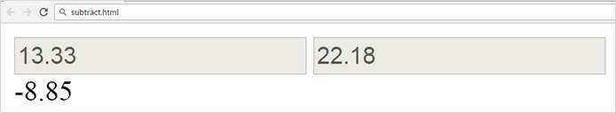
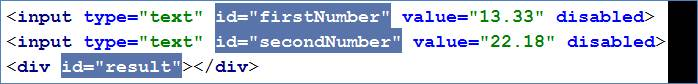
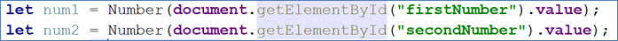
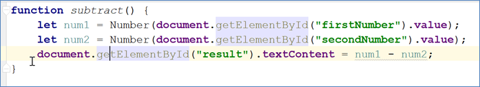
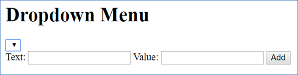
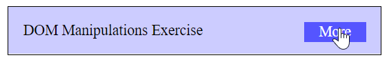
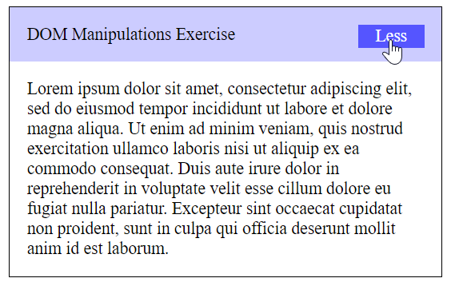
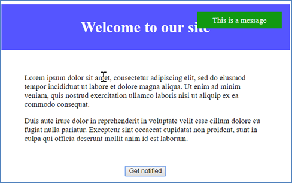
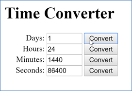
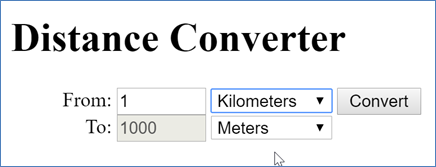

<html>

<head>
<meta http-equiv=Content-Type content="text/html; charset=windows-1251">
<meta name=Generator content="Microsoft Word 14 (filtered)">

</head>

<body lang=EN-US link=blue vlink=purple>

<h1>Exercises: DOM Manipulation</h1>

Problems for exercises and homework for the <a
href="https://softuni.bg/courses/javascript-advanced">“JavaScript Advanced”
course @ SoftUni</a>. Submit your solutions in the SoftUni judge system at <a
href="https://judge.softuni.bg/Contests/641/">https://judge.softuni.bg/Contests/641/</a>
.

<h2>1.&nbsp;&nbsp; Subtraction</h2>

A HTML page holds <b>two text fields</b> &quot;firstNumber&quot; and &quot;secondNumber&quot;.
Write a JS function to <b>subtract</b> the values from these text fields and
display the result in a div named &quot;result&quot;.

<h3>HTML and JavaScript Code</h3>

You are given the following <b>HTML</b> code:

<table class=MsoTableGrid border=1 cellspacing=0 cellpadding=0 width=696
 style='width:7.25in;margin-left:4.25pt;border-collapse:collapse;border:none'>
 <tr>
  <td width=696 valign=top style='width:7.25in;border:solid windowtext 1.0pt;
  background:#D9D9D9;padding:2.85pt 4.25pt 2.85pt 4.25pt'>
  
subtract.html

  </td>
 </tr>
 <tr>
  <td width=696 valign=top style='width:7.25in;border:solid windowtext 1.0pt;
  border-top:none;padding:2.85pt 4.25pt 2.85pt 4.25pt'>
  
&lt;!DOCTYPE
  <b>html</b>&gt; 
  &lt;<b>html </b><b>lang=</b><b>&quot;en&quot;</b>&gt; 
  &lt;<b>head</b>&gt; 
      &lt;<b>meta </b><b>charset=</b><b>&quot;UTF-8&quot;</b>&gt; 
      &lt;<b>title</b>&gt;Subtraction&lt;/<b>title</b>&gt; 
  &lt;/<b>head</b>&gt; 
  &lt;<b>body</b>&gt; 
  &lt;<b>div </b><b>id=</b><b>&quot;wrapper&quot;</b>&gt; 
      &lt;<b>input </b><b>type=</b><b>&quot;text&quot; </b><b>id=</b><b>&quot;firstNumber&quot; </b><b>value=</b><b>&quot;13.33&quot; </b><b>disabled</b>&gt; 
      &lt;<b>input </b><b>type=</b><b>&quot;text&quot; </b><b>id=</b><b>&quot;secondNumber&quot; </b><b>value=</b><b>&quot;22.18&quot; </b><b>disabled</b>&gt; 
   
      &lt;<b>div </b><b>id=</b><b>&quot;result&quot;</b>&gt;&lt;/<b>div</b>&gt; 
  &lt;/<b>div</b>&gt; 
  &lt;<b>script </b><b>src=</b><b>&quot;subtract.js&quot;</b>&gt;&lt;/<b>script</b>&gt; 
  &lt;<b>script</b>&gt; 
      <b>window</b>.onload = <b>function
  </b>() { 
          <i>subtract</i>(); 
      } 
  &lt;/<b>script</b>&gt; 
  &lt;/<b>body</b>&gt; 
  &lt;/<b>html</b>&gt;

  </td>
 </tr>
</table>

It comes together with the following <b>JavaScript</b> code:

<table class=MsoTableGrid border=1 cellspacing=0 cellpadding=0 width=696
 style='width:7.25in;margin-left:4.25pt;border-collapse:collapse;border:none'>
 <tr>
  <td width=696 valign=top style='width:7.25in;border:solid windowtext 1.0pt;
  background:#D9D9D9;padding:2.85pt 4.25pt 2.85pt 4.25pt'>
  
subtract.js

  </td>
 </tr>
 <tr>
  <td width=696 valign=top style='width:7.25in;border:solid windowtext 1.0pt;
  border-top:none;padding:2.85pt 4.25pt 2.85pt 4.25pt'>
  
<b>function </b><i>subtract</i>() { 
      <i>// </i><b><i>TODO 
  </i></b>}

  </td>
 </tr>
</table>

Implement the above<b> </b>to provide the following
functionality: 

·&nbsp;&nbsp;&nbsp;&nbsp;&nbsp;&nbsp;&nbsp;&nbsp;
Your function should take the values of &quot;<b>firstNumber</b>&quot; and &quot;<b>secondNumber</b>&quot;, <b>convert</b> them
to numbers, <b>subtract</b> the second number from the first and then write the
result in the <b>&lt;div&gt;</b> with
<b>id=&quot;result&quot;</b>

·&nbsp;&nbsp;&nbsp;&nbsp;&nbsp;&nbsp;&nbsp;&nbsp;
Your function should be able to work with <b>any 2 numbers</b> in
the inputs, not only the ones given in the example.

Submit in the judge the JS code (implementation) of the above
function. It may hold other functions in its body.

<h3>Example</h3>

<h3>Hints</h3>

We see that the <b>textboxes</b> and <b>div</b> have <b>id</b> attributes on them. 

We can take the numbers directly from the input field by
using the <b>getElementById() </b>function. After we have taken the elements
from the DOM it’s time to do the actual work. We get the values of the two <b>textboxes</b>,
the value of a textbox as one would expect is <b>text</b>, in order to get a <b>number</b>
we need to use a function to <b>parse</b> <b>them</b>. 

All that’s left now is to write the result in the div. We use the same function to get the <b>result </b>element
by id and change it’s <b>text content</b> to the resulting <b>subtraction.</b>

Our code is ready for submitting now, paste the contents of
the <b>.js</b> file in the judge.

<h2>2.&nbsp;&nbsp; Fill
Dropdown</h2>

Your task is to take values from <b>input</b> fields with <b>id</b>’s
<b>“newItemText” </b>and <b>“newItemValue” </b>and create and append an <b>&lt;option&gt;
</b>to the &lt;select&gt; with <b>id</b> <b>“menu”.</b>

<h3>HTML and JavaScript Code</h3>

You are given the following <b>HTML</b> code:

<table class=MsoTableGrid border=1 cellspacing=0 cellpadding=0 width=696
 style='width:7.25in;margin-left:4.25pt;border-collapse:collapse;border:none'>
 <tr>
  <td width=696 valign=top style='width:7.25in;border:solid windowtext 1.0pt;
  background:#D9D9D9;padding:2.85pt 4.25pt 2.85pt 4.25pt'>
  
dropdown.html

  </td>
 </tr>
 <tr>
  <td width=696 valign=top style='width:7.25in;border:solid windowtext 1.0pt;
  border-top:none;padding:2.85pt 4.25pt 2.85pt 4.25pt'>
  
&lt;!DOCTYPE
  <b>html</b>&gt; 
  &lt;<b>html </b><b>lang=</b><b>&quot;en&quot;</b>&gt; 
  &lt;<b>head</b>&gt; 
      &lt;<b>meta </b><b>charset=</b><b>&quot;UTF-8&quot;</b>&gt; 
      &lt;<b>title</b>&gt;Fill Dropdown&lt;/<b>title</b>&gt;

  <pre style='background:white'>    &lt;<b>script </b><b>src=</b><b>&quot;dropdown.js&quot;</b>&gt;&lt;/<b>script</b>&gt; 
&lt;/<b>head</b>&gt; 
&lt;<b>body</b>&gt; 
  &lt;<b>h1</b>&gt;Dropdown Menu&lt;/<b>h1</b>&gt; 
&lt;<b>div</b>&gt; 
    &lt;<b>select </b><b>id=</b><b>&quot;menu&quot;</b>&gt;&lt;/<b>select</b>&gt; 
&lt;/<b>div</b>&gt; 
  &lt;<b>label </b><b>for=</b><b>&quot;newItemText&quot;</b>&gt;Text: &lt;/<b>label</b>&gt;&lt;<b>input </b><b>type=</b><b>&quot;text&quot; </b><b>id=</b><b>&quot;newItemText&quot; </b>/&gt; 
  &lt;<b>label </b><b>for=</b><b>&quot;newItemValue&quot;</b>&gt;Value: &lt;/<b>label</b>&gt;&lt;<b>input </b><b>type=</b><b>&quot;text&quot; </b><b>id=</b><b>&quot;newItemValue&quot; </b>/&gt; 
  &lt;<b>input </b><b>type=</b><b>&quot;button&quot; </b><b>value=</b><b>&quot;Add&quot; </b><b>onclick=</b><b>&quot;</b><i>addItem</i>()<b>&quot;</b>&gt; 
&lt;/<b>body</b>&gt; 
&lt;/<b>html</b>&gt;</pre></td>
 </tr>
</table>

Again you should create a separate <b>js</b> file called <b>dropdown.js.
</b>In it you should have the following function

<table class=MsoTableGrid border=1 cellspacing=0 cellpadding=0 width=696
 style='width:7.25in;margin-left:4.25pt;border-collapse:collapse;border:none'>
 <tr>
  <td width=696 valign=top style='width:7.25in;border:solid windowtext 1.0pt;
  background:#D9D9D9;padding:2.85pt 4.25pt 2.85pt 4.25pt'>
  
dropdown.js

  </td>
 </tr>
 <tr>
  <td width=696 valign=top style='width:7.25in;border:solid windowtext 1.0pt;
  border-top:none;padding:2.85pt 4.25pt 2.85pt 4.25pt'>
  
<b>function </b><i>addItem</i>() { 
      <i>// </i><b><i>TODO 
  </i></b>}

  </td>
 </tr>
</table>

<h3>Example</h3>

<h3>Hints</h3>

·&nbsp;&nbsp;&nbsp;&nbsp;&nbsp;&nbsp;&nbsp;&nbsp;
Your function should take the values of <b>newItemText</b> and <b>newItemValue</b>.
After that you should create a new <b>option </b>element and set it’s <b>textContent</b>
and it’s <b>value</b> to the newly taken ones. 

·&nbsp;&nbsp;&nbsp;&nbsp;&nbsp;&nbsp;&nbsp;&nbsp;
Once you have done all of that you should <b>append</b> the newly
created <b>option</b> as a <b>child</b> to the select item with id <b>“menu”.</b>

·&nbsp;&nbsp;&nbsp;&nbsp;&nbsp;&nbsp;&nbsp;&nbsp;
Finally you should <b>clear</b> the value of the two <b>input</b>
fields.

<h2>3.&nbsp;&nbsp; Accordion</h2>

An <b>html</b> file is given and your task is to show <b>more</b>/show
<b>less</b> information by clicking a <b>button </b>(it is not an actual
button, but a <b>span</b> that has an <b>onlick</b> event attached to it). When
<b>More</b> link is clicked, it <b>reveals</b> the contents of a <b>hidden</b>
div and change the text of the link to <b>Less</b>. When the same link is
clicked <b>again</b> (now reading Less), <b>hide</b> the div and <b>change</b>
the text of the link back. Link action should be <b>toggleable</b> (you should
be able to click the button infinite amount of times).

<h3>HTML and JavaScript Code</h3>

You are given the following <b>HTML</b> code:

<table class=MsoTableGrid border=1 cellspacing=0 cellpadding=0 width=738
 style='width:553.5pt;margin-left:-9.25pt;border-collapse:collapse;border:none'>
 <tr>
  <td width=738 valign=top style='width:553.5pt;border:solid windowtext 1.0pt;
  background:#D9D9D9;padding:2.85pt 4.25pt 2.85pt 4.25pt'>
  
accordion.html

  </td>
 </tr>
 <tr>
  <td width=738 valign=top style='width:553.5pt;border:solid windowtext 1.0pt;
  border-top:none;padding:2.85pt 4.25pt 2.85pt 4.25pt'>
  
&lt;!DOCTYPE <b>html</b>&gt; 
  &lt;<b>html </b><b>lang=</b><b>&quot;en&quot;</b>&gt; 
  &lt;<b>head</b>&gt; 
    &lt;<b>meta </b><b>charset=</b><b>&quot;UTF-8&quot;</b>&gt; 
    &lt;<b>title</b>&gt;Accordion&lt;/<b>title</b>&gt; 
    &lt;<b>style</b>&gt; 
      <b>#accordion </b>{ 
        <b>border</b>: 1<b>px
  solid black</b>; 
        <b>display</b>: <b>inline-block</b>; 
        <b>width</b>: 400<b>px</b>; 
      } 
   
      <b>#accordion p </b>{ 
        <b>margin</b>: 1<b>em</b>; 
      } 
   
      .<b>button </b>{ 
        <b>float</b>: <b>right</b>; 
        <b>background</b>: <b>#5555ff</b>; 
        <b>padding</b>: 0.1<b>em </b>1<b>em </b>0.1<b>em </b>1<b>em</b>; 
        <b>color</b>: <b>white</b>; 
        <b>cursor</b>: <b>pointer</b>; 
      } 
   
      <b>#extra </b>{ 
        <b>display</b>: <b>none</b>; 
      } 
   
      .<b>head </b>{ 
        <b>background</b>: <b>#ccccff</b>; 
        <b>padding</b>: 1<b>em</b>; 
      } 
    &lt;/<b>style</b>&gt; 
  &lt;/<b>head</b>&gt; 
  &lt;<b>body</b>&gt; 
  &lt;<b>div </b><b>id=</b><b>&quot;accordion&quot;</b>&gt; 
    &lt;<b>div </b><b>class=</b><b>&quot;head&quot;</b>&gt;DOM Manipulations Exercise &lt;<b>span </b><b>class=</b><b>&quot;button&quot; </b><b>onclick=</b><b>&quot;</b><i>toggle</i>()<b>&quot;</b>&gt;More&lt;/<b>span</b>&gt;&lt;/<b>div</b>&gt; 
    &lt;<b>div </b><b>id=</b><b>&quot;extra&quot;</b>&gt; 
      &lt;<b>p</b>&gt;Lorem ipsum dolor sit amet,
  consectetur adipiscing elit, sed do eiusmod tempor incididunt ut labore et
  dolore magna aliqua. Ut enim ad minim veniam, quis nostrud exercitation
  ullamco laboris nisi ut aliquip ex ea commodo consequat. Duis aute irure
  dolor in reprehenderit in voluptate velit esse cillum dolore eu fugiat nulla
  pariatur. Excepteur sint occaecat cupidatat non proident, sunt in culpa qui
  officia deserunt mollit anim id est laborum.&lt;/<b>p</b>&gt; 
    &lt;/<b>div</b>&gt; 
  &lt;/<b>div</b>&gt; 
    &lt;<b>script</b>&gt; 
      <b>function </b><i>toggle</i>() { 
        <i>// </i><b><i>TODO 
      </i></b>} 
    &lt;/<b>script</b>&gt; 
  &lt;/<b>body</b>&gt; 
  &lt;/<b>html</b>&gt;

  </td>
 </tr>
</table>

<h3>Example</h3>

<h3>Hints</h3>

·&nbsp;&nbsp;&nbsp;&nbsp;&nbsp;&nbsp;&nbsp;&nbsp;
To <b>change</b> the text content of a button you could use <b>getElementsByClassName</b>.
Which however returns a <b>collection</b> and we need only <b>one</b> element
from it so the correct way is to <b>use</b> it like this: <b>getElementsByClassName</b>(‘button’)[0]
and it will return the needed span element.

·&nbsp;&nbsp;&nbsp;&nbsp;&nbsp;&nbsp;&nbsp;&nbsp;
After that we should change the <b>display style</b> of the div
with id “<b>extra</b>”. If the display style is “<b>none</b>” we should <b>change</b>
it to “<b>block</b>” and the <b>opposite</b>.

·&nbsp;&nbsp;&nbsp;&nbsp;&nbsp;&nbsp;&nbsp;&nbsp;
Alongside all of this we should <b>change</b> the text content of
the <b>button</b> to Less/More.

<h2>4.&nbsp;&nbsp; Sections</h2>

You will receive an array of strings. For each string,
create a <b>div</b> with a <b>paragraph</b> with the <b>string</b> in it. Each
paragraph is initially <b>hidden (display:none)</b>. Add a <b>click</b> event
listener to <b>each div</b> that <b>displays</b> the hidden paragraph. Finally
you should <b>append</b> all divs to the element with id “<b>content</b>”.

<h3>HTML and JavaScript Code</h3>

You are given the following <b>HTML</b> code:

<table class=MsoTableGrid border=1 cellspacing=0 cellpadding=0 width=696
 style='width:7.25in;margin-left:4.25pt;border-collapse:collapse;border:none'>
 <tr>
  <td width=696 valign=top style='width:7.25in;border:solid windowtext 1.0pt;
  background:#D9D9D9;padding:2.85pt 4.25pt 2.85pt 4.25pt'>
  
sections.html

  </td>
 </tr>
 <tr>
  <td width=696 valign=top style='width:7.25in;border:solid windowtext 1.0pt;
  border-top:none;padding:2.85pt 4.25pt 2.85pt 4.25pt'>
  
&lt;!DOCTYPE <b>html</b>&gt; 
  &lt;<b>html </b><b>lang=</b><b>&quot;en&quot;</b>&gt; 
  &lt;<b>head</b>&gt; 
    &lt;<b>meta </b><b>charset=</b><b>&quot;UTF-8&quot;</b>&gt; 
    &lt;<b>title</b>&gt;Sections&lt;/<b>title</b>&gt; 
    &lt;<b>style</b>&gt; 
      <b>#content </b>{ 
        <b>width</b>: 1000<b>px</b>; 
      } 
   
      <b>#content div </b>{ 
        <b>float</b>: <b>left</b>; 
        <b>width</b>: 300<b>px</b>; 
        <b>height</b>: 300<b>px</b>; 
        <b>margin</b>: 2<b>em</b>; 
        <b>background</b>: <b>#5555ff</b>; 
        <b>text-align</b>: <b>center</b>; 
      } 
   
      <b>#content div p </b>{ 
        <b>color</b>: <b>white</b>; 
        <b>margin</b>: 6<b>em
  </b>3<b>em </b>6<b>em </b>3<b>em</b>; 
      } 
    &lt;/<b>style</b>&gt; 
  &lt;/<b>head</b>&gt; 
  &lt;<b>div </b><b>id=</b><b>&quot;content&quot;</b>&gt; 
  &lt;/<b>div</b>&gt; 
  &lt;<b>body </b><b>onload=</b><b>&quot;</b><i>create</i>([<b>'Section 1'</b>, <b>'Section
  2'</b>, <b>'Section 3'</b>, <b>'Section 4'</b>]);<b>&quot;</b>&gt; 
  &lt;<b>script</b>&gt; 
    <b>function </b><i>create</i>(sentences) { 
      // TODO: 
    } 
  &lt;/<b>script</b>&gt; 
  &lt;/<b>body</b>&gt; 
  &lt;/<b>html</b>&gt;

  </td>
 </tr>
</table>

<h3>Example</h3>

 &agrave; 

<h2>5.&nbsp;&nbsp; Notification</h2>

Write a JS function that receives a string <b>message</b> and
<b>displays</b> it inside a div with id &quot;<b>notification</b>&quot; for 2
seconds. The div starts <strong>hidden</strong>
and when the function is called, <strong>reveal</strong>
it. After 2 seconds, <b>hide</b> the div. In the example document, a
notification is shown when you click the button.

<h3>HTML and JavaScript Code</h3>

You are given the following <b>HTML</b> code:

<table class=MsoTableGrid border=1 cellspacing=0 cellpadding=0 width=696
 style='width:7.25in;margin-left:4.25pt;border-collapse:collapse;border:none'>
 <tr>
  <td width=696 valign=top style='width:7.25in;border:solid windowtext 1.0pt;
  background:#D9D9D9;padding:2.85pt 4.25pt 2.85pt 4.25pt'>
  
notification.html

  </td>
 </tr>
 <tr>
  <td width=696 valign=top style='width:7.25in;border:solid windowtext 1.0pt;
  border-top:none;padding:2.85pt 4.25pt 2.85pt 4.25pt'>
  
&lt;!DOCTYPE <b>html</b>&gt; 
  &lt;<b>html </b><b>lang=</b><b>&quot;en&quot;</b>&gt; 
  &lt;<b>head</b>&gt; 
    &lt;<b>meta </b><b>charset=</b><b>&quot;UTF-8&quot;</b>&gt; 
    &lt;<b>title</b>&gt;Notification&lt;/<b>title</b>&gt; 
    &lt;<b>style</b>&gt; 
      <b>body </b>{ <b>width</b>: 600<b>px</b>; <b>text-align</b>: <b>center</b>; } 
      .<b>header </b>{ 
        <b>background-color</b>: <b>#5555ff</b>; 
        <b>color</b>: <b>white</b>; 
        <b>position</b>: <b>relative</b>; 
        <b>left</b>: 0; 
        <b>top</b>: 0; 
        <b>padding</b>: 0.5<b>em</b>; 
      } 
      <b>#container
  </b>{ 
        <b>position</b>: <b>relative</b>; 
      } 
      .<b>post </b>{ 
        <b>margin</b>: 48<b>px</b>; 
        <b>text-align</b>: <b>left</b>; 
      } 
      <b>#notification
  </b>{ 
        <b>float</b>: <b>right</b>; 
        <b>background</b>: <b>#119911</b>; 
        <b>color</b>: <b>#ffffff</b>; 
        <b>padding</b>: 0.5<b>em </b>2<b>em </b>0.5<b>em </b>2<b>em</b>; 
        <b>margin</b>: 1<b>em</b>; 
        <b>display</b>: <b>none</b>; 
        <b>position</b>: <b>absolute</b>; 
        <b>top</b>: 0; 
        <b>right</b>: 0; 
      } 
    &lt;/<b>style</b>&gt; 
  &lt;/<b>head</b>&gt; 
  &lt;<b>body</b>&gt; 
  &lt;<b>div </b><b>id=</b><b>&quot;container&quot;</b>&gt; 
    &lt;<b>header </b><b>class=</b><b>&quot;header&quot;</b>&gt; 
      &lt;<b>h1</b>&gt;Welcome to our site&lt;/<b>h1</b>&gt; 
    &lt;/<b>header</b>&gt; 
    &lt;<b>div </b><b>id=</b><b>&quot;content&quot;</b>&gt; 
      &lt;<b>article
  </b><b>class=</b><b>&quot;post&quot;</b>&gt; 
        &lt;<b>p</b>&gt;Lorem ipsum dolor sit
  amet, consectetur adipiscing elit, sed do eiusmod tempor incididunt ut labore
  et dolore magna aliqua. Ut enim ad minim veniam, quis nostrud exercitation ullamco
  laboris nisi ut aliquip ex ea commodo consequat.&lt;/<b>p</b>&gt; 
        &lt;<b>p</b>&gt;Duis aute irure dolor in
  reprehenderit in voluptate velit esse cillum dolore eu fugiat nulla pariatur.
  Excepteur sint occaecat cupidatat non proident, sunt in culpa qui officia
  deserunt mollit anim id est laborum.&lt;/<b>p</b>&gt; 
      &lt;/<b>article</b>&gt; 
      &lt;<b>button
  </b><b>onclick=</b><b>&quot;</b><i>notify</i>(<b>'Something happened!'</b>)<b>&quot;</b>&gt;Get notified&lt;/<b>button</b>&gt; 
    &lt;/<b>div</b>&gt; 
    &lt;<b>div </b><b>id=</b><b>&quot;notification&quot;</b>&gt;&lt;/<b>div</b>&gt; 
  &lt;/<b>div</b>&gt; 
  &lt;<b>script</b>&gt; 
    <b>function </b><i>notify</i>(message) { 
      // TODO: 
    } 
  &lt;/<b>script</b>&gt; 
  &lt;/<b>body</b>&gt; 
  &lt;/<b>html</b>&gt;

  </td>
 </tr>
</table>

<h3>Example</h3>

When we click the “Get notified” <b>button</b> a div appears
in our upper-right corner. It should <b>disappear</b> in 2 seconds.

<h2>6.&nbsp;&nbsp; Time
Converter</h2>

Create a JS app to convert between diferent time units. Your
task is to add a <b>click</b> event listener to <b>all</b> buttons. When a
button is <b>clicked</b>, read the <b>corresponding</b> input field and <b>convert</b>
the value to the <b>three other</b> units of time and <b>display</b> it in the
input fields.

<h3>HTML and JavaScript Code</h3>

You are given the following <b>HTML</b> code:

<table class=MsoTableGrid border=1 cellspacing=0 cellpadding=0 width=696
 style='width:7.25in;margin-left:4.25pt;border-collapse:collapse;border:none'>
 <tr>
  <td width=696 valign=top style='width:7.25in;border:solid windowtext 1.0pt;
  background:#D9D9D9;padding:2.85pt 4.25pt 2.85pt 4.25pt'>
  
timeConverter.html

  </td>
 </tr>
 <tr>
  <td width=696 valign=top style='width:7.25in;border:solid windowtext 1.0pt;
  border-top:none;padding:2.85pt 4.25pt 2.85pt 4.25pt'>
  
&lt;!DOCTYPE
  <b>html</b>&gt; 
  &lt;<b>html </b><b>lang=</b><b>&quot;en&quot;</b>&gt; 
  &lt;<b>head</b>&gt; 
    &lt;<b>meta </b><b>charset=</b><b>&quot;UTF-8&quot;</b>&gt; 
    &lt;<b>title</b>&gt;Time Converter&lt;/<b>title</b>&gt; 
    &lt;<b>script </b><b>src=</b><b>&quot;timeConverter.js&quot;</b>&gt;&lt;/<b>script</b>&gt; 
    &lt;<b>style</b>&gt; 
      <b>label</b>, <b>input </b>{ 
        <b>display</b>: <b>inline-block</b>; 
        <b>width</b>: 5<b>em</b>; 
      } 
      <b>label </b>{ 
        <b>text-align</b>: <b>right</b>; 
      } 
    &lt;/<b>style</b>&gt; 
  &lt;/<b>head</b>&gt; 
  &lt;<b>body </b><b>onload=</b><b>&quot;</b><i>attachEventsListeners</i>()<b>&quot;</b>&gt; 
  &lt;<b>h1</b>&gt;Time Converter&lt;/<b>h1</b>&gt; 
  &lt;<b>div</b>&gt; 
    &lt;<b>label </b><b>for=</b><b>&quot;days&quot;</b>&gt;Days: &lt;/<b>label</b>&gt; 
    &lt;<b>input </b><b>type=</b><b>&quot;text&quot; </b><b>id=</b><b>&quot;days&quot;</b>&gt; 
    &lt;<b>input </b><b>id=</b><b>&quot;daysBtn&quot; </b><b>type=</b><b>&quot;button&quot; </b><b>value=</b><b>&quot;Convert&quot;</b>&gt; 
  &lt;/<b>div</b>&gt; 
  &lt;<b>div</b>&gt; 
    &lt;<b>label </b><b>for=</b><b>&quot;hours&quot;</b>&gt;Hours: &lt;/<b>label</b>&gt; 
    &lt;<b>input </b><b>type=</b><b>&quot;text&quot; </b><b>id=</b><b>&quot;hours&quot;</b>&gt; 
    &lt;<b>input </b><b>id=</b><b>&quot;hoursBtn&quot; </b><b>type=</b><b>&quot;button&quot; </b><b>value=</b><b>&quot;Convert&quot;</b>&gt; 
  &lt;/<b>div</b>&gt; 
  &lt;<b>div</b>&gt; 
    &lt;<b>label </b><b>for=</b><b>&quot;minutes&quot;</b>&gt;Minutes: &lt;/<b>label</b>&gt; 
    &lt;<b>input </b><b>type=</b><b>&quot;text&quot; </b><b>id=</b><b>&quot;minutes&quot;</b>&gt; 
    &lt;<b>input </b><b>id=</b><b>&quot;minutesBtn&quot; </b><b>type=</b><b>&quot;button&quot; </b><b>value=</b><b>&quot;Convert&quot;</b>&gt; 
  &lt;/<b>div</b>&gt; 
  &lt;<b>div</b>&gt; 
    &lt;<b>label </b><b>for=</b><b>&quot;seconds&quot;</b>&gt;Seconds: &lt;/<b>label</b>&gt; 
    &lt;<b>input </b><b>type=</b><b>&quot;text&quot; </b><b>id=</b><b>&quot;seconds&quot;</b>&gt; 
    &lt;<b>input </b><b>id=</b><b>&quot;secondsBtn&quot; </b><b>type=</b><b>&quot;button&quot; </b><b>value=</b><b>&quot;Convert&quot;</b>&gt; 
  &lt;/<b>div</b>&gt; 
  &lt;/<b>body</b>&gt; 
  &lt;/<b>html</b>&gt;

  </td>
 </tr>
</table>

You should have the following <b>timeConverter.js</b> file:

<table class=MsoTableGrid border=1 cellspacing=0 cellpadding=0 width=696
 style='width:7.25in;margin-left:4.25pt;border-collapse:collapse;border:none'>
 <tr>
  <td width=696 valign=top style='width:7.25in;border:solid windowtext 1.0pt;
  background:#D9D9D9;padding:2.85pt 4.25pt 2.85pt 4.25pt'>
  
timeConverter.js

  </td>
 </tr>
 <tr>
  <td width=696 valign=top style='width:7.25in;border:solid windowtext 1.0pt;
  border-top:none;padding:2.85pt 4.25pt 2.85pt 4.25pt'>
  
<b>function </b><i>attachEventsListeners</i>() { 
    <i>// </i><b><i>TODO: attach click events to all
  buttons 
  </i></b>}

  </td>
 </tr>
</table>

<h3>Example</h3>

One day is equal to 24 hours/1440 minutes/86400 seconds.
Whichever button we <b>click</b> the input fields should change depending on
the added value on the left. (If we make it 48 hours and click convert the days
field should change to 2 and etc.).

<h2>7.&nbsp;&nbsp; * Distance
Converter</h2>

Your task is to convert from <b>one</b> distance unit to <b>another</b>
by adding a <b>click</b> event listener to a button. When it is clicked, <b>read</b>
the value in the input field, <b>get</b> the selected option from the input and
output units drop downs and <b>calculate</b> and <b>display</b> the converted
value in the disabled output field.

<h3>HTML and JavaScript Code</h3>

You are given the following <b>HTML</b> code:

<table class=MsoTableGrid border=1 cellspacing=0 cellpadding=0 width=696
 style='width:7.25in;margin-left:4.25pt;border-collapse:collapse;border:none'>
 <tr>
  <td width=696 valign=top style='width:7.25in;border:solid windowtext 1.0pt;
  background:#D9D9D9;padding:2.85pt 4.25pt 2.85pt 4.25pt'>
  
distanceConverter.html

  </td>
 </tr>
 <tr>
  <td width=696 valign=top style='width:7.25in;border:solid windowtext 1.0pt;
  border-top:none;padding:2.85pt 4.25pt 2.85pt 4.25pt'>
  
&lt;!DOCTYPE <b>html</b>&gt; 
  &lt;<b>html </b><b>lang=</b><b>&quot;en&quot;</b>&gt; 
  &lt;<b>head</b>&gt; 
    &lt;<b>meta </b><b>charset=</b><b>&quot;UTF-8&quot;</b>&gt; 
    &lt;<b>title</b>&gt;Distance Converter&lt;/<b>title</b>&gt; 
    &lt;<b>script </b><b>src=</b><b>&quot;distanceConverter.js&quot;</b>&gt;&lt;/<b>script</b>&gt; 
    &lt;<b>style</b>&gt; 
      <b>label</b>, <b>input </b>{ 
        <b>display</b>: <b>inline-block</b>; 
        <b>width</b>: 5<b>em</b>; 
      } 
   
      <b>label </b>{ 
        <b>text-align</b>: <b>right</b>; 
      } 
    &lt;/<b>style</b>&gt; 
  &lt;/<b>head</b>&gt; 
  &lt;<b>body </b><b>onload=</b><b>&quot;</b><i>attachEventsListeners</i>()<b>&quot;</b>&gt; 
  &lt;<b>h1</b>&gt;Distance Converter&lt;/<b>h1</b>&gt; 
  &lt;<b>div</b>&gt; 
    &lt;<b>label </b><b>for=</b><b>&quot;inputDistance&quot;</b>&gt;From:&lt;/<b>label</b>&gt; 
    &lt;<b>input </b><b>type=</b><b>&quot;text&quot; </b><b>id=</b><b>&quot;inputDistance&quot;</b>&gt; 
    &lt;<b>select </b><b>id=</b><b>&quot;inputUnits&quot;</b>&gt; 
      &lt;<b>option
  </b><b>value=</b><b>&quot;km&quot;</b>&gt;Kilometers&lt;/<b>option</b>&gt; 
      &lt;<b>option
  </b><b>value=</b><b>&quot;m&quot;</b>&gt;Meters&lt;/<b>option</b>&gt; 
      &lt;<b>option
  </b><b>value=</b><b>&quot;cm&quot;</b>&gt;Centimeters&lt;/<b>option</b>&gt; 
      &lt;<b>option
  </b><b>value=</b><b>&quot;mm&quot;</b>&gt;Millimeters&lt;/<b>option</b>&gt; 
      &lt;<b>option
  </b><b>value=</b><b>&quot;mi&quot;</b>&gt;Miles&lt;/<b>option</b>&gt; 
      &lt;<b>option
  </b><b>value=</b><b>&quot;yrd&quot;</b>&gt;Yards&lt;/<b>option</b>&gt; 
      &lt;<b>option
  </b><b>value=</b><b>&quot;ft&quot;</b>&gt;Feet&lt;/<b>option</b>&gt; 
      &lt;<b>option
  </b><b>value=</b><b>&quot;in&quot;</b>&gt;Inches&lt;/<b>option</b>&gt; 
    &lt;/<b>select</b>&gt; 
    &lt;<b>input </b><b>type=</b><b>&quot;button&quot; </b><b>id=</b><b>&quot;convert&quot; </b><b>value=</b><b>&quot;Convert&quot;</b>&gt; 
  &lt;/<b>div</b>&gt; 
  &lt;<b>div</b>&gt; 
    &lt;<b>label </b><b>for=</b><b>&quot;outputDistance&quot;</b>&gt;To:&lt;/<b>label</b>&gt; 
    &lt;<b>input </b><b>type=</b><b>&quot;text&quot; </b><b>id=</b><b>&quot;outputDistance&quot; </b><b>disabled=</b><b>&quot;disabled&quot;</b>&gt; 
    &lt;<b>select </b><b>id=</b><b>&quot;outputUnits&quot;</b>&gt; 
      &lt;<b>option
  </b><b>value=</b><b>&quot;km&quot;</b>&gt;Kilometers&lt;/<b>option</b>&gt; 
      &lt;<b>option
  </b><b>value=</b><b>&quot;m&quot;</b>&gt;Meters&lt;/<b>option</b>&gt; 
      &lt;<b>option
  </b><b>value=</b><b>&quot;cm&quot;</b>&gt;Centimeters&lt;/<b>option</b>&gt; 
      &lt;<b>option
  </b><b>value=</b><b>&quot;mm&quot;</b>&gt;Millimeters&lt;/<b>option</b>&gt; 
      &lt;<b>option
  </b><b>value=</b><b>&quot;mi&quot;</b>&gt;Miles&lt;/<b>option</b>&gt; 
      &lt;<b>option
  </b><b>value=</b><b>&quot;yrd&quot;</b>&gt;Yards&lt;/<b>option</b>&gt; 
      &lt;<b>option
  </b><b>value=</b><b>&quot;ft&quot;</b>&gt;Feet&lt;/<b>option</b>&gt; 
      &lt;<b>option
  </b><b>value=</b><b>&quot;in&quot;</b>&gt;Inches&lt;/<b>option</b>&gt; 
    &lt;/<b>select</b>&gt; 
  &lt;/<b>div</b>&gt; 
  &lt;/<b>body</b>&gt; 
  &lt;/<b>html</b>&gt;

  </td>
 </tr>
</table>

You should have the following <b>distanceConverter.js</b>
file:

<table class=MsoTableGrid border=1 cellspacing=0 cellpadding=0 width=696
 style='width:7.25in;margin-left:4.25pt;border-collapse:collapse;border:none'>
 <tr>
  <td width=696 valign=top style='width:7.25in;border:solid windowtext 1.0pt;
  background:#D9D9D9;padding:2.85pt 4.25pt 2.85pt 4.25pt'>
  
distanceConverter.js

  </td>
 </tr>
 <tr>
  <td width=696 valign=top style='width:7.25in;border:solid windowtext 1.0pt;
  border-top:none;padding:2.85pt 4.25pt 2.85pt 4.25pt'>
  
<b>function </b><i>attachEventsListeners</i>() { 
    <i>// </i><b><i>TODO: attach click event to convert
  button 
  </i></b>}

  </td>
 </tr>
</table>

Multiply the incoming distance by the following conversion
rates to convert to meters. Divide to convert from meters to the required
output unit.

1 km = 1000 m

1 m = 1 m

1 cm = 0.01 m

1 mm = 0.001 m

1 mi = 1609.34 m

1 yrd = 0.9144 m

1 ft = 0.3048 m

1 in = 0.0254 m

<h3>Example</h3>

<h3>Hint</h3>

To see which option is selected, read the properties of its
parent: value gives you the value of the selected
option (as displayed in the HTML), selectedIndex
gives you the 0-based index of the selected option. E.g. if miles are selected,
#inputUnits.value is &quot;<strong>mi</strong>&quot;, #inputUnits.selectedIndex is <strong>4</strong>. Option text is
irrelevant.

</body>

</html>
