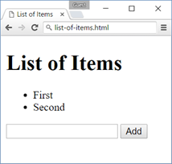
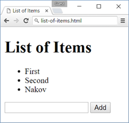

<html>

<head>
<meta http-equiv=Content-Type content="text/html; charset=windows-1251">
<meta name=Generator content="Microsoft Word 14 (filtered)">
<title>Exercises and Homework for the JavaScript Advanced Course at SoftUni</title>

</head>

<body lang=EN-US link=blue vlink=purple>

<h1>Lab: DOM Manipulation</h1>

Problems for in-class lab for the <a
href="https://softuni.bg/courses/javascript-advanced">“JavaScript Advanced”
course @ SoftUni</a>. Submit your solutions in the SoftUni judge system at <a
href="https://judge.softuni.bg/Contests/640/">https://judge.softuni.bg/Contests/640/</a>.

<h2>1.&nbsp;&nbsp; List of
Items</h2>

Write a JS function that <strong>read</strong> the text inside
an input field and <strong>appends</strong> the specified text to a list inside an
HTML page.

<h3>Input/Output</h3>

There will be no input/output, your program should instead <strong>modify</strong> the DOM of
the given HTML document.

<table class=MsoTableGrid border=1 cellspacing=0 cellpadding=0 width=680
 style='width:510.25pt;margin-left:1.15pt;border-collapse:collapse;border:none'>
 <tr>
  <td width=680 valign=top style='width:510.25pt;border:solid windowtext 1.0pt;
  background:#D9D9D9;padding:2.85pt 4.25pt 2.85pt 4.25pt'>
  
<b>Sample HTML</b>

  </td>
 </tr>
 <tr>
  <td width=680 valign=top style='width:510.25pt;border:solid windowtext 1.0pt;
  border-top:none;padding:2.85pt 4.25pt 2.85pt 4.25pt'>
  
&lt;h1&gt;List of
  Items&lt;/h1&gt;

  
&lt;ul
  id=&quot;items&quot;&gt;&lt;li&gt;First&lt;/li&gt;&lt;li&gt;Second&lt;/li&gt;&lt;/ul&gt;

  
&lt;input
  type=&quot;text&quot; id=&quot;newItemText&quot; /&gt;

  
&lt;input
  type=&quot;button&quot; value=&quot;Add&quot; onclick=&quot;addItem()&quot;&gt;

  
&lt;script&gt;

  
  function addItem() {

  
    // TODO: add new item to the list

  
  }

  
&lt;/script&gt;

  </td>
 </tr>
</table>

<h3>Examples</h3>

 &agrave;
 &agrave;

<h2>2.&nbsp;&nbsp; Add and
Delete</h2>

Extend the previous problem to display
a<strong> [Delete] link </strong>after each list item. <strong>Clicking</strong> it, should <strong>delete</strong> the item with no confirmation.

<h3>Input/Output</h3>

There will be no input/output, your program should instead <strong>modify</strong> the DOM of
the given HTML document.

<table class=MsoTableGrid border=1 cellspacing=0 cellpadding=0 width=680
 style='width:510.25pt;margin-left:1.15pt;border-collapse:collapse;border:none'>
 <tr>
  <td width=680 valign=top style='width:510.25pt;border:solid windowtext 1.0pt;
  background:#D9D9D9;padding:2.85pt 4.25pt 2.85pt 4.25pt'>
  
<b>Sample HTML</b>

  </td>
 </tr>
 <tr>
  <td width=680 valign=top style='width:510.25pt;border:solid windowtext 1.0pt;
  border-top:none;padding:2.85pt 4.25pt 2.85pt 4.25pt'>
  
&lt;h1&gt;List of
  Items&lt;/h1&gt;

  
&lt;ul
  id=&quot;items&quot;&gt;&lt;/ul&gt;

  
&lt;input
  type=&quot;text&quot; id=&quot;newText&quot; /&gt;

  
&lt;input
  type=&quot;button&quot; value=&quot;Add&quot; 
    onclick=&quot;addItem()&quot;&gt;

  
&lt;script&gt;

  
  function addItem() { ...

  
    function deleteItem()
  { ... }

  
  }

  
&lt;/script&gt;

  </td>
 </tr>
</table>

<h3>Examples</h3>

&agrave; 

<h2>3.&nbsp;&nbsp; Delete
from Table</h2>

Write a JS program that <strong>takes</strong> an e-mail from an <strong>input field</strong> and <strong>deletes</strong> matching
rows from a table. If no entry is found, an <strong>error</strong> should be displayed in a
&lt;div&gt; with ID &quot;<strong>results</strong>&quot;.
The error should read &quot;<strong>Not
found</strong>.&quot;

<h3>Input/Output</h3>

There will be no input/output, your program should instead <strong>modify</strong> the DOM of
the given HTML document.

<table class=MsoTableGrid border=1 cellspacing=0 cellpadding=0 width=680
 style='width:510.25pt;margin-left:1.15pt;border-collapse:collapse;border:none'>
 <tr>
  <td width=680 valign=top style='width:510.25pt;border:solid windowtext 1.0pt;
  background:#D9D9D9;padding:2.85pt 4.25pt 2.85pt 4.25pt'>
  
<b>Sample HTML</b>

  </td>
 </tr>
 <tr>
  <td width=680 valign=top style='width:510.25pt;border:solid windowtext 1.0pt;
  border-top:none;padding:2.85pt 4.25pt 2.85pt 4.25pt'>
  
&lt;table
  border=&quot;1&quot; id=&quot;customers&quot;&gt;

  
 &lt;tr&gt;&lt;th&gt;Name&lt;/th&gt;&lt;th&gt;Email&lt;/th&gt;&lt;/tr&gt;

  
 &lt;tr&gt;&lt;td&gt;Eve&lt;/td&gt;&lt;td&gt;eve@gmail.com&lt;/td&gt;&lt;/tr&gt;

  
 &lt;tr&gt;&lt;td&gt;Nick&lt;/td&gt;&lt;td&gt;nick@yahooo.com&lt;/td&gt;&lt;/tr&gt;

  
 &lt;tr&gt;&lt;td&gt;Didi&lt;/td&gt;&lt;td&gt;didi@didi.net&lt;/td&gt;&lt;/tr&gt;

  
 &lt;tr&gt;&lt;td&gt;Tedy&lt;/td&gt;&lt;td&gt;tedy@tedy.com&lt;/td&gt;&lt;/tr&gt;

  
&lt;/table&gt;

  
Email: &lt;input
  type=&quot;text&quot; name=&quot;email&quot; /&gt;

  
&lt;button
  onclick=&quot;deleteByEmail()&quot;&gt;Delete&lt;/button&gt;

  
&lt;div
  id=&quot;result&quot; /&gt;

  </td>
 </tr>
</table>

<h3>Examples</h3>

 &agrave; 

<h2>4.&nbsp;&nbsp; Stopwatch</h2>

Write a JS program that <strong>implements </strong>a web timer that supports <strong>minutes</strong> and <strong>seconds</strong>. The user
should be able to control it with <strong>buttons</strong>.
Clicking <strong>[Start]</strong>
<strong>resets</strong>
the timer back to zero. Only one of the buttons should be enabled at a time
(you cannot stop the timer if it’s not running).

<h3>Input/Output</h3>

There will be no input/output, your program should instead <strong>modify</strong> the DOM of
the given HTML document.

<table class=MsoTableGrid border=1 cellspacing=0 cellpadding=0 width=680
 style='width:510.25pt;margin-left:1.15pt;border-collapse:collapse;border:none'>
 <tr>
  <td width=680 valign=top style='width:510.25pt;border:solid windowtext 1.0pt;
  background:#D9D9D9;padding:2.85pt 4.25pt 2.85pt 4.25pt'>
  
<b>Sample HTML</b>

  </td>
 </tr>
 <tr>
  <td width=680 valign=top style='width:510.25pt;border:solid windowtext 1.0pt;
  border-top:none;padding:2.85pt 4.25pt 2.85pt 4.25pt'>
  
&lt;div id=&quot;time&quot;
  style=&quot;border:3px solid blue; text-align:center; font-size:2em;
  margin-bottom:10px&quot;&gt;00:00&lt;/div&gt;

  
&lt;button
  id=&quot;startBtn&quot;&gt;Start&lt;/button&gt;

  
&lt;button
  id=&quot;stopBtn&quot; disabled=&quot;true&quot;&gt;Stop&lt;/button&gt;

  
&lt;script&gt;window.onload
  = function() { stopwatch(); }&lt;/script&gt;

  </td>
 </tr>
</table>

<h3>Examples</h3>

<h2>5.&nbsp;&nbsp; Mouse
Gradient</h2>

Write a JS program that <strong>detects</strong> and displays how far along a
gradient the user has <strong>moved
</strong>their<strong>
mouse</strong> on a webpage. Use the provided HTML and stylesheet (CSS)
to test locally. The resulting value should be <strong>rounded down</strong> and displayed as a <strong>percentage</strong> inside
the <strong>&lt;div&gt;</strong>
with ID &quot;<strong>result</strong>&quot;.

<h3>Input/Output</h3>

There will be no input/output, your program should instead <strong>modify</strong> the DOM of
the given HTML document.

<table class=MsoTableGrid border=1 cellspacing=0 cellpadding=0 width=680
 style='width:510.25pt;margin-left:1.15pt;border-collapse:collapse;border:none'>
 <tr>
  <td width=680 valign=top style='width:510.25pt;border:solid windowtext 1.0pt;
  background:#D9D9D9;padding:2.85pt 4.25pt 2.85pt 4.25pt'>
  
<b>Sample HTML</b>

  </td>
 </tr>
 <tr>
  <td width=680 valign=top style='width:510.25pt;border:solid windowtext 1.0pt;
  border-top:none;padding:2.85pt 4.25pt 2.85pt 4.25pt'>
  
&lt;html&gt;

  
&lt;head&gt;

  
  &lt;title&gt;Mouse in
  Gradient&lt;/title&gt;

  
  &lt;link
  rel=&quot;stylesheet&quot; href=&quot;gradient.css&quot; /&gt;

  
  &lt;script
  src=&quot;gradient.js&quot;&gt;&lt;/script&gt;

  
&lt;/head&gt;

  
&lt;body
  onload=&quot;attachGradientEvents()&quot;&gt;

  
  &lt;div
  id=&quot;gradient-box&quot;&gt;

  
    &lt;div
  id=&quot;gradient&quot;&gt;Click me!&lt;/div&gt;

  
  &lt;/div&gt;

  
  &lt;div
  id=&quot;result&quot;&gt;&lt;/div&gt;

  
&lt;/body&gt;

  
&lt;/html&gt;

  </td>
 </tr>
</table>

&nbsp;

<table class=MsoTableGrid border=1 cellspacing=0 cellpadding=0 width=680
 style='width:510.25pt;margin-left:1.15pt;border-collapse:collapse;border:none'>
 <tr>
  <td width=680 valign=top style='width:510.25pt;border:solid windowtext 1.0pt;
  background:#D9D9D9;padding:2.85pt 4.25pt 2.85pt 4.25pt'>
  
<b>gradient.css</b>

  </td>
 </tr>
 <tr>
  <td width=680 valign=top style='width:510.25pt;border:solid windowtext 1.0pt;
  border-top:none;padding:2.85pt 4.25pt 2.85pt 4.25pt'>
  
#gradient-box {

  
  width: 300px;

  
  border: 2px solid
  lightgrey;

  
}

  
#gradient-box:hover {

  
  border: 2px solid black;

  
}

  
#gradient {

  
  height: 30px;

  
  color: white;

  
  text-shadow: 1px 1px
  10px black;

  
  text-align: center;

  
  line-height: 30px;

  
  background:
  linear-gradient(to right, black, white);

  
  cursor: crosshair;

  
}

  </td>
 </tr>
</table>

<h3>Examples</h3>

<h2>6.&nbsp;&nbsp; Highlight
Active</h2>

Write a JS function to highlight the <strong>currently active</strong>
section of a document. There will be <strong>multiple</strong>
divs with <strong>inputs</strong>
inside them – set the class of the div, that contains the currently focused
input field to &quot;<strong>focus</strong>&quot;.
When focus is lost (<strong>blurred</strong>)
<strong>remove the class</strong>
from the element.

<h3>Input/Output</h3>

There will be no input/output, your program should instead <strong>modify</strong> the DOM of
the given HTML document.

<table class=MsoTableGrid border=1 cellspacing=0 cellpadding=0 width=680
 style='width:510.25pt;margin-left:1.15pt;border-collapse:collapse;border:none'>
 <tr>
  <td width=680 valign=top style='width:510.25pt;border:solid windowtext 1.0pt;
  background:#D9D9D9;padding:2.85pt 4.25pt 2.85pt 4.25pt'>
  
<b>Sample HTML</b>

  </td>
 </tr>
 <tr>
  <td width=680 valign=top style='width:510.25pt;border:solid windowtext 1.0pt;
  border-top:none;padding:2.85pt 4.25pt 2.85pt 4.25pt'>
  
&lt;!DOCTYPE
  html&gt;&lt;html lang=&quot;en&quot;&gt;

  
&lt;head&gt;

  
  &lt;meta
  charset=&quot;UTF-8&quot;&gt;&lt;title&gt;Focus&lt;/title&gt;

  
  &lt;style&gt;

  
    div { width: 470px; }

  
    div div {

  
      text-align: center;

  
      display:
  inline-block;

  
      width: 200px;

  
      height: 200px;

  
      margin: 15px;

  
      border: 1px solid
  #999;

  
    }

  
    .focused { background:
  #999999; }

  
  &lt;/style&gt;

  
&lt;/head&gt;

  
&lt;body
  onload=&quot;focus()&quot;&gt;

  
  &lt;div&gt;

  
   
  &lt;div&gt;&lt;h1&gt;Section 1&lt;/h1&gt;&lt;input
  type=&quot;text&quot;/&gt;&lt;/div&gt;

  
   
  &lt;div&gt;&lt;h1&gt;Section 2&lt;/h1&gt;&lt;input
  type=&quot;text&quot;/&gt;&lt;/div&gt;

  
   
  &lt;div&gt;&lt;h1&gt;Section 3&lt;/h1&gt;&lt;input
  type=&quot;text&quot;/&gt;&lt;/div&gt;

  
   
  &lt;div&gt;&lt;h1&gt;Section 4&lt;/h1&gt;&lt;input
  type=&quot;text&quot;/&gt;&lt;/div&gt;

  
  &lt;/div&gt;

  
  &lt;script&gt;

  
    function focus() {

  
      <i>// TODO</i>

  
    }

  
  &lt;/script&gt;

  
&lt;/body&gt;

  
&lt;/html&gt;

  </td>
 </tr>
</table>

<h3>Example</h3>

 &agrave; 

<h2>7.&nbsp;&nbsp; Dynamic
Validation</h2>

Write a JS function that dynamically validates an email
input field when it is <strong>changed</strong>. If the input is invalid, apply
to it the style &quot;error&quot;. Do not validate on every keystroke, as it is
annoying for the user, only watch of <strong>change</strong>
events.

A valid email will be in format: <b>&lt;name&gt;@&lt;domain&gt;.&lt;extension&gt;</b>

Only lowercase Latin characters are allowed for any of the
parts of the email. If the input is valid, clear the style.

<h3>Input/Output</h3>

There will be no input/output, your program should instead <strong>modify</strong> the DOM of
the given HTML document.

<table class=MsoTableGrid border=1 cellspacing=0 cellpadding=0 width=680
 style='width:510.25pt;margin-left:1.15pt;border-collapse:collapse;border:none'>
 <tr>
  <td width=680 valign=top style='width:510.25pt;border:solid windowtext 1.0pt;
  background:#D9D9D9;padding:2.85pt 4.25pt 2.85pt 4.25pt'>
  
<b>Sample HTML</b>

  </td>
 </tr>
 <tr>
  <td width=680 valign=top style='width:510.25pt;border:solid windowtext 1.0pt;
  border-top:none;padding:2.85pt 4.25pt 2.85pt 4.25pt'>
  
&lt;!DOCTYPE
  html&gt;&lt;html lang=&quot;en&quot;&gt;

  
&lt;head&gt;

  
  &lt;meta
  charset=&quot;UTF-8&quot;&gt;&lt;title&gt;Focus&lt;/title&gt;

  
  &lt;style&gt;.error { border:
  2px solid red; }&lt;/style&gt;

  
&lt;/head&gt;

  
&lt;body onload=&quot;validate()&quot;&gt;

  
  &lt;label
  for=&quot;email&quot;&gt;Enter email:&lt;/label&gt;

  
  &lt;input
  id=&quot;email&quot; type=&quot;text&quot;/&gt;

  
  &lt;script&gt;

  
    function validate() {

  
      <i>// TODO</i>

  
    }

  
  &lt;/script&gt;

  
&lt;/body&gt;

  
&lt;/html&gt;

  </td>
 </tr>
</table>

<h3>Example</h3>

&agrave; 

</body>

</html>
