<html>

<head>
<meta http-equiv=Content-Type content="text/html; charset=windows-1251">
<meta name=Generator content="Microsoft Word 14 (filtered)">
<title>Exercises and Homework for the JavaScript Advanced Course at SoftUni</title>

</head>

<body lang=EN-US link=blue vlink=purple>

<h1>Lab: Document Object Model</h1>

Problems for in-class lab for the <a
href="https://softuni.bg/courses/javascript-advanced">“JavaScript Advanced”
course @ SoftUni</a>. Submit your solutions in the SoftUni judge system at <a
href="https://judge.softuni.bg/Contests/328/">https://judge.softuni.bg/Contests/328/</a>.

<h2>1.&nbsp;&nbsp; Sum
Numbers</h2>

Write a JS function that <strong>reads</strong> two numbers
from input fields in a <strong>web
page</strong> and puts their <strong>sum </strong><strong>in another field</strong> when the user <strong>clicks</strong> on a button.

<h3>Input/Output</h3>

There will be no input/output, your program should instead <strong>modify</strong> the DOM of
the given HTML document.

<table class=MsoTableGrid border=1 cellspacing=0 cellpadding=0 width=680
 style='width:510.25pt;margin-left:1.15pt;border-collapse:collapse;border:none'>
 <tr>
  <td width=680 valign=top style='width:510.25pt;border:solid windowtext 1.0pt;
  background:#D9D9D9;padding:2.85pt 4.25pt 2.85pt 4.25pt'>
  
<b>Sample HTML</b>

  </td>
 </tr>
 <tr>
  <td width=680 valign=top style='width:510.25pt;border:solid windowtext 1.0pt;
  border-top:none;padding:2.85pt 4.25pt 2.85pt 4.25pt'>
  
&lt;input
  type=&quot;text&quot; id=&quot;num1&quot; /&gt; +

  
&lt;input
  type=&quot;text&quot; id=&quot;num2&quot; /&gt; =

  
&lt;input type=&quot;text&quot;
  id=&quot;sum&quot; readonly=&quot;readonly&quot; /&gt;

  
&lt;input
  type=&quot;button&quot; value=&quot;Calc&quot; onclick=&quot;calc()&quot;
  /&gt;

  
&lt;script&gt;

  
    function calc() { 

  
       // TODO: sum = num1 + num2

  
    }

  
&lt;/script&gt;

  </td>
 </tr>
</table>

<h3>Examples</h3>

<h3>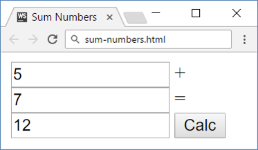 </h3>

<h2>2.&nbsp;&nbsp; Show More</h2>

Write a JS function that <strong>expands</strong> a hidden
section of text when a link is <strong>clicked</strong>.
The link should <strong>disappear</strong>
as the rest of the text shows up.

<h3>Input/Output</h3>

There will be no input/output, your program should instead <strong>modify</strong> the DOM of
the given HTML document.

<table class=MsoTableGrid border=1 cellspacing=0 cellpadding=0 width=680
 style='width:510.25pt;margin-left:1.15pt;border-collapse:collapse;border:none'>
 <tr>
  <td width=680 valign=top style='width:510.25pt;border:solid windowtext 1.0pt;
  background:#D9D9D9;padding:2.85pt 4.25pt 2.85pt 4.25pt'>
  
<b>Sample HTML</b>

  </td>
 </tr>
 <tr>
  <td width=680 valign=top style='width:510.25pt;border:solid windowtext 1.0pt;
  border-top:none;padding:2.85pt 4.25pt 2.85pt 4.25pt'>
  
Welcome to the &quot;Show
  More Text Example&quot;.

  
&lt;a href=&quot;#&quot;
  id=&quot;more&quot; onclick= &quot;showText()&quot;&gt;Read more …&lt;/a&gt;

  
&lt;span
  id=&quot;text&quot; style= &quot;display:none&quot;&gt;Welcome to JavaScript
  and DOM.&lt;/span&gt;

  
&lt;script&gt;

  
  function showText() {

  
    // TODO

  
  }

  
&lt;/script&gt;

  </td>
 </tr>
</table>

<h3>Examples</h3>

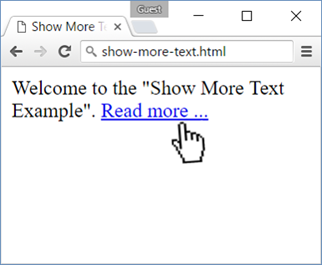 &agrave;
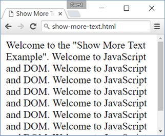

<h2>3.&nbsp;&nbsp; Collect
List Items</h2>

Write a JS function that scans a given <strong>HTML list</strong> and <strong>appends</strong> all
collected list items’ text to a <strong>text
area</strong> on the same page when the user <strong>clicks</strong> on a button.

<h3>Input/Output</h3>

There will be no input/output, your program should instead <strong>modify</strong> the DOM of
the given HTML document.

<table class=MsoTableGrid border=1 cellspacing=0 cellpadding=0 width=680
 style='width:510.25pt;margin-left:1.15pt;border-collapse:collapse;border:none'>
 <tr>
  <td width=680 valign=top style='width:510.25pt;border:solid windowtext 1.0pt;
  background:#D9D9D9;padding:2.85pt 4.25pt 2.85pt 4.25pt'>
  
<b>Sample HTML</b>

  </td>
 </tr>
 <tr>
  <td width=680 valign=top style='width:510.25pt;border:solid windowtext 1.0pt;
  border-top:none;padding:2.85pt 4.25pt 2.85pt 4.25pt'>
  
&lt;ul
  id=&quot;items&quot;&gt;

  
  &lt;li&gt;first
  item&lt;/li&gt;

  
  &lt;li&gt;second
  item&lt;/li&gt;

  
  &lt;li&gt;third
  item&lt;/li&gt;

  
&lt;/ul&gt;

  
&lt;textarea
  id=&quot;result&quot;&gt;&lt;/textarea&gt;

  
&lt;br&gt;

  
&lt;button
  onclick=&quot;extractText()&quot;&gt;Extract Text&lt;/button&gt;

  
&lt;script&gt;

  
  function extractText() {

  
    // TODO

  
  }

  
&lt;/script&gt;

  </td>
 </tr>
</table>

<h3>Examples</h3>

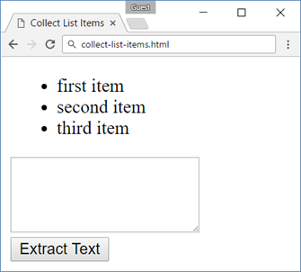 &agrave;
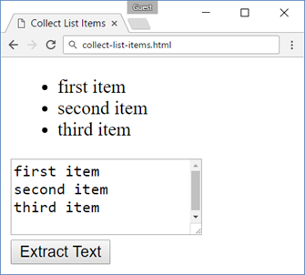

<h2>4.&nbsp;&nbsp; Colorize
Table</h2>

Write a JS function that <strong>changes the color </strong>of
all <strong>even</strong>
rows when the user <strong>clicks</strong>
a button. Apply the color &quot;<strong>Teal</strong>&quot;
to the target rows.

<h3>Input/Output</h3>

There will be no input/output, your program should instead <strong>modify</strong> the DOM of
the given HTML document.

<table class=MsoTableGrid border=1 cellspacing=0 cellpadding=0 width=680
 style='width:510.25pt;margin-left:1.15pt;border-collapse:collapse;border:none'>
 <tr>
  <td width=680 valign=top style='width:510.25pt;border:solid windowtext 1.0pt;
  background:#D9D9D9;padding:2.85pt 4.25pt 2.85pt 4.25pt'>
  
<b>Sample HTML</b>

  </td>
 </tr>
 <tr>
  <td width=680 valign=top style='width:510.25pt;border:solid windowtext 1.0pt;
  border-top:none;padding:2.85pt 4.25pt 2.85pt 4.25pt'>
  
&lt;table&gt;

  
  &lt;tr&gt;&lt;th&gt;Name&lt;/th&gt;&lt;th&gt;Town&lt;/th&gt;&lt;/tr&gt;

  
  &lt;tr&gt;&lt;td&gt;Eve&lt;/td&gt;&lt;td&gt;Sofia&lt;/td&gt;&lt;/tr&gt;

  
  &lt;tr&gt;&lt;td&gt;Nick&lt;/td&gt;&lt;td&gt;Varna&lt;/td&gt;&lt;/tr&gt;

  
  &lt;tr&gt;&lt;td&gt;Didi&lt;/td&gt;&lt;td&gt;Ruse&lt;/td&gt;&lt;/tr&gt;

  
  &lt;tr&gt;&lt;td&gt;Tedy&lt;/td&gt;&lt;td&gt;Varna&lt;/td&gt;&lt;/tr&gt;

  
&lt;/table&gt;

  
&lt;button onclick=&quot;colorize()&quot;&gt;Colorize&lt;/button&gt;

  
&lt;script&gt;

  
  function colorize() {

  
    // TODO

  
  }

  
&lt;/script&gt;

  </td>
 </tr>
</table>

<h3>Examples</h3>

 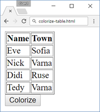 &agrave;
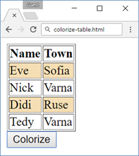

<h2>5.&nbsp;&nbsp; Countdown</h2>

Write a JS program that <strong>implements </strong>a web countdown timer that
supports <strong>minutes</strong>
and <strong>seconds</strong>.
The user should be able to set the time by calling you function with the number
of seconds required. The time begins to count down as soon as the function is
called. Using the sample code, your function will be called as soon as the page
finishes loading and will begin to count down from 10 minutes.

<h3>Input</h3>

Your function will receive a <strong>number parameter</strong>, representing the
starting number of <strong>seconds</strong>.

<h3>Output</h3>

There will be no output, your program should instead <strong>modify</strong> the DOM of
the given HTML document.

<table class=MsoTableGrid border=1 cellspacing=0 cellpadding=0 width=680
 style='width:510.25pt;margin-left:1.15pt;border-collapse:collapse;border:none'>
 <tr>
  <td width=680 valign=top style='width:510.25pt;border:solid windowtext 1.0pt;
  background:#D9D9D9;padding:2.85pt 4.25pt 2.85pt 4.25pt'>
  
<b>Sample HTML</b>

  </td>
 </tr>
 <tr>
  <td width=680 valign=top style='width:510.25pt;border:solid windowtext 1.0pt;
  border-top:none;padding:2.85pt 4.25pt 2.85pt 4.25pt'>
  
&lt;input
  type=&quot;text&quot; id=&quot;time&quot; style=&quot;border:3px solid blue;
  text-align:center; font-size:2em;&quot; disabled=&quot;true&quot;/&gt;

  
&lt;script&gt;window.onload =
  function() { countdown(600); }&lt;/script&gt;

  </td>
 </tr>
</table>

<h3>Examples</h3>

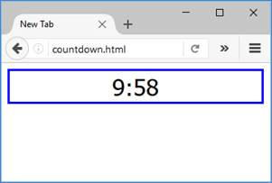

<h2>6.&nbsp;&nbsp; Extract
Parenthesis</h2>

Write a JS function that when <strong>executed</strong>, extracts
all parenthesized text from a target paragraph by given element ID. The result
is a string, joined by &quot;; &quot; (semicolon, space).

<h3>Input</h3>

Your function will receive a <strong>string parameter</strong>, representing the
target element ID, from which text must be extracted. The text should be
extracted from the DOM.

<h3>Output</h3>

<strong>Return
a string</strong> with all matched text, separated by &quot;; &quot;
(semicolon, space).

<h3>Examples</h3>

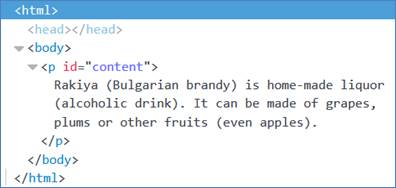

<table class=MsoTableGrid border=1 cellspacing=0 cellpadding=0 width=680
 style='width:510.25pt;margin-left:1.15pt;border-collapse:collapse;border:none'>
 <tr>
  <td width=680 valign=top style='width:510.25pt;border:solid windowtext 1.0pt;
  background:#D9D9D9;padding:2.85pt 4.25pt 2.85pt 4.25pt'>
  
<b>Sample call</b>

  </td>
 </tr>
 <tr>
  <td width=680 valign=top style='width:510.25pt;border:solid windowtext 1.0pt;
  border-top:none;padding:2.85pt 4.25pt 2.85pt 4.25pt'>
  
let text =
  extract(&quot;content&quot;);

  </td>
 </tr>
 <tr>
  <td width=680 valign=top style='width:510.25pt;border:solid windowtext 1.0pt;
  border-top:none;background:#D9D9D9;padding:2.85pt 4.25pt 2.85pt 4.25pt'>
  
<b>Result (stored in variable text)</b>

  </td>
 </tr>
 <tr>
  <td width=680 valign=top style='width:510.25pt;border:solid windowtext 1.0pt;
  border-top:none;padding:2.85pt 4.25pt 2.85pt 4.25pt'>
  
Bulgarian brandy; alcoholic drink;
  even apples

  </td>
 </tr>
</table>

&nbsp;

<h2>7.&nbsp;&nbsp; * Sum
Table</h2>

Write a JS function that finds the first table in a document
and sums the values in the last column. The result is then displayed in an
element with ID &quot;sum&quot;.

<h3>Input/Output</h3>

There will be no input/output, your program should instead <strong>modify</strong> the DOM of
the given HTML document.

<table class=MsoTableGrid border=1 cellspacing=0 cellpadding=0 width=680
 style='width:510.25pt;margin-left:1.15pt;border-collapse:collapse;border:none'>
 <tr>
  <td width=680 valign=top style='width:510.25pt;border:solid windowtext 1.0pt;
  background:#D9D9D9;padding:2.85pt 4.25pt 2.85pt 4.25pt'>
  
<b>Sample HTML</b>

  </td>
 </tr>
 <tr>
  <td width=680 valign=top style='width:510.25pt;border:solid windowtext 1.0pt;
  border-top:none;padding:2.85pt 4.25pt 2.85pt 4.25pt'>
  
&lt;table&gt;

  
  &lt;tbody&gt;

  
   
  &lt;tr&gt;&lt;th&gt;Product&lt;/th&gt;&lt;th&gt;Cost&lt;/th&gt;&lt;/tr&gt;

  
   
  &lt;tr&gt;&lt;td&gt;Beer&lt;/td&gt;   &lt;td&gt;2.88&lt;/td&gt;&lt;/tr&gt;

  
   
  &lt;tr&gt;&lt;td&gt;Fries&lt;/td&gt;  &lt;td&gt;2.15&lt;/td&gt;&lt;/tr&gt;

  
   
  &lt;tr&gt;&lt;td&gt;Burger&lt;/td&gt; &lt;td&gt;4.59&lt;/td&gt;&lt;/tr&gt;

  
   
  &lt;tr&gt;&lt;td&gt;Total:&lt;/td&gt; &lt;td
  id=&quot;sum&quot;&gt;&lt;/td&gt;&lt;/tr&gt;

  
  &lt;/tbody&gt;

  
&lt;/table&gt;

  
&lt;button
  onclick=&quot;sum()&quot;&gt;Sum&lt;/button&gt;

  </td>
 </tr>
</table>

<h3>Example</h3>

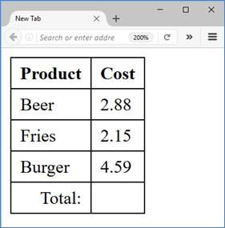&agrave; 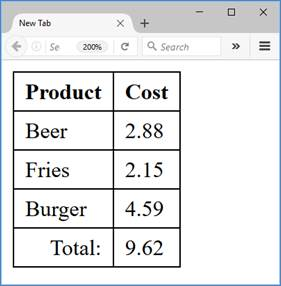

</body>

</html>
