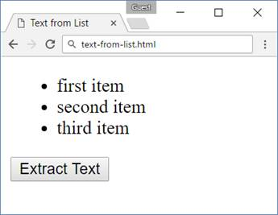
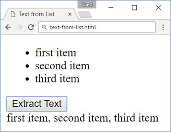
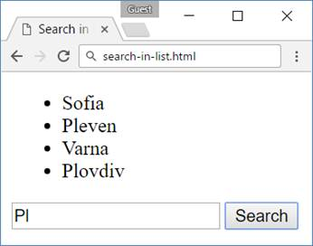
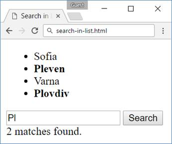
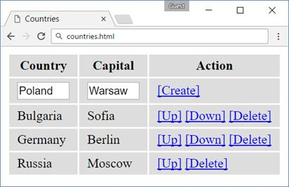
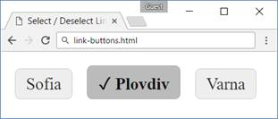
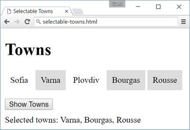

<html>

<head>
<meta http-equiv=Content-Type content="text/html; charset=windows-1251">
<meta name=Generator content="Microsoft Word 14 (filtered)">

</head>

<body lang=EN-US link=blue vlink=purple>

<h1>Lab: jQuery</h1>

Problems for exercises and homework for the <a
href="https://softuni.bg/courses/javascript-advanced">“JavaScript Advanced”
course @ SoftUni</a>. Submit your solutions in the SoftUni judge system at <a
href="https://judge.softuni.bg/Contests/329">https://judge.softuni.bg/Contests/329</a>.

<h2>1.&nbsp;&nbsp; Text from
List</h2>

A HTML page holding a <b>list</b> of items and an [Extract Text] button is given. Implement the extractText function which will be called when the button's
onClick event is fired.

<h3>HTML and JavaScript Code</h3>

You are given the following <b>HTML</b> code:

<table class=MsoTableGrid border=1 cellspacing=0 cellpadding=0 width=696
 style='width:7.25in;margin-left:4.25pt;border-collapse:collapse;border:none'>
 <tr>
  <td width=696 valign=top style='width:7.25in;border:solid windowtext 1.0pt;
  background:#D9D9D9;padding:2.85pt 4.25pt 2.85pt 4.25pt'>
  
text.html

  </td>
 </tr>
 <tr>
  <td width=696 valign=top style='width:7.25in;border:solid windowtext 1.0pt;
  border-top:none;padding:2.85pt 4.25pt 2.85pt 4.25pt'>
  
&lt;!DOCTYPE
  <b>html</b>&gt; 
  &lt;<b>html </b><b>lang=</b><b>&quot;en&quot;</b>&gt; 
  &lt;<b>head</b>&gt; 
      &lt;<b>meta </b><b>charset=</b><b>&quot;UTF-8&quot;</b>&gt; 
      &lt;<b>title</b>&gt;Text from List&lt;/<b>title</b>&gt; 
      &lt;<b>script </b><b>src=</b><b>&quot;https://code.jquery.com/jquery-3.1.1.min.js&quot;
  </b><b>integrity=</b><b>&quot;sha256-hVVnYaiADRTO2PzUGmuLJr8BLUSjGIZsDYGmIJLv2b8=&quot;  
  </b><b>crossorigin=</b><b>&quot;anonymous&quot;</b>&gt;&lt;/<b>script</b>&gt; 
      &lt;<b>script </b><b>src=</b><b>&quot;extractText.js&quot;</b>&gt;&lt;/<b>script</b>&gt; 
  &lt;/<b>head</b>&gt; 
  &lt;<b>body</b>&gt; 
      &lt;<b>ul </b><b>id=</b><b>&quot;items&quot;</b>&gt; 
          &lt;<b>li</b>&gt;first item&lt;/<b>li</b>&gt; 
          &lt;<b>li</b>&gt;second item&lt;/<b>li</b>&gt; 
          &lt;<b>li</b>&gt;third item&lt;/<b>li</b>&gt; 
      &lt;/<b>ul</b>&gt; 
      &lt;<b>button </b><b>onclick=</b><b>&quot;</b><i>extractText</i>()<b>&quot;</b>&gt; 
  Extract Text&lt;/<b>button</b>&gt; 
      &lt;<b>div </b><b>id=</b><b>&quot;result&quot;</b>&gt;&lt;/<b>div</b>&gt; 
  &lt;/<b>body</b>&gt; 
  &lt;/<b>html</b>&gt;

  </td>
 </tr>
</table>

It comes together with the following <b>JavaScript</b> code:

<table class=MsoTableGrid border=1 cellspacing=0 cellpadding=0 width=696
 style='width:7.25in;margin-left:4.25pt;border-collapse:collapse;border:none'>
 <tr>
  <td width=696 valign=top style='width:7.25in;border:solid windowtext 1.0pt;
  background:#D9D9D9;padding:2.85pt 4.25pt 2.85pt 4.25pt'>
  
extract-text.js

  </td>
 </tr>
 <tr>
  <td width=696 valign=top style='width:7.25in;border:solid windowtext 1.0pt;
  border-top:none;padding:2.85pt 4.25pt 2.85pt 4.25pt'>
  
<b>function </b><i>extractText</i>() { 
      <i>// </i><b><i>TODO 
  </i></b>}

  </td>
 </tr>
</table>

<h3>Screenshot</h3>

 

<h2>2.&nbsp;&nbsp; Search in
List</h2>

An HTML page holds a <b>list</b> of towns, a <b>search</b>
box and a [Search] button. Implement the search function to <b>bold</b> the items from the list
which include the text from the <b>search</b> box. Also print the amount of
items the current search<b> matches</b> in the format <b>&quot;&lt;matches&gt;
matches found.&quot;</b>

<h3>HTML and JavaScript Code</h3>

You are given the following <b>HTML</b> code:

<table class=MsoTableGrid border=1 cellspacing=0 cellpadding=0 width=701
 style='width:526.0pt;margin-left:1.15pt;border-collapse:collapse;border:none'>
 <tr style='height:12.85pt'>
  <td width=701 valign=top style='width:526.0pt;border:solid windowtext 1.0pt;
  background:#D9D9D9;padding:2.85pt 4.25pt 2.85pt 4.25pt;height:12.85pt'>
  
list.html

  </td>
 </tr>
 <tr style='height:269.0pt'>
  <td width=701 valign=top style='width:526.0pt;border:solid windowtext 1.0pt;
  border-top:none;padding:2.85pt 4.25pt 2.85pt 4.25pt;height:269.0pt'>
  
&lt;!DOCTYPE
  <b>html</b>&gt; 
  &lt;<b>html </b><b>lang=</b><b>&quot;en&quot;</b>&gt; 
  &lt;<b>head</b>&gt; 
      &lt;<b>meta </b><b>charset=</b><b>&quot;UTF-8&quot;</b>&gt; 
      &lt;<b>title</b>&gt;Search in List&lt;/<b>title</b>&gt; 
      &lt;<b>script </b><b>src=</b><b>&quot;https://code.jquery.com/jquery-3.1.1.min.js&quot;
  </b><b>integrity=</b><b>&quot;sha256-hVVnYaiADRTO2PzUGmuLJr8BLUSjGIZsDYGmIJLv2b8=&quot;  
  </b><b>crossorigin=</b><b>&quot;anonymous&quot;</b>&gt;&lt;/<b>script</b>&gt; 
      &lt;<b>script </b><b>src=</b><b>&quot;search.js&quot;</b>&gt;&lt;/<b>script</b>&gt; 
  &lt;/<b>head</b>&gt; 
  &lt;<b>body</b>&gt; 
  &lt;<b>ul </b><b>id=</b><b>&quot;towns&quot;</b>&gt; 
      &lt;<b>li</b>&gt;Sofia&lt;/<b>li</b>&gt; 
      &lt;<b>li</b>&gt;Pleven&lt;/<b>li</b>&gt; 
      &lt;<b>li</b>&gt;Varna&lt;/<b>li</b>&gt; 
      &lt;<b>li</b>&gt;Plovdiv&lt;/<b>li</b>&gt; 
  &lt;/<b>ul</b>&gt; 
  &lt;<b>input </b><b>type=</b><b>&quot;text&quot; </b><b>id=</b><b>&quot;searchText&quot; </b>/&gt; 
  &lt;<b>button </b><b>onclick=</b><b>&quot;</b><i>search</i>()<b>&quot;</b>&gt;Search&lt;/<b>button</b>&gt; 
  &lt;<b>div </b><b>id=</b><b>&quot;result&quot;</b>&gt;&lt;/<b>div</b>&gt; 
  &lt;/<b>body</b>&gt; 
  &lt;/<b>html</b>&gt;

  </td>
 </tr>
</table>

It comes together with the following <b>JavaScript</b> code:

<table class=MsoTableGrid border=1 cellspacing=0 cellpadding=0 width=700
 style='width:525.1pt;margin-left:1.15pt;border-collapse:collapse;border:none'>
 <tr>
  <td width=700 valign=top style='width:525.1pt;border:solid windowtext 1.0pt;
  background:#D9D9D9;padding:2.85pt 4.25pt 2.85pt 4.25pt'>
  
search.js

  </td>
 </tr>
 <tr>
  <td width=700 valign=top style='width:525.1pt;border:solid windowtext 1.0pt;
  border-top:none;padding:2.85pt 4.25pt 2.85pt 4.25pt'>
  
<b>function </b><i>search</i>() { 
      <i>// </i><b><i>TODO 
  </i></b>}

  </td>
 </tr>
</table>

<h3>Screenshots</h3>

 

<h2>3.&nbsp;&nbsp; Countries
Table</h2>

You are given and HTML table holding <b>countries</b> and
their <b>capitals</b>. You need to implement a [Create]
link to create a new country and for each existing country implement [Up], [Down] and [Delete] links to manipulate its position in the table.

The table needs to have the following entries when it’s
initialized (<strong>add them
when your functions starts</strong>):

Bulgaria, Sofia

Germany, Berlin

Russia, Moscow

<h3>HTML and JavaScript Code</h3>

You are given the following <b>HTML</b> code:

<table class=MsoTableGrid border=1 cellspacing=0 cellpadding=0 width=700
 style='width:525.1pt;margin-left:1.15pt;border-collapse:collapse;border:none'>
 <tr>
  <td width=700 valign=top style='width:525.1pt;border:solid windowtext 1.0pt;
  background:#D9D9D9;padding:2.85pt 4.25pt 2.85pt 4.25pt'>
  
countries.html

  </td>
 </tr>
 <tr>
  <td width=700 valign=top style='width:525.1pt;border:solid windowtext 1.0pt;
  border-top:none;padding:2.85pt 4.25pt 2.85pt 4.25pt'>
  
&lt;!DOCTYPE
  <b>html</b>&gt; 
  &lt;<b>html </b><b>lang=</b><b>&quot;en&quot;</b>&gt; 
  &lt;<b>head</b>&gt; 
      &lt;<b>meta </b><b>charset=</b><b>&quot;UTF-8&quot;</b>&gt; 
      &lt;<b>title</b>&gt;Countries Table&lt;/<b>title</b>&gt; 
      &lt;<b>style</b>&gt; 
          <b>td</b>, <b>th </b>{ <b>background</b>: <b>#DDD</b>; <b>padding</b>: 5<b>px
  </b>10<b>px </b>} 
          <b>input</b>[<b>type</b>=<b>'text'</b>] { <b>width</b>: 60<b>px </b>} 
      &lt;/<b>style</b>&gt; 
      &lt;<b>script </b><b>src=</b><b>&quot;https://code.jquery.com/jquery-3.1.1.min.js&quot;
  </b><b>integrity=</b><b>&quot;sha256-hVVnYaiADRTO2PzUGmuLJr8BLUSjGIZsDYGmIJLv2b8=&quot;  
  </b><b>crossorigin=</b><b>&quot;anonymous&quot;</b>&gt;&lt;/<b>script</b>&gt; 
      &lt;<b>script </b><b>src=</b><b>&quot;initialize-table.js&quot;</b>&gt;&lt;/<b>script</b>&gt; 
  &lt;/<b>head</b>&gt; 
  &lt;<b>body</b>&gt; 
  &lt;<b>table </b><b>id=</b><b>&quot;countriesTable&quot;</b>&gt; 
      &lt;<b>tr</b>&gt; 
          &lt;<b>th</b>&gt;Country&lt;/<b>th</b>&gt; 
          &lt;<b>th</b>&gt;Capital&lt;/<b>th</b>&gt; 
          &lt;<b>th</b>&gt;Action&lt;/<b>th</b>&gt; 
      &lt;/<b>tr</b>&gt; 
      &lt;<b>tr</b>&gt; 
          &lt;<b>td</b>&gt;&lt;<b>input </b><b>type=</b><b>&quot;text&quot; </b><b>id=</b><b>&quot;newCountryText&quot; </b>/&gt;&lt;/<b>td</b>&gt; 
          &lt;<b>td</b>&gt;&lt;<b>input </b><b>type=</b><b>&quot;text&quot; </b><b>id=</b><b>&quot;newCapitalText&quot; </b>/&gt;&lt;/<b>td</b>&gt; 
          &lt;<b>td</b>&gt;&lt;<b>a </b><b>href=</b><b>&quot;#&quot; </b><b>id=</b><b>&quot;createLink&quot;</b>&gt;[Create]&lt;/<b>a</b>&gt;&lt;/<b>td</b>&gt; 
      &lt;/<b>tr</b>&gt; 
  &lt;/<b>table</b>&gt; 
  &lt;<b>script</b>&gt;$(() =&gt; <i>initializeTable</i>())&lt;/<b>script</b>&gt; 
  &lt;/<b>body</b>&gt; 
  &lt;/<b>html</b>&gt;

  </td>
 </tr>
</table>

It comes together with the following <b>JavaScript</b> code:

<table class=MsoTableGrid border=1 cellspacing=0 cellpadding=0 width=700
 style='width:525.1pt;margin-left:1.15pt;border-collapse:collapse;border:none'>
 <tr>
  <td width=700 valign=top style='width:525.1pt;border:solid windowtext 1.0pt;
  background:#D9D9D9;padding:2.85pt 4.25pt 2.85pt 4.25pt'>
  
initialize-table.js

  </td>
 </tr>
 <tr>
  <td width=700 valign=top style='width:525.1pt;border:solid windowtext 1.0pt;
  border-top:none;padding:2.85pt 4.25pt 2.85pt 4.25pt'>
  
<b>function </b><i>initializeTable</i>() { 
      <i>// </i><b><i>TODO 
  </i></b>}

  </td>
 </tr>
</table>

<h3>Screenshots</h3>

<h2>4.&nbsp;&nbsp; Link
Buttons</h2>

You are given HTML holding some buttons. Implement the attachEvents function which should attach click events on the buttons. When a button is <b>clicked</b>
it should <b>remove</b> the class=&quot;selected&quot;
attribute from the button that currently holds it and <b>add it to its own
attributes</b>. 

<h3>HTML, CSS and JavaScript Code</h3>

You are given the following <b>HTML</b> code:

<table class=MsoTableGrid border=1 cellspacing=0 cellpadding=0 width=700
 style='width:525.1pt;margin-left:1.15pt;border-collapse:collapse;border:none'>
 <tr>
  <td width=700 valign=top style='width:525.1pt;border:solid windowtext 1.0pt;
  background:#D9D9D9;padding:2.85pt 4.25pt 2.85pt 4.25pt'>
  
buttons.html

  </td>
 </tr>
 <tr>
  <td width=700 valign=top style='width:525.1pt;border:solid windowtext 1.0pt;
  border-top:none;padding:2.85pt 4.25pt 2.85pt 4.25pt'>
  
&lt;!DOCTYPE
  <b>html</b>&gt; 
  &lt;<b>html </b><b>lang=</b><b>&quot;en&quot;</b>&gt; 
  &lt;<b>head</b>&gt; 
      &lt;<b>meta </b><b>charset=</b><b>&quot;UTF-8&quot;</b>&gt; 
      &lt;<b>title</b>&gt;Title&lt;/<b>title</b>&gt; 
      &lt;<b>link </b><b>rel=</b><b>&quot;stylesheet&quot; </b><b>href=</b><b>&quot;link-buttons.css&quot; </b>/&gt; 
      &lt;<b>script </b><b>src=</b><b>&quot;https://code.jquery.com/jquery-3.1.1.min.js&quot;</b>&gt;&lt;/<b>script</b>&gt; 
      &lt;<b>script </b><b>src=</b><b>&quot;link-buttons.js&quot;</b>&gt;&lt;/<b>script</b>&gt; 
  &lt;/<b>head</b>&gt; 
  &lt;<b>body </b><b>onload=</b><b>&quot;</b>attachEvents()<b>&quot;</b>&gt; 
      &lt;<b>a </b><b>class=</b><b>&quot;button&quot;</b>&gt;Sofia&lt;/<b>a</b>&gt; 
      &lt;<b>a </b><b>class=</b><b>&quot;button&quot;</b>&gt;Plovdiv&lt;/<b>a</b>&gt; 
      &lt;<b>a </b><b>class=</b><b>&quot;button&quot;</b>&gt;Varna&lt;/<b>a</b>&gt; 
  &lt;/<b>body</b>&gt; 
  &lt;/<b>html</b>&gt;

  </td>
 </tr>
</table>

It comes with this <b>CSS</b>:

<table class=MsoTableGrid border=1 cellspacing=0 cellpadding=0 width=700
 style='width:525.1pt;margin-left:1.15pt;border-collapse:collapse;border:none'>
 <tr>
  <td width=700 valign=top style='width:525.1pt;border:solid windowtext 1.0pt;
  background:#D9D9D9;padding:2.85pt 4.25pt 2.85pt 4.25pt'>
  
link-buttons.css

  </td>
 </tr>
 <tr>
  <td width=700 valign=top style='width:525.1pt;border:solid windowtext 1.0pt;
  border-top:none;padding:2.85pt 4.25pt 2.85pt 4.25pt'>
  
<b>a</b>.<b>button </b>{ 
      <b>border</b>: 1<b>px
  solid </b><b>#CCC</b>; 
      <b>background</b>: <b>#EEE</b>; 
      <b>padding</b>: 5<b>px
  </b>10<b>px</b>; 
      <b>border-radius</b>: 5<b>px</b>; 
      <b>color</b>: <b>#333</b>; 
      <b>text-decoration</b>: <b>none</b>; 
      <b>display</b>: <b>inline-block</b>; 
      <b>margin</b>: 5<b>px</b>; 
  } 
   
  <b>a</b>.<b>button</b>.<b>selected
  </b>{ 
      <b>color</b>: <b>#111</b>; 
      <b>font-weight</b>: <b>bold</b>; 
      <b>border</b>: 1<b>px
  solid </b><b>#AAA</b>; 
      <b>background</b>: <b>#BBB</b>; 
  } 
   
  <b>a</b>.<b>button</b>.<b>selected</b>::<b>before </b>{ 
      <b>content</b>: <b>&quot;\2713\20\20&quot;</b>; 
  } 
   
  <b>a</b>:<b>hover </b>{ 
      <b>cursor</b>: <b>pointer</b>; 
  }

  </td>
 </tr>
</table>

and the following <b>JavaScript</b> code:

<table class=MsoTableGrid border=1 cellspacing=0 cellpadding=0 width=700
 style='width:525.1pt;margin-left:1.15pt;border-collapse:collapse;border:none'>
 <tr>
  <td width=700 valign=top style='width:525.1pt;border:solid windowtext 1.0pt;
  background:#D9D9D9;padding:2.85pt 4.25pt 2.85pt 4.25pt'>
  
link-buttons.js

  </td>
 </tr>
 <tr>
  <td width=700 valign=top style='width:525.1pt;border:solid windowtext 1.0pt;
  border-top:none;padding:2.85pt 4.25pt 2.85pt 4.25pt'>
  
<b>function </b><i>attachEvents</i>() { 
      <i>// </i><b><i>TODO 
  </i></b>}

  </td>
 </tr>
</table>

<h3>Screenshots</h3>

<h3>Hints</h3>

·&nbsp;&nbsp;&nbsp;&nbsp;&nbsp;&nbsp;&nbsp;&nbsp;
Use the attachEventListener function.

<h2>5.&nbsp;&nbsp; Selectable
Towns</h2>

Create an HTML page listing <b>towns</b>, a town should be
selectable. Clicking on a town should <b>select/deselect</b> it, a selected
town should have the data-selected attribute added
to it and its background color should be changed to #DDD.
Also create a button [Show Towns] that prints the
text <b>&quot;Selected towns: &quot;</b> followed by all selected towns joined
with a <b>&quot;, &quot;</b>.

<h3>HTML and JavaScript Code</h3>

You are given the following <b>HTML</b> code:

<table class=MsoTableGrid border=1 cellspacing=0 cellpadding=0 width=700
 style='width:525.1pt;margin-left:1.15pt;border-collapse:collapse;border:none'>
 <tr>
  <td width=700 valign=top style='width:525.1pt;border:solid windowtext 1.0pt;
  background:#D9D9D9;padding:2.85pt 4.25pt 2.85pt 4.25pt'>
  
towns.html

  </td>
 </tr>
 <tr>
  <td width=700 valign=top style='width:525.1pt;border:solid windowtext 1.0pt;
  border-top:none;padding:2.85pt 4.25pt 2.85pt 4.25pt'>
  
&lt;!DOCTYPE
  <b>html</b>&gt; 
  &lt;<b>html </b><b>lang=</b><b>&quot;en&quot;</b>&gt; 
  &lt;<b>head</b>&gt; 
      &lt;<b>meta </b><b>charset=</b><b>&quot;UTF-8&quot;</b>&gt; 
      &lt;<b>title</b>&gt;Selectable Towns&lt;/<b>title</b>&gt; 
      &lt;<b>style</b>&gt; 
          <b>li </b>{ 
              <b>display</b>: <b>inline-block</b>; 
              <b>cursor</b>: <b>pointer</b>; 
              <b>padding</b>: 10<b>px</b>; 
          } 
          <b>ul </b>{ <b>padding</b>:0; } 
      &lt;/<b>style</b>&gt; 
      &lt;<b>script </b><b>src=</b><b>&quot;https://code.jquery.com/jquery-3.1.1.min.js&quot;</b>&gt;&lt;/<b>script</b>&gt; 
      &lt;<b>script </b><b>src=</b><b>&quot;select-towns.js&quot;</b>&gt;&lt;/<b>script</b>&gt; 
  &lt;/<b>head</b>&gt; 
  &lt;<b>body</b>&gt; 
  &lt;<b>h2</b>&gt;Towns&lt;/<b>h2</b>&gt; 
  &lt;<b>ul </b><b>id=</b><b>&quot;items&quot;</b>&gt; 
      &lt;<b>li</b>&gt;Sofia&lt;/<b>li</b>&gt; 
      &lt;<b>li</b>&gt;Varna&lt;/<b>li</b>&gt; 
      &lt;<b>li</b>&gt;Plovdiv&lt;/<b>li</b>&gt; 
      &lt;<b>li</b>&gt;Bourgas&lt;/<b>li</b>&gt; 
      &lt;<b>li</b>&gt;Rousse&lt;/<b>li</b>&gt; 
  &lt;/<b>ul</b>&gt; 
  &lt;<b>button </b><b>id=</b><b>&quot;showTownsButton&quot;</b>&gt;Show Towns&lt;/<b>button</b>&gt;

  
&lt;<b>div</b> <b>id=</b><b>&quot;selectedTowns&quot;</b>&gt;&lt;/<b>div</b>&gt; 
  &lt;<b>script</b>&gt;$(<i>attachEvents</i>())&lt;/<b>script</b>&gt; 
  &lt;/<b>body</b>&gt; 
  &lt;/<b>html</b>&gt;

  </td>
 </tr>
</table>

It comes together with the following <b>JavaScript</b> code:

<table class=MsoTableGrid border=1 cellspacing=0 cellpadding=0 width=700
 style='width:525.1pt;margin-left:1.15pt;border-collapse:collapse;border:none'>
 <tr>
  <td width=700 valign=top style='width:525.1pt;border:solid windowtext 1.0pt;
  background:#D9D9D9;padding:2.85pt 4.25pt 2.85pt 4.25pt'>
  
select-towns.js

  </td>
 </tr>
 <tr>
  <td width=700 valign=top style='width:525.1pt;border:solid windowtext 1.0pt;
  border-top:none;padding:2.85pt 4.25pt 2.85pt 4.25pt'>
  
<b>function </b><i>attachEvents</i>() { 
      <i>// </i><b><i>TODO 
  </i></b>}

  </td>
 </tr>
</table>

<h3>Screenshots</h3>

<h3></h3>

</body>

</html>
