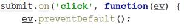

<html>

<head>
<meta http-equiv=Content-Type content="text/html; charset=windows-1251">
<meta name=Generator content="Microsoft Word 14 (filtered)">

</head>

<body lang=EN-US link=blue vlink=purple>

<h1>Exercises: jQuery, DOM and Events</h1>

Problems for exercises and homework for the <a
href="https://softuni.bg/courses/javascript-advanced">“JavaScript Advanced”
course @ SoftUni</a>. Submit your solutions in the SoftUni judge system at <a
href="https://judge.softuni.bg/Contests/278/jQuery-and-DOM">https://judge.softuni.bg/Contests/278/jQuery-and-DOM</a>.

<h2>1.&nbsp;&nbsp; Increment
Counter</h2>

You are tasked with creating a piece of <b>HTML</b>
dynamically using JavaScript and <b>appending</b> it to a given element using a
passed in <b>selector</b>.

<h3>HTML and JavaScript Code</h3>

You are given the following <b>HTML</b> code:

<table class=MsoTableGrid border=1 cellspacing=0 cellpadding=0 width=664
 style='width:498.25pt;margin-left:1.15pt;border-collapse:collapse;border:none'>
 <tr>
  <td width=664 valign=top style='width:498.25pt;border:solid windowtext 1.0pt;
  background:#D9D9D9;padding:2.85pt 4.25pt 2.85pt 4.25pt'>
  
incrementCounter.html

  </td>
 </tr>
 <tr>
  <td width=664 valign=top style='width:498.25pt;border:solid windowtext 1.0pt;
  border-top:none;padding:2.85pt 4.25pt 2.85pt 4.25pt'>
  
&lt;!DOCTYPE
  <b>html</b>&gt; 
  &lt;<b>html </b><b>lang=</b><b>&quot;en&quot;</b>&gt; 
  &lt;<b>head</b>&gt; 
      &lt;<b>meta </b><b>charset=</b><b>&quot;UTF-8&quot;</b>&gt; 
      &lt;<b>title</b>&gt;Increment Counter&lt;/<b>title</b>&gt; 
      &lt;<b>script </b><b>src=</b><b>&quot;https://code.jquery.com/jquery-3.1.0.min.js&quot; 
              </b><b>integrity=</b><b>&quot;sha256-cCueBR6CsyA4/9szpPfrX3s49M9vUU5BgtiJj06wt/s=&quot; 
              </b><b>crossorigin=</b><b>&quot;anonymous&quot;</b>&gt;&lt;/<b>script</b>&gt; 
  &lt;/<b>head</b>&gt; 
  &lt;<b>body</b>&gt; 
      &lt;<b>div </b><b>id=</b><b>&quot;wrapper&quot;</b>&gt; 
      &lt;/<b>div</b>&gt; 
      &lt;<b>script </b><b>src=</b><b>&quot;incrementCounter.js&quot;</b>&gt;&lt;/<b>script</b>&gt; 
      &lt;<b>script</b>&gt; 
          <b>window</b>.onload = <b>function</b>(){ 
              <i>increment</i>(<b>&quot;#wrapper&quot;</b>); 
          } 
      &lt;/<b>script</b>&gt; 
  &lt;/<b>body</b>&gt; 
  &lt;/<b>html</b>&gt;

  </td>
 </tr>
</table>

It comes together with the following <b>JavaScript</b> code:

<table class=MsoTableGrid border=1 cellspacing=0 cellpadding=0 width=664
 style='width:498.25pt;margin-left:1.15pt;border-collapse:collapse;border:none'>
 <tr>
  <td width=664 valign=top style='width:498.25pt;border:solid windowtext 1.0pt;
  background:#D9D9D9;padding:2.85pt 4.25pt 2.85pt 4.25pt'>
  
incrementCounter.js

  </td>
 </tr>
 <tr>
  <td width=664 valign=top style='width:498.25pt;border:solid windowtext 1.0pt;
  border-top:none;padding:2.85pt 4.25pt 2.85pt 4.25pt'>
  
<b>function </b><i>increment</i>() { 
      <i>// </i><b><i>TODO 
  </i></b>}

  </td>
 </tr>
</table>

Your function will receive a <b>string </b>value
representing a <b>selector</b> (for example &quot;#wrapper&quot;
or &quot;.root&quot;), all elements created should
be appended to the <b>selector</b>.  

The HTML you create should contain 4 elements:

·&nbsp;&nbsp;&nbsp;&nbsp;&nbsp;&nbsp;&nbsp;&nbsp;
&lt;textarea&gt; with class=&quot;counter&quot;, value=&quot;0&quot;
and the disabled attribute.

·&nbsp;&nbsp;&nbsp;&nbsp;&nbsp;&nbsp;&nbsp;&nbsp;
&lt;button&gt; with class=&quot;btn&quot;, id=&quot;incrementBtn&quot;
and text &quot;<b>Increment</b>&quot;.

·&nbsp;&nbsp;&nbsp;&nbsp;&nbsp;&nbsp;&nbsp;&nbsp;
&lt;button&gt; with class=&quot;btn&quot;, id=&quot;addBtn&quot;
and text &quot;<b>Add</b>&quot;.

·&nbsp;&nbsp;&nbsp;&nbsp;&nbsp;&nbsp;&nbsp;&nbsp;
Unordered list &lt;ul&gt; with class=&quot;results&quot;.

When the [Increment] is clicked
the value of the <b>textarea</b> should go up by <b>one</b> (if it was 0 it
should become 1 e.t.c.). When the [Add] is clicked
a new list item (&lt;li&gt;) with text equal to the
current value of the textarea should be added to the unordered list.

Submit in the judge the JS code (implementation) of the
above function. It may hold other functions in its body.

<h3>Screenshots</h3>

<h3>Hints</h3>

We’ll start off by creating the needed elements and parsing
the <b>selector</b>, we can do it easily with <b>jQuery</b> like this:

Adding multiple elements to the DOM can be expensive,
instead of repeatedly adding to the DOM we can create a DocumentFragment
and <b>add</b> the elements to it instead. When we have built our hierarchy we
can <b>append the</b> DocumentFragment to the DOM,
which will add all of the fragment’s elements to the specified selector. 
 
The next step is to <b>add values</b>, and <b>attributes</b> to the <b>elements</b>
and <b>events</b> to the <b>buttons</b>:

The last step is to <b>add</b> our elements to the DOM:

Our code is now ready to be submitted to Judge.

<h2>2.&nbsp;&nbsp; Timer</h2>

You will be given an <b>HTML</b> file, containing the markup
of a<b> timer</b> with spans for <b>seconds</b>, <b>minutes</b> and <b>hours</b>
and buttons to [Start] and [Pause]
the timer. Your task is to create a JavaScript application that <b>starts</b>
the timer whenever the [Start] button is pressed and
<b>pauses</b> it when the [Pause] button is
pressed.

<h3>HTML and JavaScript Code</h3>

You are given the following <b>HTML</b> code:

<table class=MsoTableGrid border=1 cellspacing=0 cellpadding=0 width=664
 style='width:498.25pt;margin-left:1.15pt;border-collapse:collapse;border:none'>
 <tr>
  <td width=664 valign=top style='width:498.25pt;border:solid windowtext 1.0pt;
  background:#D9D9D9;padding:2.85pt 4.25pt 2.85pt 4.25pt'>
  
timer.html

  </td>
 </tr>
 <tr>
  <td width=664 valign=top style='width:498.25pt;border:solid windowtext 1.0pt;
  border-top:none;padding:2.85pt 4.25pt 2.85pt 4.25pt'>
  
&lt;!DOCTYPE
  <b>html</b>&gt; 
  &lt;<b>html </b><b>lang=</b><b>&quot;en&quot;</b>&gt; 
  &lt;<b>head</b>&gt; 
      &lt;<b>meta </b><b>charset=</b><b>&quot;UTF-8&quot;</b>&gt; 
      &lt;<b>title</b>&gt;Timer&lt;/<b>title</b>&gt; 
      &lt;<b>script </b><b>src=</b><b>&quot;https://code.jquery.com/jquery-3.1.0.min.js&quot; 
              </b><b>integrity=</b><b>&quot;sha256-cCueBR6CsyA4/9szpPfrX3s49M9vUU5BgtiJj06wt/s=&quot; 
              </b><b>crossorigin=</b><b>&quot;anonymous&quot;</b>&gt;&lt;/<b>script</b>&gt; 
      &lt;<b>style</b>&gt; 
          <b>#timer </b>{ 
              <b>font-size</b>: 5<b>em</b>; 
          } 
      &lt;/<b>style</b>&gt; 
  &lt;/<b>head</b>&gt; 
  &lt;<b>body</b>&gt; 
  &lt;<b>div </b><b>id=</b><b>&quot;timer&quot;</b>&gt; 
      &lt;<b>span </b><b>id=</b><b>&quot;hours&quot; </b><b>class=</b><b>&quot;timer&quot;</b>&gt;00&lt;/<b>span</b>&gt;: 
      &lt;<b>span </b><b>id=</b><b>&quot;minutes&quot; </b><b>class=</b><b>&quot;timer&quot;</b>&gt;00&lt;/<b>span</b>&gt;: 
      &lt;<b>span </b><b>id=</b><b>&quot;seconds&quot; </b><b>class=</b><b>&quot;timer&quot;</b>&gt;00&lt;/<b>span</b>&gt; 
      &lt;<b>button </b><b>id=</b><b>&quot;start-timer&quot;</b>&gt;Start&lt;/<b>button</b>&gt; 
      &lt;<b>button </b><b>id=</b><b>&quot;stop-timer&quot;</b>&gt;Stop&lt;/<b>button</b>&gt; 
  &lt;/<b>div</b>&gt; 
  &lt;<b>script </b><b>src=</b><b>&quot;timer.js&quot;</b>&gt;&lt;/<b>script</b>&gt; 
  &lt;<b>script</b>&gt; 
      <b>window</b>.onload=<b>function</b>(){ 
          <i>timer</i>(); 
      } 
  &lt;/<b>script</b>&gt; 
  &lt;/<b>body</b>&gt; 
  &lt;/<b>html</b>&gt;

  </td>
 </tr>
</table>

It comes together with the following <b>JavaScript</b> code:

<table class=MsoTableGrid border=1 cellspacing=0 cellpadding=0 width=664
 style='width:498.25pt;margin-left:1.15pt;border-collapse:collapse;border:none'>
 <tr>
  <td width=51 valign=top style='width:38.45pt;border:solid windowtext 1.0pt;
  background:#D9D9D9;padding:2.85pt 4.25pt 2.85pt 4.25pt'>
  
timer.js

  </td>
 </tr>
 <tr>
  <td width=51 valign=top style='width:38.45pt;border:solid windowtext 1.0pt;
  border-top:none;padding:2.85pt 4.25pt 2.85pt 4.25pt'>
  
<b>function </b><i>timer</i>() { 
      <i>// </i><b><i>TODO 
  </i></b>}

  </td>
 </tr>
</table>

Submit in the judge the JS code (implementation) of the
above function. It may hold other functions in its body.

<h3>Constraints</h3>

·&nbsp;&nbsp;&nbsp;&nbsp;&nbsp;&nbsp;&nbsp;&nbsp;
The initial value of the timer must always be <b>00:00:00</b>

<h3>Hints</h3>

Note the spans have unique id
values – we can use these to select and modify the elements with <b>jQuery</b>.

JavaScript has a built-in function setInterval()
for executing and repeating an action after a set period of time. It returns an
object which can later be used to stop the execution with clearInterval().

The <b>first argument</b> can be an inline declaration or a <b>named
function</b>. The <b>second argument</b> is the <b>time interval</b>, specified
in <b>milliseconds</b>. We can easily attach these two functions to the click
event of a button.

To get and set the text of a markup element you can either
use its textContent property, or jQuery’s text() function.

Keep in mind that that you should only have one setInterval() function active when the the timer is
working, multiple presses of the [Start] button
should not attach more setInterval() functions as
that would break the correct operation of the timer. 

<h2>3.&nbsp;&nbsp; Book
Generator</h2>

Create a function that accepts a selector,
a title, an author and
an ISBN and <b>uses</b> them to <b>create</b> the <b>HTML
code</b> for a <b>book</b> and <b>inserts it</b> into the <b>selector</b>. 

<h3>HTML and JavaScript Code</h3>

You are given the following <b>HTML</b> code:

<table class=MsoTableGrid border=1 cellspacing=0 cellpadding=0 width=664
 style='width:498.25pt;margin-left:1.15pt;border-collapse:collapse;border:none'>
 <tr>
  <td width=664 valign=top style='width:498.25pt;border:solid windowtext 1.0pt;
  background:#D9D9D9;padding:2.85pt 4.25pt 2.85pt 4.25pt'>
  
book-generator.html

  </td>
 </tr>
 <tr>
  <td width=664 valign=top style='width:498.25pt;border:solid windowtext 1.0pt;
  border-top:none;padding:2.85pt 4.25pt 2.85pt 4.25pt'>
  
&lt;!DOCTYPE
  <b>html</b>&gt; 
  &lt;<b>html </b><b>lang=</b><b>&quot;en&quot;</b>&gt; 
  &lt;<b>head</b>&gt; 
      &lt;<b>meta </b><b>charset=</b><b>&quot;UTF-8&quot;</b>&gt; 
      &lt;<b>title</b>&gt;Book Generator&lt;/<b>title</b>&gt; 
      &lt;<b>script
  </b><b>src=</b><b>&quot;https://code.jquery.com/jquery-3.1.0.min.js&quot; 
              </b><b>integrity=</b><b>&quot;sha256-cCueBR6CsyA4/9szpPfrX3s49M9vUU5BgtiJj06wt/s=&quot; 
              </b><b>crossorigin=</b><b>&quot;anonymous&quot;</b>&gt;&lt;/<b>script</b>&gt; 
  &lt;/<b>head</b>&gt; 
  &lt;<b>body</b>&gt; 
  &lt;<b>div </b><b>id=</b><b>&quot;wrapper&quot;</b>&gt; 
   
  &lt;/<b>div</b>&gt; 
  &lt;<b>script </b><b>src=</b><b>&quot;book</b><b>-g</b><b>enerator.js&quot;</b>&gt;&lt;/<b>script</b>&gt; 
  &lt;<b>script</b>&gt; 
      window.onload = <b>function </b>() { 
          <i>createBook</i>(<b>&quot;#wrapper&quot;</b>, <b>&quot;Alice in Wonderland&quot;</b>, <b>&quot;Lewis Carroll&quot;</b>, 1111); 
      } 
  &lt;/<b>script</b>&gt; 
  &lt;/<b>body</b>&gt; 
  &lt;/<b>html</b>&gt;

  </td>
 </tr>
</table>

It comes together with the following <b>JavaScript</b> code:

<table class=MsoTableGrid border=1 cellspacing=0 cellpadding=0 width=664
 style='width:498.25pt;margin-left:1.15pt;border-collapse:collapse;border:none'>
 <tr>
  <td width=664 valign=top style='width:498.25pt;border:solid windowtext 1.0pt;
  background:#D9D9D9;padding:2.85pt 4.25pt 2.85pt 4.25pt'>
  
book-generator.js

  </td>
 </tr>
 <tr>
  <td width=664 valign=top style='width:498.25pt;border:solid windowtext 1.0pt;
  border-top:none;padding:2.85pt 4.25pt 2.85pt 4.25pt'>
  
<b>function </b><i>createBook</i>() { 
      <i>// </i><b><i>TODO 
  </i></b>}

  </td>
 </tr>
</table>

Your function will receive <b>4 parameters</b> - a <b>string
value</b> representing a selector (for example &quot;#wrapper&quot; or &quot;.root&quot;), a <b>string value</b> representing the title<b> </b>of the book, a <b>string value</b>
representing the author<b> </b>of the book and a <b>number</b>
representing the ISBN of the book. <b>After</b> the
book is <b>created</b> it should be <b>attached</b> to the passed in <b>selector</b>.

The <b>number</b> in the Id of
the containing div should be <b>incremented</b> by <b>one</b>
<b>for each successive book created</b> (i.e. first book should have id = &quot;book1&quot;, second id =
&quot;book2&quot; and so on…). The title, author and ISBN should be <b>paragraphs</b>
with a class equal to their <b>respective role</b>
- class=&quot;title&quot; for the <b>title
paragraph</b>, class=&quot;author&quot; for the <b>author
paragraph</b> and class=&quot;isbn&quot; for the <b>ISBN
paragraph</b>. A book should also contain <b>2 buttons</b> – [Select] and [Deselect], when
the [Select] button is pressed the border of the div element should be set to &quot;2px
solid blue&quot;. When the [Deselect] button
is pressed it should be set to &quot;none&quot;.

<h3>Screenshots</h3>

The HTML code for a book should have the following
structure:

Selected book:

<h3>Hints</h3>

You can use what is known as an <b>IIFE</b> (Immediately
Invoked Function Expression) to declare and instantly execute a function that
will keep the id variable in its scope. This way you will receive the inner
function and for it the variable id will be <b>shared
between all calls</b>, essentially becoming like a <b>static variable</b> for
the function:

An <b>element’s</b> <b>css properties</b> can easily be
changed with <b>jQuery</b> in the following way:

<h2>4.&nbsp;&nbsp; Form
Validation</h2>

You are given the task to write <b>validation</b> for the
fields of a simple form.

<h3>HTML and JavaScript Code</h3>

You are provided a <b>skeleton</b> containing the necessary
files for your program.

The validations should be as follows:

·&nbsp;&nbsp;&nbsp;&nbsp;&nbsp;&nbsp;&nbsp;&nbsp;
The username needs to be between <b>3</b>
and <b>20</b> symbols <b>inclusively</b> and only <b>letters</b> and <b>numbers</b>
are allowed.

·&nbsp;&nbsp;&nbsp;&nbsp;&nbsp;&nbsp;&nbsp;&nbsp;
The password and confirm-password must be between <b>5</b> and <b>15</b> <b>inclusively</b>
symbols and only <b>word characters</b> are allowed (<b>letters</b>, <b>numbers</b>
and <b>_</b>).

·&nbsp;&nbsp;&nbsp;&nbsp;&nbsp;&nbsp;&nbsp;&nbsp;
The <b>inputs</b> of the password and
confirm-password field <b>must match</b>.

·&nbsp;&nbsp;&nbsp;&nbsp;&nbsp;&nbsp;&nbsp;&nbsp;
The email field must contain the “<b>@</b>”
symbol and <b>at least one</b> &quot;<b>.</b>&quot;(<b>dot</b>) after it.

If the &quot;Is
company?&quot; checkbox is checked, the CompanyInfo fieldset should become <b>visible</b> and the
Company Number field must also be <b>validated</b>,
if it isn’t checked the Company fieldset should
have the style &quot;display: none;&quot; and the <b>value</b>
of the Company Number field shouldn’t matter. 

·&nbsp;&nbsp;&nbsp;&nbsp;&nbsp;&nbsp;&nbsp;&nbsp;
The Company Number field must be a
number between <b>1000</b> and <b>9999</b>.

Every field with an <b>incorrect</b> value when the [Submit] button is <b>pressed</b> should have the
following style applied border-color: red;,
alternatively if it’s correct it should have style border:
none;. If there are <b>required fields</b> with an incorrect value when
the [Submit] button is pressed, the div with id=&quot;valid&quot;
should become <b>hidden</b> (<b>&quot;</b>display: none;&quot;),
<b>alternatively</b> if all fields are correct the div
should become <b>visible</b>.

<h3>Constraints</h3>

·&nbsp;&nbsp;&nbsp;&nbsp;&nbsp;&nbsp;&nbsp;&nbsp;
<b>You are NOT allowed to change the HTML or CSS files provided.</b>

<h3>Screenshots</h3>

<b></b>

<b></b>

<b></b>

<h3>Hints</h3>

·&nbsp;&nbsp;&nbsp;&nbsp;&nbsp;&nbsp;&nbsp;&nbsp;
Use addEventListener() or jQuery’s on() function to <b>attach</b> an <b>event listener</b>
for the &quot;change&quot; event to the <b>checkbox</b>.

·&nbsp;&nbsp;&nbsp;&nbsp;&nbsp;&nbsp;&nbsp;&nbsp;
All buttons within a &lt;form&gt;
automatically work as <b>submit</b> buttons, unless their type is <b>manually</b>
<b>assigned</b> to something else, in order to avoid <b>reloading</b> <b>the
page</b> upon <b>clicking</b> the [Submit] button
you can add the following code in the function that handles the on click event:

·&nbsp;&nbsp;&nbsp;&nbsp;&nbsp;&nbsp;&nbsp;&nbsp;
The validation for the separate fields can be done using <b>regex</b>.

<h2>5.&nbsp;&nbsp; DOM Search</h2>

Write a JS function that <b>generates a form</b> for
managing a list of items and inserts it in an HTML document by given <b>selector</b>
(e.g. by div id). 

<h3>HTML and JavaScript Code</h3>

You are given the following <b>HTML</b> code:

<table class=MsoTableGrid border=1 cellspacing=0 cellpadding=0 width=664
 style='width:498.25pt;margin-left:1.15pt;border-collapse:collapse;border:none'>
 <tr>
  <td width=664 valign=top style='width:498.25pt;border:solid windowtext 1.0pt;
  background:#D9D9D9;padding:2.85pt 4.25pt 2.85pt 4.25pt'>
  
dom-search.html

  </td>
 </tr>
 <tr>
  <td width=664 valign=top style='width:498.25pt;border:solid windowtext 1.0pt;
  border-top:none;padding:2.85pt 4.25pt 2.85pt 4.25pt'><pre style='background:
  white'>&lt;!DOCTYPE <b>html</b>&gt; 
&lt;<b>html </b><b>lang=</b><b>&quot;en&quot;</b>&gt; 
&lt;<b>head</b>&gt; 
    &lt;<b>meta </b><b>charset=</b><b>&quot;UTF-8&quot;</b>&gt; 
    &lt;<b>title</b>&gt;DOM Search&lt;/<b>title</b>&gt; 
    &lt;<b>script </b><b>src=</b><b>&quot;https://code.jquery.com/jquery-3.1.0.min.js&quot; 
            </b><b>integrity=</b><b>&quot;sha256-cCueBR6CsyA4/9szpPfrX3s49M9vUU5BgtiJj06wt/s=&quot; 
  </b><b>            crossorigin=</b><b>&quot;anonymous&quot;</b>&gt;&lt;/<b>script</b>&gt; 
    &lt;<b>style</b>&gt; 
        .<b>add-controls</b>, .<b>search-controls </b>{ 
            <b>width</b>: 20<b>em</b>; 
            <b>height</b>: 2<b>em</b>; 
        } 
        <b>input </b>{ 
            <b>position</b>: <b>absolute</b>; 
            <b>left</b>:6<b>em</b>; 
        } 
        .<b>button </b>{ 
            <b>background-color</b>: <b>darkgrey</b>; 
            <b>color</b>: <b>white</b>; 
            <b>font-weight</b>: <b>bold</b>; 
            <b>position</b>: <b>absolute</b>; 
            <b>left</b>: 15<b>em</b>; 
            <b>border</b>: 1<b>px solid black</b>; 
            <b>padding</b>: 0 5<b>px </b>0 5<b>px</b>; 
        } 
        .<b>result-controls </b>.<b>button </b>{ 
            <b>position</b>: <b>relative</b>; 
            <b>left</b>: 0; 
            <b>font-size</b>: 50%; 
            <b>margin-right</b>:1<b>em</b>; 
            <b>padding</b>: 0; 
            <b>bottom</b>: 3<b>px</b>; 
        } 
        <b>li </b>{ 
            <b>list-style-type</b>: <b>none</b>; 
        } 
    &lt;/<b>style</b>&gt; 
&lt;/<b>head</b>&gt; 
&lt;<b>body</b>&gt; 
&lt;<b>div </b><b>id=</b><b>&quot;content&quot;</b>&gt;&lt;/<b>div</b>&gt; 
&lt;<b>script </b><b>src=</b><b>&quot;</b><b>dom</b><b>-search</b><b>.js&quot;</b>&gt;&lt;/<b>script</b>&gt; 
&lt;<b>script</b>&gt; 
    <i>domSearch</i>(<b>&quot;#content&quot;</b>,<b>false</b>); 
&lt;/<b>script</b>&gt; 
&lt;/<b>body</b>&gt; 
&lt;/<b>html</b>&gt;</pre></td>
 </tr>
</table>

It comes together with the following <b>JavaScript</b> code:

<table class=MsoTableGrid border=1 cellspacing=0 cellpadding=0 width=664
 style='width:498.25pt;margin-left:1.15pt;border-collapse:collapse;border:none'>
 <tr>
  <td width=664 valign=top style='width:498.25pt;border:solid windowtext 1.0pt;
  background:#D9D9D9;padding:2.85pt 4.25pt 2.85pt 4.25pt'>
  
dom-search.js

  </td>
 </tr>
 <tr>
  <td width=664 valign=top style='width:498.25pt;border:solid windowtext 1.0pt;
  border-top:none;padding:2.85pt 4.25pt 2.85pt 4.25pt'>
  
<b>function </b><i>domSearch</i>() { 
      <i>// </i><b><i>TODO 
  </i></b>}

  </td>
 </tr>
</table>

&nbsp;

Your function will receive <b>two arguments</b> – the <b>first</b>
is a <b>selector</b> to an HTML element, the <b>second</b> is a <b>Boolean
value</b>, indicating whether the search function is <b>case-sensitive</b>. If
set to true, searches are case sensitive, if set to
false, or not set, searches ignore casing.

The user must be able to:

·&nbsp;&nbsp;&nbsp;&nbsp;&nbsp;&nbsp;&nbsp;&nbsp;
Add a new item with specified string content. 

·&nbsp;&nbsp;&nbsp;&nbsp;&nbsp;&nbsp;&nbsp;&nbsp;
Delete an existing element. 

·&nbsp;&nbsp;&nbsp;&nbsp;&nbsp;&nbsp;&nbsp;&nbsp;
Search for all elements containing a given string.

Each of the controls must be in a separate div. Place the add controls inside a div with a class add-controls,
and provide a label with the text “Enter text:”, an <b>empty input field</b> and an anchor with the class button
applied to it. The anchor acts as an <b>add button</b>
and when the user presses it, a <b>new item must be added to the list</b>,
using the string in the <b>input field</b> as its <b>name</b>.

Place the search controls inside a div
with a class search-controls, and provide a label with the text &quot;<b>Search:</b>&quot; and an
empty input field. When the user starts typing, the list of items should
display <b>only the items</b> that <b>contain</b> the given string. The search <b>is
case-sensitive only if specified with an argument</b>. When nothing is entered,
the list will contain all elements.

Place the result controls inside a div
with a class result-controls and in a list of class
items-list. Each element has the class list-item. When the list is filtered with a search, all
elements that need to be left out must be applied a style of display:none;. Don’t forget to <b>remove the style</b>
after the search string is <b>removed</b>!

Every element is composed of an anchor
with inner text &quot;X&quot; functioning as a <b>delete
button</b> and its name wrapped in a &lt;strong&gt;
tag. The anchor has the class button. When the
button is clicked, the element is <b>deleted</b> from the list.

<h3>Screenshots 
</h3>

<h3>Hints</h3>

Take a look at the following screenshot – it contains the
HTML hierarchy for the form you see in the previous images. Note the last three
elements in the list are set to style display:none;,
which will hide them from view.

<h2>6.&nbsp;&nbsp; *Calendar</h2>

Write a program that <b>generates</b> a monthly calendar by
given date. It should be formatted as an <b>HTML table</b> with a <b>caption</b>
for the month and year and headings for each column for the days of the week.
The current date must be <b>highlighted</b> with a <b>different style</b> than
the rest of the table cells.

<h3>Screenshots</h3>

<h3>HTML and JavaScript Code</h3>

You are given the following <b>HTML</b> code:

&nbsp;

<table class=MsoTableGrid border=1 cellspacing=0 cellpadding=0 width=664
 style='width:498.25pt;margin-left:1.15pt;border-collapse:collapse;border:none'>
 <tr>
  <td width=664 valign=top style='width:498.25pt;border:solid windowtext 1.0pt;
  background:#D9D9D9;padding:2.85pt 4.25pt 2.85pt 4.25pt'>
  
calendar.html

  </td>
 </tr>
 <tr>
  <td width=664 valign=top style='width:498.25pt;border:solid windowtext 1.0pt;
  border-top:none;padding:2.85pt 4.25pt 2.85pt 4.25pt'>
  
&lt;!DOCTYPE
  <b>html</b>&gt; 
  &lt;<b>html </b><b>lang=</b><b>&quot;en&quot;</b>&gt; 
  &lt;<b>head</b>&gt; 
      &lt;<b>meta </b><b>charset=</b><b>&quot;UTF-8&quot;</b>&gt; 
      &lt;<b>title</b>&gt;Calendar&lt;/<b>title</b>&gt; 
      &lt;<b>script
  </b><b>src=</b><b>&quot;https://code.jquery.com/jquery-3.1.0.min.js&quot; 
              </b><b>integrity=</b><b>&quot;sha256-cCueBR6CsyA4/9szpPfrX3s49M9vUU5BgtiJj06wt/s=&quot; 
              </b><b>crossorigin=</b><b>&quot;anonymous&quot;</b>&gt;&lt;/<b>script</b>&gt; 
      &lt;<b>style</b>&gt; 
          <b>table</b>, <b>th</b>, <b>td </b>{ 
              <b>border</b>: 1<b>px solid black</b>; 
              <b>padding</b>: 0.25<b>em</b>; 
              <b>margin</b>: 0; 
              <b>border-collapse</b>: <b>collapse</b>; 
              <b>border-spacing</b>: 0; 
          } 
          <b>th</b>, <b>td </b>{ 
              <b>width</b>: 2.5<b>em</b>; 
          } 
          .<b>today
  </b>{ 
              <b>background-color</b>: <b>orange</b>; 
              <b>color</b>: <b>white</b>; 
          } 
      &lt;/<b>style</b>&gt; 
  &lt;/<b>head</b>&gt; 
  &lt;<b>body</b>&gt; 
  &lt;<b>div </b><b>id=</b><b>&quot;content&quot;</b>&gt; 
  &lt;/<b>div</b>&gt; 
  &lt;<b>script </b><b>src=</b><b>&quot;</b><b>calendar</b><b>.js&quot;</b>&gt;&lt;/<b>script</b>&gt; 
  &lt;<b>script</b>&gt; 
      <b>window</b>.onload = <b>function</b>(){ 
          <i>calendar</i>([15,1,2017]); 
      } 
  &lt;/<b>script</b>&gt; 
  &lt;/<b>body</b>&gt; 
  &lt;/<b>html</b>&gt;

  </td>
 </tr>
</table>

It comes together with the following <b>JavaScript</b> code:

<table class=MsoTableGrid border=1 cellspacing=0 cellpadding=0 width=664
 style='width:498.25pt;margin-left:1.15pt;border-collapse:collapse;border:none'>
 <tr>
  <td width=664 valign=top style='width:498.25pt;border:solid windowtext 1.0pt;
  background:#D9D9D9;padding:2.85pt 4.25pt 2.85pt 4.25pt'>
  
calendar.js

  </td>
 </tr>
 <tr>
  <td width=664 valign=top style='width:498.25pt;border:solid windowtext 1.0pt;
  border-top:none;padding:2.85pt 4.25pt 2.85pt 4.25pt'>
  
<b>function </b><i>calendar</i>() { 
      <i>// </i><b><i>TODO 
  </i></b>}

  </td>
 </tr>
</table>

Your script needs to insert the generated calendar in the #content div. The resulting
table should have the following format:

<table class=MsoTableGrid border=1 cellspacing=0 cellpadding=0 width=664
 style='width:498.25pt;margin-left:1.15pt;border-collapse:collapse;border:none'>
 <tr>
  <td width=664 valign=top style='width:498.25pt;border:solid windowtext 1.0pt;
  background:#D9D9D9;padding:2.85pt 4.25pt 2.85pt 4.25pt'>
  
HTML

  </td>
 </tr>
 <tr>
  <td width=664 valign=top style='width:498.25pt;border:solid windowtext 1.0pt;
  border-top:none;padding:2.85pt 4.25pt 2.85pt 4.25pt'>
  
&lt;<b>table</b>&gt; 
      &lt;<b>caption</b>&gt;January 2017&lt;/<b>caption</b>&gt; <i>&lt;!-- Table caption --&gt; 
      </i>&lt;<b>tbody</b>&gt; 
      &lt;<b>tr</b>&gt; 
          &lt;<b>th</b>&gt;Mon&lt;/<b>th</b>&gt; <i>&lt;!-- Heading --&gt; 
          </i>… 
      &lt;/<b>tr</b>&gt; 
      &lt;<b>tr</b>&gt; 
          &lt;<b>td</b>&gt;&lt;/<b>td</b>&gt; <i>&lt;!-- Empty element --&gt; 
          </i>… 
          &lt;<b>td</b>&gt;1&lt;/<b>td</b>&gt; 
      &lt;/<b>tr</b>&gt; 
      &lt;<b>tr</b>&gt; 
          … 
          &lt;<b>td
  </b><b>class=</b><b>&quot;today&quot;</b>&gt;15&lt;/<b>td</b>&gt; <i>&lt;!-- Current date is highlighted
  --&gt; 
      </i>&lt;/<b>tr</b>&gt; 
      … 
      &lt;/<b>tbody</b>&gt; 
  &lt;/<b>table</b>&gt; 

  </td>
 </tr>
</table>

Your function will receive an array of three numbers
representing a date as follows: [day, month, year]

<h3>Requirements</h3>

·&nbsp;&nbsp;&nbsp;&nbsp;&nbsp;&nbsp;&nbsp;&nbsp;
Current <b>month</b> and <b>year</b> are listed in a &lt;caption&gt; element with the month displayed as a <b>full
capitalized name</b> and the <b>year</b> with <b>all digits</b>;

·&nbsp;&nbsp;&nbsp;&nbsp;&nbsp;&nbsp;&nbsp;&nbsp;
The <b>first row</b> contains <b>headings</b> for the <b>days</b>
<b>of the week</b>, <b>shortened</b> to <b>3 letters</b>: <b>Mon</b>, <b>Tue</b>,
<b>Wed</b>, etc.;

·&nbsp;&nbsp;&nbsp;&nbsp;&nbsp;&nbsp;&nbsp;&nbsp;
Each week is a complete row – <b>pad</b> the week with <b>empty
cells</b> (empty string as cell content) if the month <b>doesn’t start on a
Monday</b> or <b>end on a Sunday</b>;

·&nbsp;&nbsp;&nbsp;&nbsp;&nbsp;&nbsp;&nbsp;&nbsp;
The table should contain <b>only as many rows as needed</b> –
some months may need 6 weeks, others just 5.

<h3>Hints</h3>

·&nbsp;&nbsp;&nbsp;&nbsp;&nbsp;&nbsp;&nbsp;&nbsp;
JavaScript has a built-in Date
object, which can be used to construct a date with arguments and then extract
the current day of the week using the getDay()
method. You can familiarize yourself with the object properties here: <a
href="http://www.w3schools.com/jsref/jsref_obj_date.asp">http://www.w3schools.com/jsref/jsref_obj_date.asp</a>

·&nbsp;&nbsp;&nbsp;&nbsp;&nbsp;&nbsp;&nbsp;&nbsp;
Try setting the day of the <b>month</b> to <b>0</b> and see what
the result will be.

·&nbsp;&nbsp;&nbsp;&nbsp;&nbsp;&nbsp;&nbsp;&nbsp;
Notice that the passed in arguments in the example <b>[15, 1,
2017]</b> correspond to <b>15th January 2017</b>

<h2>7.&nbsp;&nbsp; **Wiki
Parser</h2>

You are tasked by Wikipedia to write a JS program that
parses text according to their internal markup in the browser. Your program
will receive a <b>selector</b> to a <b>paragraph</b> of text and has to scan it
for special symbol combinations that denote specific style for the text that is
enclosed in them. For instance, text surrounded by double single quotes (''text'') must be displayed in italics. Look bellow for a
full list of features.

<h3>Screenshots</h3>

<h3>HTML and JavaScript Code</h3>

You are given the following <b>HTML</b> code:

<table class=MsoTableGrid border=1 cellspacing=0 cellpadding=0 width=664
 style='width:498.25pt;margin-left:1.15pt;border-collapse:collapse;border:none'>
 <tr>
  <td width=664 valign=top style='width:498.25pt;border:solid windowtext 1.0pt;
  background:#D9D9D9;padding:2.85pt 4.25pt 2.85pt 4.25pt'>
  
wiki-parser.html

  </td>
 </tr>
 <tr>
  <td width=664 valign=top style='width:498.25pt;border:solid windowtext 1.0pt;
  border-top:none;padding:2.85pt 4.25pt 2.85pt 4.25pt'>
  
&lt;!DOCTYPE
  <b>html</b>&gt; 
  &lt;<b>html </b><b>lang=</b><b>&quot;en&quot;</b>&gt; 
  &lt;<b>head</b>&gt; 
      &lt;<b>meta </b><b>charset=</b><b>&quot;UTF-8&quot;</b>&gt; 
      &lt;<b>title</b>&gt;Wiki Parser&lt;/<b>title</b>&gt; 
      &lt;<b>script
  </b><b>src=</b><b>&quot;https://code.jquery.com/jquery-3.1.0.min.js&quot; 
              </b><b>integrity=</b><b>&quot;sha256-cCueBR6CsyA4/9szpPfrX3s49M9vUU5BgtiJj06wt/s=&quot; 
              </b><b>crossorigin=</b><b>&quot;anonymous&quot;</b>&gt;&lt;/<b>script</b>&gt; 
  &lt;/<b>head</b>&gt; 
  &lt;<b>body</b>&gt; 
  &lt;<b>div</b>&gt; 
      &lt;<b>p </b><b>id=</b><b>&quot;wiki&quot;</b>&gt; 
          =Document title= 
          ==First segment== 
          '''bold 1''' word ''italics 1'' '''bold2''' 
          [[hyper first]] '''Bold three''' ''italics2''' 
          word [[hyper2]] [[hyperlink2|with Label]] 
          ==Second segment== 
          ===Third segment=== 
          word '''word'''[[pipe|bomb]] 
      &lt;/<b>p</b>&gt; 
  &lt;/<b>div</b>&gt; 
  &lt;<b>script </b><b>src=</b><b>&quot;</b><b>wiki-parser</b><b>.js&quot;</b>&gt;&lt;/<b>script</b>&gt; 
  &lt;<b>script</b>&gt; 
      <b>window</b>.onload = <b>function</b>(){ 
          <i>wikiParser</i>(<b>'#wiki'</b>); 
      } 
  &lt;/<b>script</b>&gt; 
  &lt;/<b>body</b>&gt; 
  &lt;/<b>html</b>&gt;

  </td>
 </tr>
</table>

It comes together with the following <b>JavaScript</b> code:

<table class=MsoTableGrid border=1 cellspacing=0 cellpadding=0 width=664
 style='width:498.25pt;margin-left:1.15pt;border-collapse:collapse;border:none'>
 <tr>
  <td width=664 valign=top style='width:498.25pt;border:solid windowtext 1.0pt;
  background:#D9D9D9;padding:2.85pt 4.25pt 2.85pt 4.25pt'>
  
wiki-parser.js

  </td>
 </tr>
 <tr>
  <td width=664 valign=top style='width:498.25pt;border:solid windowtext 1.0pt;
  border-top:none;padding:2.85pt 4.25pt 2.85pt 4.25pt'>
  
<b>function </b><i>wikiParser</i>() { 
      <i>// </i><b><i>TODO 
  </i></b>}

  </td>
 </tr>
</table>

Your function will receive a selector to an HTML element.

<h3>Markup</h3>

The following symbols must be recognized and parsed:

·&nbsp;&nbsp;&nbsp;&nbsp;&nbsp;&nbsp;&nbsp;&nbsp;
''text'' becomes &lt;i&gt;text&lt;/i&gt; (two single quotes)

·&nbsp;&nbsp;&nbsp;&nbsp;&nbsp;&nbsp;&nbsp;&nbsp;
'''text''' becomes &lt;b&gt;text&lt;/b&gt; (three single quotes)

·&nbsp;&nbsp;&nbsp;&nbsp;&nbsp;&nbsp;&nbsp;&nbsp;
=text=, ==text==
and ===text=== become &lt;h1&gt;text&lt;/h1&gt;,
&lt;h2&gt;text&lt;/h2&gt; and &lt;h3&gt;text&lt;/h3&gt;

·&nbsp;&nbsp;&nbsp;&nbsp;&nbsp;&nbsp;&nbsp;&nbsp;
[[link]] becomes an anchor to /wiki/link with the same text, &lt;a
href=&quot;/wiki/link&quot;&gt;link&lt;/a&gt;

·&nbsp;&nbsp;&nbsp;&nbsp;&nbsp;&nbsp;&nbsp;&nbsp;
[[link|Text]] becomes an
anchor to /wiki/link with the argument after the
pipe as text, &lt;a&nbsp;href=&quot;/wiki/link&quot;&gt;Text&lt;/a&gt;

Note all resulting hyperlinks are relative to /wiki

<h3>Constraints</h3>

·&nbsp;&nbsp;&nbsp;&nbsp;&nbsp;&nbsp;&nbsp;&nbsp;
There will be no overlapping markup, i.e. there won’t be bold
text inside a heading or a link

·&nbsp;&nbsp;&nbsp;&nbsp;&nbsp;&nbsp;&nbsp;&nbsp;
All hyperlinks will only consist of valid characters

</body>

</html>
