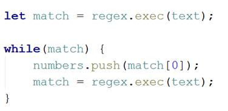

<html>

<head>
<meta http-equiv=Content-Type content="text/html; charset=windows-1251">
<meta name=Generator content="Microsoft Word 14 (filtered)">

</head>

<body lang=EN-US link=blue vlink=purple>

<h1>Exercises: Strings and Regular Expressions</h1>

Problems for exercises and homework for the <a
href="https://softuni.bg/courses/javascript-fundamentals">“JavaScript
Fundamentals” course @ SoftUni</a>. Submit your solutions in the SoftUni judge
system at <a href="https://judge.softuni.bg/Contests/314/">https://judge.softuni.bg/Contests/314/</a>.

In this exercise you are supposed to <b>write program logic</b>
using the basic operations between Strings and the built-in String functions,
as well as regular expressions, in JavaScript. You will practice working with <b>strings</b>,
<b>regular expressions</b> and using <b>built-in</b> <b>functions</b> (concat(), trim(), split()…). In some of the exercises you
might need to combine both in order to find the best solution.

<h1>Text Processing and String Manipulation</h1>

<h2>1.&nbsp;&nbsp; Split a String
with a Delimiter</h2>

Write a JS function that <b>splits</b> a <b>string</b> with a
given <b>delimiter</b>.

The <b>input</b> comes as 2 string arguments. The<b> first
one is the string</b> you need to split and the <b>second</b> <b>one is the
delimiter</b>.

The <b>output</b> should consist of all elements you’ve
received, after you’ve <b>split</b> <b>the given string</b> by <b>the given
delimiter</b>. Each element should be printed on a new line.

<h3>Examples</h3>

<table class=MsoTableGrid border=1 cellspacing=0 cellpadding=0 width=688
 style='width:516.1pt;margin-left:1.15pt;border-collapse:collapse;border:none'>
 <tr>
  <td width=208 valign=top style='width:156.1pt;border:solid windowtext 1.0pt;
  background:#D9D9D9;padding:2.85pt 4.25pt 2.85pt 4.25pt'>
  
<b>Input</b>

  </td>
  <td width=61 valign=top style='width:45.45pt;border:solid windowtext 1.0pt;
  border-left:none;background:#D9D9D9;padding:2.85pt 4.25pt 2.85pt 4.25pt'>
  
<b>Output</b>

  </td>
  <td width=17 valign=top style='width:13.05pt;border:none;border-right:solid windowtext 1.0pt;
  padding:2.85pt 4.25pt 2.85pt 4.25pt'>
  
<b>&nbsp;</b>

  </td>
  <td width=222 valign=top style='width:166.5pt;border:solid windowtext 1.0pt;
  border-left:none;background:#D9D9D9;padding:2.85pt 4.25pt 2.85pt 4.25pt'>
  
<b>Input</b>

  </td>
  <td width=180 valign=top style='width:135.0pt;border:solid windowtext 1.0pt;
  border-left:none;background:#D9D9D9;padding:2.85pt 4.25pt 2.85pt 4.25pt'>
  
<b>Output</b>

  </td>
 </tr>
 <tr>
  <td width=208 valign=top style='width:156.1pt;border:solid windowtext 1.0pt;
  border-top:none;padding:2.85pt 4.25pt 2.85pt 4.25pt'>
  
One-Two-Three-Four-Five 

  
-

  </td>
  <td width=61 style='width:45.45pt;border-top:none;border-left:none;
  border-bottom:solid windowtext 1.0pt;border-right:solid windowtext 1.0pt;
  padding:2.85pt 4.25pt 2.85pt 4.25pt'>
  
One

  
Two

  
Three

  
Four

  
Five

  
&nbsp;

  </td>
  <td width=17 valign=top style='width:13.05pt;border:none;border-right:solid windowtext 1.0pt;
  padding:2.85pt 4.25pt 2.85pt 4.25pt'>
  
&nbsp;

  </td>
  <td width=222 valign=top style='width:166.5pt;border-top:none;border-left:
  none;border-bottom:solid windowtext 1.0pt;border-right:solid windowtext 1.0pt;
  padding:2.85pt 4.25pt 2.85pt 4.25pt'>
  
http://platform.softuni.bg

  
.

  
&nbsp;

  </td>
  <td width=180 valign=top style='width:135.0pt;border-top:none;border-left:
  none;border-bottom:solid windowtext 1.0pt;border-right:solid windowtext 1.0pt;
  padding:2.85pt 4.25pt 2.85pt 4.25pt'>
  
http://platform

  
softuni

  
bg

  </td>
 </tr>
</table>

<h3>Hints</h3>

·&nbsp;&nbsp;&nbsp;&nbsp;&nbsp;&nbsp;&nbsp;&nbsp;
This “main” function will hold all of
the code of our solution. 
 

·&nbsp;&nbsp;&nbsp;&nbsp;&nbsp;&nbsp;&nbsp;&nbsp;
 Now that we have the string and the delimiter, we can split the
string and save the split elements we received as result to the action we did. 

·&nbsp;&nbsp;&nbsp;&nbsp;&nbsp;&nbsp;&nbsp;&nbsp;
The split() function returns an array
of elements, which we can iterate over. The last thing we need to do is print
each of the elements on a new line. 
 

<h2>2.&nbsp;&nbsp;  Repeat a
String N Times</h2>

Write a JS function that repeats a given string, N times.

The <b>input</b> comes as 2 arguments. The <b>first argument
is a string that</b> will represent <b>the one you need to repeat</b>. The
second one is a number will represent <b>the times you need to repeat it</b>.

The <b>output</b> is a big string, containing the <b>given
one</b>, <b>repeated N times</b>.

<h3>Examples</h3>

<table class=MsoTableGrid border=1 cellspacing=0 cellpadding=0 width=448
 style='width:336.1pt;margin-left:1.15pt;border-collapse:collapse;border:none'>
 <tr>
  <td width=118 valign=top style='width:88.6pt;border:solid windowtext 1.0pt;
  background:#D9D9D9;padding:2.85pt 4.25pt 2.85pt 4.25pt'>
  
<b>Input</b>

  </td>
  <td width=330 valign=top style='width:247.5pt;border:solid windowtext 1.0pt;
  border-left:none;background:#D9D9D9;padding:2.85pt 4.25pt 2.85pt 4.25pt'>
  
<b>Output</b>

  </td>
 </tr>
 <tr>
  <td width=118 valign=top style='width:88.6pt;border:solid windowtext 1.0pt;
  border-top:none;padding:2.85pt 4.25pt 2.85pt 4.25pt'>
  
repeat

  
5

  </td>
  <td width=330 style='width:247.5pt;border-top:none;border-left:none;
  border-bottom:solid windowtext 1.0pt;border-right:solid windowtext 1.0pt;
  padding:2.85pt 4.25pt 2.85pt 4.25pt'>
  
repeatrepeatrepeatrepeatrepeat

  </td>
 </tr>
 <tr>
  <td width=448 colspan=2 valign=top style='width:336.1pt;border:none;
  border-bottom:solid windowtext 1.0pt;padding:2.85pt 4.25pt 2.85pt 4.25pt'>
  
&nbsp;

  </td>
 </tr>
 <tr>
  <td width=118 valign=top style='width:88.6pt;border:solid windowtext 1.0pt;
  border-top:none;background:#D9D9D9;padding:2.85pt 4.25pt 2.85pt 4.25pt'>
  
<strong>Input</strong>

  </td>
  <td width=330 style='width:247.5pt;border-top:none;border-left:none;
  border-bottom:solid windowtext 1.0pt;border-right:solid windowtext 1.0pt;
  background:#D9D9D9;padding:2.85pt 4.25pt 2.85pt 4.25pt'>
  
<strong>Output</strong>

  </td>
 </tr>
 <tr>
  <td width=118 valign=top style='width:88.6pt;border:solid windowtext 1.0pt;
  border-top:none;padding:2.85pt 4.25pt 2.85pt 4.25pt'>
  
magic is real

  
3

  </td>
  <td width=330 style='width:247.5pt;border-top:none;border-left:none;
  border-bottom:solid windowtext 1.0pt;border-right:solid windowtext 1.0pt;
  padding:2.85pt 4.25pt 2.85pt 4.25pt'>
  
magic is realmagic is realmagic is real

  </td>
 </tr>
</table>

<h3>Hints</h3>

·&nbsp;&nbsp;&nbsp;&nbsp;&nbsp;&nbsp;&nbsp;&nbsp;
You can easily use <b>string concatenation</b> to solve this
problem.

·&nbsp;&nbsp;&nbsp;&nbsp;&nbsp;&nbsp;&nbsp;&nbsp;
You could, however, see if there is a <b>built-in function</b>
that does the same thing. 

<h2>3.&nbsp;&nbsp; Check if
String starts with a given Substring.</h2>

Write a JS function that checks if a <b>given string</b>, <b>starts
with a given substring</b>.

The <b>input</b> comes as 2 string arguments. The <b>first
string</b> will represent <b>the main one</b>. The second one will represent <b>the
substring</b>.

The <b>output</b> is either “true”
or “false” based on the result of the check. 
The comparison is <b>case-sensitive</b>!

<h3>Examples</h3>

<table class=MsoTableGrid border=1 cellspacing=0 cellpadding=0 width=678
 style='width:508.5pt;margin-left:-.25pt;border-collapse:collapse;border:none'>
 <tr>
  <td width=264 colspan=2 valign=top style='width:2.75in;border:solid windowtext 1.0pt;
  background:#D9D9D9;padding:2.85pt 4.25pt 2.85pt 4.25pt'>
  
<b>Input</b>

  </td>
  <td width=60 valign=top style='width:45.0pt;border:solid windowtext 1.0pt;
  border-left:none;background:#D9D9D9;padding:2.85pt 4.25pt 2.85pt 4.25pt'>
  
<b>Output</b>

  </td>
  <td width=24 valign=top style='width:.25in;border:none;border-right:solid windowtext 1.0pt;
  padding:2.85pt 4.25pt 2.85pt 4.25pt'>
  
<b>&nbsp;</b>

  </td>
  <td width=270 colspan=2 valign=top style='width:202.5pt;border:solid windowtext 1.0pt;
  border-left:none;background:#D9D9D9;padding:2.85pt 4.25pt 2.85pt 4.25pt'>
  
<b>Input</b>

  </td>
  <td width=60 valign=top style='width:45.0pt;border:solid windowtext 1.0pt;
  border-left:none;background:#D9D9D9;padding:2.85pt 4.25pt 2.85pt 4.25pt'>
  
<b>Output</b>

  </td>
 </tr>
 <tr>
  <td width=264 colspan=2 valign=top style='width:2.75in;border:solid windowtext 1.0pt;
  border-top:none;padding:2.85pt 4.25pt 2.85pt 4.25pt'>
  
How have you been?

  
how

  </td>
  <td width=60 style='width:45.0pt;border-top:none;border-left:none;border-bottom:
  solid windowtext 1.0pt;border-right:solid windowtext 1.0pt;padding:2.85pt 4.25pt 2.85pt 4.25pt'>
  
false

  </td>
  <td width=24 valign=top style='width:.25in;border:none;border-right:solid windowtext 1.0pt;
  padding:2.85pt 4.25pt 2.85pt 4.25pt'>
  
&nbsp;

  </td>
  <td width=270 colspan=2 valign=top style='width:202.5pt;border-top:none;
  border-left:none;border-bottom:solid windowtext 1.0pt;border-right:solid windowtext 1.0pt;
  padding:2.85pt 4.25pt 2.85pt 4.25pt'>
  
The quick brown fox…

  
The quick brown fox…

  </td>
  <td width=60 valign=top style='width:45.0pt;border-top:none;border-left:none;
  border-bottom:solid windowtext 1.0pt;border-right:solid windowtext 1.0pt;
  padding:2.85pt 4.25pt 2.85pt 4.25pt'>
  
true

  </td>
 </tr>
 <tr style='height:13.3pt'>
  <td width=264 colspan=2 valign=top style='width:2.75in;border:none;
  padding:2.85pt 4.25pt 2.85pt 4.25pt;height:13.3pt'>
  
&nbsp;

  </td>
  <td width=60 style='width:45.0pt;border:none;padding:2.85pt 4.25pt 2.85pt 4.25pt;
  height:13.3pt'>
  
&nbsp;

  </td>
  <td width=24 valign=top style='width:.25in;border:none;padding:2.85pt 4.25pt 2.85pt 4.25pt;
  height:13.3pt'>
  
&nbsp;

  </td>
  <td width=270 colspan=2 valign=top style='width:202.5pt;border:none;
  padding:2.85pt 4.25pt 2.85pt 4.25pt;height:13.3pt'>
  
&nbsp;

  </td>
  <td width=60 valign=top style='width:45.0pt;border:none;padding:2.85pt 4.25pt 2.85pt 4.25pt;
  height:13.3pt'>
  
&nbsp;

  </td>
 </tr>
 <tr>
  <td style='border:none;padding:0in 0in 0in 0in' width=108>
&nbsp;</td>
  <td width=432 colspan=4 valign=top style='width:4.5in;border:solid windowtext 1.0pt;
  background:#D9D9D9;padding:2.85pt 4.25pt 2.85pt 4.25pt'>
  
<strong>Input</strong>

  </td>
  <td width=78 style='width:58.5pt;border:solid windowtext 1.0pt;border-left:
  none;background:#D9D9D9;padding:2.85pt 4.25pt 2.85pt 4.25pt'>
  
<strong>Output</strong>

  </td>
  <td style='border:none;padding:0in 0in 0in 0in' width=60>
&nbsp;</td>
 </tr>
 <tr>
  <td style='border:none;padding:0in 0in 0in 0in' width=108>
&nbsp;</td>
  <td width=432 colspan=4 valign=top style='width:4.5in;border:solid windowtext 1.0pt;
  border-top:none;padding:2.85pt 4.25pt 2.85pt 4.25pt'>
  
Marketing Fundamentals, starting 19/10/2016

  
Marketing Fundamentals, sta

  </td>
  <td width=78 style='width:58.5pt;border-top:none;border-left:none;border-bottom:
  solid windowtext 1.0pt;border-right:solid windowtext 1.0pt;padding:2.85pt 4.25pt 2.85pt 4.25pt'>
  
true

  </td>
  <td style='border:none;padding:0in 0in 0in 0in' width=60>
&nbsp;</td>
 </tr>
 <tr height=0>
  <td width=108 style='border:none'></td>
  <td width=156 style='border:none'></td>
  <td width=60 style='border:none'></td>
  <td width=24 style='border:none'></td>
  <td width=192 style='border:none'></td>
  <td width=78 style='border:none'></td>
  <td width=60 style='border:none'></td>
 </tr>
</table>

<h2>4.&nbsp;&nbsp; Check if
String ends with given Substring.</h2>

Write a JS function that checks if a <b>given string</b>, <b>ends
with a given substring</b>.

The <b>input</b> comes as 2 string arguments. The <b>first
string</b> will represent <b>the main one</b>. The second one will represent <b>the
substring</b>.

The <b>output</b> is either “true”
or “false” based on the result of the check. 
The comparison is <b>case-sensitive</b>!

<h3>Examples</h3>

<table class=MsoTableGrid border=1 cellspacing=0 cellpadding=0 width=678
 style='width:508.5pt;margin-left:-.25pt;border-collapse:collapse;border:none'>
 <tr>
  <td width=264 colspan=2 valign=top style='width:2.75in;border:solid windowtext 1.0pt;
  background:#D9D9D9;padding:2.85pt 4.25pt 2.85pt 4.25pt'>
  
<b>Input</b>

  </td>
  <td width=60 valign=top style='width:45.0pt;border:solid windowtext 1.0pt;
  border-left:none;background:#D9D9D9;padding:2.85pt 4.25pt 2.85pt 4.25pt'>
  
<b>Output</b>

  </td>
  <td width=24 valign=top style='width:.25in;border:none;border-right:solid windowtext 1.0pt;
  padding:2.85pt 4.25pt 2.85pt 4.25pt'>
  
<b>&nbsp;</b>

  </td>
  <td width=270 colspan=2 valign=top style='width:202.5pt;border:solid windowtext 1.0pt;
  border-left:none;background:#D9D9D9;padding:2.85pt 4.25pt 2.85pt 4.25pt'>
  
<b>Input</b>

  </td>
  <td width=60 valign=top style='width:45.0pt;border:solid windowtext 1.0pt;
  border-left:none;background:#D9D9D9;padding:2.85pt 4.25pt 2.85pt 4.25pt'>
  
<b>Output</b>

  </td>
 </tr>
 <tr>
  <td width=264 colspan=2 valign=top style='width:2.75in;border:solid windowtext 1.0pt;
  border-top:none;padding:2.85pt 4.25pt 2.85pt 4.25pt'>
  
This sentence ends with fun?

  
fun?

  </td>
  <td width=60 style='width:45.0pt;border-top:none;border-left:none;border-bottom:
  solid windowtext 1.0pt;border-right:solid windowtext 1.0pt;padding:2.85pt 4.25pt 2.85pt 4.25pt'>
  
true

  </td>
  <td width=24 valign=top style='width:.25in;border:none;border-right:solid windowtext 1.0pt;
  padding:2.85pt 4.25pt 2.85pt 4.25pt'>
  
&nbsp;

  </td>
  <td width=270 colspan=2 valign=top style='width:202.5pt;border-top:none;
  border-left:none;border-bottom:solid windowtext 1.0pt;border-right:solid windowtext 1.0pt;
  padding:2.85pt 4.25pt 2.85pt 4.25pt'>
  
This is Houston, we have…

  
We have…

  </td>
  <td width=60 valign=top style='width:45.0pt;border-top:none;border-left:none;
  border-bottom:solid windowtext 1.0pt;border-right:solid windowtext 1.0pt;
  padding:2.85pt 4.25pt 2.85pt 4.25pt'>
  
false

  </td>
 </tr>
 <tr style='height:13.3pt'>
  <td width=264 colspan=2 valign=top style='width:2.75in;border:none;
  padding:2.85pt 4.25pt 2.85pt 4.25pt;height:13.3pt'>
  
&nbsp;

  </td>
  <td width=60 style='width:45.0pt;border:none;padding:2.85pt 4.25pt 2.85pt 4.25pt;
  height:13.3pt'>
  
&nbsp;

  </td>
  <td width=24 valign=top style='width:.25in;border:none;padding:2.85pt 4.25pt 2.85pt 4.25pt;
  height:13.3pt'>
  
&nbsp;

  </td>
  <td width=270 colspan=2 valign=top style='width:202.5pt;border:none;
  padding:2.85pt 4.25pt 2.85pt 4.25pt;height:13.3pt'>
  
&nbsp;

  </td>
  <td width=60 valign=top style='width:45.0pt;border:none;padding:2.85pt 4.25pt 2.85pt 4.25pt;
  height:13.3pt'>
  
&nbsp;

  </td>
 </tr>
 <tr>
  <td style='border:none;padding:0in 0in 0in 0in' width=108>
&nbsp;</td>
  <td width=432 colspan=4 valign=top style='width:4.5in;border:solid windowtext 1.0pt;
  background:#D9D9D9;padding:2.85pt 4.25pt 2.85pt 4.25pt'>
  
<strong>Input</strong>

  </td>
  <td width=78 style='width:58.5pt;border:solid windowtext 1.0pt;border-left:
  none;background:#D9D9D9;padding:2.85pt 4.25pt 2.85pt 4.25pt'>
  
<strong>Output</strong>

  </td>
  <td style='border:none;padding:0in 0in 0in 0in' width=60>
&nbsp;</td>
 </tr>
 <tr>
  <td style='border:none;padding:0in 0in 0in 0in' width=108>
&nbsp;</td>
  <td width=432 colspan=4 valign=top style='width:4.5in;border:solid windowtext 1.0pt;
  border-top:none;padding:2.85pt 4.25pt 2.85pt 4.25pt'>
  
The new iPhone has no headphones jack.

  
o headphones jack.

  </td>
  <td width=78 style='width:58.5pt;border-top:none;border-left:none;border-bottom:
  solid windowtext 1.0pt;border-right:solid windowtext 1.0pt;padding:2.85pt 4.25pt 2.85pt 4.25pt'>
  
true

  </td>
  <td style='border:none;padding:0in 0in 0in 0in' width=60>
&nbsp;</td>
 </tr>
 <tr height=0>
  <td width=108 style='border:none'></td>
  <td width=156 style='border:none'></td>
  <td width=60 style='border:none'></td>
  <td width=24 style='border:none'></td>
  <td width=192 style='border:none'></td>
  <td width=78 style='border:none'></td>
  <td width=60 style='border:none'></td>
 </tr>
</table>

<h2>5.&nbsp;&nbsp; *Capitalize
the Words</h2>

Write a JS function that capitalizes the given words. You
need to make <b>every word</b>’s <b>first letter</b> – <b>uppercase</b> and <b>all</b>
<b>other letters</b> – <b>lowercase</b>. 

The <b>input</b> comes as a <b>single string</b>, containing
words, separated by a space.

The <b>output</b> is the same string, however with all of
its words capitalized.

Note: The words can contain <b>any ASCII character</b>. You
need to <b>affect only the letters</b>.

<h3>Examples</h3>

<table class=MsoTableGrid border=1 cellspacing=0 cellpadding=0 width=624
 style='width:6.5in;margin-left:4.25pt;border-collapse:collapse;border:none'>
 <tr>
  <td width=312 valign=top style='width:3.25in;border:solid windowtext 1.0pt;
  background:#D9D9D9;padding:2.85pt 4.25pt 2.85pt 4.25pt'>
  
<b>Input</b>

  </td>
  <td width=312 valign=top style='width:3.25in;border:solid windowtext 1.0pt;
  border-left:none;background:#D9D9D9;padding:2.85pt 4.25pt 2.85pt 4.25pt'>
  
<b>Output</b>

  </td>
 </tr>
 <tr>
  <td width=312 valign=top style='width:3.25in;border:solid windowtext 1.0pt;
  border-top:none;padding:2.85pt 4.25pt 2.85pt 4.25pt'>
  
Capitalize these words

  </td>
  <td width=312 style='width:3.25in;border-top:none;border-left:none;
  border-bottom:solid windowtext 1.0pt;border-right:solid windowtext 1.0pt;
  padding:2.85pt 4.25pt 2.85pt 4.25pt'>
  
Capitalize These Words

  </td>
 </tr>
 <tr style='height:13.3pt'>
  <td width=312 valign=top style='width:3.25in;border:none;padding:2.85pt 4.25pt 2.85pt 4.25pt;
  height:13.3pt'>
  
&nbsp;

  </td>
  <td width=312 style='width:3.25in;border:none;padding:2.85pt 4.25pt 2.85pt 4.25pt;
  height:13.3pt'>
  
&nbsp;

  </td>
 </tr>
 <tr>
  <td width=312 valign=top style='width:3.25in;border:solid windowtext 1.0pt;
  background:#D9D9D9;padding:2.85pt 4.25pt 2.85pt 4.25pt'>
  
<strong>Input</strong>

  </td>
  <td width=312 style='width:3.25in;border:solid windowtext 1.0pt;border-left:
  none;background:#D9D9D9;padding:2.85pt 4.25pt 2.85pt 4.25pt'>
  
<strong>Output</strong>

  </td>
 </tr>
 <tr>
  <td width=312 valign=top style='width:3.25in;border:solid windowtext 1.0pt;
  border-top:none;padding:2.85pt 4.25pt 2.85pt 4.25pt'>
  
Was that Easy? tRY thIs onE for SiZe!

  </td>
  <td width=312 style='width:3.25in;border-top:none;border-left:none;
  border-bottom:solid windowtext 1.0pt;border-right:solid windowtext 1.0pt;
  padding:2.85pt 4.25pt 2.85pt 4.25pt'>
  
Was That Easy? Try This One For Size!

  </td>
 </tr>
</table>

<h1>&nbsp;</h1>

<h1>Working with Regular Expressions</h1>

For the following tasks, it will be most appropriate, if you
use regular expressions in your solutions.

<h2>6.&nbsp;&nbsp; Capture the
Numbers</h2>

Write a JS function that <b>finds all numbers</b> in a
sequence of strings.

The <b>input</b> comes as array of strings. Each element represents
one of the strings.

The <b>output</b> is all the numbers, <b>extracted</b> and <b>printed
on a single line</b> – each separated by a <b>single space</b>.

<h3>Examples</h3>

<table class=MsoTableGrid border=1 cellspacing=0 cellpadding=0 width=624
 style='width:6.5in;margin-left:4.25pt;border-collapse:collapse;border:none'>
 <tr>
  <td width=234 valign=top style='width:175.5pt;border:solid windowtext 1.0pt;
  background:#D9D9D9;padding:2.85pt 4.25pt 2.85pt 4.25pt'>
  
<b>Input</b>

  </td>
  <td width=390 valign=top style='width:292.5pt;border:solid windowtext 1.0pt;
  border-left:none;background:#D9D9D9;padding:2.85pt 4.25pt 2.85pt 4.25pt'>
  
<b>Output</b>

  </td>
 </tr>
 <tr>
  <td width=234 valign=top style='width:175.5pt;border:solid windowtext 1.0pt;
  border-top:none;padding:2.85pt 4.25pt 2.85pt 4.25pt'>
  
The300

  
What is that?

  
I think it’s the 3rd movie.

  
Lets watch it at 22:45

  </td>
  <td width=390 valign=top style='width:292.5pt;border-top:none;border-left:
  none;border-bottom:solid windowtext 1.0pt;border-right:solid windowtext 1.0pt;
  padding:2.85pt 4.25pt 2.85pt 4.25pt'>
  
300 3 22 45

  </td>
 </tr>
 <tr style='height:13.3pt'>
  <td width=234 valign=top style='width:175.5pt;border:none;padding:2.85pt 4.25pt 2.85pt 4.25pt;
  height:13.3pt'>
  
&nbsp;

  </td>
  <td width=390 style='width:292.5pt;border:none;padding:2.85pt 4.25pt 2.85pt 4.25pt;
  height:13.3pt'>
  
&nbsp;

  </td>
 </tr>
 <tr>
  <td width=234 valign=top style='width:175.5pt;border:solid windowtext 1.0pt;
  background:#D9D9D9;padding:2.85pt 4.25pt 2.85pt 4.25pt'>
  
<strong>Input</strong>

  </td>
  <td width=390 style='width:292.5pt;border:solid windowtext 1.0pt;border-left:
  none;background:#D9D9D9;padding:2.85pt 4.25pt 2.85pt 4.25pt'>
  
<strong>Output</strong>

  </td>
 </tr>
 <tr>
  <td width=234 valign=top style='width:175.5pt;border:solid windowtext 1.0pt;
  border-top:none;padding:2.85pt 4.25pt 2.85pt 4.25pt'>
  
123a456

  
789b987

  
654c321

  
0

  </td>
  <td width=390 valign=top style='width:292.5pt;border-top:none;border-left:
  none;border-bottom:solid windowtext 1.0pt;border-right:solid windowtext 1.0pt;
  padding:2.85pt 4.25pt 2.85pt 4.25pt'>
  
123 456 789 987 654 321 0

  </td>
 </tr>
 <tr>
  <td width=234 valign=top style='width:175.5pt;border:solid windowtext 1.0pt;
  border-top:none;background:#D9D9D9;padding:2.85pt 4.25pt 2.85pt 4.25pt'>
  
<strong>Input</strong>

  </td>
  <td width=390 style='width:292.5pt;border-top:none;border-left:none;
  border-bottom:solid windowtext 1.0pt;border-right:solid windowtext 1.0pt;
  background:#D9D9D9;padding:2.85pt 4.25pt 2.85pt 4.25pt'>
  
<strong>Output</strong>

  </td>
 </tr>
 <tr>
  <td width=234 valign=top style='width:175.5pt;border:solid windowtext 1.0pt;
  border-top:none;padding:2.85pt 4.25pt 2.85pt 4.25pt'>
  
Let’s go11!!!11!

  
Okey!1!

  </td>
  <td width=390 valign=top style='width:292.5pt;border-top:none;border-left:
  none;border-bottom:solid windowtext 1.0pt;border-right:solid windowtext 1.0pt;
  padding:2.85pt 4.25pt 2.85pt 4.25pt'>
  
11 11 1

  </td>
 </tr>
</table>

<h3>Hints</h3>

We can solve this problem in multiple ways; first let’s see
the more complex way in order to understand how the regex actually works:

·&nbsp;&nbsp;&nbsp;&nbsp;&nbsp;&nbsp;&nbsp;&nbsp;
We receive several sentences in the form of an array of strings.
Let’s create a variable named text, and gather all the sentences into one big
string. Also, we need to initialize our regex pattern, and an array that will
hold the numbers we found.

·&nbsp;&nbsp;&nbsp;&nbsp;&nbsp;&nbsp;&nbsp;&nbsp;
We create the needed things. The regex is “\d+”
which will catch <b>one or more consecutive digits</b>. We also give it a
global modifier, “g”, which will prevent the regex
from returning on the first match.

·&nbsp;&nbsp;&nbsp;&nbsp;&nbsp;&nbsp;&nbsp;&nbsp;
We can now proceed with combining all the strings into one big
string.

·&nbsp;&nbsp;&nbsp;&nbsp;&nbsp;&nbsp;&nbsp;&nbsp;
Now that we have that, we can proceed to the main thing. The
matching.

·&nbsp;&nbsp;&nbsp;&nbsp;&nbsp;&nbsp;&nbsp;&nbsp;
First we create a match variable
which will hold our matches. The regex <b>anchors itself</b> every time, to the
index of the match it has found, thus to iterate all matches we need a while loop. Every time we <b>match something</b>, we <b>push
it</b> to the array of numbers… The match variable represents an <b>array of
all groups it has found</b>, so we just take the first element, which
represents the <b>whole match</b>. Then we match again, to <b>move the anchor</b>.

·&nbsp;&nbsp;&nbsp;&nbsp;&nbsp;&nbsp;&nbsp;&nbsp;
Last but not least, we print the result:

Now that we understand how the matching works underneath, we
can actually write a simpler solution. Having learned the Array built-in
functions we know we can group the input into one string using the <b>Array.join()</b>
function:

The regex we’ll use will be the same:

 In case we don’t need capturing subgroups, as it is in this
problem, we can just use the <b>String.match()</b> function to get all matches
from our string (the regex still has to have the global flag <b>“g”</b>).

Thus we managed to write the program in just a few lines:

<h2>7.&nbsp;&nbsp; Find Variable
Names in Sentences</h2>

Write a JS function that finds all <b>variable names</b> in a
given string. A variable name starts with an <b>underscore</b> (“_”) and contains<b> only Capital and Non-Capital English
Alphabet letters and digits</b>. Extract only their names, <b>without the underscore.
</b>Try to do this <b>only with regular expressions</b>.

The <b>input</b> comes as single string, on which you have
to perform the matching.

The <b>output</b> consists of all variable names, <b>extracted</b>
and <b>printed on a single line</b>, each <b>separated </b>by a <b>comma</b>.

<table class=MsoTableGrid border=1 cellspacing=0 cellpadding=0 width=678
 style='width:508.5pt;margin-left:-.25pt;border-collapse:collapse;border:none'>
 <tr>
  <td width=480 valign=top style='width:5.0in;border:solid windowtext 1.0pt;
  background:#D9D9D9;padding:2.85pt 4.25pt 2.85pt 4.25pt'>
  
<b>Input</b>

  </td>
  <td width=198 valign=top style='width:148.5pt;border:solid windowtext 1.0pt;
  border-left:none;background:#D9D9D9;padding:2.85pt 4.25pt 2.85pt 4.25pt'>
  
<b>Output</b>

  </td>
 </tr>
 <tr>
  <td width=480 valign=top style='width:5.0in;border:solid windowtext 1.0pt;
  border-top:none;padding:2.85pt 4.25pt 2.85pt 4.25pt'>
  
The _id and _age variables are both integers.

  </td>
  <td width=198 style='width:148.5pt;border-top:none;border-left:none;
  border-bottom:solid windowtext 1.0pt;border-right:solid windowtext 1.0pt;
  padding:2.85pt 4.25pt 2.85pt 4.25pt'>
  
id,age

  </td>
 </tr>
 <tr style='height:13.3pt'>
  <td width=480 valign=top style='width:5.0in;border:none;padding:2.85pt 4.25pt 2.85pt 4.25pt;
  height:13.3pt'>
  
&nbsp;

  </td>
  <td width=198 style='width:148.5pt;border:none;padding:2.85pt 4.25pt 2.85pt 4.25pt;
  height:13.3pt'>
  
&nbsp;

  </td>
 </tr>
 <tr>
  <td width=480 valign=top style='width:5.0in;border:solid windowtext 1.0pt;
  background:#D9D9D9;padding:2.85pt 4.25pt 2.85pt 4.25pt'>
  
<strong>Input</strong>

  </td>
  <td width=198 style='width:148.5pt;border:solid windowtext 1.0pt;border-left:
  none;background:#D9D9D9;padding:2.85pt 4.25pt 2.85pt 4.25pt'>
  
<strong>Output</strong>

  </td>
 </tr>
 <tr>
  <td width=480 valign=top style='width:5.0in;border:solid windowtext 1.0pt;
  border-top:none;padding:2.85pt 4.25pt 2.85pt 4.25pt'>
  
Calculate the _area of the _perfectRectangle
  object.

  </td>
  <td width=198 style='width:148.5pt;border-top:none;border-left:none;
  border-bottom:solid windowtext 1.0pt;border-right:solid windowtext 1.0pt;
  padding:2.85pt 4.25pt 2.85pt 4.25pt'>
  
area,perfectRectangle

  </td>
 </tr>
 <tr>
  <td width=480 valign=top style='width:5.0in;border:solid windowtext 1.0pt;
  border-top:none;background:#D9D9D9;padding:2.85pt 4.25pt 2.85pt 4.25pt'>
  
<strong>Input</strong>

  </td>
  <td width=198 style='width:148.5pt;border-top:none;border-left:none;
  border-bottom:solid windowtext 1.0pt;border-right:solid windowtext 1.0pt;
  background:#D9D9D9;padding:2.85pt 4.25pt 2.85pt 4.25pt'>
  
<strong>Output</strong>

  </td>
 </tr>
 <tr>
  <td width=480 valign=top style='width:5.0in;border:solid windowtext 1.0pt;
  border-top:none;padding:2.85pt 4.25pt 2.85pt 4.25pt'>
  
__invalidVariable _evenMoreInvalidVariable_
  _validVariable

  </td>
  <td width=198 style='width:148.5pt;border-top:none;border-left:none;
  border-bottom:solid windowtext 1.0pt;border-right:solid windowtext 1.0pt;
  padding:2.85pt 4.25pt 2.85pt 4.25pt'>
  
validVariable

  </td>
 </tr>
</table>

<h3>Hints</h3>

·&nbsp;&nbsp;&nbsp;&nbsp;&nbsp;&nbsp;&nbsp;&nbsp;
Think how to ensure that your match is a separate word (not part
of a bigger word that may be invalid).

·&nbsp;&nbsp;&nbsp;&nbsp;&nbsp;&nbsp;&nbsp;&nbsp;
Think of a way to ensure your regex matches only the variable and
not parts before/after it. Check the <a
href="https://developer.mozilla.org/en-US/docs/Web/JavaScript/Guide/Regular_Expressions">special
characters</a> online to see if one of them fits your needs.

<h2>8.&nbsp;&nbsp; Find
Occurrences of Word in Sentence</h2>

Write a JS function that finds, <b>how many times</b> a <b>given
word</b>, is <b>used</b> in a <b>given sentence. </b>Note that letter case does
not matter – it is <b>case-insensitive</b>. 

The <b>input</b> comes as 2 string arguments. The <b>first
one</b> will be the <b>sentence</b>, and the <b>second one</b> – the <b>word</b>.

The <b>output</b> is a single number indicating the <b>amount
of times</b> the sentence contains the word.

<h3>Examples</h3>

<table class=MsoTableGrid border=1 cellspacing=0 cellpadding=0 width=672
 style='width:7.0in;margin-left:4.25pt;border-collapse:collapse;border:none'>
 <tr>
  <td width=612 valign=top style='width:459.0pt;border:solid windowtext 1.0pt;
  background:#D9D9D9;padding:2.85pt 4.25pt 2.85pt 4.25pt'>
  
<b>Input</b>

  </td>
  <td width=60 valign=top style='width:45.0pt;border:solid windowtext 1.0pt;
  border-left:none;background:#D9D9D9;padding:2.85pt 4.25pt 2.85pt 4.25pt'>
  
<b>Output</b>

  </td>
 </tr>
 <tr>
  <td width=612 valign=top style='width:459.0pt;border:solid windowtext 1.0pt;
  border-top:none;padding:2.85pt 4.25pt 2.85pt 4.25pt'>
  
The waterfall was so high, that the child
  couldn’t see its peak.

  
the

  </td>
  <td width=60 style='width:45.0pt;border-top:none;border-left:none;border-bottom:
  solid windowtext 1.0pt;border-right:solid windowtext 1.0pt;padding:2.85pt 4.25pt 2.85pt 4.25pt'>
  
2

  </td>
 </tr>
 <tr style='height:13.3pt'>
  <td width=612 valign=top style='width:459.0pt;border:none;padding:2.85pt 4.25pt 2.85pt 4.25pt;
  height:13.3pt'>
  
&nbsp;

  </td>
  <td width=60 style='width:45.0pt;border:none;padding:2.85pt 4.25pt 2.85pt 4.25pt;
  height:13.3pt'>
  
&nbsp;

  </td>
 </tr>
 <tr>
  <td width=612 valign=top style='width:459.0pt;border:solid windowtext 1.0pt;
  background:#D9D9D9;padding:2.85pt 4.25pt 2.85pt 4.25pt'>
  
<strong>Input</strong>

  </td>
  <td width=60 style='width:45.0pt;border:solid windowtext 1.0pt;border-left:
  none;background:#D9D9D9;padding:2.85pt 4.25pt 2.85pt 4.25pt'>
  
<strong>Output</strong>

  </td>
 </tr>
 <tr>
  <td width=612 valign=top style='width:459.0pt;border:solid windowtext 1.0pt;
  border-top:none;padding:2.85pt 4.25pt 2.85pt 4.25pt'>
  
How do you plan on achieving that? How? How can
  you even think of that?

  
how

  </td>
  <td width=60 style='width:45.0pt;border-top:none;border-left:none;border-bottom:
  solid windowtext 1.0pt;border-right:solid windowtext 1.0pt;padding:2.85pt 4.25pt 2.85pt 4.25pt'>
  
3

  </td>
 </tr>
 <tr>
  <td width=612 valign=top style='width:459.0pt;border:solid windowtext 1.0pt;
  border-top:none;background:#D9D9D9;padding:2.85pt 4.25pt 2.85pt 4.25pt'>
  
<strong>Input</strong>

  </td>
  <td width=60 style='width:45.0pt;border-top:none;border-left:none;border-bottom:
  solid windowtext 1.0pt;border-right:solid windowtext 1.0pt;background:#D9D9D9;
  padding:2.85pt 4.25pt 2.85pt 4.25pt'>
  
<strong>Output</strong>

  </td>
 </tr>
 <tr>
  <td width=612 valign=top style='width:459.0pt;border:solid windowtext 1.0pt;
  border-top:none;padding:2.85pt 4.25pt 2.85pt 4.25pt'>
  
There was one. Therefore I bought it. I wouldn’t
  buy it otherwise.

  
there

  </td>
  <td width=60 style='width:45.0pt;border-top:none;border-left:none;border-bottom:
  solid windowtext 1.0pt;border-right:solid windowtext 1.0pt;padding:2.85pt 4.25pt 2.85pt 4.25pt'>
  
1

  </td>
 </tr>
</table>

<h3>Hints</h3>

·&nbsp;&nbsp;&nbsp;&nbsp;&nbsp;&nbsp;&nbsp;&nbsp;
Remember how we always used the global modifier <b>“g”</b>. There
is also a modifier for case-insensitive matching. It might help you since the
case does <b>NOT</b> matter in this problem.

·&nbsp;&nbsp;&nbsp;&nbsp;&nbsp;&nbsp;&nbsp;&nbsp;
Think how to create a regex that includes a string that will be
known only at runtime. It is important to note that there is a Regex
constructor that accepts a string representing the regex pattern.

<h2>9.&nbsp;&nbsp; *Extract
the Links</h2>

Write a JS function that <b>extracts links</b> from a <b>given
text</b>. The text will come in the form of strings, each representing a
sentence. You need to extract <b>only the valid links</b> from it. Example:

 
“www.internet.com”

&nbsp;

                         <b>Sub-Domain      </b>                                                   <b>Domain</b>
<b>name</b>                                                            <b>Domain
extension</b>

&nbsp;

The <b>Sub-Domain</b> must always be “www”.
The <b>Domain name </b>can consist of English alphabet letters (<b>uppercase</b>
and <b>lowercase</b>), digits and dashes (“–“). The
<b>Domain extension </b>consists of one or more <b>domain blocks</b>, a <b>domain
block</b> consists of a <b>dot</b> followed by <b>one or more lowercase </b>English
alphabet <b>letters</b>, a <b>Domain extension</b> must have at least <b>one</b>
<b>domain block</b> in order to be <b>valid</b>. The Sub-Domain and Domain name
must be separated by a single <b>dot</b>. Any link that <b>does NOT follow</b>
the specified above rules should be treated as <b>invalid</b>.

<b>Example incorrect links:</b>  

·&nbsp;&nbsp;&nbsp;&nbsp;&nbsp;&nbsp;&nbsp;&nbsp;
&quot;<b>ww</b>.justASite.bg&quot;

·&nbsp;&nbsp;&nbsp;&nbsp;&nbsp;&nbsp;&nbsp;&nbsp;
&quot;<b>lel</b>.awesome.com&quot;

·&nbsp;&nbsp;&nbsp;&nbsp;&nbsp;&nbsp;&nbsp;&nbsp;
&quot;www.stamat<b>_</b>gosho.hit.bg&quot;

·&nbsp;&nbsp;&nbsp;&nbsp;&nbsp;&nbsp;&nbsp;&nbsp;
&quot;www.no-symb<b>#^</b>ols-allow<b>%</b>ed.com&quot;

·&nbsp;&nbsp;&nbsp;&nbsp;&nbsp;&nbsp;&nbsp;&nbsp;
&quot;www.pesho<b>.12</b>&quot;

·&nbsp;&nbsp;&nbsp;&nbsp;&nbsp;&nbsp;&nbsp;&nbsp;
&quot;www.gosho-site<b>.</b>&quot;

·&nbsp;&nbsp;&nbsp;&nbsp;&nbsp;&nbsp;&nbsp;&nbsp;
&quot;www.example-site<b>._*^#</b>&quot;

<b>Example correct links:  </b>

·&nbsp;&nbsp;&nbsp;&nbsp;&nbsp;&nbsp;&nbsp;&nbsp;
&quot;Some textwww.softuni.bg&quot;

·&nbsp;&nbsp;&nbsp;&nbsp;&nbsp;&nbsp;&nbsp;&nbsp;
&quot;Just a link in a www.sea-of-text.bg-swimming
around&quot;

·&nbsp;&nbsp;&nbsp;&nbsp;&nbsp;&nbsp;&nbsp;&nbsp;
&quot;Instruments www.Instruments.rom.com.trombone2000
Instrument here&quot;

·&nbsp;&nbsp;&nbsp;&nbsp;&nbsp;&nbsp;&nbsp;&nbsp;
&quot;All your ice cream flavors-www.scream.for.ice.cream(We 
also have squirrels)&quot;

The <b>input</b> comes as array of strings. Each element
represents a sentence.

The <b>output</b> is all valid links you’ve found, printed –
each on a new line.

<h3>Examples</h3>

<table class=MsoTableGrid border=1 cellspacing=0 cellpadding=0 width=672
 style='width:7.0in;margin-left:4.25pt;border-collapse:collapse;border:none'>
 <tr>
  <td width=462 valign=top style='width:346.5pt;border:solid windowtext 1.0pt;
  background:#D9D9D9;padding:2.85pt 4.25pt 2.85pt 4.25pt'>
  
<b>Input</b>

  </td>
  <td width=210 valign=top style='width:157.5pt;border:solid windowtext 1.0pt;
  border-left:none;background:#D9D9D9;padding:2.85pt 4.25pt 2.85pt 4.25pt'>
  
<b>Output</b>

  </td>
 </tr>
 <tr>
  <td width=462 valign=top style='width:346.5pt;border:solid windowtext 1.0pt;
  border-top:none;padding:2.85pt 4.25pt 2.85pt 4.25pt'>
  
Join WebStars now for free, at www.web-stars.com

  
You can also support our partners:

  
Internet - www.internet.com

  
WebSpiders - www.webspiders101.com

  
Sentinel - www.sentinel.-ko 

  </td>
  <td width=210 style='width:157.5pt;border-top:none;border-left:none;
  border-bottom:solid windowtext 1.0pt;border-right:solid windowtext 1.0pt;
  padding:2.85pt 4.25pt 2.85pt 4.25pt'>
  
www.web-stars.com

  
www.internet.com

  
www.webspiders101.com

  </td>
 </tr>
 <tr style='height:13.3pt'>
  <td width=462 valign=top style='width:346.5pt;border:none;padding:2.85pt 4.25pt 2.85pt 4.25pt;
  height:13.3pt'>
  
&nbsp;

  </td>
  <td width=210 style='width:157.5pt;border:none;padding:2.85pt 4.25pt 2.85pt 4.25pt;
  height:13.3pt'>
  
&nbsp;

  </td>
 </tr>
 <tr style='height:13.3pt'>
  <td width=462 valign=top style='width:346.5pt;border:none;padding:2.85pt 4.25pt 2.85pt 4.25pt;
  height:13.3pt'>
  
&nbsp;

  
&nbsp;

  </td>
  <td width=210 style='width:157.5pt;border:none;padding:2.85pt 4.25pt 2.85pt 4.25pt;
  height:13.3pt'>
  
&nbsp;

  </td>
 </tr>
 <tr>
  <td width=462 valign=top style='width:346.5pt;border:solid windowtext 1.0pt;
  background:#D9D9D9;padding:2.85pt 4.25pt 2.85pt 4.25pt'>
  
<strong>Input</strong>

  </td>
  <td width=210 style='width:157.5pt;border:solid windowtext 1.0pt;border-left:
  none;background:#D9D9D9;padding:2.85pt 4.25pt 2.85pt 4.25pt'>
  
<strong>Output</strong>

  </td>
 </tr>
 <tr>
  <td width=462 valign=top style='width:346.5pt;border:solid windowtext 1.0pt;
  border-top:none;padding:2.85pt 4.25pt 2.85pt 4.25pt'>
  
Need information about cheap hotels in London?

  
You can check us at www.london-hotels.co.uk!

  
We provide the best services in London.

  
Here are some reviews in some blogs:

  
&quot;London Hotels are awesome!&quot; -
  www.indigo.bloggers.com

  
&quot;I am very satisfied with their
  services&quot; - ww.ivan.bg

  
&quot;Best Hotel Services!&quot; -
  www.rebel21.sedecrem.moc 

  </td>
  <td width=210 style='width:157.5pt;border-top:none;border-left:none;
  border-bottom:solid windowtext 1.0pt;border-right:solid windowtext 1.0pt;
  padding:2.85pt 4.25pt 2.85pt 4.25pt'>
  
www.london-hotels.co.uk

  
www.indigo.bloggers.com

  
www.rebel21.sedecrem.moc

  </td>
 </tr>
</table>

<h3>Hints</h3>

·&nbsp;&nbsp;&nbsp;&nbsp;&nbsp;&nbsp;&nbsp;&nbsp;
Sites such as <a href="https://regex101.com/">https://regex101.com/</a>
can be very helpful, when designing regular expressions.

<h2>10.&nbsp;&nbsp;&nbsp; **Secret
Data</h2>

Write a JS function that hides essential client data from
secret documents that went public. You have to hide people’s names, phone
numbers, ids and secret base names. 

·&nbsp;&nbsp;&nbsp;&nbsp;&nbsp;&nbsp;&nbsp;&nbsp;
The <b>names of the clients</b> will be preceded by a single <b>asterisk</b>
(“*”), they will always be <b>exactly one word</b>,
they will contain <b>only English alphabet letters</b>, they will <b>start with
a capital letter </b>and they will always be followed by either a <b>space, </b>a<b>
tabulation </b>or the <b>end of the string</b>. Anything else is <b>NOT</b> <b>to
be considered</b> as a name.

&nbsp;

·&nbsp;&nbsp;&nbsp;&nbsp;&nbsp;&nbsp;&nbsp;&nbsp;
The <b>phone numbers</b> of the clients will be preceded by a
single <b>plus sign</b> (“+”) and will consist of
exactly 10 symbols. The phone numbers can consist only of <b>digits</b> and <b>dashes
</b>and they will always be followed by a <b>space, tabulation </b>or the <b>end
of the string</b>. Anything else is <b>NOT to be considered</b> as a phone
number.

&nbsp;

·&nbsp;&nbsp;&nbsp;&nbsp;&nbsp;&nbsp;&nbsp;&nbsp;
The <b>ID</b>s of the clients will be preceded by a single <b>exclamation
mark</b> (“!”). The IDs of the clients will consist
only of <b>Lowercase</b> and <b>Uppercase English alphabet letters</b> and <b>digits
</b>and they will always be followed by a <b>space, tabulation </b>or the <b>end
of the string</b>. Anything else is <b>NOT to be considered</b> as an ID.

&nbsp;

·&nbsp;&nbsp;&nbsp;&nbsp;&nbsp;&nbsp;&nbsp;&nbsp;
The <b>names of the secret bases</b> will be preceded by a single
<b>underscore </b>(“_”) and will consist only of <b>Uppercase</b>
and <b>Lowercase English alphabet letters</b> and <b>digits </b>and they will
always be followed by a <b>space, tabulation </b>or the <b>end of the string</b>.
Anything else is <b>NOT to be considered</b> as a secret base name.

<h3>Constraints</h3>

·&nbsp;&nbsp;&nbsp;&nbsp;&nbsp;&nbsp;&nbsp;&nbsp;
<b>Usernames, phone numbers, IDs and names of secret bases</b>
can start glued to other text.

·&nbsp;&nbsp;&nbsp;&nbsp;&nbsp;&nbsp;&nbsp;&nbsp;
<b>Usernames, phone numbers, IDs and names of secret bases</b>
will never be split given across 2 lines.

·&nbsp;&nbsp;&nbsp;&nbsp;&nbsp;&nbsp;&nbsp;&nbsp;
<b>Usernames, phone numbers, IDs and names of secret bases</b>
will always have a <b>space, tabulation </b>or the<b> end of the string </b>after
them.

The <b>input</b> comes as an array of strings. Each string represents
a sentence of the secret document. You need to find every <b>client data element</b>
that is supposed to be secret, and <b>hide it</b>, by <b>replacing it</b> with
a <b>string of</b> <b>vertical bars</b> (“|”) with
the <b>same length</b>, as the <b>discovered element</b>. 

<b>NOTE: The preceding symbol counts towards the discovered
element’s length when deciding how many pipes to use to cover it.</b>

The <b>output</b> should be the same document, with the
sensitive <b>client</b> <b>data replaced by pipes</b>.  See the example for
more info.

<h3>Example</h3>

<table class=MsoTableGrid border=1 cellspacing=0 cellpadding=0 width=712
 style='width:534.1pt;margin-left:1.15pt;border-collapse:collapse;border:none'>
 <tr>
  <td width=352 valign=top style='width:264.1pt;border:solid windowtext 1.0pt;
  background:#D9D9D9;padding:2.85pt 4.25pt 2.85pt 4.25pt'>
  
<b>Input</b>

  </td>
  <td width=360 valign=top style='width:3.75in;border:solid windowtext 1.0pt;
  border-left:none;background:#D9D9D9;padding:2.85pt 4.25pt 2.85pt 4.25pt'>
  
<b>Output</b>

  </td>
 </tr>
 <tr>
  <td width=352 valign=top style='width:264.1pt;border:solid windowtext 1.0pt;
  border-top:none;padding:2.85pt 4.25pt 2.85pt 4.25pt'>
  
Agent *Ivankov was in the room when it all
  happened.

  
The person in the room was heavily armed.

  
Agent *Ivankov had to act quick in order.

  
He picked up his phone and called some unknown
  number. 

  
I think it was +555-49-796

  
I can't really remember...

  
He said something about &quot;finishing
  work&quot; with subject !2491a23BVB34Q and returning to Base _Aurora21

  
Then after that he disappeared from my sight.

  
As if he vanished in the shadows.

  
A moment, shorter than a second, later, I saw
  the person flying off the top floor.

  
I really don't know what happened there.

  
This is all I saw, that night.

  
I cannot explain it myself...

  </td>
  <td width=360 style='width:3.75in;border-top:none;border-left:none;
  border-bottom:solid windowtext 1.0pt;border-right:solid windowtext 1.0pt;
  padding:2.85pt 4.25pt 2.85pt 4.25pt'>
  
Agent |||||||| was in the room when it all
  happened.

  
The person in the room was heavily armed.

  
Agent |||||||| had to act quick in order.

  
He picked up his phone and called some unknown
  number. 

  
I think it was |||||||||||

  
I can't really remember...

  
He said something about &quot;finishing
  work&quot; with subject |||||||||||||| and returning to Base |||||||||

  
Then after that he disappeared from my sight.

  
As if he vanished in the shadows.

  
A moment, shorter than a second, later, I saw
  the person flying off the top floor.

  
I really don't know what happened there.

  
This is all I saw, that night.

  
I cannot explain it myself...

  </td>
 </tr>
</table>

&nbsp;

</body>

</html>
