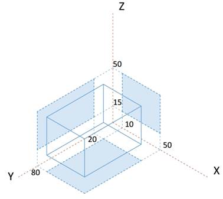
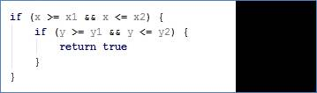
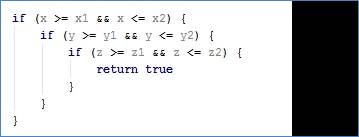
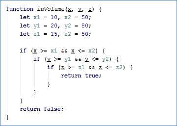
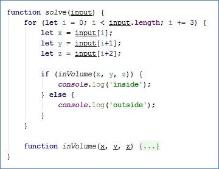
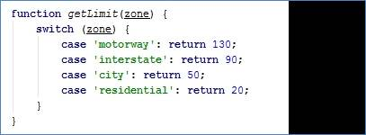
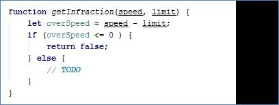
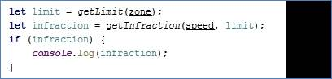
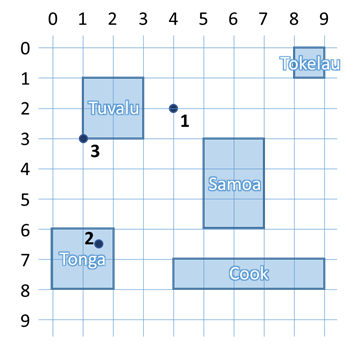
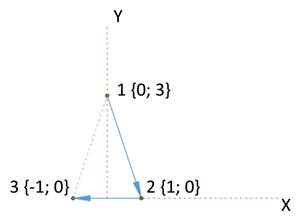

<html>

<head>
<meta http-equiv=Content-Type content="text/html; charset=windows-1251">
<meta name=Generator content="Microsoft Word 14 (filtered)">

</head>

<body lang=EN-US link=blue vlink=purple>

<h1>Exercises: Functions and Arrow Functions</h1>

Problems for exercises and homework for the <a
href="https://softuni.bg/courses/javascript-fundamentals">“JavaScript
Fundamentals” course @ SoftUni</a>. Submit your solutions in the SoftUni judge
system at <a href="https://judge.softuni.bg/Contests/310/">https://judge.softuni.bg/Contests/310/</a>.

<h2>1.&nbsp;&nbsp; Inside
Volume</h2>

Write a JS function that determines whether a point is
inside the volume, defined by the box, shown on the right.

The <b>input</b> comes as an array of numbers. Each set of 3
elements are the x, y and z coordinates of a point.

The <b>output</b> should be printed to the console on a new
line for each point. Print inside if the point lies
inside the volume and outisde otherwise.

<h3>Examples</h3>

<table class=MsoTableGrid border=1 cellspacing=0 cellpadding=0 width=227
 style='width:170.1pt;margin-left:1.15pt;border-collapse:collapse;border:none'>
 <tr>
  <td width=151 valign=top style='width:113.4pt;border:solid windowtext 1.0pt;
  background:#D9D9D9;padding:2.85pt 4.25pt 2.85pt 4.25pt'>
  
<b>Input</b>

  </td>
  <td width=76 valign=top style='width:56.7pt;border:solid windowtext 1.0pt;
  border-left:none;background:#D9D9D9;padding:2.85pt 4.25pt 2.85pt 4.25pt'>
  
<b>Output</b>

  </td>
 </tr>
 <tr>
  <td width=151 valign=top style='width:113.4pt;border:solid windowtext 1.0pt;
  border-top:none;padding:2.85pt 4.25pt 2.85pt 4.25pt'>
  
[8, 20, 22]

  </td>
  <td width=76 valign=top style='width:56.7pt;border-top:none;border-left:none;
  border-bottom:solid windowtext 1.0pt;border-right:solid windowtext 1.0pt;
  padding:2.85pt 4.25pt 2.85pt 4.25pt'>
  
outside

  </td>
 </tr>
 <tr>
  <td width=151 valign=top style='width:113.4pt;border:solid windowtext 1.0pt;
  border-top:none;padding:2.85pt 4.25pt 2.85pt 4.25pt'>
  
[13.1, 50, 31.5,

  
50, 80, 50,

  
-5, 18, 43]

  </td>
  <td width=76 valign=top style='width:56.7pt;border-top:none;border-left:none;
  border-bottom:solid windowtext 1.0pt;border-right:solid windowtext 1.0pt;
  padding:2.85pt 4.25pt 2.85pt 4.25pt'>
  
inside

  
inside

  
outside

  </td>
 </tr>
</table>

<h3>Hints</h3>

This task is very similar to previous assignments where a point
might lie inside an area in 2D space, with just an extra dimension added. If we
look at a classic conditional statement, which checks whether a point is inside
a rectangle:

It checks whether a coordinate is greater than the minimum
and at the same time less than the maximum bounding value for both axes (x and
y). All we have to do is to include an additional check for a coordinate to be
within the vertical limits of the volume (z-axis):

We can then wrap this whole statement in a function and as
we process each set of coordinates, pass them to see if they are inside the
volume and print the correct message to the console. Since the volume is the
same every time, we can hardcode the values, but it’s generally good practice
to pass them as function arguments, so that the function may work with any
arbitrary volume. Later in the course we’ll learn how to shorten this with the
use of objects.

We can extract the sets of coordinates with a loop that
skips 3 elements at a time and assigns them to temporary variables:

We know from the problem description that the input array
will contain sets to three coordinates. Starting at 0, the current element
(denoted by index <b><i>i</i></b> inside the loop) is the x-coordinate, the
element after the current (<b><i>i + 1</i></b>) is the y-coordinate, and the
element two indices after the current (<b><i>i + 2</i></b>) is the
z-coordinate. At the end of the cycle, the index is increased by 3 and we can
obtain the coordinates of the next point, using the same arithmetic (instead of
0, 1 and 2 we will get 3, 4 and 5) and so on, until there are no more elements
in the array. The three coordinates are passed into our function and we get a
Boolean value as a result. If it’s true, we print inside
for the current point and otherwise we print outside.

The solution may now be submitted to the judge system at <a
href="https://judge.softuni.bg/Contests/310">https://judge.softuni.bg/Contests/310</a>

<h2>2.&nbsp;&nbsp; Road Radar</h2>

Write a JS function that determines whether a driver is
within the speed limit. You will receive his speed and the area where he’s
driving. Each area has a different limit: on the <strong>motorway</strong> the limit
is <strong>130 </strong>km/h,
on the <strong>interstate</strong>
the limit is <strong>90</strong>,
inside a <strong>city</strong>
the limit is <strong>50</strong>
and within a <strong>residential
</strong>area the limit is <strong>20
</strong>km/h. If the driver is within the limits, your function prints
nothing. If he’s over the limit however, your function prints the severity of
the infraction. For speeds up to <strong>20</strong>
km/h<strong> </strong>over
the limit, he’s speeding; for speeds up to <strong>40</strong> over the limit, the infraction is <strong>excessive speeding</strong>
and for anything else, <strong>reckless
driving</strong>.

The <b>input</b> comes as an array of elements. The first
element is the current speed (as number), the second element is the area where
the vehicle is driving.

The <b>output</b> should be printed to the console. Note in
certain cases there will be no output.

<h3>Examples</h3>

<table class=MsoTableGrid border=1 cellspacing=0 cellpadding=0 width=416
 style='width:311.85pt;margin-left:1.15pt;border-collapse:collapse;border:none'>
 <tr>
  <td width=189 valign=top style='width:141.75pt;border:solid windowtext 1.0pt;
  background:#D9D9D9;padding:2.85pt 4.25pt 2.85pt 4.25pt'>
  
<b>Input</b>

  </td>
  <td width=227 valign=top style='width:170.1pt;border:solid windowtext 1.0pt;
  border-left:none;background:#D9D9D9;padding:2.85pt 4.25pt 2.85pt 4.25pt'>
  
<b>Output</b>

  </td>
 </tr>
 <tr>
  <td width=189 valign=top style='width:141.75pt;border:solid windowtext 1.0pt;
  border-top:none;padding:2.85pt 4.25pt 2.85pt 4.25pt'>
  
[40, city]

  </td>
  <td width=227 valign=top style='width:170.1pt;border-top:none;border-left:
  none;border-bottom:solid windowtext 1.0pt;border-right:solid windowtext 1.0pt;
  padding:2.85pt 4.25pt 2.85pt 4.25pt'>
  
&nbsp;

  </td>
 </tr>
 <tr>
  <td width=189 valign=top style='width:141.75pt;border:solid windowtext 1.0pt;
  border-top:none;padding:2.85pt 4.25pt 2.85pt 4.25pt'>
  
[21, residential]

  </td>
  <td width=227 valign=top style='width:170.1pt;border-top:none;border-left:
  none;border-bottom:solid windowtext 1.0pt;border-right:solid windowtext 1.0pt;
  padding:2.85pt 4.25pt 2.85pt 4.25pt'>
  
speeding

  </td>
 </tr>
 <tr>
  <td width=189 valign=top style='width:141.75pt;border:solid windowtext 1.0pt;
  border-top:none;padding:2.85pt 4.25pt 2.85pt 4.25pt'>
  
[120, interstate]

  </td>
  <td width=227 valign=top style='width:170.1pt;border-top:none;border-left:
  none;border-bottom:solid windowtext 1.0pt;border-right:solid windowtext 1.0pt;
  padding:2.85pt 4.25pt 2.85pt 4.25pt'>
  
excessive
  speeding

  </td>
 </tr>
 <tr>
  <td width=189 valign=top style='width:141.75pt;border:solid windowtext 1.0pt;
  border-top:none;padding:2.85pt 4.25pt 2.85pt 4.25pt'>
  
[200, motorway]

  </td>
  <td width=227 valign=top style='width:170.1pt;border-top:none;border-left:
  none;border-bottom:solid windowtext 1.0pt;border-right:solid windowtext 1.0pt;
  padding:2.85pt 4.25pt 2.85pt 4.25pt'>
  
reckless driving

  </td>
 </tr>
</table>

<h3>Hints</h3>

We can divide the task in two functions – one that
determines what the current speed limit is, depending on zone, and another
which tells us if an infraction is being made, depending on current speed and
current limit. Determining the limit is achieved with a <strong>switch</strong> statement on
the input:

This function takes a string as an argument and returns a
number, depending on what that string is. We can take this directly from the
input, pass it to this function and save the return value in a variable. In our
second function, we pass the current speed and the limit, which we just saved.

We calculate the difference between the current speed and
the limit – if it’s negative or zero, this means the driver is within the rules
and we return false, and in any other case, return
the infraction as a string and store the result of the operation in a variable.

We can use the fact that JavaScript functions can return
different data types and directly use the result we stored in a conditional
statement – if it’s <strong>false</strong>
(no infraction), do nothing, if it’s <strong>truthy</strong>
(non-empty string in this case), print the value store in the variable.

<h2>3.&nbsp;&nbsp; Template
format</h2>

Write a JS program that receives data about a quiz and
prints it formatted as an XML document. The data comes as pairs of
question-answer entries. The format of the document should be as follows:

<table class=MsoTableGrid border=1 cellspacing=0 cellpadding=0 width=680
 style='width:510.25pt;margin-left:1.15pt;border-collapse:collapse;border:none'>
 <tr>
  <td width=680 valign=top style='width:510.25pt;border:solid windowtext 1.0pt;
  background:#D9D9D9;padding:2.85pt 4.25pt 2.85pt 4.25pt'>
  
<b>XML</b>

  </td>
 </tr>
 <tr>
  <td width=680 valign=top style='width:510.25pt;border:solid windowtext 1.0pt;
  border-top:none;padding:2.85pt 4.25pt 2.85pt 4.25pt'>
  
&lt;?xml version=&quot;1.0&quot;
  encoding=&quot;UTF-8&quot;?&gt;

  
&lt;quiz&gt;

  
  &lt;question&gt;

  
    {question text}

  
  &lt;/question&gt;

  
  &lt;answer&gt;

  
    {answer text}

  
  &lt;/answer&gt;

  
&lt;/quiz&gt;

  </td>
 </tr>
</table>

The <b>input</b> comes as an array of string elements.

The <b>output</b> should be printed on the console.

<h3>Examples</h3>

<table class=MsoTableGrid border=1 cellspacing=0 cellpadding=0 width=680
 style='width:510.25pt;margin-left:1.15pt;border-collapse:collapse;border:none'>
 <tr>
  <td width=680 valign=top style='width:510.25pt;border:solid windowtext 1.0pt;
  background:#D9D9D9;padding:2.85pt 4.25pt 2.85pt 4.25pt'>
  
<b>Input</b>

  </td>
 </tr>
 <tr>
  <td width=680 valign=top style='width:510.25pt;border:solid windowtext 1.0pt;
  border-top:none;padding:2.85pt 4.25pt 2.85pt 4.25pt'>
  
[&quot;Who was the forty-second
  president of the U.S.A.?&quot;,

  
&quot;William Jefferson Clinton&quot;]

  </td>
 </tr>
 <tr>
  <td width=680 valign=top style='width:510.25pt;border:solid windowtext 1.0pt;
  border-top:none;background:#D9D9D9;padding:2.85pt 4.25pt 2.85pt 4.25pt'>
  
<b>Output</b>

  </td>
 </tr>
 <tr>
  <td width=680 valign=top style='width:510.25pt;border:solid windowtext 1.0pt;
  border-top:none;padding:2.85pt 4.25pt 2.85pt 4.25pt'>
  
&lt;?xml version=&quot;1.0&quot;
  encoding=&quot;UTF-8&quot;?&gt;

  
&lt;quiz&gt;

  
  &lt;question&gt;

  
    Who was the forty-second
  president of the U.S.A.?

  
  &lt;/question&gt;

  
  &lt;answer&gt;

  
    William Jefferson Clinton

  
  &lt;/answer&gt;

  
&lt;/quiz&gt;

  </td>
 </tr>
</table>

&nbsp;

<table class=MsoTableGrid border=1 cellspacing=0 cellpadding=0 width=680
 style='width:510.25pt;margin-left:1.15pt;border-collapse:collapse;border:none'>
 <tr>
  <td width=680 valign=top style='width:510.25pt;border:solid windowtext 1.0pt;
  background:#D9D9D9;padding:2.85pt 4.25pt 2.85pt 4.25pt'>
  
<b>Input</b>

  </td>
 </tr>
 <tr>
  <td width=680 valign=top style='width:510.25pt;border:solid windowtext 1.0pt;
  border-top:none;padding:2.85pt 4.25pt 2.85pt 4.25pt'>
  
[&quot;Dry ice is a frozen form
  of which gas?&quot;,

  
&quot;Carbon Dioxide&quot;,

  
&quot;What is the brightest
  star in the night sky?&quot;,

  
&quot;Sirius&quot;]

  </td>
 </tr>
 <tr>
  <td width=680 valign=top style='width:510.25pt;border:solid windowtext 1.0pt;
  border-top:none;background:#D9D9D9;padding:2.85pt 4.25pt 2.85pt 4.25pt'>
  
<b>Output</b>

  </td>
 </tr>
 <tr>
  <td width=680 valign=top style='width:510.25pt;border:solid windowtext 1.0pt;
  border-top:none;padding:2.85pt 4.25pt 2.85pt 4.25pt'>
  
&lt;?xml version=&quot;1.0&quot;
  encoding=&quot;UTF-8&quot;?&gt;

  
&lt;quiz&gt;

  
  &lt;question&gt;

  
    Dry ice is a frozen form of
  which gas?

  
  &lt;/question&gt;

  
  &lt;answer&gt;

  
    Carbon Dioxide

  
  &lt;/answer&gt;

  
  &lt;question&gt;

  
    What is the brightest star in
  the night sky?

  
  &lt;/question&gt;

  
  &lt;answer&gt;

  
    Sirius

  
  &lt;/answer&gt;

  
&lt;/quiz&gt;

  </td>
 </tr>
</table>

<h2>4.&nbsp;&nbsp; Cooking by
Numbers</h2>

Write a JS program that receives a number and a list of five
operations. Perform the operations in sequence by starting with the input
number and using the result of every operation as starting point for the next.
Print the result of every operation in order. The operations can be one of the
following:

·&nbsp;&nbsp;&nbsp;&nbsp;&nbsp;&nbsp;&nbsp;&nbsp;
chop – divide the number by two

·&nbsp;&nbsp;&nbsp;&nbsp;&nbsp;&nbsp;&nbsp;&nbsp;
dice – square root of number

·&nbsp;&nbsp;&nbsp;&nbsp;&nbsp;&nbsp;&nbsp;&nbsp;
spice – add 1 to number

·&nbsp;&nbsp;&nbsp;&nbsp;&nbsp;&nbsp;&nbsp;&nbsp;
bake – multiply number by 3

·&nbsp;&nbsp;&nbsp;&nbsp;&nbsp;&nbsp;&nbsp;&nbsp;
fillet – subtract 20% from number

The <b>input</b> comes as an array of 6 string elements. The
first element is your starting point and must be parsed to a number. The
remaining 5 elements are the names of operations to be performed.

The <b>output</b> should be printed on the console.

<h3>Examples</h3>

<table class=MsoTableGrid border=1 cellspacing=0 cellpadding=0 width=491
 style='width:368.5pt;margin-left:1.15pt;border-collapse:collapse;border:none'>
 <tr>
  <td width=378 valign=top style='width:283.45pt;border:solid windowtext 1.0pt;
  background:#D9D9D9;padding:2.85pt 4.25pt 2.85pt 4.25pt'>
  
<b>Input</b>

  </td>
  <td width=113 valign=top style='width:85.05pt;border:solid windowtext 1.0pt;
  border-left:none;background:#D9D9D9;padding:2.85pt 4.25pt 2.85pt 4.25pt'>
  
<b>Output</b>

  </td>
 </tr>
 <tr>
  <td width=378 valign=top style='width:283.45pt;border:solid windowtext 1.0pt;
  border-top:none;padding:2.85pt 4.25pt 2.85pt 4.25pt'>
  
[32,
  chop, chop, chop, chop, chop]

  </td>
  <td width=113 valign=top style='width:85.05pt;border-top:none;border-left:
  none;border-bottom:solid windowtext 1.0pt;border-right:solid windowtext 1.0pt;
  padding:2.85pt 4.25pt 2.85pt 4.25pt'>
  
16 
  8 
  4 
  2 
  1

  </td>
 </tr>
</table>

&nbsp;

<table class=MsoTableGrid border=1 cellspacing=0 cellpadding=0 width=491
 style='width:368.5pt;margin-left:1.15pt;border-collapse:collapse;border:none'>
 <tr>
  <td width=378 valign=top style='width:283.45pt;border:solid windowtext 1.0pt;
  background:#D9D9D9;padding:2.85pt 4.25pt 2.85pt 4.25pt'>
  
<b>Input</b>

  </td>
  <td width=113 valign=top style='width:85.05pt;border:solid windowtext 1.0pt;
  border-left:none;background:#D9D9D9;padding:2.85pt 4.25pt 2.85pt 4.25pt'>
  
<b>Output</b>

  </td>
 </tr>
 <tr>
  <td width=378 valign=top style='width:283.45pt;border:solid windowtext 1.0pt;
  border-top:none;padding:2.85pt 4.25pt 2.85pt 4.25pt'><pre style='background:
  white'>[9, dice, spice, chop, bake, fillet]</pre></td>
  <td width=113 valign=top style='width:85.05pt;border-top:none;border-left:
  none;border-bottom:solid windowtext 1.0pt;border-right:solid windowtext 1.0pt;
  padding:2.85pt 4.25pt 2.85pt 4.25pt'>
  
3

  
4

  
2

  
6

  
4.8

  </td>
 </tr>
</table>

<h2>5.&nbsp;&nbsp; Modify
Average</h2>

Write a JS program that modifies a number until the average
value of all of its digits is <b>higher than 5</b>. In order to modify the
number, your program should append a <b>9</b> to the end of the number, when
the average value of all of its digits is <b>higher than 5</b> the program
should stop appending. If the number’s average value of all of its digits is
already <b>higher than 5</b>, no appending should be done.

The <b>input</b> is a single number.

The <b>output</b> should consist of a single number - the
final modified number which has an average value of all of its digits <b>higher
than 5</b>. The <b>output</b> should be printed on the console.

<h3>Constraints</h3>

·&nbsp;&nbsp;&nbsp;&nbsp;&nbsp;&nbsp;&nbsp;&nbsp;
<b>The input number will consist of no more than 6 digits.</b>

·&nbsp;&nbsp;&nbsp;&nbsp;&nbsp;&nbsp;&nbsp;&nbsp;
<b>The input will be a valid number (there will be no leading
zeroes).</b>

<h3>Examples</h3>

<table class=MsoTableGrid border=1 cellspacing=0 cellpadding=0 width=268
 style='width:201.1pt;margin-left:1.15pt;border-collapse:collapse;border:none'>
 <tr>
  <td width=112 valign=top style='width:84.1pt;border:solid windowtext 1.0pt;
  background:#D9D9D9;padding:2.85pt 4.25pt 2.85pt 4.25pt'>
  
<b>Input</b>

  </td>
  <td width=156 valign=top style='width:117.0pt;border:solid windowtext 1.0pt;
  border-left:none;background:#D9D9D9;padding:2.85pt 4.25pt 2.85pt 4.25pt'>
  
<b>Output</b>

  </td>
 </tr>
 <tr>
  <td width=112 valign=top style='width:84.1pt;border:solid windowtext 1.0pt;
  border-top:none;padding:2.85pt 4.25pt 2.85pt 4.25pt'>
  
101

  </td>
  <td width=156 valign=top style='width:117.0pt;border-top:none;border-left:
  none;border-bottom:solid windowtext 1.0pt;border-right:solid windowtext 1.0pt;
  padding:2.85pt 4.25pt 2.85pt 4.25pt'>
  
1019999

  </td>
 </tr>
 <tr>
  <td width=112 valign=top style='width:84.1pt;border:solid windowtext 1.0pt;
  border-top:none;padding:2.85pt 4.25pt 2.85pt 4.25pt'>
  
5835

  </td>
  <td width=156 valign=top style='width:117.0pt;border-top:none;border-left:
  none;border-bottom:solid windowtext 1.0pt;border-right:solid windowtext 1.0pt;
  padding:2.85pt 4.25pt 2.85pt 4.25pt'>
  
5835

  </td>
 </tr>
</table>

<b>&nbsp;</b>

<h2>6.&nbsp;&nbsp; Validity
Checker</h2>

Write a JS program that receives two points in the format <b>[x1,
y1, x2, y2] </b>and checks if the distances between each point and the start of
the cartesian coordinate system (0, 0) and between the points themselves is <b>valid</b>.
A distance between two points is considered <b>valid</b>, if it is an <b>integer
value</b>. In case a distance is valid write &quot;<b>{x1, y1} to {x2, y2} is
valid&quot;</b>, in case the distance is invalid write <b>&quot;{x1, y1} to
{x2, y2} is invalid&quot;</b>. 

The order of comparisons should always be first <b>{x1, y1}</b>
to <b>{0, 0}</b>, then <b>{x2, y2}</b> to <b>{0, 0}</b> and finally <b>{x1, y1}</b>
to <b>{x2, y2}</b>. 

The <b>input</b> consists of two points given as an array of
numbers.

For each comparison print on the <b>output</b> either &quot;<b>{x1,
y1} to {x2, y2} is valid&quot; </b>if the distance between them is valid, or <b>&quot;{x1,
y1} to {x2, y2} is invalid&quot;</b>- if it’s invalid.

<h3>Examples</h3>

<table class=MsoTableGrid border=1 cellspacing=0 cellpadding=0 width=700
 style='width:525.1pt;margin-left:1.15pt;border-collapse:collapse;border:none'>
 <tr>
  <td width=346 valign=top style='width:259.6pt;border:solid windowtext 1.0pt;
  background:#D9D9D9;padding:2.85pt 4.25pt 2.85pt 4.25pt'>
  
<b>Input</b>

  </td>
  <td width=354 valign=top style='width:265.5pt;border:solid windowtext 1.0pt;
  border-left:none;background:#D9D9D9;padding:2.85pt 4.25pt 2.85pt 4.25pt'>
  
<b>Output</b>

  </td>
 </tr>
 <tr>
  <td width=346 valign=top style='width:259.6pt;border:solid windowtext 1.0pt;
  border-top:none;padding:2.85pt 4.25pt 2.85pt 4.25pt'>
  
[3, 0, 0, 4]

  </td>
  <td width=354 valign=top style='width:265.5pt;border-top:none;border-left:
  none;border-bottom:solid windowtext 1.0pt;border-right:solid windowtext 1.0pt;
  padding:2.85pt 4.25pt 2.85pt 4.25pt'>
  
{3, 0} to {0,
  0} is valid

  
{0, 4} to
  {0, 0} is valid

  
{3, 0} to
  {0, 4} is valid

  </td>
 </tr>
 <tr>
  <td width=346 valign=top style='width:259.6pt;border:solid windowtext 1.0pt;
  border-top:none;padding:2.85pt 4.25pt 2.85pt 4.25pt'>
  
[2, 1, 1, 1]

  </td>
  <td width=354 valign=top style='width:265.5pt;border-top:none;border-left:
  none;border-bottom:solid windowtext 1.0pt;border-right:solid windowtext 1.0pt;
  padding:2.85pt 4.25pt 2.85pt 4.25pt'>
  
{2, 1} to
  {0, 0} is invalid

  
{1, 1} to
  {0, 0} is invalid

  
{2, 1} to
  {1, 1} is valid

  </td>
 </tr>
</table>

&nbsp;

<h2>7.&nbsp;&nbsp; Treasure
Locator</h2>

You will be given a series of coordinates, leading to a
buried treasure. Use the map to the right to write a program that locates on
which island it is. After you find where all the treasure chests are, compose a
list and print it on the console. If a chest is not on any of the islands,
print “On the bottom of the ocean” to inform your treasure-hunting team to
bring diving gear. If the location is on the shore (border) of the island, it’s
still considered to lie inside.

The <b>input</b> comes as an array with a variable number of
elements that are numbers. Each pair is the coordinates to a buried treasure
chest.

The <b>output</b> is a list of the locations of every
treasure chest, either the name of an island or “On the bottom of the ocean”,
printed on the console.

&nbsp;

<h3>Examples</h3>

<table class=MsoTableGrid border=1 cellspacing=0 cellpadding=0 width=529
 style='width:396.85pt;margin-left:1.15pt;border-collapse:collapse;border:none'>
 <tr>
  <td width=227 valign=top style='width:170.1pt;border:solid windowtext 1.0pt;
  background:#D9D9D9;padding:2.85pt 4.25pt 2.85pt 4.25pt'>
  
<b>Input</b>

  </td>
  <td width=302 valign=top style='width:226.75pt;border:solid windowtext 1.0pt;
  border-left:none;background:#D9D9D9;padding:2.85pt 4.25pt 2.85pt 4.25pt'>
  
<b>Output</b>

  </td>
 </tr>
 <tr>
  <td width=227 valign=top style='width:170.1pt;border:solid windowtext 1.0pt;
  border-top:none;padding:2.85pt 4.25pt 2.85pt 4.25pt'>
  
[4, 2, 1.5, 6.5, 1, 3]

  </td>
  <td width=302 valign=top style='width:226.75pt;border-top:none;border-left:
  none;border-bottom:solid windowtext 1.0pt;border-right:solid windowtext 1.0pt;
  padding:2.85pt 4.25pt 2.85pt 4.25pt'>
  
On the
  bottom of the ocean

  
Tonga

  
Tuvalu

  </td>
 </tr>
 <tr>
  <td width=227 valign=top style='width:170.1pt;border:solid windowtext 1.0pt;
  border-top:none;padding:2.85pt 4.25pt 2.85pt 4.25pt'>
  
[6, 4]

  </td>
  <td width=302 valign=top style='width:226.75pt;border-top:none;border-left:
  none;border-bottom:solid windowtext 1.0pt;border-right:solid windowtext 1.0pt;
  padding:2.85pt 4.25pt 2.85pt 4.25pt'>
  
Samoa

  </td>
 </tr>
</table>

<h2>8.&nbsp;&nbsp; Trip
Length</h2>

You will be given the coordinates of 3 points on a 2D plane.
Write a program that finds the two shortest segments that connect them (without
going back to the starting point). When determining the listing order, use the
order with the lowest numerical value (see the figure in the hints for more
information).

The <b>input</b> comes as an array of 6 numbers. The order
is <strong>[x1, y1, x2, y2,
x3, y3]</strong>.

The <b>output</b> is the return value of your program as a
string, representing the order in which the three points must be visited and
the final distance between them. See the examples for more info.

<h3>Examples</h3>

<table class=MsoTableGrid border=1 cellspacing=0 cellpadding=0 width=454
 style='width:340.2pt;margin-left:1.15pt;border-collapse:collapse;border:none'>
 <tr>
  <td width=227 valign=top style='width:170.1pt;border:solid windowtext 1.0pt;
  background:#D9D9D9;padding:2.85pt 4.25pt 2.85pt 4.25pt'>
  
<b>Input</b>

  </td>
  <td width=227 valign=top style='width:170.1pt;border:solid windowtext 1.0pt;
  border-left:none;background:#D9D9D9;padding:2.85pt 4.25pt 2.85pt 4.25pt'>
  
<b>Output</b>

  </td>
 </tr>
 <tr>
  <td width=227 valign=top style='width:170.1pt;border:solid windowtext 1.0pt;
  border-top:none;padding:2.85pt 4.25pt 2.85pt 4.25pt'>
  
[0, 0, 2, 0, 4, 0]

  </td>
  <td width=227 valign=top style='width:170.1pt;border-top:none;border-left:
  none;border-bottom:solid windowtext 1.0pt;border-right:solid windowtext 1.0pt;
  padding:2.85pt 4.25pt 2.85pt 4.25pt'>
  
1-&gt;2-&gt;3: 4

  </td>
 </tr>
</table>

&nbsp;

<table class=MsoTableGrid border=1 cellspacing=0 cellpadding=0 width=454
 style='width:340.2pt;margin-left:1.15pt;border-collapse:collapse;border:none'>
 <tr>
  <td width=227 valign=top style='width:170.1pt;border:solid windowtext 1.0pt;
  background:#D9D9D9;padding:2.85pt 4.25pt 2.85pt 4.25pt'>
  
<b>Input</b>

  </td>
  <td width=227 valign=top style='width:170.1pt;border:solid windowtext 1.0pt;
  border-left:none;background:#D9D9D9;padding:2.85pt 4.25pt 2.85pt 4.25pt'>
  
<b>Output</b>

  </td>
 </tr>
 <tr>
  <td width=227 valign=top style='width:170.1pt;border:solid windowtext 1.0pt;
  border-top:none;padding:2.85pt 4.25pt 2.85pt 4.25pt'>
  
[5, 1, 1, 1, 5, 4]

  </td>
  <td width=227 valign=top style='width:170.1pt;border-top:none;border-left:
  none;border-bottom:solid windowtext 1.0pt;border-right:solid windowtext 1.0pt;
  padding:2.85pt 4.25pt 2.85pt 4.25pt'>
  
2-&gt;1-&gt;3: 7

  </td>
 </tr>
</table>

&nbsp;

<table class=MsoTableGrid border=1 cellspacing=0 cellpadding=0 width=454
 style='width:340.2pt;margin-left:1.15pt;border-collapse:collapse;border:none'>
 <tr>
  <td width=227 valign=top style='width:170.1pt;border:solid windowtext 1.0pt;
  background:#D9D9D9;padding:2.85pt 4.25pt 2.85pt 4.25pt'>
  
<b>Input</b>

  </td>
  <td width=227 valign=top style='width:170.1pt;border:solid windowtext 1.0pt;
  border-left:none;background:#D9D9D9;padding:2.85pt 4.25pt 2.85pt 4.25pt'>
  
<b>Output</b>

  </td>
 </tr>
 <tr>
  <td width=227 valign=top style='width:170.1pt;border:solid windowtext 1.0pt;
  border-top:none;padding:2.85pt 4.25pt 2.85pt 4.25pt'>
  
[-1, -2, 3.5, 0, 0, 2]

  </td>
  <td width=227 valign=top style='width:170.1pt;border-top:none;border-left:
  none;border-bottom:solid windowtext 1.0pt;border-right:solid windowtext 1.0pt;
  padding:2.85pt 4.25pt 2.85pt 4.25pt'>
  
1-&gt;3-&gt;2: 8.154234499766936

  </td>
 </tr>
</table>

<h3>Hints</h3>

You can find the horizontal and vertical offset between
two points by calculating the difference between their coordinates. Use
Pythagoras’ theorem to find the distance.

If more than one shortest paths exist, choose the one with
lowest numerical value. For instance, in the figure on the right, 1&agrave;2&agrave;3
is the same distance as 3&agrave;2&agrave;1, but we chose to start at 1,
since it’s lower than 3. When choosing the second point, we encounter the same
issue – 1&agrave;3&agrave;2 would be the same as 1&agrave;2&agrave;3,
but we chose to visit 2 first, because it’s lower than 3.

<h2>9.&nbsp;&nbsp; *Radio
Crystals</h2>

It’s time to put your skills to work for the war effort –
creating management software for a radio transmitter factory. Radios require a
finely tuned quartz crystal in order to operate at the correct frequency. The
resource used to produce them is quartz ore that comes in big chunks and needs
to undergo several processes, before it reaches the desired properties.

You need to write a JS program that monitors the current
thickness of the crystal and recommends the next procedure that will bring it
closer to the desired frequency. To reduce waste and the time it takes to make
each crystal your program needs to complete the process with the least number
of operations. Each operation takes the same amount of time, but since they are
done at different parts of the factory, the crystals have to be transported and
thoroughly washed every time an operation different from the previous must be
performed, so this must also be taken into account. When determining the order,
always attempt to start from the operation that removes the largest amount of
material.

The different operations you can perform are the following:

·&nbsp;&nbsp;&nbsp;&nbsp;&nbsp;&nbsp;&nbsp;&nbsp;
Cut – cuts the crystal in 4

·&nbsp;&nbsp;&nbsp;&nbsp;&nbsp;&nbsp;&nbsp;&nbsp;
Lap – removes 20% of the crystal’s
thickness

·&nbsp;&nbsp;&nbsp;&nbsp;&nbsp;&nbsp;&nbsp;&nbsp;
Grind – removes 20 microns of
thickness

·&nbsp;&nbsp;&nbsp;&nbsp;&nbsp;&nbsp;&nbsp;&nbsp;
Etch – removes 2 microns of thickness

·&nbsp;&nbsp;&nbsp;&nbsp;&nbsp;&nbsp;&nbsp;&nbsp;
X-ray – increases the thickness of
the crystal by 1 micron; this operation can only be done once!

·&nbsp;&nbsp;&nbsp;&nbsp;&nbsp;&nbsp;&nbsp;&nbsp;
Transporting and washing – removes any imperfections smaller than 1 micron (round down the
number); do this after every batch of operations that
remove material

At the beginning of your program, you will receive a number
representing the desired final thickness and a series of numbers, representing
the thickness of crystal ore in microns. Process each chunk and print to the
console the order of operations and number of times they need to be repeated to
bring them to the desired thickness.

The <b>input</b> comes as a numeric array with a variable
number of elements. The first number is the target thickness and all following
numbers are the thickness of different chunks of quartz ore.

The <b>output</b> is the order of operation and how many
times they are repeated, every operation on a new line. See the examples for
more information.

<h3>Examples</h3>

<table class=MsoTableGrid border=1 cellspacing=0 cellpadding=0 width=529
 style='width:396.85pt;margin-left:1.15pt;border-collapse:collapse;border:none'>
 <tr>
  <td width=227 valign=top style='width:170.1pt;border:solid windowtext 1.0pt;
  background:#D9D9D9;padding:2.85pt 4.25pt 2.85pt 4.25pt'>
  
<b>Input</b>

  </td>
  <td width=302 valign=top style='width:226.75pt;border:solid windowtext 1.0pt;
  border-left:none;background:#D9D9D9;padding:2.85pt 4.25pt 2.85pt 4.25pt'>
  
<b>Output</b>

  </td>
 </tr>
 <tr>
  <td width=227 valign=top style='width:170.1pt;border:solid windowtext 1.0pt;
  border-top:none;padding:2.85pt 4.25pt 2.85pt 4.25pt'>
  
[1375, 50000]

  </td>
  <td width=302 valign=top style='width:226.75pt;border-top:none;border-left:
  none;border-bottom:solid windowtext 1.0pt;border-right:solid windowtext 1.0pt;
  padding:2.85pt 4.25pt 2.85pt 4.25pt'>
  
Processing
  chunk 50000 microns

  
Cut x2

  
Transporting
  and washing

  
Lap x3

  
Transporting
  and washing

  
Grind x11

  
Transporting
  and washing

  
Etch x3

  
Transporting
  and washing

  
X-ray x1

  
Finished crystal
  1375 microns

  </td>
 </tr>
</table>

<h4>Explanation</h4>

The operation that would remove the most material is always
cutting – it removes three quarters of the chunk. Starting from 50000, if we
perform it twice, we bring the chunk down to 3125. If we cut again, the chunk
will be 781.25, which is less than the desired thickness, so we move to the
next operation, but we first round down the number (transporting &amp;
washing). Next, we lap the chunk – after three operations, the crystal reaches
1600 microns. One more lapping would take it to 1280, so we move on to the next
operation instead. We do the same check with grinding, and finally by etching 2
times, the crystal has reached 1376 microns, which is one more than desired. We
don’t have an operation which only takes away 1 micron, so instead we etch once
more to get to 1374, wash and then x-ray to add 1 micron, which brings us to
the desired thickness.

<table class=MsoTableGrid border=1 cellspacing=0 cellpadding=0 width=529
 style='width:396.85pt;margin-left:1.15pt;border-collapse:collapse;border:none'>
 <tr>
  <td width=227 valign=top style='width:170.1pt;border:solid windowtext 1.0pt;
  background:#D9D9D9;padding:2.85pt 4.25pt 2.85pt 4.25pt'>
  
<b>Input</b>

  </td>
  <td width=302 valign=top style='width:226.75pt;border:solid windowtext 1.0pt;
  border-left:none;background:#D9D9D9;padding:2.85pt 4.25pt 2.85pt 4.25pt'>
  
<b>Output</b>

  </td>
 </tr>
 <tr>
  <td width=227 valign=top style='width:170.1pt;border:solid windowtext 1.0pt;
  border-top:none;padding:2.85pt 4.25pt 2.85pt 4.25pt'>
  
[1000, 4000, 8100]

  </td>
  <td width=302 valign=top style='width:226.75pt;border-top:none;border-left:
  none;border-bottom:solid windowtext 1.0pt;border-right:solid windowtext 1.0pt;
  padding:2.85pt 4.25pt 2.85pt 4.25pt'>
  
Processing
  chunk 4000 microns

  
Cut x1

  
Transporting
  and washing

  
Finished crystal
  1000 microns

  
Processing
  chunk 8100 microns

  
Cut x1

  
Transporting
  and washing

  
Lap x3

  
Transporting
  and washing

  
Grind x1

  
Transporting
  and washing

  
Etch x8

  
Transporting
  and washing

  
Finished crystal
  1000 microns

  </td>
 </tr>
</table>

&nbsp;

<h2>10.&nbsp;&nbsp;&nbsp; **DNA
Helix</h2>

Write a JS program that prints a DNA helix with length,
specified by the user. The helix has a repeating structure, but the symbol in
the chain follows the sequence ATCGTTAGGG. See the examples for more
information.

The <b>input</b> comes as a single number. It represents the
length of the required helix.

The <b>output</b> is the completed structure, printed on the
console.

<h3>Examples</h3>

<table class=MsoTableGrid border=1 cellspacing=0 cellpadding=0 width=402
 style='width:301.5pt;margin-left:1.15pt;border-collapse:collapse;border:none'>
 <tr>
  <td width=76 valign=top style='width:56.7pt;border:solid windowtext 1.0pt;
  background:#D9D9D9;padding:2.85pt 4.25pt 2.85pt 4.25pt'>
  
<b>Input</b>

  </td>
  <td width=113 valign=top style='width:85.05pt;border:solid windowtext 1.0pt;
  border-left:none;background:#D9D9D9;padding:2.85pt 4.25pt 2.85pt 4.25pt'>
  
<b>Output</b>

  </td>
  <td width=24 rowspan=2 valign=top style='width:.25in;border:none;border-right:
  solid windowtext 1.0pt;padding:2.85pt 4.25pt 2.85pt 4.25pt'>
  
<b>&nbsp;</b>

  </td>
  <td width=76 valign=top style='width:56.7pt;border:solid windowtext 1.0pt;
  border-left:none;background:#D9D9D9;padding:2.85pt 4.25pt 2.85pt 4.25pt'>
  
<b>Input</b>

  </td>
  <td width=113 valign=top style='width:85.05pt;border:solid windowtext 1.0pt;
  border-left:none;background:#D9D9D9;padding:2.85pt 4.25pt 2.85pt 4.25pt'>
  
<b>Output</b>

  </td>
 </tr>
 <tr>
  <td width=76 valign=top style='width:56.7pt;border:solid windowtext 1.0pt;
  border-top:none;padding:2.85pt 4.25pt 2.85pt 4.25pt'>
  
4

  </td>
  <td width=113 valign=top style='width:85.05pt;border-top:none;border-left:
  none;border-bottom:solid windowtext 1.0pt;border-right:solid windowtext 1.0pt;
  padding:2.85pt 4.25pt 2.85pt 4.25pt'>
  
**AT** 
  *C--G* 
  T----T 
  *A--G*

  </td>
  <td width=76 valign=top style='width:56.7pt;border-top:none;border-left:none;
  border-bottom:solid windowtext 1.0pt;border-right:solid windowtext 1.0pt;
  padding:2.85pt 4.25pt 2.85pt 4.25pt'>
  
10

  </td>
  <td width=113 valign=top style='width:85.05pt;border-top:none;border-left:
  none;border-bottom:solid windowtext 1.0pt;border-right:solid windowtext 1.0pt;
  padding:2.85pt 4.25pt 2.85pt 4.25pt'><pre style='background:white'>**AT** 
*C--G* 
T----T 
*A--G* 
**GG** 
*A--T* 
C----G 
*T--T* 
**AG** 
*G--G*</pre></td>
 </tr>
</table>

<h2 style='margin-left:0in;text-indent:0in'>&nbsp;</h2>

</body>

</html>
